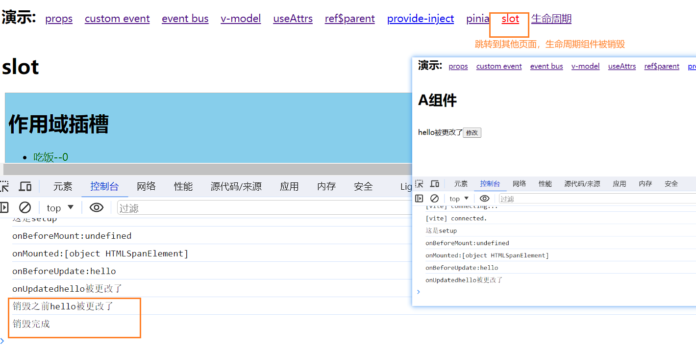
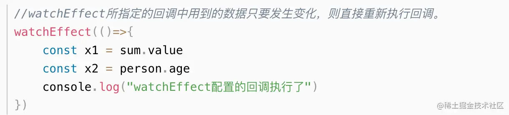
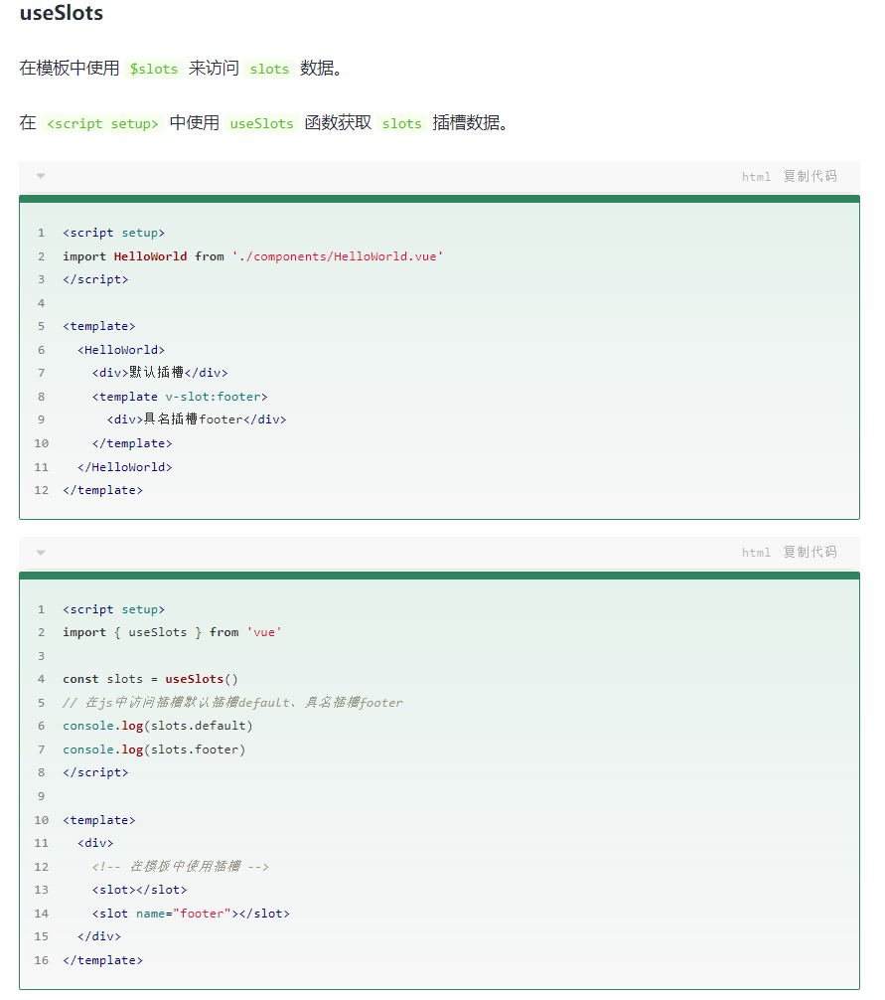

# 其他

###  vue中 route 与 router 的区别

 [博客](https://juejin.cn/post/7019908330101424159)

**$route 表示当前的路由信息，包含了当前URL解析得到的信息，包含当前的路径，参数，query对象等** 

**$router用来操作路由的router实例** 


### component

[博客](https://juejin.cn/post/7124501474175877150)

什么是动态组件 就是：让多个组件使用同一个挂载点，并动态切换，这就是动态组件。

在挂载点使用component标签，然后使用v-bind:is=”组件”


### 插槽

[博客](https://juejin.cn/post/7134733869076938765)


### 项目配置

[企业级前端配置](https://juejin.cn/post/7246777535043502136)


###  Options API和Composition API

[参考博客](https://juejin.cn/post/7325817302335471616) 、[参考博客](https://juejin.cn/post/7325495601269473289) 、[参考博客](https://juejin.cn/post/7227453567686033468)

Options API 是 Vue.js 传统的组件设计方式，通过对象来描述组件的各种选项，如 `data`、`methods`、`computed`、`watch` 等。这种方式在简单组件中非常直观，易于理解。 

Composition API 是 Vue 3 引入的一种新的组件设计方式，通过函数来组织代码，提供更灵活的组织结构和复用性。这种方式适用于处理复杂组件逻辑。 

Composition API 更好的代码组织，更好的逻辑服用；可维护性，更好的类型推导，可拓展性更好；

两种API各有优缺点，使用哪种API取决于具体的项目需求。对于小型项目，Options API更为简单方便；对于大型项目，Composition API可以更好地组织代码。

总之，Vue.js的Composition API和Options API是为了满足不同开发者的需求而存在的，我们应该根据具体的场景选择使用哪种API，以达到更好的开发效果和代码质量。

 


# VUE3面试题

[参考来源：Vue3面试题汇总](https://juejin.cn/post/7139921537896808479)、[Vue3 setup + TypeScript 开发新范式](https://juejin.cn/post/7052531217333223437)

### 项目的生命周期

[参考博客](https://juejin.cn/post/7323031996864413737)

Vue3的生命周期钩子函数主要包括：

- `beforeCreate`: 创建实例之前调用，此时实例的数据观测、事件等还未初始化。
- `created`: 创建实例后调用，此时实例的数据观测、事件等已经初始化完成。
- `beforeMount`: 挂载实例之前调用，此时模板已经编译完成，但是还未挂载到DOM。
- `mounted`: 挂载实例后调用，此时实例已经挂载到DOM，可以进行DOM操作。
- `beforeUpdate`: 数据更新之前调用，此时可以进行状态的最后更改。
- `updated`: 数据更新后调用，此时DOM已经完成更新，可以进行DOM操作。
- `beforeUnmount`: 卸载实例之前调用，此时实例仍然完全可用。
- `unmounted`: 卸载实例后调用，此时实例已经完全卸载。

选项式和组合式生命周期的区别：

- 选项式API的生命周期钩子函数定义在组件选项对象的methods中

- 组合式API的生命周期钩子函数定义在`setup`函数中，需要使用`import`从`vue`中引入 

  **注意**：在组合式API中没有`beforecate`和`created`钩子，因为他们本身被`setup`这个函数替代了，直接把相关逻辑写在`setup`中就行了 


参考[视频](https://www.bilibili.com/video/BV1ua4y1u7N8) 

```
<template>
    <div>
        <h1>A组件</h1>
        <br>
        <span ref="span">{{ msg }}</span>
        <button @click="change">修改</button>
    </div>
</template>

<script setup>
import {ref,onBeforeMount, onMounted,onBeforeUpdate, onUpdated, onBeforeUnmount, onUnmounted} from "vue"

console.log("这是setup")
const msg = ref("hello")
const span = ref()
const change = () => {
    msg.value = "hello被更改了"
}
// 第一对：代表对DOM的创建过程
// onBeforeMount 创建前 与onMounted 创建完成
onBeforeMount(() => {console.log("onBeforeMount:" + span.value)}) // undefined
onMounted(() => {console.log("onMounted:" + span.value)}) // <span>hello</span>
// 更新生命周期
onBeforeUpdate(() => {console.log("onBeforeUpdate:"+span.value?.innerText)}) //  hello
onUpdated(() => {console.log("onUpdated"+ span.value?.innerText)}) //  hello被更改了
// 销毁生命周期
onBeforeUnmount(() => {console.log("销毁之前" + span.value?.innerText)}) //  
onUnmounted(() => {console.log("销毁完成")}) // 
</script>

<style lang="scss" scoped>

</style>
```



### Vue3 新特性有哪些 

#### 1、性能提升

- 响应式性能提升，由原来的 `Object.defineProperty` 改为基于`ES6`的 `Proxy` ，使其速度更快
- 重写了 `Vdom` (diff算法优化，增加静态标志)
- 进行模板编译优化（静态提升，不参与更新的元素只被创建一次）
- 更加高效的组件初始化

#### 2、更好的支持 `typeScript`

- `Vue.js 2.x` 选用 `Flow` 做类型检查，来避免一些因类型问题导致的错误，但是 Flow 对于一些复杂场景类型的检查，支持得并不好。
- `Vue.js 3.0` 抛弃了 `Flow` ，使用 `TypeScript` 重构了整个项目
- `TypeScript` 提供了更好的类型检查，能支持复杂的`类型推断`

#### 3、新增 `Composition API`

`Composition API` 是 `vue3` 新增的功能，比 `mixin` 更强大。它可以把各个功能模块`独立`开来，提高代码逻辑的可复用性，同时代码压缩性更强。

在 `Vue3` 中，定义 `methods`、`watch`、`computed`、`data`数据等都放在了 `setup()` 函数中。

`setup()`函数会在`created()`生命周期之前执行。执行顺序为：`beforeCreate > setup > created`

#### 4、新增组件

- `Fragment` 不再限制 `template` 只有一个根节点。
- `Teleport` 传送门，允许我们将控制的内容传送到任意的 `DOM` 中。
- `Suspense` 等待异步组件时渲染一些额外的内容，让应用有更好的用户体验。

##### 5、Tree-shaking：支持摇树优化

摇树优化后会将不需要的模块修剪掉，真正需要的模块打到包内。优化后的项目体积只有原来的一半，加载速度更快。

##### 6、Custom Renderer API： 自定义渲染器

实现 DOM 的方式进行 WebGL 编程。

 

### vue3性能优化体现在哪几个方面

博客：从源[码设计看 Vue3 的性能提升](https://juejin.cn/post/7086084262423691294)：

#### **1、编译阶段优化**

回顾`Vue2`，我们知道每个组件实例都对应一个 `watcher 实例`，它会在组件渲染的过程中把用到的数据`property`记录为依赖，当依赖发生改变，触发`setter`，则会通知`watcher`，从而使关联的组件重新渲染。

因此，`Vue3`在编译阶段，做了进一步优化：

##### ① **diff算法优化**

`vue3`在`diff`算法中相比`vue2`增加了`静态标记`，其作用是为了会发生变化的地方添加一个`flag标记`，下次发生变化的时候`直接`找该地方进行比较。

##### ② **静态提升**

Vue3中对`不参与更新`的元素，会做静态提升，`只会被创建一次`，在渲染时直接复用。免去了重复的创建操作，优化内存。

没做静态提升之前，未参与更新的元素也在`render函数`内部，会重复`创建阶段`。
 做了静态提升后，未参与更新的元素，被`放置在render 函数外`，每次渲染的时候只要`取出`即可。同时该元素会被打上`静态标记值为-1`，特殊标志是`负整数`表示永远不会用于 `Diff`。

##### ③ **事件监听缓存**

默认情况下绑定事件行为会被视为动态绑定（`没开启事件监听器缓存`），所以`每次`都会去追踪它的变化。`开启事件侦听器缓存`后，没有了静态标记。也就是说下次`diff算法`的时候`直接使用`。

##### ④ **SSR优化**

当静态内容大到一定量级时候，会用`createStaticVNode`方法在客户端去生成一个`static node`，这些`静态node`，会被直接`innerHtml`，就不需要创建对象，然后根据对象渲染。

#### **2、源码体积**

相比`Vue2`，`Vue3`整体体积`变小`了，除了移出一些`不常用的API`，最重要的是`Tree shanking`。

任何一个函数，如`ref、reavtived、computed`等，仅仅在`用到`的时候才`打包`，`没用到`的模块都`被摇掉`，打包的整体体积`变小`。

#### **3、响应式系统**

`vue2`中采用 `defineProperty`来劫持整个对象，然后进行深度遍历所有属性，给`每个属性`添加`getter和setter`，实现响应式。

`vue3`采用`proxy`重写了响应式系统，因为`proxy`可以对`整个对象进行监听`，所以不需要深度遍历。

- 可以监听动态属性的添加
- 可以监听到数组的索引和数组length属性
- 可以监听删除属性

 

### Vue3 里为什么要用 Proxy API 替代 defineProperty API ？

[可详细参考博客](https://juejin.cn/post/7201334455058923580)

1、`vue2`中采用 `defineProperty`来劫持整个对象，然后进行深度遍历所有属性，给每个属性添加getter和setter，实现响应式。但是存在以下的问题：

- 检测不到对象属性的添加和删除
- 数组API方法无法监听到
- 需要对每个属性进行遍历监听，如果嵌套对象，需要深层监听，造成性能问题

2、proxy：监听是针对一个对象的，那么对这个对象的所有操作会进入监听操作。

总结：

- Object.defineProperty只能遍历对象属性进行劫持
- Proxy直接可以劫持整个对象，并返回一个新对象，我们可以只操作新的对象达到响应式目的
- Proxy可以直接监听数组的变化（push、shift、splice）
- Proxy有多达13种拦截方法,不限于apply、ownKeys、deleteProperty、has等等，这是Object.defineProperty不具备的


### Vue3响应式原理 

[你一定看得懂的Vue3响应式实现原理](https://juejin.cn/post/7334623638115598347)

vue3 响应式是使用 ES6 的 proxy 和 Reflect 相互配合实现数据响应式，解决了 vue2 中视图不能自动更新的问题。 

Reflect API则可以更加方便地实现对对象的监听和更新，可以用来访问、检查和修改对象的属性和方法，比如`Reflect.get`、`Reflect.set`、`Reflect.has`、`Reflect.deleteProperty`等。

Vue3会将响应式对象转换为一个Proxy对象，并利用Proxy对象的get和set拦截器来实现对属性的监听和更新。当访问响应式对象的属性时，get拦截器会被触发，此时会收集当前的依赖关系，并返回属性的值；当修改响应式对象的属性时，set拦截器会被触发，此时会触发更新操作，并通知相关的依赖进行更新。

优点：可监听属性的变化、新增与删除，监听数组的变化

 

### Vue 3.0中Treeshaking 特性

[Tree Shaking：从原理到Vue3实践](https://juejin.cn/post/7329573754987413541)

**1、是什么？**

- `Tree shaking` 是一种通过`清除多余代码`方式来优化项目`打包体积`的技术，专业术语叫 `Dead code elimination`
- 简单来讲，就是在保持代码`运行结果不变`的前提下，去除无用的代码

在`Vue2`中，无论我们使用什么功能，它们最终都会出现在生产代码中。主要原因是`Vue`实例在项目中是单例的，捆绑程序无法检测到该对象的哪些属性在代码中被使用到。

而`Vue3`源码引入`tree shaking`特性，将全局 `API` 进行分块。如果您不使用其某些功能，它们将不会包含在您的基础包中

**2、如何做**

`Tree shaking`是基于`ES6`模板语法（`import`与`exports`），主要是借助`ES6`模块的`静态编译`思想，在`编译时`就能确定模块的`依赖关系`，以及`输入`和`输出`的变量。

`Tree shaking`无非就是做了两件事：

- 编译阶段利用`ES6 Module`判断哪些模块已经加载
- 判断那些模块和变量未被使用或者引用，进而删除对应代码

**3、作用（好处）?**

通过`Tree shaking`，`Vue3`给我们带来的好处是：

- 减少程序体积（更小）
- 减少程序执行时间（更快）
- 便于将来对程序架构进行优化（更友好）


### vue3 组合式API生命周期钩子函数有变化吗 

`setup` 是围绕 `beforeCreate` 和 `created` 生命周期钩子运行的，所以不需要显示的定义它们。其他的钩子都可以编写到 `setup` 内。

值得注意的是`组合式API`中的钩子函数，通过在生命周期钩子前面加上 `on` 来访问组件的生命周期钩子。需要注册，并且只能在 `setup` 期间同步使用，因为它们依赖于内部的全局状态来定位当前组件实例。

下表包含如何在 [setup ()](https://link.juejin.cn?target=https%3A%2F%2Fv3.cn.vuejs.org%2Fguide%2Fcomposition-api-setup.html) 内部调用生命周期钩子：

| 选项式 API        | Hook inside `setup` |
| ----------------- | ------------------- |
| `beforeCreate`    | Not needed*         |
| `created`         | Not needed*         |
| `beforeMount`     | `onBeforeMount`     |
| `mounted`         | `onMounted`         |
| `beforeUpdate`    | `onBeforeUpdate`    |
| `updated`         | `onUpdated`         |
| `beforeUnmount`   | `onBeforeUnmount`   |
| `unmounted`       | `onUnmounted`       |
| `errorCaptured`   | `onErrorCaptured`   |
| `renderTracked`   | `onRenderTracked`   |
| `renderTriggered` | `onRenderTriggered` |
| `activated`       | `onActivated`       |
| `deactivated`     | `onDeactivated`     |


### watch 和 watchEffect 的区别？ 

`watch` 和 `watchEffect` 都是监听器，`watchEffect` 是一个副作用函数。它们之间的区别有：

- `watch` ：既要指明监视的数据源，也要指明监视的回调。

- 而 `watchEffect` 可以自动监听数据源作为依赖。不用指明监视哪个数据，监视的回调中用到哪个数据，那就监视哪个数据。

- `watch` 可以访问`改变之前和之后`的值，`watchEffect` 只能获取`改变后`的值。

- `watch` 运行的时候`不会立即执行`，值改变后才会执行，而 `watchEffect` 运行后可`立即执行`。这一点可以通过 `watch` 的配置项 `immediate` 改变。

- `watchEffect`有点像 `computed` ：

  - 但 `computed` 注重的计算出来的值（回调函数的返回值）， 所以必须要写返回值。
  - 而 `watcheffect`注重的是过程（回调函数的函数体），所以不用写返回值。

  

- `watch`与 `vue2.x`中 `watch` 配置功能一致，但也有两个小坑

  - 监视 `reactive` 定义的响应式数据时，`oldValue` 无法正确获取，强`制开启`了深度监视（deep配置失效）
  - 监视 `reactive` 定义的响应式数据中`某个属性`时，`deep配置有效`。

```
let sum = ref(0)
let msg = ref('你好啊')
let person = reactive({
	name:'张三',
	age:18,
	job:{
		j1:{
			salary:20
		}
	}
})

//情况1：监视ref定义的响应式数据
watch(sum,(newValue, oldValue)=>{
	console.log("sum变化了", newValue, oldValue),(immediate:true)
})
//情况2：监视多个ref定义的响应式数据
watch([sum, msg],(newValue, oldValue)=>{
	console.log("sum或msg变化了", newValue, oldValue),(immediate:true)
})
//情况3：监视reactive定义的响应式数据
//若watch监视的是reactive定义的响应式数据，则无法正确获得oldValue，且强制开启了深度监视。
watch(person,(newValue, oldValue)=>{
	console.log("person变化了", newValue, oldValue),(immediate:true,deep:false) //此处的deep配置不再生效。
})
//情况4：监视reactive所定义的一个响应式数据中的某个属性
watch(()=>person.name,(newValue, oldValue)=>{
	console.log("person.name变化了", newValue, oldValue)
})
//情况5：监视reactive所定义的一个响应式数据中的某些属性
watch([()=>person.name, ()=>person.age],(newValue, oldValue)=>{
	console.log("person.name或person.age变化了", newValue, oldValue)
})
//特殊情况：
watch(()=>person.job,(newValue, oldValue)=>{
	console.log("person.job变化了", newValue, oldValue)
}, {deep:true})
```

------

### v-if 和 v-for 的优先级哪个高 

在 `vue2` 中 `v-for` 的优先级更高，但是在 `vue3` 中优先级改变了。`v-if` 的优先级更高。

 

### script setup 是干啥的？ 

`scrtpt setup` 是 `vue3` 的语法糖，简化了`组合式 API` 的写法，并且运行性能更好。使用 `script setup` 语法糖的特点：

- 属性和方法无需返回，可以直接使用。
- 引入`组件`的时候，会`自动注册`，无需通过 `components` 手动注册。
- 使用 `defineProps` 接收父组件传递的值。
- `useAttrs` 获取属性，`useSlots` 获取插槽，`defineEmits` 获取自定义事件。
- 默认`不会对外暴露`任何属性，如果有需要可使用 `defineExpose` 。


详细学习：[Vue3 setup + TypeScript 开发新范式](https://juejin.cn/post/7052531217333223437)



### setup中如何获得组件实例？

在 `setup` 函数中，你可以使用 `getCurrentInstance()` 方法来获取组件实例。`getCurrentInstance()` 方法返回一个对象，该对象包含了组件实例以及其他相关信息。

以下是一个示例：

```
javascript
复制代码import { getCurrentInstance } from 'vue';

export default {
  setup() {
    const instance = getCurrentInstance();

    // ...

    return {
      instance
    };
  }
};
```

在上面的示例中，我们使用 `getCurrentInstance()` 方法获取当前组件实例。然后，我们可以将该实例存储在一个常量中，并在 `setup` 函数的返回值中返回。

需要注意的是，`getCurrentInstance()` 方法只能在 `setup` 函数中使用，而不能在组件的生命周期方法（如 `created`、`mounted` 等方法）中使用。另外，需要注意的是，如果在 `setup` 函数返回之前访问了 `instance` 对象，那么它可能是 `undefined` ，因此我们需要对其进行处理。


### Vue2/Vue3组件通信方式？

- props 父组件调用子组件方法 
- emit 子组件调用父组件方法 
- v-model
- refs、 $parent
- provide/inject
- 事件总线
- vuex/pinia(状态管理工具)
- useAttrs

#### 1. props

props可以实现父子组件通信,在vue3中我们可以通过defineProps获取父组件传递的数据。且在组件内部不需要引入defineProps方法可以直接使用！

**父组件给子组件传递数据**

```
<Child info="我爱祖国" :money="money"></Child>
```

**子组件获取父组件传递数据:方式1**

```
let props = defineProps({
  info:{
   type:String,//接受的数据类型
   default:'默认参数',//接受默认数据
  },
  money:{
   type:Number,
   default:0
}})
```

**子组件获取父组件传递数据:方式2**

```
let props = defineProps(["info",'money']);
```

子组件获取到props数据就可以在模板中使用了,但是切记props是只读的(只能读取，不能修改)

#### 2.emit

使用`defineEmits`

1.父组件

```
js
复制代码<template>
	<Child @sayHello="handle"></Child>
</template>
 
<script lang="ts" setup>
	import Child from '../../components/child.vue';
 
	const handle = () => {
		console.log('子组件调用了父组件的方法');
	}
</script>
```

2.子组件

```
js
复制代码<template>
	<div>我是子组件</div>
	<button @click="say">调用父组件的方法</button>
</template>
 
<script lang="ts" setup>
	import { defineEmits } from 'vue';

	const emit = defineEmits(["sayHello"]);
 
	const say = () => {
		emit('sayHello');
	}
</script>
```

[一篇文章带你简单了解Vue3父子组件如何相互调用方法：](https://juejin.cn/post/7340826749095690279)

#### 3. v-model

可以实现父子组件数据同步。

而v-model实指利用props[modelValue]与自定义事件[update:modelValue]实现的。

下方代码:相当于给组件Child传递一个props(modelValue)与绑定一个自定义事件update:modelValue

实现父子组件数据同步

```
<Child v-model="msg"></Child>
```

在vue3中一个组件可以通过使用多个v-model,让父子组件多个数据同步,下方代码相当于给组件Child传递两个props分别是pageNo与pageSize，以及绑定两个自定义事件update:pageNo与update:pageSize实现父子数据同步

```
<Child v-model:pageNo="msg" v-model:pageSize="msg1"></Child>
```

#### 4.refs 与 $parent

ref,提及到ref可能会想到它可以获取元素的DOM或者获取子组件实例的VC。既然可以在父组件内部通过ref获取子组件实例VC，那么子组件内部的方法与响应式数据父组件可以使用的。

比如:在父组件挂载完毕获取组件实例

父组件内部代码:

```
<template>
  <div>
    <h1>ref与$parent</h1>
    <Son ref="son"></Son>
  </div>
</template>
<script setup lang="ts">
import Son from "./Son.vue";
import { onMounted, ref } from "vue";
const son = ref();
onMounted(() => {
  console.log(son.value);
});
</script>
```

但是需要注意，如果想让父组件获取子组件的数据或者方法需要通过defineExpose对外暴露,因为vue3中组件内部的数据对外“关闭的”，外部不能访问

```
<script setup lang="ts">
import { ref } from "vue";
//数据
let money = ref(1000);
//方法
const handler = ()=>{
}
defineExpose({
  money,
   handler
})
</script>
```

$parent可以获取某一个组件的父组件实例VC,因此可以使用父组件内部的数据与方法。必须子组件内部拥有一个按钮点击时候获取父组件实例，当然父组件的数据与方法需要通过defineExpose方法对外暴露

```
<button @click="handler($parent)">点击我获取父组件实例</button>
```

### 

#### 5. provide/inject

**provide[提供]**

**inject[注入]**

vue3提供两个方法provide与inject,可以实现隔辈组件传递参数

组件组件提供数据:

provide方法用于提供数据，此方法执需要传递两个参数,分别提供数据的key与提供数据value

```
<script setup lang="ts">
import {provide} from 'vue'
provide('token','admin_token');
</script>
```

后代组件可以通过inject方法获取数据,通过key获取存储的数值

```
<script setup lang="ts">
import {inject} from 'vue'
let token = inject('token');
</script>
```


#### 6.事件总线

Vue3中移除了事件总线，但是可以借助于第三方工具来完成，Vue官方推荐[mitt](https://link.juejin.cn/?target=https%3A%2F%2Fwww.npmjs.com%2Fpackage%2Fmitt)或[tiny-emitter](https://link.juejin.cn/?target=https%3A%2F%2Fwww.npmjs.com%2Fpackage%2Ftiny-emitter)；

在大多数情况下不推荐使用全局事件总线的方式来实现组件通信，虽然比较简单粗暴，但是长久来说维护事件总线是一个大难题

#### 7.vuex/pinia(状态管理工具)

[Vuex](https://link.juejin.cn/?target=https%3A%2F%2Fvuex.vuejs.org%2Fzh%2F)和[Pinia](https://link.juejin.cn/?target=https%3A%2F%2Fpinia.vuejs.org%2F)是Vue3中的状态管理工具，使用这两个工具可以轻松实现组件通信 


#### 8.useAttrs

在Vue3中可以利用useAttrs方法获取组件的属性与事件(包含:原生DOM事件或者自定义事件),次函数功能类似于Vue2框架中$attrs属性与$listeners方法。

比如:在父组件内部使用一个子组件my-button

```
<my-button type="success" size="small" title='标题' @click="handler"></my-button>
```

子组件内部可以通过useAttrs方法获取组件属性与事件.因此你也发现了，它类似于props,可以接受父组件传递过来的属性与属性值。需要注意如果defineProps接受了某一个属性，useAttrs方法返回的对象身上就没有相应属性与属性值。

```
<script setup lang="ts">
import {useAttrs} from 'vue';
let $attrs = useAttrs();
</script>
```


### 理解ref与reactive 、toRef 和 toRefs？ 

ref与reactive 是 `Vue3` 新推出的主要 `API` 之一，它们主要用于响应式数据的创建。

- `template` 模板中使用的数据和方法，都需要通过 `setup` 函数 `return` 出去才可以被使用。
- `ref` 函数创建的响应式数据，在模板中可以直接被使用，在 `JS` 中需要通过 `.value` 的形式才能使用。
- `ref` 函数可以接收**原始数据类型**与**引用数据类型**。
- `reactive` 函数只能接收**引用数据类型**。
- `ref` 底层还是使用 `reactive` 来做，`ref` 是在 `reactive` 上在进行了封装，增强了其能力，使它支持了对原始数据类型的处理。
- 在 `Vue3` 中 `reactive` 能做的，`ref` 也能做，`reactive` 不能做的，`ref` 也能做。

`toRef`：针对一个响应式对象的属性创建一个ref，使得该属性具有响应式，两者之间保持引用关系。 

`toRefs`： 将一个**响应式对象**转为普通对象，对象的每一个属性都是对应的ref，两者保持引用关系

 

### EventBus与mitt区别？  

`Vue2` 中我们使用 `EventBus` 来实现跨组件之间的一些通信，它依赖于 `Vue` 自带的 `$on/$emit/$off` 等方法，这种方式使用非常简单方便，但如果使用不当也会带来难以维护的毁灭灾难。

而 `Vue3` 中移除了这些相关方法，这意味着 `EventBus` 这种方式我们使用不了， `Vue3` 推荐尽可能使用 `props/emits`、`provide/inject`、`vuex` 等其他方式来替代。

当然，如果 `Vue3` 内部的方式无法满足你，官方建议使用一些外部的辅助库，例如：[mitt](https://link.juejin.cn?target=https%3A%2F%2Fgithub.com%2Fdevelopit%2Fmitt)。

优点

- 非常小，压缩后仅有 `200 bytes`。
- 完整 `TS` 支持，源码由 `TS` 编码。
- 跨框架，它并不是只能用在 `Vue` 中，`React`、`JQ` 等框架中也可以使用。
- 使用简单，仅有 `on`、`emit`、`off` 等少量实用API。

 

### 谈谈pinia 

[Pinia](https://link.juejin.cn/?target=https%3A%2F%2Fgithub.com%2Fvuejs%2Fpinia) 是 `Vue` 官方团队成员专门开发的一个全新状态管理库，并且 `Vue` 的官方状态管理库已经更改为了 `Pinia`。在 [Vuex](https://link.juejin.cn/?target=https%3A%2F%2Fgithub.com%2Fvuejs%2Fvuex) 官方仓库中也介绍说可以把 `Pinia` 当成是不同名称的 `Vuex 5`，这也意味不会再出 `5` 版本了。

优点

- 更加轻量级，压缩后提交只有`1.6kb`。
- 完整的 `TS` 的支持，`Pinia` 源码完全由 `TS` 编码完成。
- 移除 `mutations`，只剩下 `state` 、 `actions` 、 `getters` 。
- 没有了像 `Vuex` 那样的模块镶嵌结构，它只有 `store` 概念，并支持多个 `store`，且都是互相独立隔离的。当然，你也可以手动从一个模块中导入另一个模块，来实现模块的镶嵌结构。
- 无需手动添加每个 `store`，它的模块默认情况下创建就自动注册。
- 支持服务端渲染（`SSR`）。
- 支持 `Vue DevTools`。
- 更友好的代码分割机制，[传送门](https://juejin.cn/post/7057439040911441957#heading-2)。

> `Pinia` 配套有个插件 [pinia-plugin-persist](https://link.juejin.cn/?target=https%3A%2F%2Fseb-l.github.io%2Fpinia-plugin-persist%2F)进行数据持久化，否则一刷新就会造成数据丢失

 

### Vue3中的Teleport组件


Vue 3 中新增了`teleport`（瞬移）组件，可以将组件的 DOM 插到指定的组件层，而不是默认的父组件层，可以用于在应用中创建模态框、悬浮提示框、通知框等组件。

`Teleport` 组件可以传递两个属性：

- `to` (必填)：指定组件需要挂载到的 DOM 节点的 ID，如果使用插槽的方式定义了目标容器也可以传入一个选择器字符串。
- `disabled` (可选)：一个标志位指示此节点是否应该被瞬移到目标中，一般情况下，这个 props 建议设为一个响应式变量来控制 caption 是否展示。

[Vue3好玩的API-Teleport实现B站视频播放效果](https://www.bilibili.com/video/BV19u411v73D/)