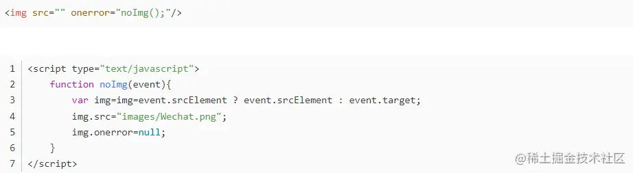
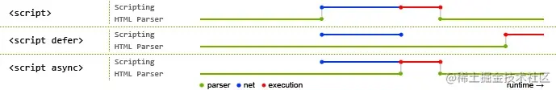
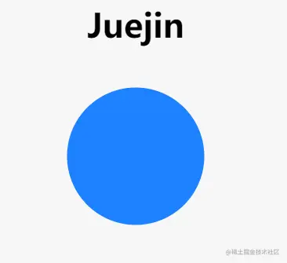
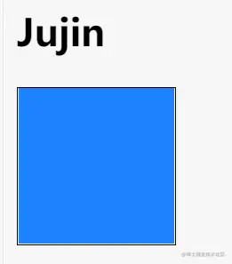

[参考](https://juejin.cn/post/7095899257072254989)、[参考](https://juejin.cn/post/7150109570609152014)

## 1. 什么是 *DOCTYPE*， 有何作用？

**文档声明的作用：** 文档声明是为了告诉浏览器，当前`HTML`文档使用什么版本的`HTML`来写的，这样浏览器才能按照声明的版本来正确的解析。 

**<!doctype html> 的作用：** 就是让浏览器进入标准模式(严格模式)，使用最新的 `HTML5` 标准来解析渲染页面；如果不写，浏览器就会进入混杂模式，我们需要避免此类情况发生。 

##  ** 2. 说说对 *html* 语义化的理解

HTML标签的语义化，简单来说，就是用正确的标签做正确的事情，给某块内容用上一个最恰当最合适的标签，使页面有良好的结构，页面元素有含义，无论是谁都能看懂这块内容是什么。

语义化的优点如下：

- 在没有CSS样式情况下也能够让页面呈现出清晰的结构
- 有利于SEO和搜索引擎建立良好的沟通，有助于爬虫抓取更多的有效信息，爬虫是依赖于标签来确定上下文和各个关键字的权重
- 方便团队开发和维护，语义化更具可读性，遵循W3C标准的团队都遵循这个标准，可以减少差异化

## ** 3. src 和 href 的区别 

src和href都是HTML中特定元素的属性，都可以用来引入外部的资源。两者区别如下：

- src：全称*source*，它通常用于img、video、audio、script元素，通过src指向请求外部资源的来源地址，指向的内容会嵌入到文档中当前标签所在位置，在请求src资源时，它会将资源下载并应用到文档内，比如说：js脚本、img图片、frame等元素。当浏览器解析到该元素时，会暂停其它资源下载，直到将该资源加载、编译、执行完毕。这也是为什么将js脚本放在底部而不是头部的原因。
- href：全称*hyper reference*，意味着超链接，指向网络资源，当浏览器识别到它指向的⽂件时，就会并⾏下载资源，不会停⽌对当前⽂档的处理，通常用于a、link元素。

##  4.title与h1的区别、b与strong的区别、i与em的区别？

- strong标签有语义，是起到加重语气的效果，而b标签是没有的，b标签只是一个简单加粗标签。b标签之间的字符都设为粗体，strong标签加强字符的语气都是通过粗体来实现的，而搜索引擎更侧重strong标签。
- *title* 属性表示网页的标题 ，H1则表示层次明确的标题，对页面信息的抓取有很大的影响
- **i内容展示为斜体，em表示强调的文本**

## 5. **严格模式与混杂模式的区分：**

- **严格模式**： 又称为标准模式，指浏览器按照`W3C`标准解析代码；
- **混杂模式**： 又称怪异模式、兼容模式，是指浏览器用自己的方式解析代码。混杂模式通常模拟老式浏览器的行为，以防止老站点无法工作；

## 6. **前端页面由哪三层构成，分别作用是什么？**

分成：结构层、表示层、行为层。

1. 结构层（structural layer）

   由 HTML 或 XHTML 之类的标记语言负责创建。标签，也就是那些出现在尖括号里的单词，对网页内容的语义含义做出了描述，但这些标签不包含任何关于如何显示有关内容的信息。例如，P 标签表达了这样一种语义：“这是一个文本段。”

1. 表示层（presentation layer）

   由 CSS 负责创建。 CSS 对“如何显示有关内容”的问题做出了回答。

1. 行为层（behaviorlayer）

   负责回答“内容应该如何对事件做出反应”这一问题。这是 Javascript 语言和 DOM 主宰的领域。

## **  7. **iframe 标签有那些优点和缺点？**

iframe 元素会创建包含另外一个文档的内联框架（即行内框架）。

**优点：**

- 用来加载速度较慢的内容（如广告）
- 可以使脚本可以并行下载
- 可以实现跨子域通信

**缺点：**

- iframe 会阻塞主页面的 onload 事件
- 无法被一些搜索引擎索识别
- 会产生很多页面，不容易管理

## 8 img上 title 与 alt

- alt：全称`alternate`，切换的意思，如果无法显示图像，浏览器将显示alt指定的内容
- title：当鼠标移动到元素上时显示title的内容

区别：

一般当鼠标滑动到元素身上的时候显示`title`，而`alt`是img标签特有的属性，是图片内容的等价描述，用于图片无法加载时显示，这样用户还能看到关于丢失了什么东西的一些信息，相对来说比较友好。

## 9. H5和HTML5区别

- H5是一个产品名词，包含了最新的HTML5、CSS3、ES6等新技术来制作的应用
- HTML5是一个技术名词，指的就是第五代HTML

## **  10. 行内元素有哪些？块级元素有哪些？ 空(void)元素有那些？

- 行内元素有：`a b span img input select strong`；
- 块级元素有：`div ul ol li dl dt dd h1 h2 h3 h4 h5 h6 p`；

### 块级元素：

- 总是在新行上开始，就是每个块级元素独占一行，默认从上到下排列
- 宽度缺少时是它的容器的100%，除非设置一个宽度
- 高度、行高以及外边距和内边距都是可以设置的
- 块级元素可以容纳其它行级元素和块级元素

### 行内元素：

- 和其它元素都会在一行显示
- 高、行高以及外边距和内边距可以设置
- 宽度就是文字或者图片的宽度，不能改变
- 行级元素只能容纳文本或者其它行内元素

使用行内元素需要注意的是：

- 行内元素设置宽度`width`无效
- 行内元素设置`height`无效，但是可以通过`line-height`来设置
- 设置`margin`只有左右有效，上下无效
- 设置`padding`只有左右有效，上下无效

**可以通过`display`属性对行内元素和块级元素进行切换** 

**空元素，即没有内容的HTML元素。空元素是在开始标签中关闭的，也就是空元素没有闭合标签：**

- 常见的有：`<br>`、`<hr>`、``、`<input>`、`<link>`、`<meta>`；
- 鲜见的有：`<area>`、`<base>`、`<col>`、`<colgroup>`、`<command>`、`<embed>`、`<keygen>`、`<param>`、`<source>`、`<track>`、`<wbr>`。

##  11.label 标签的作用是什么？

label标签来定义表单控件的关系：当用户选择label标签时，浏览器会自动将焦点转到和label标签相关的表单控件上。 

## 12.对于Web标准以及W3C的理解

`Web标准`简单来说可以分为结构、表现、行为。其中结构是由HTML各种标签组成，简单来说就是body里面写入标签是为了页面的结构。表现指的是CSS层叠样式表，通过CSS可以让我们的页面结构标签更具美感。行为指的是页面和用户具有一定的交互，这部分主要由JS组成

`W3C`，全称：world wide web consortium是一个制定各种标准的非盈利性组织，也叫万维网联盟，标准包括HTML、CSS、ECMAScript等等，web标准的制定有很多好处，比如说：

- 可以统一开发流程，统一使用标准化开发工具（VSCode、WebStorm、Sublime），方便多人协作
- 学习成本降低，只需要学习标准就行，否则就要学习各个浏览器厂商标准
- 跨平台，方便迁移都不同设备
- 降低代码维护成本

## 13. Quirks（怪癖）模式是什么？它和Standards（标准）有什么区别？

页面如果写了DTD，就意味着这个页面采用对CSS支持更好的布局，而如果没有，则采用兼容之前的布局方式，这就是Quirks模式，有时候也叫怪癖模式、诡异模式、怪异模式。

区别：总体会有布局、样式解析、脚本执行三个方面区别，这里列举一些比较常见的区别：

- `盒模型`：在W3C标准中，如果设置一个元素的宽度和高度，指的是元素内容的宽度和高度，然而在Quirks模式下，IE的宽度和高度还包含了padding和border
- `设置行内元素的高宽`：在Standards模式下，给行内元素设置width和height都不会生效，而在Quriks模式下会生效
- `用margin：0 auto设置水平居中`:在Standards模式下，设置margin：0 auto；可以使元素水平居中，但是在Quriks模式下失效
- `设置百分比高度`:在Standards模式下，元素的高度是由包含的内容决定的，如果父元素没有设置百分比的高度，子元素设置百分比的高度是无效的

## 14. 知道什么是微格式吗？谈谈理解，在前端构建中应该考虑微格式吗？

[参考](https://juejin.cn/post/7244709476519264293)

 微格式是一种用于在HTML文档中嵌入语义化信息的简单而轻量级的标记语言。它们通过使用已有的HTML标签和类名来表示结构化数据，以便机器能够更容易地理解和处理这些数据。 

微格式的目标是为了让信息更易于被自动化工具（如搜索引擎、数据聚合器、日历应用程序等）提取和解析。通过添加特定的类名和属性值，可以标记出文本中的特定数据，比如人名、地址、日期、评论等。 

## 15. HTML5为什么只需要写`<!DOCTYPE html>`?

为什么HTML5只需要写一段：

```
<!DOCTYPE html>
```

而HTML4却需要写很长的一段

```
<!DOCTYPE HTML PUBLIC "-//W3C//DTD HTML 4.01 Transitional//EN" "http://www.w3.org/TR/html4/loose.dtd">
```

HTML 4.01 中的 doctype 需要对 DTD 进行引用，因为 HTML 4.01 基于 SGML。而 HTML 5 不基于 SGML，因此不需要对 DTD 进行引用，但是需要 doctype 来规范浏览器的行为。

其中，SGML 是标准通用标记语言, 简单的说，就是比 HTML, XML 更老的标准，HTML，XML这两者都是由 SGML 发展而来的，而HTML5 不是的。

## 16. HTML5 对比 HTML4 有哪些不同之处？HTML5有哪些新特性

**HTML5新增：**

（1）新增语义化标签：nav、header、footer、aside、section、article

（2）音频、视频标签：audio、video

（3）数据存储：localStorage、sessionStorage

（4）canvas（画布）、Geolocation（地理定位）、websocket（通信协议）

（5）input标签新增属性：placeholder、autocomplete、autofocus、required

（6）history API：go、forward、back、pushstate

**HTML5移除的元素有：**

- 纯表现的元素：basefont，big，center，font, s，strike，tt，u;
- 对可用性产生负面影响的元素：frame，frameset，noframes

##   17. 怎么处理HTML5新标签兼容问题？

主要有两种方式：

1. 实现标签被识别：通过`document.createElement(tagName)`方法可以让浏览器识别新的标签，浏览器支持新标签后。还可以为新标签添加CSS样式
2. 用JavaScript解决：使用HTML5的shim框架，在`head`标签中调用以下代码：

```
<!--[if lt IE 9]>
    <script> src="http://html5shim.googlecode.com/svn/trunk/html5.js"</script>
<![endif]-->
```

##  18. 如何实现在一张图片上的某个区域做到点击事件

我们可以通过图片热区技术：

1. 插入一张图片，并设置好图像的有关参数，在``标记中设置参数`usemap="#Map"`，以表示对图像地图的引用。
2. 用`<map>`标记设定图像地图的作用区域，并取名：Map；
3. 分别用`<area>`标记针对相应位置互粉出多个矩形作用区域，并设定好链接参数`href`

例：

```
<body>
 
 　　<map name="Map" id="Map">
     <area alt="" title="" href="#" shape="poly"
         coords="65,71,98,58,114,90,108,112,79,130,56,116,38,100,41,76,52,53,83,34,110,33,139,46,141,75,145,101,127,115,113,133,85,132,82,131,159,117" />
     <area alt="" title="" href="#" shape="poly" coords="28,22,57,20,36,39,27,61" />
 </map>
</body>
```

## 19. a 元素除了用于导航外，还有什么作用？

href属性中的url可以是浏览器支持的任何协议，所以a标签可以用来手机拨号`<a href="tel:110">110</a>`，也可以用来发送短信`<a href="sms:110">110</a>`，还有邮件等等

当然，a元素最常见的就是用来做*锚点*和 *下载文件*。例：`<a href="example.pdf" download>下载 PDF 文件</a>`

锚点可以在点击时快速定位到一个页面的某个位置，而下载的原理在于a标签所对应的资源浏览器无法解析，于是浏览器会选择将其下载下来。

##  20. 你知道SEO中的TDK吗？

在SEO中，TDK其实就是`title`、`description`、`keywords`这三个标签，title表示标题标签，description是描述标签，keywords是关键词标签

##  21 为什么最好把 JS 的 `<script>` 标签恰好放在 `</body>` 之前？

脚本在下载和执行期间会阻止 HTML 解析。把 `<script>` 标签放在底部，保证 HTML 首先完成解析，将页面尽早呈现给用户。

例外情况：

是当你的脚本里包含 `document.write()` 时。（但是现在 `document.write()` 不推荐使用）。同时你将 `<script>` 标签放在底部，意味着浏览器直到整个文档（document）被解析完成不能开始下载脚本。

也许，对此比较好的做法是， `<script>` 使用 `defer` 属性，放在 `<head>` 中。`defer` 属性告诉浏览器该脚本将延迟执行，直到文档完全解析完成后再执行。 

## 22.为什么最好把 CSS 的 `<link>` 标签放在`<head></head>`之间？

把 `<link>` 标签放在 `<head></head>` 之间是规范要求的内容。这种做法可以让页面逐步呈现，提高了用户体验。如果将样式表放在文档底部附近，会使许多浏览器（包括 Internet Explorer）不能逐步呈现页面。

一些浏览器会阻止渲染，以避免在页面样式发生变化时，重新绘制页面中的元素。这种做法可以防止呈现给用户空白的页面或没有样式的内容

##  23 说一下音视频标签的使用？

**audio** 标签用来向页面中引入一个外部的音视频文件。音视频文件引入时，默认情况下不允许用户自己控制播放停止。

属性：

```
markdown
复制代码    controls 是否允许用户自己控制播放。

    autoplay 音视频文件是否自动播放。

    loop -音视频是否进行循环播放。
```

如果设置了autoplay，则音视频在打开界面时会自动播放。

但是目前来讲大部分浏览器都不会对音视频进行播放。

**video**标签来向网页中引入一个视频，使用方法和audio基本上是一样的，包括各种audio拥有的属性，video也有。

## 24. 说一下 web worker

在 HTML 页面中，如果在执行脚本时，页面的状态是不可响应的，直到脚本执行完成后，页面才变成可响应。web worker 是运行在后台的 js，独立于其他脚本，不会影响页面的性能。 并且通过 postMessage 将结果回传到主线程。这样在进行复杂操作的时候，就不会阻塞主线程了。

如何创建 web worker：

1. 检测浏览器对于 web worker 的支持性
2. 创建 web worker 文件（js，回传函数等）
3. 创建 web worker 对象 

## 25. 说说img标签的onerror事件，图片加载失败的处理方法

在图片不存在或者网络状态不好的情况下，会存在图片加载不过来，用户体验很差

可以直接在img标签里添加onerror事件进行控制

```
ini
复制代码    
    
    注意点：
        1.这里的图片要尽可能小，如果过大还会存在加载失败的可能；

        2.当'xxx.jpg'图片不存在时还会出现加载失败；

        3.当加载失败时会再次执行onerror，再失败再执行，会一直执行陷入循环之中。
```

所以可以写一个函数，让函数只执行一次（执行一次把它置为null即可），不让其进入循环之中

 

## 26. html 常见兼容性问题？

1. 双边距 BUG float 引起的，解决办法: 使用 display解决
2. 2.3 像素问题 使用 float 引起的，解决办法: 使用 dislpay:inline -3px

1. 超链接 hover 点击后失效，解决办法: 使用正确的书写顺序 link visited hover active
2. Ie z-index 问题，解决办法: 给父级添加 position:relative
3. Png 透明 ，解决办法: 使用 js 代码
4. Min-height 最小高度 ，解决办法: ！Important 解决
5. 7.select 在 ie6 下遮盖，解决办法: 使用 iframe 嵌套

1. 为什么没有办法定义 1px 左右的宽度容器，解决办法: （IE6 默认的行高造成的，使用 over:hidden, zoom:0.08 line-height:1px）
2. IE5-8 不支持 opacity，解决办法：

```
css
复制代码 .opacity {
    opacity: 0.4;
    filter: alpha(opacity=60);/_ for IE5-7 _/ -ms-filter: "progid:DXImageTransform.Microsoft.Alpha(Opacity=60)";/_ for IE 8_/
  }
```

1. IE6 不支持 PNG 透明背景，解决办法: IE6 下使用 gif 图片

[其他类型问题可参考文章](https://juejin.cn/post/6844904193841430536)

 

## 27. 说一下HTML5的离线存储？

指的是没有网络连接的时候，可以正常访问应用，与网络连接时更新缓存文件

在 cache.manifest 文件中编写需要离线存储的资源：

如何清除缓存：更新 manifest 文件，通过 javascript 操作，清除浏览器缓存

## 28. 前缀为 data- 开头的元素属性是什么？

这是一种为 HTML 元素添加额外数据信息的方式，被称为 **自定义属性**。

我们可以直接在元素标签上声明这样的数据属性：

```
bash
复制代码<div id="mydiv" data-message="Hello,world" data-num="123"></div>
```

也可以使用 JavaScript 来操作元素的数据属性：

```
javascript
复制代码let mydiv = document.getElementById('mydiv')

// 读取
console.log(mydiv.dataset.message)

// 写入
mydiv.dataset.foo = "bar!!!"
```

## 29. HTML、XML、XHTML 之间有什么区别？

它们都属于标记语言。

| 语言  | 中文名               | 说明                                                         |
| ----- | -------------------- | ------------------------------------------------------------ |
| HTML4 | 超文本标记语言       | 主要用于做界面呈现。HTML 是先有实现，后面才慢慢制定标准的，导致HTML⾮常混乱和松散，语法非常的不严谨。 |
| XML   | 可扩展标记语言       | 主要⽤于存储数据和结构。语法严谨，可扩展性强。由于 JSON 也有类似作⽤但更轻量⾼效， XML 的市场变得越来越⼩。 |
| XHTML | 可扩展超文本标记语言 | 属于加强版 HTML，为解决 HTML 的混乱问题而生，在语法方面变得和 XML 一样严格。另外，XHTML 的出现也催生了 HTML 5，让HTML向规范化严谨化过渡。 |
| HTML5 | 超文本标记语言       | 在HTML的基础上进行拓展，用于页面呈现 (目前标准)              |

XML的要求会比较严格:

1. 有且只能有一个根元素
2. 大小写敏感
3. 正确嵌套
4. 必须双引号
5. 必须闭合标签

 渐进增强和优雅降级之间的区别

**（1）渐进增强（progressive enhancement）** ：主要是针对低版本的浏览器进行页面重构，保证基本的功能情况下，再针对高级浏览器进行效果、交互等方面的改进和追加功能，以达到更好的用户体验。

**（2）优雅降级 graceful degradation**： 一开始就构建完整的功能，然后再针对低版本的浏览器进行兼容。

**两者区别：**

- 优雅降级是从复杂的现状开始的，并试图减少用户体验的供给；而渐进增强是从一个非常基础的，能够起作用的版本开始的，并在此基础上不断扩充，以适应未来环境的需要；
- 降级（功能衰竭）意味着往回看，而渐进增强则意味着往前看，同时保证其根基处于安全地带。

## 30. 浏览器乱码的原因是什么？如何解决？

**产生乱码的原因：**

- 网页源代码是`gbk`的编码，而内容中的中文字是`utf-8`编码的，这样浏览器打开即会出现`html`乱码，反之也会出现乱码；
- `html`网页编码是`gbk`，而程序从数据库中调出呈现是`utf-8`编码的内容也会造成编码乱码；
- 浏览器不能自动检测网页编码，造成网页乱码。

**解决办法：**

- 使用软件编辑HTML网页内容；
- 如果网页设置编码是`gbk`，而数据库储存数据编码格式是`UTF-8`，此时需要程序查询数据库数据显示数据前进程序转码；
- 如果浏览器浏览时候出现网页乱码，在浏览器中找到转换编码的菜单进行转换。

## 31.head 标签有什么作用，其中什么标签必不可少？

标签用于定义文档的头部，它是所有头部元素的容器。 中的元素可以引用脚本、指示浏览器在哪里找到样式表、提供元信息等。

文档的头部描述了文档的各种属性和信息，包括文档的标题、在 Web 中的位置以及和其他文档的关系等。绝大多数文档头部包含的数据都不会真正作为内容显示给读者。

**下面这些标签可用在 head 部分：`<base>, <link>, <meta>, <script>, <style>, <title>`。**

**其中 `<title>` 定义文档的标题，它是 head 部分中唯一必需的元素。**

 

## 32.说一下 HTML5 drag(拖拽) API

dragstart：事件主体是被拖放元素，在开始拖放被拖放元素时触发。

darg：事件主体是被拖放元素，在正在拖放被拖放元素时触发。

dragenter：事件主体是目标元素，在被拖放元素进入某元素时触发。

dragover：事件主体是目标元素，在被拖放在某元素内移动时触发。

dragleave：事件主体是目标元素，在被拖放元素移出目标元素是触发。

drop：事件主体是目标元素，在目标元素完全接受被拖放元素时触发。

dragend：事件主体是被拖放元素，在整个拖放操作结束时触发。

## 33.常⽤的meta标签有哪些

`meta` 标签由 `name` 和 `content` 属性定义，**用来描述网页文档的属性**，比如网页的作者，网页描述，关键词等，除了HTTP标准固定了一些`name`作为大家使用的共识，开发者还可以自定义name。

## 34.常用的meta标签：

`charset`，用来描述HTML文档的编码类型：

```
ini
复制代码<meta charset="UTF-8" >
```

`keywords`，页面关键词：

```
ini
复制代码<meta name="keywords" content="关键词" />
```

`description`，页面描述：

```
ini
复制代码<meta name="description" content="页面描述内容" />
```

`refresh`，页面重定向和刷新：

```
ini
复制代码<meta http-equiv="refresh" content="0;url=" />
```

`viewport`，适配移动端，可以控制视口的大小和比例：

```
ini
复制代码<meta name="viewport" content="width=device-width, initial-scale=1, maximum-scale=1">
```

viewport的`content` 参数有以下几种：

- `width viewport` ：宽度(数值/device-width)
- `height viewport` ：高度(数值/device-height)
- `initial-scale` ：初始缩放比例
- `maximum-scale` ：最大缩放比例
- `minimum-scale` ：最小缩放比例
- `user-scalable` ：是否允许用户缩放(yes/no）

`robots`，搜索引擎索引方式：

```
ini
复制代码<meta name="robots" content="index,follow" />
```

robots的`content` 参数有以下几种：

- `all`：文件将被检索，且页面上的链接可以被查询；
- `none`：文件将不被检索，且页面上的链接不可以被查询；
- `index`：文件将被检索；
- `follow`：页面上的链接可以被查询；
- `noindex`：文件将不被检索；
- `nofollow`：页面上的链接不可以被查询。

##  35. 响应式图片处理优化: Picture 标签

**考察点: 响应式图片处理**

`picture`元素就像是图像和其源的容器。浏览器仍然需要`img`元素，用来表明需要加载的图片

在 `<picture>` 下可放置零个或多个`<source>`标签、以及一个``标签，为不同的屏幕设备和场景显示不同的图片。

如果source匹配到了, 就会优先用匹配到的, 如果没有匹配到会往下继续找

使用`picture`元素选择图像，不会有歧义。

浏览器的工作流程如下：

- 浏览器会先根据当前的情况，去匹配和使用`<source>`提供的图片
- 如果未匹配到合适的`<source>`，就使用``标签提供的图片

```
ini
复制代码<picture>
  <source srcset="640.png" media="(min-width: 640px)">
  <source srcset="480.png" media="(min-width: 480px)">
  
</picture>
```

## 36. img的srcset属性的作⽤？

响应式页面中经常用到根据屏幕密度设置不同的图片。这时就用到了 img 标签的srcset属性。

**通过使用 img 标签的 srcset 属性，可定义一组额外的图片集合，让浏览器根据不同的屏幕状况选取合适的图片来显示**。

## 37. script标签中defer和async的区别

如果没有defer或async属性，浏览器会立即加载并执行相应的脚本。它不会等待后续加载的文档元素，读取到就会开始加载和执行，这样就阻塞了后续文档的加载。

下图可以直观的看出三者之间的区别:



其中蓝色代表js脚本网络加载时间，红色代表js脚本执行时间，绿色代表html解析。

**defer 和 async属性都是去异步加载外部的JS脚本文件，它们都不会阻塞页面的解析**，其区别如下：

- **执行顺序：** 多个带async属性的标签，不能保证加载的顺序；多个带defer属性的标签，按照加载顺序执行；
- **脚本是否并行执行：async属性，表示后续文档的加载和执行与js脚本的加载和执行是并行进行的**，即异步执行；defer属性，加载后续文档的过程和js脚本的加载(此时仅加载不执行)是并行进行的(异步)，js脚本需要等到文档所有元素解析完成之后才执行，DOMContentLoaded事件触发执行之前。

##  38.  说说对HTML语义化的理解

**语义化是指根据内容的结构化（内容语义化），选择合适的标签（代码语义化）** 。通俗来讲就是用正确的标签做正确的事情。

语义化的优点如下：

- 对机器友好，带有语义的文字表现力丰富，更适合搜索引擎的爬虫爬取有效信息，**有利于SEO**。除此之外，语义类还支持读屏软件，根据文章可以自动生成目录；
- 对开发者友好，使用语义类标签**增强了可读性**，结构更加清晰，开发者能清晰的看出网页的结构，便于团队的开发与维护。

常见的语义化标签：

```
css
复制代码<h1>~<h6>标签：标题标签，h1等级最高，h6等级最低

<header></header>：用于定义页面的介绍展示区域，通常包括网站logo、主导航、全站链接以及搜索框

<nav></nav>：定义页面的导航链接部分区域

<main></main>：定义页面的主要内容，一个页面只能使用一次。

<article></article>：定义页面独立的内容，它可以有自己的header、footer、sections等

<section></section>：元素用于标记文档的各个部分，例如长表单文章的章节或主要部分

<aside></aside>：一般用于侧边栏

<footer></footer>：文档的底部信息

<small></small>：呈现小号字体效果

<strong></strong>：用于强调文本
```

## **  39.  Canvas 与 SVG 的区别 

[参考来源](https://juejin.cn/post/7083146633029877768)

## svg

 **可缩放矢量图形**（**Scalable Vector Graphics，SVG**），是一种用于描述二维的[矢量图形](https://link.juejin.cn/?target=https%3A%2F%2Fzh.wikipedia.org%2Fwiki%2F%25E7%259F%25A2%25E9%2587%258F%25E5%259B%25BE%25E5%25BD%25A2)， 基于 XML 的标记语言, 这意味着可以使用任何文本编辑器(如记事本)创建和编辑SVG图像。

与[JPEG](https://link.juejin.cn?target=https%3A%2F%2Fdeveloper.mozilla.org%2Fzh-CN%2Fdocs%2FGlossary%2Fjpeg)和[PNG](https://link.juejin.cn?target=https%3A%2F%2Fdeveloper.mozilla.org%2Fzh-CN%2Fdocs%2FGlossary%2FPNG)这种传统的点阵图像模式不同，SVG格式提供的是矢量图，这意味着它的图像能够被**无限放大而不失真或降低质量**，并且可以方便地修改内容。

`HTML` `<svg>`元素是`svg`图形的容器。

------

> [svg demo](https://link.juejin.cn?target=https%3A%2F%2Fjsbin.com%2Fyejohebuvo%2F2%2Fedit%3Fhtml%252Cconsole%252Coutput%3D)

```
<svg id="svgelem" height="200">
    <circle id="greencircle" cx="60" cy="60" r="50" fill="#1E81FF" />
</svg>
```



## canvas

**`<canvas>`本身只是相当于一块画布，不具有绘图能力，必须通过脚本(通常是JavaScript)动态地绘制图形，脚本充当画笔的角色。**元素只是图形的容器, 必须使用脚本来实际绘制图形。Canvas有几种绘制路径、框、圆、文本和添加图像的方法

------

> [canvas demo](https://link.juejin.cn?target=https%3A%2F%2Fjsbin.com%2Fweduxufura%2Fedit%3Fhtml%252Cconsole%252Coutput%3D)

```
<canvas id="newCanvas" width="100" height="100" style="border:1px solid #000000;">
</canvas>

<script>
    var c = document.getElementById('newCanvas');
    var ctx = c.getContext('2d');
    ctx.fillStyle = '#1E81FF';
    ctx.fillRect(0, 0, 100, 100);
</script>
```



### 二者的区别

`SVG`是一种基于`XML`中的2D图形的语言。

`Canvas`通过脚本动态绘制2D图形。

`SVG`是基于`XML`的，这意味着每个元素都在`SVG DOM`中可用, 可以为元素附加`JavaScript`事件处理程序。在SVG中，将每个绘制的形状记住为对象。如果更改了SVG对象的属性，则浏览器可以自动重新呈现形状。

`Canvas`由像素呈现,一旦图形在画布中绘制完成，浏览器撒手不管了。如果需要更改其位置，则需要重新绘制整个场景，其中许多对象会被频繁重绘。

**详细对比如下：**

| SVG                                       | Canvas                                     |
| ----------------------------------------- | ------------------------------------------ |
| 不依赖分辨率（矢量图）                    | 依赖分辨率（位图）                         |
| 每一个图形都是一个 `DOM`元素              | 单个HTML元素，相当于``                |
| 支持事件处理器                            | 不支持事件处理器                           |
| 适合大型渲染区域的应用程序(谷歌地图)      | 文本渲染能力差                             |
| 可以通过脚本和CSS进行修改                 | 只能通过脚本修改                           |
| 对象数量较小 (`<10k`)、图面更大时性能更佳 | 图面较小，对象数量较大（`>10k`）时性能最佳 |
| 不适合游戏应用                            | 适合图像密集型的游戏应用                   |

 