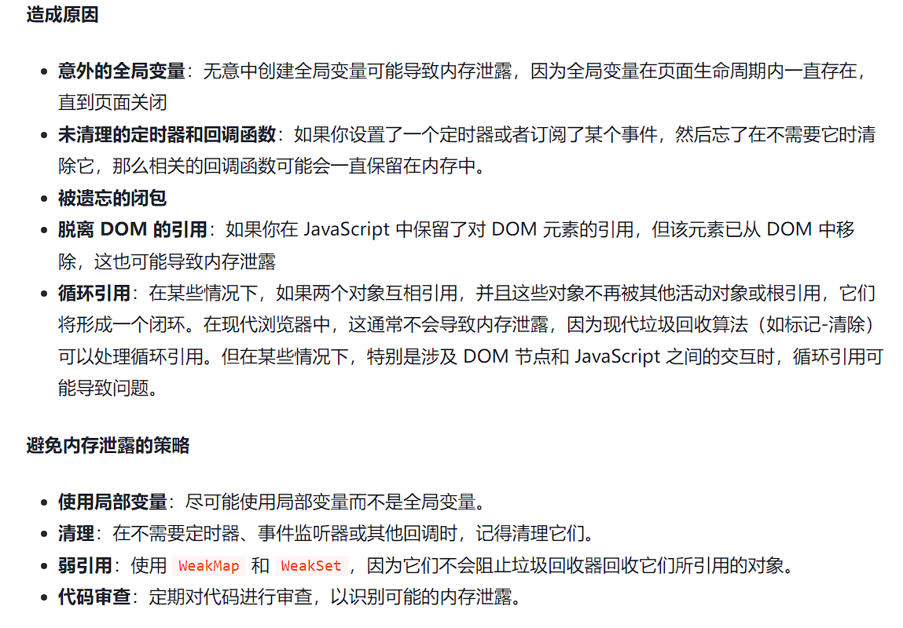

# JavaScript面试题

[参考博客](https://juejin.cn/post/7347324514365227047)，参考博客，

## **  1. JS的数据类型及检测方法

基本数据类型：number、string、undefined、null、boolean、symbol（es6）、bigInt（es7）

 引用数据类型：object、array、function 

检测方法： 

+ typeof :检测基本数据类型，但是null和object都被检测为对象 

  ```
  typeof undefined // "undefined"
  
  typeof 0 // "number"
  
  typeof 10n // "bigint"
  
  typeof true // "boolean"
  
  typeof "foo" // "string"
  
  typeof Symbol("id") // "symbol"
  
  typeof Math // "object"  (1)
  
  typeof null // "object"  (2)
  
  typeof alert // "function"  (3)
  ```

+ Instance of: 主要用来检测引用数据类型，不能正确检测基本数据类型，他的原理是判断其原型链上能不能找到该类型的原型 , 语法`obj instanceof Class` 

```
class Rabbit {}
let rabbit = new Rabbit();

// rabbit 是 Rabbit class 的对象吗？
alert( rabbit instanceof Rabbit ); // true
```

+ Constructor: 用于检测引用数据类型，检测方法是获取示例的构造函数和某个类是否相同 

  ```
  function Rabbit() {}
  // 默认：
  // Rabbit.prototype = { constructor: Rabbit }
  
  alert( Rabbit.prototype.constructor == Rabbit ); // true
  ```

  

+ Object.prototype.toString.call(): 可以检测任何类

```
let s = Object.prototype.toString;

alert( s.call(123) ); // [object Number]
alert( s.call(null) ); // [object Null]
alert( s.call(alert) ); // [object Function]
```

## **  2. ES6新增

- **let 和 const**：用于变量声明，提供块级作用域。
- **箭头函数（Arrow Functions）** ：简化了函数表达式的写法，使用 `=>` 符号
- **类（Classes）** ：引入了基于类的面向对象编程语法。

```
class Person {
  constructor(name) {
    this.name = name;
  }
  greet() {
    return `Hello, ${this.name}!`;
  }
}
```

- **模板字符串（Template Literals）** ：允许嵌入表达式的字符串字面量。
- **默认参数值**：允许函数参数有默认值。
- **解构赋值（Destructuring Assignment）** ：允许从数组或对象中提取数据并赋值给变量。

```
const [a, b] = [1, 2];
const { x, y } = { x: 10, y: 20 };
```

- **扩展运算符（Spread Operator）和剩余参数（Rest Parameters）** ：使用 `...` 实现。

```
const numbers = [1, 2, 3];
const newNumbers = [...numbers, 4, 5]; // Spread operator

function sum(...args) { // Rest parameters
  return args.reduce((sum, current) => sum + current, 0);
}
```

- **模块导入和导出（Modules）** ：使用 `import` 和 `export` 语法。
- **Promise 对象**：用于异步编程。
- **生成器和迭代器（Generators & Iterators）** ：引入生成器函数，可通过 `yield` 关键字暂停和恢复执行
- **新的数据结构**：如 `Map`, `Set`, `WeakMap`, `WeakSet`
- **Symbol 类型**：引入了新的原始数据类型 `Symbol`，可用作唯一的属性键。
- **新的静态方法和属性**：例如 `Array.from`, `Object.assign`, `Number.isFinite`, `Math.trunc` 等

## **  3. let、const、var区别

|            | var      | let    | const  |
| ---------- | -------- | ------ | ------ |
| 块级作用域 | 没有     | 有     | 有     |
| 变量提升   | 有       | 没有   | 没有   |
| 暂时性死区 | 没有     | 有     | 有     |
| 初始值     | 可以没有 | 可以有 | 必须有 |
| 重复声明   | 可以     | 不可以 | 不可以 |

## 4. call、apply、bind区别

都是js中函数原型上的方法，用于设置函数执行时的上下文

- `call`：`call`方法允许调用一个函数，也允许指定函数内部的`this`值，它接收一个参数列表，第一个参数是`this`指向对象

```
const greet = (message) => {
  return `${message}, ${this.name}`;
}

const person = { name: 'Alice' };
const result = greet.call(person, 'Hello'); // "Hello, Alice"
```

- `Apply`：与call方法类似，但它接收的是一个参数数组而不是列

```
const greet = (message) => {
  return `${message}, ${this.name}`;
}

const person = { name: 'Alice' };
const result = greet.apply(person, ['Hello']); // "Hello, Alice"
```

- `Bind`: call与apply都用于立即执行一个函数，但是bind不会立即调用函数，而是创建一个新函数，新函数被调用时它的this会被设置为bind方法的第一个参数

```
const greet = (message) => {
  return `${message}, ${this.name}`;
}

const person = { name: 'Alice' };
const boundGreet = greet.bind(person, 'Hello');

const result = boundGreet(); // "Hello, Alice"
```

## **  5. ==和===区别

- **`=` 是相等运算符**，**它执行类型转换以尝试匹配值的类型后再比较它们的等价性**。当使用 `==` 比较两个变量时，如果它们的类型不相同，JavaScript 会尝试将它们转换为一个共同类型，然后再进行比较。

```
'2' == 2; // true，因为字符串 '2' 被转换为数字 2
```

- **`===` 是严格相等运算符，它不会执行类型转换。**如果两个变量的类型不同，则这两个变量被认定为不等。使用 `===` 比较时，**仅当变量的值和类型都相同时，它们才被认为是相等的**。

```
'2' === 2; // false，因为它们的类型不同
```

## ** 6. 原型及原型链

### 原型 (Prototype)

在 JavaScript 中，每个函数在创建时都会自动获得一个 `prototype` 属性，这个属性是一个具有 `constructor` 属性的对象，而 `constructor` 属性又指回函数本身。当使用构造函数创建对象时，这些对象内部会包含一个指向构造函数 `prototype` 属性的内部链接（通常在实现中用 `[[Prototype]]` 表示，可以通过 `__proto__` 属性或 `Object.getPrototypeOf()` 方法访问）。

```
function Person(name){
  this.name = name;
}

Person.prototype.sayName = function(){ // Person.prototype是通过Person构造函数创建的所有实例共享的原型对象
  console.log(this.name);
};

let person1 = new Person("Alice");
person1.sayName(); // 输出 "Alice"
// person1.__proto__（或 Object.getPrototypeOf(person1)）指向Person.prototype，所以 person1可以访问sayName方法
console.log(person1.__proto__ === Person.prototype); // 输出 true
```


### 原型链 (Prototype Chain)

原型链是一个对象查找属性和方法时的查找机制。如果在对象自身上找不到请求的属性或方法，JavaScript 会沿着这个对象的原型链向上查找，直到找到属性或方法或者到达原型链的顶端（也就是 `Object.prototype`）。如果在原型链的任何一级上找到了属性或方法，查找过程就会停止；如果一直没找到，通常会返回 `undefined`（对于方法调用则会抛出错误）。

### 原型链的终点

在原型链的最顶端是 `Object.prototype`。它是所有默认对象原型链的最终点：

```
console.log(Person.prototype.__proto__ === Object.prototype); // 输出 true
console.log(person1.__proto__.__proto__ === Object.prototype); // 输出 true
console.log(person1.__proto__.__proto__.__proto__); // 输出 null，原型链的终点
```

`Object.prototype` 的原型是 `null`，这表示原型链的终点，即没有更多的原型对象可以查找。

##  7. 继承的方式

[JavaScript继承方式有哪些](https://www.bilibili.com/video/BV1UX4y1C7gQ/)

### 原型链继承

通过将**子类的原型**设置为**父类的实例**来实现继承。

```
function Parent() {
  this.property = true;
}

Parent.prototype.getParentProperty = function() {
  return this.property;
};

function Child() {
  this.childProperty = false;
}

// 继承 Parent
Child.prototype = new Parent();

let child = new Child();
console.log(child.getParentProperty()); // true
```

### 构造函数继承

在子类的构造函数中调用父类的构造函数，使用 `call` 或 `apply` 方法将子类实例的 `this` 绑定到父类函数上实现继承。

```
function Parent(name) {
  this.name = name;
}

function Child(name) {
  Parent.call(this, name);
}

var child = new Child("Alice");
console.log(child.name); // Alice
```

这种方式的缺点是方法都在构造函数中定义，因此每次创建实例都会创建一遍方法，不能继承父类prototype上的属性。

### 组合继承（原型链 + 构造函数）

结合了原型链继承和构造函数继承的优点，是 JavaScript 中最常用的继承模式。

```
function Parent(name) {
  this.name = name;
  this.colors = ['red', 'blue', 'green'];
}

Parent.prototype.sayName = function() {
  console.log(this.name);
};

function Child(name, age) {
  Parent.call(this, name); // 继承属性
  this.age = age;
}

Child.prototype = new Parent(); // 继承方法
Child.prototype.constructor = Child; // 修正 constructor 指针

Child.prototype.sayAge = function() {
  console.log(this.age);
};

var child1 = new Child("Alice", 10);
child1.colors.push('black');
console.log(child1.colors); // ["red", "blue", "green", "black"]
child1.sayName(); // Alice
child1.sayAge(); // 10
```

缺点: 调用两次parent(), 他在child的prototype上添加了父类的属性和方法

### 原型式继承

使用 `Object.create` 方法创建一个新对象，使用现有的对象来提供新创建的对象的 `__proto__`。

```
var person = {
  name: 'Alice',
  friends: ['Bob', 'Eve']
};

var anotherPerson = Object.create(person);
anotherPerson.name = 'Clara';
anotherPerson.friends.push('Dave');

console.log(person.friends); // ["Bob", "Eve", "Dave"]
// 原型式继承的缺点是包含引用类型值的属性始终会共享相应的值。
```

### 寄生式继承

创建一个仅用于封装继承过程的函数，该函数在内部以某种方式增强对象，最后再像真的是它做了所有工作一样返回对象。

```
function createAnother(original) {
  var clone = Object.create(original); // 通过调用函数创建一个新对象
  clone.sayHi = function() { // 以某种方式增强这个对象
    console.log('hi');
  };
  return clone; // 返回这个对象
}

var person = {
  name: "Alice",
  friends: ["Bob", "Eve"]
};

var anotherPerson = createAnother(person);
anotherPerson.sayHi(); // "hi"
```

### 寄生组合式继承

通过借用构造函数来继承属性，通过原型链的混成形式来继承方法，基本思路是不必为了指定子类型的原型而调用超类型的构造函数。

```
function inheritPrototype(subType, superType) {
  var prototype = Object.create(superType.prototype); // 创建对象
  prototype.constructor = subType; // 增强对象
  subType.prototype = prototype; // 指定对象
}

function SuperType(name) {
  this.name = name;
}

SuperType.prototype.sayName = function() {
  console.log(this.name);
};

function SubType(name, age) {
  SuperType.call(this, name);
  this.age = age;
}

inheritPrototype(SubType, SuperType);

SubType.prototype.sayAge = function() {
  console.log(this.age);
};

var instance = new SubType("Alice", 21);
instance.sayName(); // Alice
instance.sayAge(); // 21
```

寄生组合式继承是最有效率的继承方式，它只调用一次 SuperType 构造函数，并且避免了在 SubType.prototype 上创建不必要的、多余的属性。与此同时，原型链还能保持不变；因此，还能够正常使用 instanceof 和 isPrototypeOf。出于这些原因，寄生组合式继承被认为是引用类型最理想的继承范式

##   **  8. 作用域和闭包

**作用域**：是程序中定义变量的区域，分为全局作用域（代码的任何地方都能访问到的变量）和局部作用域（只能在函数或者代码块内部访问的变量）；局部作用域可以分为局部作用域和函数作用域

**闭包**：当一个函数嵌套在另一个函数中，内部函数会保留外部函数的作用域，即使外部函数已经执行完毕，内部函数依然可以访问外部函数中的变量

  常用的两个用途： 

- 在函数外部可以方位到内部的变量，可以通过这种方法来创建私有变量
- 已经结束运行的函数，上下文中的变量对象会继续留在内存中，因为闭包函数保留了这个对象的引用，所以变量不会被回收

闭包的坏处 ：

- 使用不当会造成内存泄露
- 闭包使得函数的变量都放在内存中，内存消耗较大，解决办法是退出函数之前把所有的变量删除
- 闭包会在父函数外部改变其内部的值

## **  9. promise理解

- `promise`是异步编程的解决方案，最早是由社区提出的，他可以看作是一个容器，里面放着异步操作和异步操作的结果，是一个构造函数，接收一个参数返回一个`promise`实例，可以获取异步操作的信息，也可以避免地域回调的问题。
- `promise`有三种状态，`初始态pending、成功态 resolved--也叫fulfilled、失败态 rejected`；状态是不可逆的只能由`pending`变为`resolved或rejected`；并且`promise`一旦创建就立即执行，无法取消；状态的改变只能通过`resolve、reject`来实现
- `promise`的方法
   i.`.then()`: 可以接收2个参数，第一个是promise对象变为resolve时的回调，第二个是变为rejected时的回调
   ii.`.catch()`：相当于.then的第二个参数，用来捕获内部错误
   iii.`.all()`：可以并行完成任务，接收一个数组，数组的每一项都是一个promis对象，当数组的每一个promise对象的状态变为resolve时.all的状态才会变成resolve
   iv.`.race()`：和.all类似，不同的是最先执行的事件的状态就是.race的状态
   v.`.finally()`：不管最后结果如何都执行

##  **  10. 箭头函数特点

- 箭头函数的语法更简单，省去了`function`关键字
- 不能创建自己的`this`上下文，`this`值在定义箭头函数的时候就确定下来了，他继承父级的`this`
- 不能绑定`arguments`函数，不能在箭头函数内部使用`arguments`变量来访问函数的参数列表，但可以用剩余参数语法`（…args）`
- 不能作为构造函数使用，没有`prototype`属性，不能绑定`super`
- 不能使用`new`关键字

普通函数：谁调用这个函数，this指向谁

箭头函数：在哪里定义函数，this指向谁

##   **  11 new一个对象的过程

当在 JavaScript 中使用 `new` 操作符创建一个新对象时，会经历以下几个步骤：

- **创建一个新对象**： `new` 操作符首先创建一个空的简单 JavaScript 对象（即 `{}`）。
- **设置原型**：新对象的 `[[Prototype]]`（也就是 `__proto__` 属性，或者通过 `Object.getPrototypeOf` 获取的值）会被设置为构造函数的 `prototype` 属性。这意味着新对象会继承构造函数原型上的方法和属性。
- **绑定 this 值**：构造函数内部的 `this` 被绑定到新创建的对象上。这样构造函数内部对 `this` 的任何引用都会指向这个新对象。
- **执行构造函数**：`new` 操作符后面的函数（构造函数）会被调用，其参数也会按照指定的参数传递进去。构造函数内部的代码通常会初始化新对象的属性，并执行其他必要的设置。
- **返回新对象**：如果构造函数返回一个对象，那么这个对象会成为 `new` 操作符的返回值。如果构造函数没有返回对象，那么 `new` 操作符会返回刚刚创建的新对象。

##   12 对柯里化的理解

柯里化（`Currying`）是指将一个接受多个参数的函数转换成一系列使用一个参数的函数的过程。柯里化的目的是固定一些参数并产生一个更小元的新函数，这个新函数接受剩余的参数以完成原函数的调用。 柯里化的几个关键点：

- **参数复用**： 柯里化使得函数可以被重复调用，每次调用只传递部分参数。通过柯里化，一些参数可以预设固定值，从而简化后续函数的调用。
- **延迟计算**： 柯里化函数允许我们将函数的计算过程分步骤进行。我们可以在不同的时间点传递不同的参数，直到所有参数都被提供之后，完成最终的函数计算。
- **动态生成函数**： 每次柯里化调用都可以返回一个新的函数，这个函数期望接收下一个参数。这种能力使得柯里化非常灵活，可以动态地根据不同的需求生成定制化的函数。

```
function curry(fn) {
  return function curried(...args) {
    if (args.length >= fn.length) {
      // 如果传入的参数数量足够，则直接执行函数
      return fn.apply(this, args);
    } else {
      // 如果传入的参数数量不够，则返回一个接受剩余参数的新函数
      return function(...args2) {
        return curried.apply(this, args.concat(args2));
      }
    }
  };
}

// 使用示例
function sum(a, b, c) {
  return a + b + c;
}

let curriedSum = curry(sum);

console.log(curriedSum(1)(2)(3)); // 6
console.log(curriedSum(1, 2)(3)); // 6
console.log(curriedSum(1)(2, 3)); // 6
// curry`函数接受一个函数 fn 并返回一个新的函数，逐步接收参数并在参数足够时执行原函数。柯里化后的函数 curriedSum 可以被多次调用，每次接受部分参数，直到收集齐所有参数并执行原始的 `sum` 函数
```

## **  13 简述深拷贝和浅拷贝

### 浅拷贝

在 JavaScript 中实现深拷贝的方法没有内置的简单方法，但有一些常见的解决方案： 浅拷贝只复制对象的第一层属性。如果属性值是原始类型（如 `Number、String、Boolean`），则复制的是值本身；如果属性值是复合类型（如对象、数组），则复制的是引用（内存地址），而不是实际的值。这意味着，如果你修改了拷贝后对象中的某个嵌套对象，原始对象中对应的嵌套对象也会被修改，因为它们引用的是同一块内存地址。

**常见的浅拷贝的方法**

- **Object.assign()** ： `Object.assign()` 方法可以将所有可枚举的自有属性从一个或多个源对象复制到目标对象，并返回目标对象。

```
const obj = { a: 1, b: { c: 2 } };
const copy = Object.assign({}, obj);
```

- **扩展运算符**

```
const obj = { a: 1, b: { c: 2 } };
const copy = { ...obj };
```

- **Array.prototype.slice()** ： 对于数组，可以使用 `slice()` 方法来创建一个浅拷贝。这个方法返回一个新数组，包含从 start 到 end （不包括 end）的原数组的浅拷贝

```
const arr = [1, 2, 3, { a: 4 }];
const arrCopy = arr.slice();
```

- **Array.prototype.concat()** ： `concat()` 方法也可以用于创建数组的浅拷贝。当 `concat()` 用于空数组时，效果和 `slice()` 类似

```
const arr = [1, 2, 3, { a: 4 }];
const arrCopy = [].concat(arr);
```

- **Array.from()** ： `Array.from()` 方法可以通过一个类似数组或可迭代对象来创建一个新的数组实例，实现数组的浅拷贝

```
const arr = [1, 2, 3, { a: 4 }];
const arrCopy = Array.from(arr);
```

### 深拷贝

深拷贝是完全复制一个对象，包括对象内部嵌套的对象。深拷贝后的对象与原始对象不共享任何引用，修改拷贝后对象的任何属性都不会影响原始对象。 **常见的深拷贝的方法**

- **JSON 方法**： 最简单的深拷贝实现是使用 `JSON.stringify()` 和 `JSON.parse()`。这种方法会将对象转换成 JSON 字符串，然后再将字符串解析成一个新的对象

```
const original = { a: 1, b: { c: 2 } };
const deepCopy = JSON.parse(JSON.stringify(original));

original.b.c = 3;
console.log(deepCopy.b.c); // 输出 2，因为 deepCopy 是深拷贝
```

该方法不支持函数、`undefined`、循环引用、`Symbol`、`BigInt`、正则表达式对象、`Date` 对象等；不会复制对象的原型链

- **递归方法**
- **三方库lodash cloneDeep**

```
 // 使用 lodash 库
const _ = require('lodash');
const original = { a: 1, b: { c: 2 } };
const deepCopy = _.cloneDeep(original);
```

- **MessageChannel**： 一些特殊情况下，可以使用 `MessageChannel` 实现深拷贝，它基于浏览器的消息传递机制

```
function deepCloneUsingMessageChannel(obj) {
  return new Promise(resolve => {
    const { port1, port2 } = new MessageChannel();
    port2.onmessage = ev => resolve(ev.data);
    port1.postMessage(obj);
  });
}

// 使用方法（因为是异步的，所以需要在 promise 中操作结果）
deepCloneUsingMessageChannel(original).then(deepCopy => {
  // 使用深拷贝后的对象
});
// 这个方法是异步的，通常不推荐用于同步逻辑的深拷贝
```

##  **  14 简述forEach()和map()循环的主要区别，它们分别在什么情况下使用

### forEach()

`forEach()` 方法用于迭代数组中的每个元素，并对每个元素执行提供的回调函数。它不返回值（即返回 `undefined`），仅用于执行对数组每个元素的操作。如果你想对数组进行遍历并执行副作用（如打印日志、更新 DOM、写入文件等），而不关心返回值，则应该使用 `forEach()`

### map()

`map()` 方法同样迭代数组中的每一个元素，但它会返回一个新数组，这个新数组包含回调函数的返回值。这意味着你可以使用 `map()` 来转换数组，将数组中的每个元素映射到另一个值上。当你想基于原数组创建一个新数组时，应该使用 `map()`。

 

## **  15  简述JSONP的工作原理（它为什么不是真的AJAX）

`JSONP（JSON with Padding）`是一种跨域数据交换的协议，它允许网页从不同域名下加载数据。`JSONP `利用了 `<script>` 标签的一个特性：无论域名，都可以加载并执行 JavaScript 资源。由于同源策略限制`XMLHttpRequest`对象只能请求相同域名下的资源，`JSONP`提供了一种绕过这一限制的方法。

### 工作原理

- **客户端创建请求**： 客户端（通常是一个网页）先定义一个回调函数，然后通过动态创建一个 `<script>` 标签来向服务器发起请求。请求的 URL 包含一个查询参数，通常称为 `callback` 或 `jsonp`，其值是准备接收响应的回调函数的名称。
- **服务器响应**： 服务器在接收到请求后，会将数据包装在回调函数的调用中。服务器的响应不是 JSON 格式的数据，而是一段调用指定回调函数的 JavaScript 代码。这段代码作为脚本的内容发送给客户端。
- **客户端处理**： 当 `<script>` 标签加载时，浏览器会执行服务器返回的 JavaScript 代码。这通常意味着执行一个函数调用，并传入实际的数据作为参数。
- **执行回调函数**： 回调函数执行时，它处理从服务器接收到的数据。由于这个函数是事先定义好的，因此可以对数据进行后续处理。

### 为什么JSONP 不是真正的 AJAX

因为它并不使用 `XMLHttpRequest` 对象。AJAX 通常指的是通过 `XMLHttpRequest`（或在现代浏览器中的 `fetch` API）发起异步的 HTTP 请求，并在客户端处理响应。JSONP 的异步特性是通过动态加载 `<script>` 标签实现的，并且它只能处理 GET 请求。

JSONP 的一个主要缺点是它缺乏错误处理机制。如果 JSONP 请求失败或服务器返回错误，客户端通常无法捕获到错误信息。此外，因为 JSONP 是通过插入 `<script>` 标签执行的，它存在安全风险——如果服务器返回恶意代码，那么这段代码将直接在客户端上执行。考虑到这些问题，现在推荐使用 CORS（跨源资源共享）来实现跨域请求，而不是使用 JSONP。

## **  16. 对async/await理解

### async

**`async` 关键字用于声明一个函数是异步的。**它可以放在普通函数、箭头函数、方法前面。`async` 函数总是返回一个 Promise 对象。如果函数体的返回值不是 Promise，它将隐式地被包装在一个立即解决的 Promise 中

```
async function fetchData() {
  // 这里可以使用 await
  return 'data';
}
// 等同于
function fetchDataEquivalent() {
  return Promise.resolve('data');
}
```

### await

`await` 关键字用于等待一个 Promise 解决（fulfilled）。它只能在 `async` 函数中使用。`await` 会暂停 `async` 函数的执行，等待 Promise 解决后再继续执行，并返回解决的值。如果 Promise 被拒绝（rejected），`await` 会抛出拒绝的原因，**可以用 `try...catch` 语句捕获这个错误**

```
async function fetchData() {
  try {
    const response = await fetch('https://api.example.com/data');
    const data = await response.json();
    console.log(data);
  } catch (error) {
    console.error('Error fetching data:', error);
  }
}
```

### await在等待什么

具体来说，`await` 在等待：

- **Promise 解决（Fulfill）** ： 如果 `Promise` 成功解决，`await` 会恢复 `async` 函数的执行，并返回解决的值。
- **Promise 拒绝（Reject）** ： 如果 `Promise` 被拒绝，`await` 会抛出拒绝的原因（即错误），这个错误可以通过 `try...catch` 结构捕获
- **Promise 状态变化**： 如果 `Promise` 还在 pending 状态（即未完成），`await` 会等待直到 Promise 被解决或被拒绝。在此期间，`async` 函数的执行被暂停，但不会阻塞其他 JavaScript 代码的执行（如事件处理或其他异步操作）

##   17. async与defer的区别

### async

- `async` 属性表示脚本将异步加载。浏览器会继续加载 HTML 文档，而不会阻塞页面渲染。
- 当脚本下载完毕后，浏览器会暂停文档的解析，执行脚本，然后继续解析文档。
- `async` 脚本不保证按照它们在文档中出现的顺序执行。哪个脚本先下载完毕，哪个脚本就先执行。

### defer

- `defer` 属性也表示脚本将异步加载，浏览器同样会继续加载 HTML 文档，不阻塞页面渲染。
- 与 `async` 不同的是，`defer` 脚本会在整个文档都解析完毕之后，DOMContentLoaded 事件触发之前执行。
- `defer` 脚本会按照它们在文档中出现的顺序执行。

### 使用场景

- **使用 async**：当你的脚本是完全独立的，不依赖于其他脚本，并且不需要等待 DOMContentLoaded 事件时，可以使用 `async`。例如，对于广告脚本和计数器，`async` 可能是合适的选择。
- **使用 defer**：如果你的脚本依赖于文档的完整解析，或者你需要保证脚本执行的顺序，应该使用 `defer`。例如，如果脚本需要访问或操作文档中的元素，在文档解析完毕之后再执行，`defer` 就非常适用。

### 总结

- `async` 和 `defer` 都允许脚本异步加载，避免阻塞文档解析。
- `async` 脚本会在脚本加载完毕后立即执行，执行顺序无法保证。
- `defer` 脚本会在文档解析完毕后，按照它们在文档中的顺序执行。
- 如果 `<script>` 标签没有使用 `async` 或 `defer`，脚本加载和执行会阻塞后续文档的解析。

推荐使用 `async` 或 `defer` 来提高页面加载性能，除非有特定原因需要立即加载并执行脚本

##   **  18. JS精度丢失问题

精度丢失问题通常是由于其使用 IEEE 754 双精度浮点数格式来表示数字所导致的。这种格式在表示大多数小数时，并不能精确地表示这些数字，尤其是当涉及到二进制和十进制转换时

### 精度丢失的常见情况

- 浮点数运算

```
console.log(0.1 + 0.2); // 输出: 0.30000000000000004
// 这个问题的根源在于二进制浮点数在表示某些十进制小数时的不精确性。在二进制中，像 0.1 或 0.2 这样的数字是无法精确表示的，类似于我们无法用有限的小数位数精确表示 1/3（0.3333...）
```

- 大整数: 如果一个整数超出了双精度浮点数能精确表示的范围（2^53 - 1），则会丢失精度

```
console.log(9007199254740992 + 1); // 输出: 9007199254740992
console.log(9007199254740992 + 2); // 输出: 9007199254740994

```

### 解决方案

- **使用整数进行计算**: 通过将浮点数转换为整数（例如，将 0.1 转为 10），进行计算后再转换回去。这种方法对于简单的运算有效，但对于复杂的数学运算可能不实用。
- **使用第三方库**: 使用专门处理大数或者精确小数运算的库，如 `BigInt`（对于大整数）、`decimal.js` 或 `bignumber.js`（对于高精度的小数运算）。这些库提供了精确的数字运算方法。
- **内置 BigInt 类型**: 对于大整数，ES2020 引入了 `BigInt` 类型，可以用来表示任意精度的整数。

```
const a = BigInt("9007199254740992");
const b = BigInt("1");
console.log(a + b); // 输出: 9007199254740993n
```

- **避免直接比较浮点数**: 由于浮点数的不精确性，应该避免直接比较两个浮点数。可以设定一个足够小的误差范围（epsilon），如果两个数的差值在这个范围内，就认为它们是相等的

```
function areEqual(a, b, epsilon = 0.000001) {
  return Math.abs(a - b) < epsilon;
}
console.log(areEqual(0.1 + 0.2, 0.3)); // 输出: true
```

## 19. 请解释如何在 JavaScript 中创建模块

### CommonJS 模块（主要用于 Node.js）

CommonJS 模块是 Node.js 中使用的模块系统。在 CommonJS 中，每个文件都被视为一个独立的模块。

- **创建模块**：在 Node.js 文件中，你可以将任何变量、函数或对象分配给 `module.exports` 或 `exports` 对象，以便它们可以被其他模块使用。

```
// myModule.js
const myFunction = () => {
  console.log('Function from myModule');
};

module.exports = {
  myFunction
};
```

- **引入模块**：使用 `require()` 函数来加载和使用一个 CommonJS 模块。

```
// main.js
const myModule = require('./myModule.js');
myModule.myFunction(); // 输出: Function from myModule
```

### ES6 模块（用于现代浏览器和 Node.js）

ES6 模块是 JavaScript 官方的模块系统，现代浏览器和较新版本的 Node.js 均支持。

- **创建模块**：使用 `export` 关键字来导出一个模块中的变量、函数、类或任何其他实体

```
// myModule.js
export const myFunction = () => {
  console.log('Function from myModule');
};
```

- **引入模块**：使用 `import` 关键字来导入一个模块中的绑定（变量、函数、类等）。

```
// main.js
import { myFunction } from './myModule.js';
myFunction(); // 输出: Function from myModule
```

为了在 HTML 中使用 ES6 模块，`<script>` 标签需要有 `type="module"` 属性。

> 注意事项
>
> - CommonJS 主要用于服务器端（Node.js），而 ES6 模块可以用于服务器端和客户端（现代浏览器）。
> - ES6 模块是静态的，这意味着 `import` 和 `export` 语句只能位于模块的顶层作用域，并且不能动态加载。
> - CommonJS 模块是动态的，可以在代码的任何位置使用 `require()`，并且可以根据条件动态加载模块。 ES6 模块通过 CORS 策略限制了跨域模块请求，同时要求服务器提供带有正确 MIME 类型 `application/javascript` 的模块文件。
> - 模块化是现代 JavaScript 开发的基石，它允许高效地组织和管理代码，促进了代码的重用和封装。随着 JavaScript 生态系统的发展，越来越多的项目采用 ES6 模块化标准，特别是在客户端和前端框架/库中

## **  21 垃圾回收机制和内存泄漏

### 垃圾回收机制

Js运行时，需要分配内存空间来储存变量和值，当这些变量不再运行的时候，系统就会收回被占用的内存

**回收机制**

Js有自动回收机制，会定期清理不再使用的变量，然后释放内存。

Js有两种变量，全局变量和局部变量，全局变量的内存是等页面卸载之后就被释放；局部变量等到函数执行完毕之后就被释放

 

### 内存泄露

内存泄露是计算机程序中的一个缺陷，它发生在分配给程序的内存由于某些原因未能释放，尽管它不再被程序使用。在长时间运行的应用程序中，内存泄露可能会导致内存消耗持续增加，最终可能耗尽系统资源，导致程序变慢甚至崩溃



## **  22. 防抖、节流、重排、重绘

- **防抖**：防止抖动，用于将用户的操作行为触发转换为程序行为触发，在一段时间内某个事件连续触发多次，回调只会执行一次。

  **应用场景**： input框输入请求

- **节流**：控制流量，主要用于用户在与页面交互时控制事件发生的频率，一段时间内控制事件每隔n秒执行一次

  **应用场景**：游戏中的射击按钮、调整窗口大小时持续更新布局

- **重排**：如果对一个dom元素进行了更改，浏览器会对dom结构重新进行计算重新布局。比如改变了一个div宽高，浏览器会重新计算现在的宽高，那其他元素的位置也会受到影响，导致部分元素的样式失效，需要重新排版

- **重绘**：重绘是指浏览器重画页面中元素的过程，这发生在元素的外观发生变化但不影响其布局的情况下。例如，改变元素的颜色、背景、可见性等，都可能触发重绘。因为重绘不涉及布局的改变，它通常比重排代价要小

> 重排一定会引起重绘，但重绘不一定引起重排

## 

## **  23. cookie、sessionStorage、localStorage区别


## **  25. eventloop（事件循环机制）

它是计算机的一种运行机制，解决js单线程的一些问题，由于js时候单线程的，所有任务都在一个线程上执行，当遇到任务量大或者耗时任务时，就会出现假死的现象，无法及时的响应用户

`eventloop`就是用于等到和发送消息的。简单的说就是创建2个线程，一个是主线程用来执行本身的任务，另一个用来负责与其他线程进行通信，也就是`eventLoop`线程，当遇到输入输出命令时，主线程就会让`eventLoop`线程去通知响应的程序继续往后执行，这样就不存等到程序完成之后再把结果返回无法及时响应用户的问题


##  26. 事件冒泡

事件冒泡（Event Bubbling）是 Web 浏览器中事件传播的一种机制。在事件冒泡阶段，从触发事件的最深层的元素（事件的目标）开始，事件会逐级向上传播到文档的根元素，即从目标元素传到其父元素，再传到父元素的父元素，一直到文档的最顶层（通常是 `document` 对象）

事件冒泡允许开发者在一个高级别的节点上设置事件监听器来处理多个下级节点的事件，这种技术称为事件委托（Event Delegation）。事件委托利用了事件冒泡机制，使得只需在 DOM 树中的较高级别节点上添加一个事件监听器，就可以管理和处理多个子元素的事件。这减少了需要添加到页面的事件监听器的数量，从而提高性能并简化了事件管理。

 

[HTTP灵魂之问](https://juejin.cn/post/6844904100035821575)

[TCP灵魂之问](https://juejin.cn/post/6844904070889603085)

