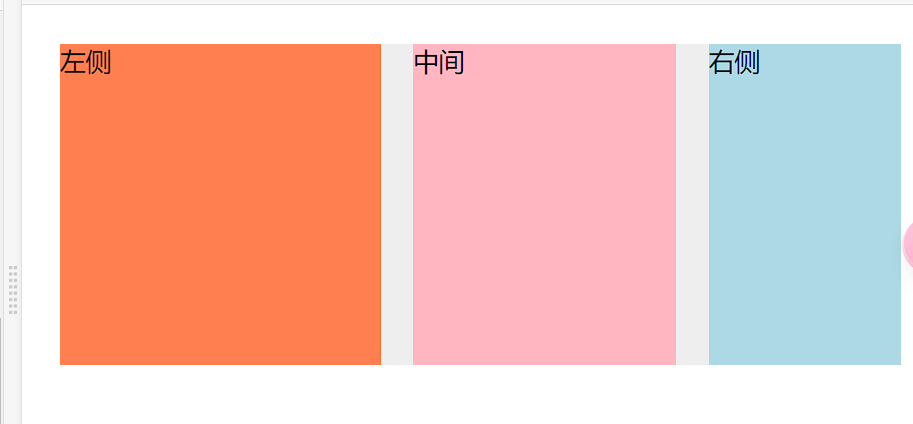

##  **  1：说说你对盒子模型的理解? 

**[简洁版：](https://github.com/lf2021/Front-End-Interview/blob/master/04.CSS/css.md)**

盒模型总共包括 4 个部分：
+ content：内容，容纳着元素的”真实“内容，例如文本，图像或是视频播放器
+ padding：内边距
+ border：边框
+ margin：外边距

两种盒模型的区别：

+ W3C 盒模型 `box-sizing: content-box`

  W3C 盒模型中，通过 CSS 样式设置的 width 的大小只是 content 的大小

+ IE 盒模型 `box-sizing: border-box`

  IE 盒模型中，通过 CSS 样式设置的 width 的大小是 content + padding + border 的和

---

[详细版：](https://github.com/febobo/web-interview/issues/93)

### 盒子模型是什么？

当浏览器对一个文档进行布局时，浏览器会依据**盒模型原则**来对每一个元素进行渲染，将每一个元素渲染成为一个矩形盒子。
这个矩形盒子会有四个属性，从内到外分别是content、padding、border、margin。

- content 表示的是实质内容。
- padding 表示的是内填充。
- border 表示的盒子的边框。
- margin 表示的是盒子的外边距。

### 标准盒模型和IE盒模型

盒模型有2类，第一类是标准盒模型，是目前浏览器默认使用的盒模型，第二类是IE盒模型。
这2类盒模型最主要的区别还是在width和height的含义上

- 在标准盒模型中，width、height代表的是content的宽高
- 在IE盒模型中，width、height代表的是content + padding + border的宽高

这2类模型是可以使用一个css属性来切换的，那就是box-sizing。

- `box-sizing: content-box;` 代表的是标准盒模型，
- `box-sizing: border-box;` 代表的是IE盒模型。

### 浏览器渲染后盒模型最终大小是多少？

**浏览器最终显示盒子的大小 = content + padding + border**，这个公式是固定的，不管什么类型的盒子，计算宽高时都必须是这三个东西的结果。

我们自己定义的width属性的含义，在不同情况下是不同的：

- 在标准盒模型中，width代表的是content的宽度，那么要计算其在浏览器渲染后盒模型最终大小，还要加上盒模型的padding和border；
- 而在IE盒模型中，width代表的是content + padding + border，所以width就是盒模型最终在浏览器渲染后显示的宽大小；

### 题外话：

margin 虽然是盒子模型的组成部分，但是和盒子的大小没有关系，margin 决定的事盒子占据的位置。

### 测试

标准盒模型
[](https://user-images.githubusercontent.com/82071209/203681207-8086d2b9-6c27-45ba-b639-74b5f34de8ee.png)

IE盒模型
[](https://user-images.githubusercontent.com/82071209/203681436-95693d33-3b06-4daf-9d61-dc522d4d4408.png)

##  ** 2 css选择器有哪些？优先级？哪些属性可以继承？

[参考：](https://github.com/febobo/web-interview/issues/95)

### 关于`css`属性选择器常用的有：

- id选择器（#box），选择id为box的元素
- 类选择器（.one），选择类名为one的所有元素
- 标签选择器（div），选择标签为div的所有元素
- 后代选择器（#box div），选择id为box元素内部所有的div元素
- 子选择器（.one>one_1），选择父元素为.one的所有.one_1的元素
- 相邻同胞选择器（.one+.two），选择紧接在.one之后的所有.two元素
- 群组选择器（div,p），选择div、p的所有元素

### 优先级

 !important > 内联 > id选择器 > 类名选择器 > 标签选择器 

更详细：选择器按优先级先后排列：!important>内联>id>class = 属性 = 伪类 >标签 = 伪元素 > 通配符 * 

### 可继承   

 TODO--》

## ** 3 [说说em/px/rem/vh/vw区别?](https://github.com/febobo/web-interview/issues/96) 

+ **px**：绝对单位，页面按精确像素展示
+ **em**：相对单位，基准点为父节点字体的大小，如果自身定义了`font-size`按自身来计算，整个页面内`1em`不是一个固定的值
+ **rem**：相对单位，可理解为`root em`, 相对根节点`html`的字体大小来计算
+ **vh、vw**：主要用于页面视口大小布局，在页面布局上更加方便简单

vw（Viewport Width）、vh(Viewport Height)是基于视图窗口的单位，是 css3 的一部分，基于视图窗口的单位，除了 vw、vh 还有 vmin、vmax。

- vw:1vw 等于视口宽度的 1%
- vh:1vh 等于视口高度的 1%
- vmin: 选取 vw 和 vh 中最小的那个,即在手机竖屏时，1vmin=1vw
- vmax:选取 vw 和 vh 中最大的那个 ,即在手机竖屏时，1vmax=1vh

## 4：[说说设备像素、css像素、设备独立像素、dpr、ppi 之间的区别？](https://github.com/febobo/web-interview/issues/97) 

无缩放情况下，1个CSS像素等于1个设备独立像素

设备像素由屏幕生产之后就不发生改变，而设备独立像素是一个虚拟单位会发生改变

PC端中，1个设备独立像素 = 1个设备像素 （在100%，未缩放的情况下）

在移动端中，标准屏幕（160ppi）下 1个设备独立像素 = 1个设备像素

设备像素比（dpr） = 设备像素 / 设备独立像素

每英寸像素（ppi），值越大，图像越清晰

## 5 [css中，有哪些方式可以隐藏页面元素？区别?](https://github.com/febobo/web-interview/issues/98)

1. 使用 display:none;隐藏元素，渲染树不会包含该渲染对象，因此该元素不会在页面中占据位置，也不会响应绑定的监听事件。

2. 使用 visibility:hidden;隐藏元素。元素在页面中仍占据空间，但是不会响应绑定的监听事件。

3. 使用 opacity:0;将元素的透明度设置为 0，以此来实现元素的隐藏。元素在页面中仍然占据空间，并且能够响应元素绑定的监听事件。

4. 通过使用绝对定位将元素移除可视区域内，以此来实现元素的隐藏。元素不可见，不影响页面布局

   ```
   .hide {
      position: absolute;
      top: -9999px;
      left: -9999px;
   }
   ```

5. 通过 z-index 负值，来使其他元素遮盖住该元素，以此来实现隐藏。

6. 通过 clip/clip-path 元素裁剪的方法来实现元素的隐藏，这种方法下，元素仍在页面中占据位置，但是不会响应绑定的监听事件。

   ```
   .hide {
     clip-path: polygon(0px 0px,0px 0px,0px 0px,0px 0px);
   }
   ```

   

7. 通过 transform:scale(0,0)来将元素缩放为 0，以此来实现元素的隐藏。这种方法下，元素仍在页面中占据位置，但是不会响应绑定的监听事件。

8. ### 设置height、width属性为0

   将元素的`margin`，`border`，`padding`，`height`和`width`等影响元素盒模型的属性设置成0，如果元素内有子元素或内容，还应该设置其`overflow:hidden`来隐藏其子元素

   ```
   .hiddenBox {
       margin:0;     
       border:0;
       padding:0;
       height:0;
       width:0;
       overflow:hidden;
   }
   ```

   特点：元素不可见，不占据页面空间，无法响应点击事件

##  ** 6 BFC 的概念, 哪些元素可以触发 BFC( 遇到高度坍塌和外边距折叠、外边距合并的情况怎么办)

> BFC 即 Block Formatting Context (块格式化上下文)， 是 Web 页面的可视化 CSS 渲染的一部分，是块盒子的布局过程发生的区域，也是浮动元素与其他元素交互的区域。

`BFC`（Block Formatting Context），即块级格式化上下文，它是页面中的一块渲染区域，并且有一套属于自己的渲染规则：

- 内部的盒子会在垂直方向上一个接一个的放置
- 对于同一个BFC的俩个相邻的盒子的margin会发生重叠，与方向无关。
- 每个元素的左外边距与包含块的左边界相接触（从左到右），即使浮动元素也是如此
- BFC的区域不会与float的元素区域重叠
- 计算BFC的高度时，浮动子元素也参与计算
- BFC就是页面上的一个隔离的独立容器，容器里面的子元素不会影响到外面的元素，反之亦然

`BFC`目的是形成一个相对于外界完全独立的空间，让内部的子元素不会影响到外部的元素

[参考视频](https://www.bilibili.com/video/BV1Bd4y1e7od)


**使用float和position这两个属性强制创建BFC，对元素做布局会较为麻烦，相对来说，使用display和overflow创建BFC，副作用较小，尤其是display：flow-root 就是给元素创建一个BFC，没有其他副作用。**

简单来说就是一个封闭的黑盒子，里面元素的布局不会影响外部。 下列方式会创建块格式化上下文：

- 根元素(<html>)
- 浮动元素（元素的 float 不是 none）
- 绝对定位元素（元素的 position 为 absolute 或 fixed）
- 行内块元素（元素的 display 为 inline-block）
- 表格单元格（元素的 display 为 table-cell，HTML 表格单元格默认为该值）
- 表格标题（元素的 display 为 table-caption，HTML 表格标题默认为该值）
- 匿名表格单元格元素（元素的 display 为 table、table-row table-row-group、table-header-group、table-footer-group（分别是- HTML table、row、tbody、thead、tfoot 的默认属性）或 inline-table）
- overflow 值不为 visible 的块元素
- display 值为 flow-root 的元素
- contain 值为 layout、content 或 paint 的元素
- 弹性元素（display 为 flex 或 inline-flex 元素的直接子元素）
- 网格元素（display 为 grid 或 inline-grid 元素的直接子元素）
- 多列容器（元素的 column-count 或 column-width 不为 auto，包括 - column-count 为 1）
- column-span 为 all 的元素始终会创建一个新的 BFC，即使该元素没有包裹在一个多列容器中（标准变更，Chrome bug）。

##  ** 7 [元素水平垂直居中的方法有哪些？如果元素不定宽高呢？](https://github.com/febobo/web-interview/issues/102) 

在开发中经常遇到这个问题，即让某个元素的内容在水平和垂直方向上都居中，内容不仅限于文字，可能是图片或其他元素

居中是一个非常基础但又是非常重要的应用场景，实现居中的方法存在很多，可以将这些方法分成两个大类：

- 居中元素（子元素）的宽高已知
- 居中元素宽高未知

**实现方式**

实现元素水平垂直居中的方式：

- 父元素position: relative子元素  position: absolute +  top、 left、right、bottom:0 +margin:auto
- 父元素position: relative子元素  position: absolute+   top: 50%;left: 50%+transform：`translate(-50%, -50%);
- table布局： 设置父元素为`display:table-cell`，子元素设置 `display: inline-block`。  vertical-align: middle; text-align: center;
- flex布局：   display: flex;   justify-content: center;     align-items: center;
- grid布局：  display: grid;   align-items:center;  justify-content: center;

### 利用定位+margin:auto

先上代码：

```
<style>
    .father{
        width:500px;
        height:300px;
        border:1px solid #0a3b98;
        position: relative;
    }
    .son{
        width:100px;
        height:40px;
        background: #f0a238;
        position: absolute;
        top:0;
        left:0;
        right:0;
        bottom:0;
        margin:auto;
    }
</style>
<div class="father">
    <div class="son"></div>
</div>
```


**父级设置为相对定位，子级绝对定位 ，并且四个定位属性的值都设置了0，那么这时候如果子级没有设置宽高，则会被拉开到和父级一样宽高**

**这里子元素设置了宽高，所以宽高会按照我们的设置来显示，但是实际上子级的虚拟占位已经撑满了整个父级，这时候再给它一个`margin：auto`它就可以上下左右都居中了**

### 利用定位+margin:负值

绝大多数情况下，设置父元素为相对定位， 子元素移动自身50%实现水平垂直居中

```
<style>
    .father {
        position: relative;
        width: 200px;
        height: 200px;
        background: skyblue;
    }
    .son {
        position: absolute;
        top: 50%;
        left: 50%;
        margin-left:-50px;
        margin-top:-50px;
        width: 100px;
        height: 100px;
        background: red;
    }
</style>
<div class="father">
    <div class="son"></div>
</div>
```


整个实现思路如下图所示：

- 初始位置为方块1的位置
- 当设置left、top为50%的时候，内部子元素为方块2的位置
- 设置margin为负数时，使内部子元素到方块3的位置，即中间位置

这种方案不要求父元素的高度，也就是即使父元素的高度变化了，仍然可以保持在父元素的垂直居中位置，水平方向上是一样的操作

**但是该方案需要知道子元素自身的宽高，但是我们可以通过下面`transform`属性进行移动**

### 利用定位+transform

实现代码如下：

```
<style>
    .father {
        position: relative;
        width: 200px;
        height: 200px;
        background: skyblue;
    }
    .son {
        position: absolute;
        top: 50%;
        left: 50%;
        transform: translate(-50%,-50%);
        width: 100px;
        height: 100px;
        background: red;
    }
</style>
<div class="father">
    <div class="son"></div>
</div>
```

**`translate(-50%, -50%)`将会将元素位移自己宽度和高度的-50%**

这种方法其实和最上面被否定掉的margin负值用法一样，可以说是`margin`负值的替代方案，并不需要知道自身元素的宽高

### table布局

设置父元素为`display:table-cell`，子元素设置 `display: inline-block`。利用`vertical`和`text-align`可以让所有的行内块级元素水平垂直居中

```
<style>
    .father {
        display: table-cell;
        width: 200px;
        height: 200px;
        background: skyblue;
        vertical-align: middle;
        text-align: center;
    }
    .son {
        display: inline-block;
        width: 100px;
        height: 100px;
        background: red;
    }
</style>
<div class="father">
    <div class="son"></div>
</div>
```

### flex弹性布局

还是看看实现的整体代码：

```
<style>
    .father {
        display: flex;
        justify-content: center;
        align-items: center;
        width: 200px;
        height: 200px;
        background: skyblue;
    }
    .son {
        width: 100px;
        height: 100px;
        background: red;
    }
</style>
<div class="father">
    <div class="son"></div>
</div>
```

`css3`中了`flex`布局，可以非常简单实现垂直水平居中

这里可以简单看看`flex`布局的关键属性作用：

- display: flex时，表示该容器内部的元素将按照flex进行布局
- align-items 属性定义flex子项在flex容器的当前行的**侧轴**（纵轴）方向上的对齐方式。 
-  justify-content 用于设置或检索弹性盒子元素在**主轴**（横轴）方向上的对齐方式。 

### grid网格布局

```
<style>
    .father {
            display: grid;
            align-items:center;
            justify-content: center;
            width: 200px;
            height: 200px;
            background: skyblue;

        }
        .son {
            width: 10px;
            height: 10px;
            border: 1px solid red
        }
</style>
<div class="father">
    <div class="son"></div>
</div>
```

这里看到，`gird`网格布局和`flex`弹性布局都简单粗暴

### 文字水平垂直居中 text-align、line-height

对于文字的水平垂直居中，你可以使用`text-align: center`和`line-height`来设置，`line-height`的参数设置成父容器的高即可

### 小结

上述方法中，不知道元素宽高大小仍能实现水平垂直居中的方法有：

- 利用定位+margin:auto
- 利用定位+transform
- 利用定位+margin:负值
- flex布局
- grid布局

## 8 [如何实现两栏布局，右侧自适应？三栏布局中间自适应呢？](https://github.com/febobo/web-interview/issues/103) 

### 二、双栏布局

双栏布局非常常见，往往是以一个定宽栏和一个自适应的栏并排展示存在

实现思路也非常的简单：

- 使用 float 左浮左边栏
- 右边模块使用 margin-left 撑出内容块做内容展示
- 为父级元素添加BFC，防止下方元素飞到上方内容

代码如下：

```
<style>
    .box{
        overflow: hidden; <!-- 生成BFC，计算高度时考虑浮动的元素 -->
    }
    .left {
        float: left;
        width: 200px;
        background-color: gray;
        height: 400px;
    }
    .right {
        margin-left: 210px;
        background-color: lightgray;
        height: 200px;
    }
</style>
<div class="box">
    <div class="left">左边</div>
    <div class="right">右边</div>
</div>
```


还有一种更为简单的使用则是采取：flex弹性布局

#### flex弹性布局

```
<style>
    .box{
        display: flex;
    }
    .left {
        width: 100px;
    }
    .right {
        flex: 1;
    }
</style>
<div class="box">
    <div class="left">左边</div>
    <div class="right">右边</div>
</div>
```

**`flex`可以说是最好的方案了，代码少，使用简单**

注意的是，`flex`容器的一个默认属性值:`align-items: stretch;`

这个属性导致了列等高的效果。 为了让两个盒子高度自动，需要设置: `align-items: flex-start`

### 三、三栏布局

实现三栏布局中间自适应的布局方式有：

- 两边使用 float，中间使用 margin
- 两边使用 absolute，中间使用 margin
- 两边使用 float 和负 margin
- display: table 实现
- flex实现
- grid网格布局

#### 两边使用 float，中间使用 margin

需要将中间的内容放在`html`结构最后，否则右侧会臣在中间内容的下方

实现代码如下：

```
<style>
    .wrap {
        background: #eee;
        overflow: hidden; <!-- 生成BFC，计算高度时考虑浮动的元素 -->
        padding: 20px;
        height: 200px;
    }
    .left {
        width: 200px;
        height: 200px;
        float: left;
        background: coral;
    }
    .right {
        width: 120px;
        height: 200px;
        float: right;
        background: lightblue;
    }
    .middle {
        margin-left: 220px;
        height: 200px;
        background: lightpink;
        margin-right: 140px;
    }
</style>
<div class="wrap">
    <div class="left">左侧</div>
    <div class="right">右侧</div>
    <div class="middle">中间</div>
</div>
```



原理如下：

- 两边固定宽度，中间宽度自适应。
- 利用中间元素的margin值控制两边的间距
- 宽度小于左右部分宽度之和时，右侧部分会被挤下去

这种实现方式存在缺陷：

- 主体内容是最后加载的。
- 右边在主体内容之前，如果是响应式设计，不能简单的换行展示

#### 两边使用 absolute，中间使用 margin

基于绝对定位的三栏布局：注意绝对定位的元素脱离文档流，相对于最近的已经定位的祖先元素进行定位。无需考虑HTML中结构的顺序

```
<style>
  .container {
    position: relative;
  }
  
  .left,
  .right,
  .main {
    height: 200px;
    line-height: 200px;
    text-align: center;
  }

  .left {
    position: absolute;
    top: 0;
    left: 0;
    width: 100px;
    background: green;
  }

  .right {
    position: absolute;
    top: 0;
    right: 0;
    width: 100px;
    background: green;
  }

  .main {
    margin: 0 110px;
    background: black;
    color: white;
  }
</style>

<div class="container">
  <div class="left">左边固定宽度</div>
  <div class="right">右边固定宽度</div>
  <div class="main">中间自适应</div>
</div>
```


实现流程：

- **左右两边使用绝对定位，固定在两侧。**
- **中间占满一行，但通过 margin和左右两边留出10px的间隔**

#### 两边使用 float 和负 margin

```
<style>
  .left,
  .right,
  .main {
    height: 200px;
    line-height: 200px;
    text-align: center;
  }

  .main-wrapper {
    float: left;
    width: 100%;
  }

  .main {
    margin: 0 110px;
    background: black;
    color: white;
  }

  .left,
  .right {
    float: left;
    width: 100px;
    margin-left: -100%;
    background: green;
  }

  .right {
    margin-left: -100px; /* 同自身宽度 */
  }
</style>

<div class="main-wrapper">
  <div class="main">中间自适应</div>
</div>
<div class="left">左边固定宽度</div>
<div class="right">右边固定宽度</div>
```

实现过程：

- 中间使用了双层标签，外层是浮动的，以便左中右能在同一行展示
- 左边通过使用负 margin-left:-100%，相当于中间的宽度，所以向上偏移到左侧
- 右边通过使用负 margin-left:-100px，相当于自身宽度，所以向上偏移到最右侧

缺点：

- 增加了 .main-wrapper 一层，结构变复杂
- 使用负 margin，调试也相对麻烦

#### 使用 display: table 实现

`<table>` 标签用于展示行列数据，不适合用于布局。但是可以使用 `display: table` 来实现布局的效果

```
<style>
  .container {
    height: 200px;
    line-height: 200px;
    text-align: center;
    display: table;
    table-layout: fixed;
    width: 100%;
  }

  .left,
  .right,
  .main {
    display: table-cell;
  }

  .left,
  .right {
    width: 100px;
    background: green;
  }

  .main {
    background: black;
    color: white;
    width: 100%;
  }
</style>

<div class="container">
  <div class="left">左边固定宽度</div>
  <div class="main">中间自适应</div>
  <div class="right">右边固定宽度</div>
</div>
```

实现原理：

- 层通过 display: table设置为表格，设置 table-layout: fixed`表示列宽自身宽度决定，而不是自动计算。
- 内层的左中右通过 display: table-cell设置为表格单元。
- 左右设置固定宽度，中间设置 width: 100% 填充剩下的宽度

#### 使用flex实现

利用`flex`弹性布局，可以简单实现中间自适应

代码如下：

```
<style type="text/css">
    .wrap {
        display: flex;
        justify-content: space-between;
    }

    .left,
    .right,
    .middle {
        height: 100px;
    }

    .left {
        width: 200px;
        background: coral;
    }

    .right {
        width: 120px;
        background: lightblue;
    }

    .middle {
        background: #555;
        width: 100%;
        margin: 0 20px;
    }
</style>
<div class="wrap">
    <div class="left">左侧</div>
    <div class="middle">中间</div>
    <div class="right">右侧</div>
</div>
```

实现过程：

- 仅需将容器设置为`display:flex;`，
- 盒内元素两端对其，将中间元素设置为`100%`宽度，或者设为`flex:1`，即可填充空白
- 盒内元素的高度撑开容器的高度

优点：

- 结构简单直观
- 可以结合 flex的其他功能实现更多效果，例如使用 order属性调整显示顺序，让主体内容优先加载，但展示在中间

#### grid网格布局

代码如下：

```
<style>
    .wrap {
        display: grid;
        width: 100%;
        grid-template-columns: 300px auto 300px;
    }

    .left,
    .right,
    .middle {
        height: 100px;
    }

    .left {
        background: coral;
    }

    .right {
        width: 300px;
        background: lightblue;
    }

    .middle {
        background: #555;
    }
</style>
<div class="wrap">
    <div class="left">左侧</div>
    <div class="middle">中间</div>
    <div class="right">右侧</div>
</div>
```

跟`flex`弹性布局一样的简单

## ** 9 [说说flexbox（弹性盒布局模型）,以及适用场景？](https://github.com/febobo/web-interview/issues/104) 

概念：Flexible Box，简称Flex，弹性布局，可以简便、完整、响应式地实现各种页面布局

+ 弹性布局，display：flex

+ 所有子元素会自动成为Flex Item。

Flex Container的属性有：

+ flex-direction，决定主轴的方向
+ flex-wrap，决定Flex item时候可以换行
+ justify-content，定义了item在主轴上的对齐方式
+ align-items，定义了item在交叉轴上如何对齐
+ align-content，定义了多根轴线的对齐方式，如果项目只有一根轴线，该属性不起作用

  


## 10 [介绍一下grid网格布局](https://github.com/febobo/web-interview/issues/105) 


概念：`Grid` 布局即网格布局，是一个二维的布局方式，由纵横相交的两组网格线形成的框架性布局结构，能够同时处理行与列，擅长将一个页面划分为几个主要区域，以及定义这些区域的大小、位置、层次等关系

+ Grid Container：Grid的容器
+ Grid Item：Grid容器的直接子元素

**用途：**居中布局两列、三列布局等
**缺点：**

+ 总体兼容性不错，当IE10以下不支持
+ 手机端支持不太友好

## 11 [CSS3新增了哪些新特性？](https://github.com/febobo/web-interview/issues/106) 

选择器：属性选择器在css2是没有的，还有像是`last-child`这样的伪类选择器

盒子阴影`box-shadow`

裁剪：`clip-path`裁剪以及`background-clip`背景图裁剪

过度动画：`transition`

转换`transform`：，平移，缩放，旋转，倾斜

纯动画`animation`

颜色渐变`background: linear-gradient()`

## 12 css3中常见的动画有哪些？怎么实现

[参考来源：](https://juejin.cn/post/7338655886443429951)

### 过渡动画transition

当其他属性值发生变更时，`transition`可以控制变更所花费的时间以及变更曲线

```
<!DOCTYPE html>
<html lang="en">
<head>
    <meta charset="UTF-8">
    <meta name="viewport" content="width=device-width, initial-scale=1.0">
    <title>Document</title>
    <style>
        .box{
            width: 200px;
            height: 50px;
            background-color: blueviolet;
            /* transition: width 2s linear; */
            /* 2s内 linear匀速 ease慢快慢 ease-in越来越快 ease-out越来越慢 ease-in-out快到慢*/
            transition: width 2s cubic-bezier(0.075, 0.82, 0.165, 1);
            /* 贝塞尔曲线这个参数先快速上涨,后慢速下降 */
        }
        .box:hover{
            /* 伪类选择器，鼠标移上去时宽度变成500 */
            width: 500px;
        }
    </style>
</head>
<body>
    <div class="box"></div>
</body>
</html>
```

### 转换动画transform

用于做容器的平移，缩放，旋转，倾斜等动画，可以搭配`transition`过渡动画使其更优雅

```
<!DOCTYPE html>
<html lang="en">
<head>
    <meta charset="UTF-8">
    <meta name="viewport" content="width=device-width, initial-scale=1.0">
    <title>Document</title>
    <style>
        .wrap{
            margin-top: 30px;
            width: 200px;
            height: 50px;
            background-color: red;
            transition: all 2s;
        }
        .wrap:hover{
            transform: translateX(100px) rotateZ(90deg);
            /* 从左往右移100px 绕z轴旋转90° */
        }
    </style>
</head>
<body>
    <div class="wrap"></div>
</body>
</html>
```

### 纯动画animation

控制容器动画的关键帧

> 如何理解这个关键帧：就是以一个时间动下，取决于刷新率，60hz时间是16.7ms，120hz就是16.7/2ms。

```
<!DOCTYPE html>
<html lang="en">
<head>
    <meta charset="UTF-8">
    <meta name="viewport" content="width=device-width, initial-scale=1.0">
    <title>Document</title>
    <style>
        .container {
            margin-top: 30px;
            width: 200px;
            height: 50px;
            background-color: aquamarine;
            animation: rotate 2s linear infinite;
            /* infinite是无限循环 */
        }
        @keyframes rotate {
            /* 自定义动画名 */
            0%{
                transform: rotateZ(0deg);
            }
            100%{
                transform: rotateZ(360deg);
            }
        }
    </style>
</head>
<body>
    <div class="container"></div>
</body>
</html>
```

## ** 13 [怎么理解回流跟重绘？什么场景下会触发？](https://github.com/febobo/web-interview/issues/107) 

### 回流

**浏览器计算页面布局的过程就叫做`回流`**

只要页面有容器几何信息发生变更就会发生回流， 影响了它的排版， 有以下几种：

1. 改变窗口的尺寸
2. 改变元素的尺寸
3. display: none | block;（增加或删除可见元素）
4. 页面初次渲染

**容器脱离文档流是不会发生回流的**，当然这是针对影响其他元素而言，比如你增删一个可见元素，是会影响下面容器的几何信息的。对于脱离文档流容器本身而言，肯定是发生回流的

### 重绘

GPU将已经计算好几何信息的容器在屏幕上亮起来就是`重绘`

所以只要元素的非几何属性发生变化时，就会发生重绘

1. 修改背景颜色
2. 修改背景图片
3. 边框颜色
4. 字体颜色
5. 回流

 回流 会带来重绘，重绘不一定带来回流

###  触发

触发回流：页面上有容器的几何属性发生变更

触发重绘：容器非几何属性变更，比如颜色等

所以回流一定重绘，但是重绘不一定回流

## 14 [什么是响应式设计？响应式设计的基本原理是什么？如何做？](https://github.com/febobo/web-interview/issues/108) 

跟随用户页面设备尺寸的变化，页面实现自动的适配

> 比如你逛掘金的商城页面，缩放页面的时候发现1000-1160宽是一个适配，1160以外又是一个适配

响应式设计实现通常会从以下几方面思考：

- 弹性盒子（包括图片、表格、视频）和媒体查询等技术
- 使用百分比布局创建流式布局的弹性UI，同时使用媒体查询限制元素的尺寸和内容变更范围
- 使用相对单位使得内容自适应调节
- 选择断点，针对不同断点实现不同布局和内容展示

### 实现方案

1. 弹性布局：适合做某个容器内的响应式，比如`ul`的`li`，但是不方便做整个页面的响应式

   弹性容器默认就是让子元素在收缩放大时平均分配

2. 百分比：常适用于页面外层大容器，同样不适合整个页面的响应式，一般适配都是pc端一个，平板一个，手机一个，百分比过于灵活不适合

   百分比继承父容器

3. rem + 媒体查询 （可用于任何地方，一般pc端是rem + 媒体查询，移动端是rem + js）

   rem是参照根字体大小，css有媒体查询的语法，写法参考如下，`min-width`到`max-width`就是区间

   ```
   <!DOCTYPE html>
   <html lang="en">
   <head>
       <meta charset="UTF-8">
       <meta name="viewport" content="width=device-width, initial-scale=1.0">
       <title>Document</title>
       <style>
           * {
               margin: 0;
               padding: 0;
           }
           li{
               list-style: none;
               width: 200px;
               height: 100px;
           }
           li:nth-child(1){
               background-color: antiquewhite;
           }
           li:nth-child(2){
               background-color: aqua;
           }
           li:nth-child(3){
               background-color: aquamarine;
           }
           li:nth-child(4){
               background-color: azure;
           }
           li:nth-child(5){
               background-color: black;
           }
           li:nth-child(6){
               background-color: blueviolet;
           }
       </style>
   
       <style>
           li {
               width: 10rem;
               /* pc端用媒体查询 移动端用js处理 */
           }
           @media screen and (min-width: 1000px) {
               /* 大于1000时 变化 pc端 */
               html{
                   font-size: 30px;
               }
           }
           @media screen and (min-width: 800px) and (max-width: 1000px) {
               /* 平板端 */
               html{
                   font-size: 20px;
               }
           }
           @media screen and (max-width: 500px) {
               /* 手机端 */
               html{
                   font-size: 14px;
               }
           }
       </style>
   </head>
   <body>
       <ul>
           <li>1</li>
           <li>2</li>
           <li>3</li>
           <li>4</li>
           <li>5</li>
           <li>6</li>
       </ul>    
   </body>
   </html>
   ```

4. 直接媒体查询，不如第三个方法，这个代码量会很大

   一个区间写一个样式，代码量会很大

   ```
   <!DOCTYPE html>
   <html lang="en">
   <head>
       <meta charset="UTF-8">
       <meta name="viewport" content="width=device-width, initial-scale=1.0">
       <title>Document</title>
       <style>
           * {
               margin: 0;
               padding: 0;
           }
           li{
               list-style: none;
               width: 200px;
               height: 100px;
           }
           li:nth-child(1){
               background-color: antiquewhite;
           }
           li:nth-child(2){
               background-color: aqua;
           }
           li:nth-child(3){
               background-color: aquamarine;
           }
           li:nth-child(4){
               background-color: azure;
           }
           li:nth-child(5){
               background-color: black;
           }
           li:nth-child(6){
               background-color: blueviolet;
           }
       </style>
       <style>
           @media screen and (min-width: 1000px) {
               li{
                   width: 300px;
               }
           }
           @media screen and (min-width: 800px) and (max-width: 1000px) {
               li{
                   width: 200px;
               }
           }
           @media screen and (max-width: 500px) {
               li{
                   width: 100px;
               }
           }
       </style>
   </head>
   <body>
       <ul>
           <li>1</li>
           <li>2</li>
           <li>3</li>
           <li>4</li>
           <li>5</li>
           <li>6</li>
       </ul>    
   </body>
   </html>
   ```

5. `vw` / `vh` ：相对于window大小

   ```
   <!DOCTYPE html>
   <html lang="en">
   <head>
       <meta charset="UTF-8">
       <meta name="viewport" content="width=device-width, initial-scale=1.0">
       <title>Document</title>
       <style>
           * {
               margin: 0;
               padding: 0;
           }
           li{
               list-style: none;
               width: 200px;
               height: 100px;
           }
           li:nth-child(1){
               background-color: antiquewhite;
           }
           li:nth-child(2){
               background-color: aqua;
           }
           li:nth-child(3){
               background-color: aquamarine;
           }
           li:nth-child(4){
               background-color: azure;
           }
           li:nth-child(5){
               background-color: black;
           }
           li:nth-child(6){
               background-color: blueviolet;
           }
       </style>
       <style>
           li{
               width: 20vw;
           }
       </style>
   </head>
   <body>
       <ul>
           <li>1</li>
           <li>2</li>
           <li>3</li>
           <li>4</li>
           <li>5</li>
           <li>6</li>
       </ul>    
   </body>
   </html>
   ```


## 15  [如果要做优化，CSS提高性能的方法有哪些？](https://github.com/febobo/web-interview/issues/114) 

### 二、实现方式

实现方式有很多种，主要有如下：

- 异步加载CSS
- 资源压缩
- 合理使用选择器
- 减少使用昂贵的属性
- 不要使用[@import](https://github.com/import)

#### 异步加载CSS

在`CSS`文件请求、下载、解析完成之前，`CSS`会阻塞渲染，浏览器将不会渲染任何已处理的内容

前面加载内联代码后，后面的外部引用`css`则没必要阻塞浏览器渲染。这时候就可以采取异步加载的方案，主要有如下：

- 使用javascript将link标签插到head标签最后

```
// 创建link标签
const myCSS = document.createElement( "link" );
myCSS.rel = "stylesheet";
myCSS.href = "mystyles.css";
// 插入到header的最后位置
document.head.insertBefore( myCSS, document.head.childNodes[ document.head.childNodes.length - 1 ].nextSibling );
```

- 设置link标签media属性为noexis，浏览器会认为当前样式表不适用当前类型，会在不阻塞页面渲染的情况下再进行下载。加载完成后，将`media`的值设为`screen`或`all`，从而让浏览器开始解析CSS

```
<link rel="stylesheet" href="mystyles.css" media="noexist" onload="this.media='all'">
```

- 通过rel属性将link元素标记为alternate可选样式表，也能实现浏览器异步加载。同样别忘了加载完成之后，将rel设回stylesheet

```
<link rel="alternate stylesheet" href="mystyles.css" onload="this.rel='stylesheet'">
```

#### 资源压缩

利用`webpack`、`gulp/grunt`、`rollup`等模块化工具，将`css`代码进行压缩，使文件变小，大大降低了浏览器的加载时间

#### 合理使用选择器

`css`匹配的规则是从右往左开始匹配，例如`#markdown .content h3`匹配规则如下：

- 先找到h3标签元素
- 然后去除祖先不是.content的元素
- 最后去除祖先不是#markdown的元素

如果嵌套的层级更多，页面中的元素更多，那么匹配所要花费的时间代价自然更高

所以我们在编写选择器的时候，可以遵循以下规则：

- 不要嵌套使用过多复杂选择器，最好不要三层以上
- 使用id选择器就没必要再进行嵌套
- 通配符和属性选择器效率最低，避免使用

#### 减少使用昂贵的属性

在页面发生重绘的时候，昂贵属性如`box-shadow`/`border-radius`/`filter`/透明度/`:nth-child`等，会降低浏览器的渲染性能

#### 不要使用[@import](https://github.com/import)

css样式文件有两种引入方式，一种是`link`元素，另一种是`@import`

`@import`会影响浏览器的并行下载，使得页面在加载时增加额外的延迟，增添了额外的往返耗时

而且多个`@import`可能会导致下载顺序紊乱

比如一个css文件`index.css`包含了以下内容：`@import url("reset.css")`

那么浏览器就必须先把`index.css`下载、解析和执行后，才下载、解析和执行第二个文件`reset.css`

#### 其他

- 减少重排操作，以及减少不必要的重绘
- 了解哪些属性可以继承而来，避免对这些属性重复编写
- cssSprite，合成所有icon图片，用宽高加上backgroud-position的背景图方式显现出我们要的icon图，减少了http请求
- 把小的icon图片转成base64编码
- CSS3动画或者过渡尽量使用transform和opacity来实现动画，不要使用left和top属性

### 三、总结

`css`实现性能的方式可以从选择器嵌套、属性特性、减少`http`这三面考虑，同时还要注意`css`代码的加载顺序

##  16 [如何实现单行／多行文本溢出的省略样式？](https://github.com/febobo/web-interview/issues/115)

### 单行文本溢出省略

实现方式也很简单，涉及的`css`属性有：

- text-overflow：规定当文本溢出时，显示省略符号来代表被修剪的文本
- white-space：设置文字在一行显示，不能换行
- overflow：文字长度超出限定宽度，则隐藏超出的内容

`overflow`设为`hidden`，普通情况用在块级元素的外层隐藏内部溢出元素，或者配合下面两个属性实现文本溢出省略

`white-space:nowrap`，作用是设置文本不换行，是`overflow:hidden`和`text-overflow：ellipsis`生效的基础

`text-overflow`属性值有如下：

- clip：当对象内文本溢出部分裁切掉
- ellipsis：当对象内文本溢出时显示省略标记（...）

`text-overflow`只有在设置了`overflow:hidden`和`white-space:nowrap`才能够生效的

### 多行文本溢出省略

多行文本溢出的时候，我们可以分为两种情况：

- 基于高度截断
- 基于行数截断

#### 基于高度截断

#### 伪元素 + 定位

核心的`css`代码结构如下：

- position: relative：为伪元素绝对定位
- overflow: hidden：文本溢出限定的宽度就隐藏内容）
- position: absolute：给省略号绝对定位
- line-height: 20px：结合元素高度,高度固定的情况下,设定行高, 控制显示行数
- height: 40px：设定当前元素高度
- ::after {} ：设置省略号样式

```
/*单行文本溢出*/
<style>
    p{
        overflow: hidden;
        line-height: 40px;
        width:400px;
        height:40px;
        border:1px solid red;
        text-overflow: ellipsis;
        white-space: nowrap;
    }
</style>
<p 这是一些文本这是一些文本这是一些文本这是一些文本这是一些文本这是一些文本这是一些文本这是一些文本这是一些文本这是一些文本</p >

/*多行文本溢出*/
<style>
    .demo {
        position: relative;
        line-height: 20px;
        height: 40px;
        overflow: hidden;
    }
    .demo::after {
        content: "...";
        position: absolute;
        bottom: 0;
        right: 0;
        padding: 0 20px 0 10px;
    }
</style>

<body>
    <div class='demo'>这是一段很长的文本</div>
</body>
```

## 17 [如何使用css完成视差滚动效果?](https://github.com/febobo/web-interview/issues/116) 


## ** 18 [CSS如何画一个三角形？原理是什么？](https://github.com/febobo/web-interview/issues/117)


```
边框是实现三角形的部分，边框实际上并不是一个直线，如果我们将四条边设置不同的颜色，将边框逐渐放大，可以得到每条边框都是一个梯形

利用旋转、隐藏，以及设置内容宽高等属性设置边框，就能够实现其他类型的三角形
```


画扇形


## ** 19 [让Chrome支持小于12px 的文字方式有哪些？区别？](https://github.com/febobo/web-interview/issues/118) 

Chrome 中文版浏览器会默认设定页面的最小字号是12px，英文版没有限制

原由 Chrome 团队认为汉字小于12px就会增加识别难度

- 中文版浏览器

与网页语言无关，取决于用户在Chrome的设置里（chrome://settings/languages）把哪种语言设置为默认显示语言

- 系统级最小字号

浏览器默认设定页面的最小字号，用户可以前往 chrome://settings/fonts 根据需求更改

而我们在实际项目中，不能奢求用户更改浏览器设置

对于文本需要以更小的字号来显示，就需要用到一些小技巧

## 二、解决方案

常见的解决方案有：

- zoom
- -webkit-transform:scale()
- -webkit-text-size-adjust:none

`Zoom` 非标属性，有兼容问题，**缩放会改变了元素占据的空间大小，触发重排**

`-webkit-transform:scale()` **大部分现代浏览器支持，并且对英文、数字、中文也能够生效，缩放不会改变了元素占据的空间大小，页面布局不会发生变化**

`-webkit-text-size-adjust`对谷歌浏览器有版本要求，在27之后，就取消了该属性的支持，并且只对英文、数字生效

### Zoom

`zoom` 的字面意思是“变焦”，可以改变页面上元素的尺寸，属于真实尺寸

其支持的值类型有：

- zoom:50%，表示缩小到原来的一半
- zoom:0.5，表示缩小到原来的一半

使用 `zoom` 来”支持“ 12px 以下的字体

代码如下：

```
<style type="text/css">
    .span1{
        font-size: 12px;
        display: inline-block;
        zoom: 0.8;
    }
    .span2{
        display: inline-block;
        font-size: 12px;
    }
</style>
<body>
    <span class="span1">测试10px</span>
    <span class="span2">测试12px</span>
</body>
```

> 需要注意的是，`Zoom` 并不是标准属性，需要考虑其兼容性

### -webkit-transform:scale()

**针对`chrome`浏览器,加`webkit`前缀，用`transform:scale()`这个属性进行放缩**

注意的是，使用`scale`属性只对可以定义宽高的元素生效，所以，下面代码中将`span`元素转为行内块元素

实现代码如下：

```
<style type="text/css">
    .span1{
        font-size: 12px;
        display: inline-block;
        -webkit-transform:scale(0.8);
    }
    .span2{
        display: inline-block;
        font-size: 12px;
    }
</style>
<body>
    <span class="span1">测试10px</span>
    <span class="span2">测试12px</span>
</body>
```

### -webkit-text-size-adjust:none

该属性用来设定文字大小是否根据设备(浏览器)来自动调整显示大小

属性值：

- percentage：字体显示的大小；
- auto：默认，字体大小会根据设备/浏览器来自动调整；
- none:字体大小不会自动调整

```
html { -webkit-text-size-adjust: none; }
```

这样设置之后会有一个问题，就是当你放大网页时，一般情况下字体也会随着变大，而设置了以上代码后，字体只会显示你当前设置的字体大小，不会随着网页放大而变大了

所以，我们不建议全局应用该属性，而是单独对某一属性使用

> 需要注意的是，自从`chrome 27`之后，就取消了对这个属性的支持。同时，该属性只对英文、数字生效，对中文不生效

## 20[说说对Css预编语言的理解？有哪些区别?](https://github.com/febobo/web-interview/issues/119) 

`Css` 作为一门标记性语言，语法相对简单，对使用者的要求较低，但同时也带来一些问题

需要书写大量看似没有逻辑的代码，不方便维护及扩展，不利于复用，尤其对于非前端开发工程师来讲，往往会因为缺少 `Css` 编写经验而很难写出组织良好且易于维护的 `Css` 代码

`Css`预处理器便是针对上述问题的解决方案

#### 预处理语言

扩充了 `Css` 语言，增加了诸如变量、混合（mixin）、函数等功能，让 `Css` 更易维护、方便

本质上，预处理是`Css`的超集

包含一套自定义的语法及一个解析器，根据这些语法定义自己的样式规则，这些规则最终会通过解析器，编译生成对应的 `Css` 文件

### 二、有哪些

`Css`预编译语言在前端里面有三大优秀的预编处理器，分别是：

- sass
- less
- stylus

#### sass

2007 年诞生，最早也是最成熟的 `Css `预处理器，拥有 Ruby 社区的支持和 `Compass` 这一最强大的 `Css `框架，目前受 `LESS` 影响，已经进化到了全面兼容 `Css` 的 `Scss`

文件后缀名为`.sass`与`scss`，可以严格按照 sass 的缩进方式省去大括号和分号

#### less

2009年出现，受`SASS`的影响较大，但又使用 `Css` 的语法，让大部分开发者和设计师更容易上手，在 `Ruby `社区之外支持者远超过 `SASS`

其缺点是比起 `SASS `来，可编程功能不够，不过优点是简单和兼容 `Css`，反过来也影响了 `SASS `演变到了` Scss` 的时代

### stylus

`Stylus `是一个`Css`的预处理框架，2010 年产生，来自 `Node.js `社区，主要用来给 `Node` 项目进行 `Css` 预处理支持

所以` Stylus` 是一种新型语言，可以创建健壮的、动态的、富有表现力的` Css`。比较年轻，其本质上做的事情与`SASS/LESS`等类似

### 三、区别

虽然各种预处理器功能强大，但使用最多的，还是以下特性：

- 变量（variables）
- 作用域（scope）
- 代码混合（ mixins）
- 嵌套（nested rules）
- 代码模块化（Modules）

因此，下面就展开这些方面的区别

#### 基本使用

less和scss

```
.box {
  display: block;
}
```

sass

```
.box
  display: block
```

stylus

```
.box
  display: block
```

#### 嵌套

三者的嵌套语法都是一致的，甚至连引用父级选择器的标记 & 也相同

区别只是 Sass 和 Stylus 可以用没有大括号的方式书写

less

```
.a {
  &.b {
    color: red;
  }
}
```

#### 变量

变量无疑为 Css 增加了一种有效的复用方式，减少了原来在 Css 中无法避免的重复「硬编码」

`less`声明的变量必须以`@`开头，后面紧跟变量名和变量值，而且变量名和变量值需要使用冒号`:`分隔开

```
@red: #c00;

strong {
  color: @red;
}
```

`sass`声明的变量跟`less`十分的相似，只是变量名前面使用`@`开头

```
$red: #c00;

strong {
  color: $red;
}
```

`stylus`声明的变量没有任何的限定，可以使用`$`开头，结尾的分号`;`可有可无，但变量与变量值之间需要使用`=`

在`stylus`中我们不建议使用`@`符号开头声明变量

```
red = #c00

strong
  color: red
```

#### 作用域

`Css` 预编译器把变量赋予作用域，也就是存在生命周期。就像 `js `一样，它会先从局部作用域查找变量，依次向上级作用域查找

`sass`中不存在全局变量

```
$color: black;
.scoped {
  $bg: blue;
  $color: white;
  color: $color;
  background-color:$bg;
}
.unscoped {
  color:$color;
} 
```

编译后

```
.scoped {
  color:white;/*是白色*/
  background-color:blue;
}
.unscoped {
  color:white;/*白色（无全局变量概念）*/
} 
```

所以，在`sass`中最好不要定义相同的变量名

`less`与`stylus`的作用域跟`javascript`十分的相似，首先会查找局部定义的变量，如果没有找到，会像冒泡一样，一级一级往下查找，直到根为止

```
@color: black;
.scoped {
  @bg: blue;
  @color: white;
  color: @color;
  background-color:@bg;
}
.unscoped {
  color:@color;
} 
```

编译后：

```
.scoped {
  color:white;/*白色（调用了局部变量）*/
  background-color:blue;
}
.unscoped {
  color:black;/*黑色（调用了全局变量）*/
} 
```

#### 混入

混入（mixin）应该说是预处理器最精髓的功能之一了，简单点来说，`Mixins`可以将一部分样式抽出，作为单独定义的模块，被很多选择器重复使用

可以在`Mixins`中定义变量或者默认参数

在`less`中，混合的用法是指将定义好的`ClassA`中引入另一个已经定义的`Class`，也能使用够传递参数，参数变量为`@`声明

```
.alert {
  font-weight: 700;
}

.highlight(@color: red) {
  font-size: 1.2em;
  color: @color;
}

.heads-up {
  .alert;
  .highlight(red);
}
```

编译后

```
.alert {
  font-weight: 700;
}
.heads-up {
  font-weight: 700;
  font-size: 1.2em;
  color: red;
}
```

`Sass`声明`mixins`时需要使用`@mixinn`，后面紧跟`mixin`的名，也可以设置参数，参数名为变量`$`声明的形式

```
@mixin large-text {
  font: {
    family: Arial;
    size: 20px;
    weight: bold;
  }
  color: #ff0000;
}

.page-title {
  @include large-text;
  padding: 4px;
  margin-top: 10px;
}
```

`stylus`中的混合和前两款`Css`预处理器语言的混合略有不同，他可以不使用任何符号，就是直接声明`Mixins`名，然后在定义参数和默认值之间用等号（=）来连接

```
error(borderWidth= 2px) {
  border: borderWidth solid #F00;
  color: #F00;
}
.generic-error {
  padding: 20px;
  margin: 4px;
  error(); /* 调用error mixins */
}
.login-error {
  left: 12px;
  position: absolute;
  top: 20px;
  error(5px); /* 调用error mixins，并将参数$borderWidth的值指定为5px */
} 
```

#### 代码模块化

模块化就是将`Css`代码分成一个个模块

`scss`、`less`、`stylus`三者的使用方法都如下所示

```
@import './common';
@import './github-markdown';
@import './mixin';
@import './variables';
```