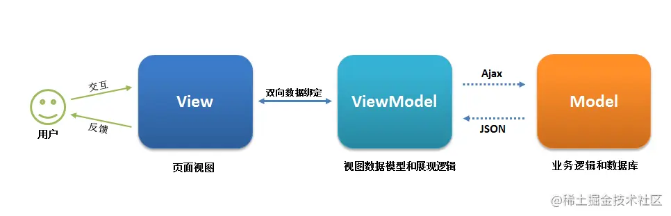

# 其他

###  vue中 route 与 router 的区别

 [博客](https://juejin.cn/post/7019908330101424159)

**$route 表示当前的路由信息，包含了当前URL解析得到的信息，包含当前的路径，参数，query对象等** 

**$router用来操作路由的router实例** 


### component

[博客](https://juejin.cn/post/7124501474175877150)

什么是动态组件 就是：让多个组件使用同一个挂载点，并动态切换，这就是动态组件。

在挂载点使用component标签，然后使用v-bind:is=”组件”


### 插槽

[博客](https://juejin.cn/post/7134733869076938765)


### 项目配置

[企业级前端配置](https://juejin.cn/post/7246777535043502136)


###  Options API和Composition API

[参考博客](https://juejin.cn/post/7325817302335471616) 、[参考博客](https://juejin.cn/post/7325495601269473289) 、[参考博客](https://juejin.cn/post/7227453567686033468)

Options API 是 Vue.js 传统的组件设计方式，通过对象来描述组件的各种选项，如 `data`、`methods`、`computed`、`watch` 等。这种方式在简单组件中非常直观，易于理解。 

Composition API 是 Vue 3 引入的一种新的组件设计方式，通过函数来组织代码，提供更灵活的组织结构和复用性。这种方式适用于处理复杂组件逻辑。 

Composition API 更好的代码组织，更好的逻辑服用；可维护性，更好的类型推导，可拓展性更好；

两种API各有优缺点，使用哪种API取决于具体的项目需求。对于小型项目，Options API更为简单方便；对于大型项目，Composition API可以更好地组织代码。

总之，Vue.js的Composition API和Options API是为了满足不同开发者的需求而存在的，我们应该根据具体的场景选择使用哪种API，以达到更好的开发效果和代码质量。

 


# VUE3面试题

[参考来源：Vue3面试题汇总](https://juejin.cn/post/7139921537896808479)、[Vue3 setup + TypeScript 开发新范式](https://juejin.cn/post/7052531217333223437)

### 项目的生命周期

[参考博客](https://juejin.cn/post/7323031996864413737)

Vue3的生命周期钩子函数主要包括：

- `beforeCreate`: 创建实例之前调用，此时实例的数据观测、事件等还未初始化。
- `created`: 创建实例后调用，此时实例的数据观测、事件等已经初始化完成。
- `beforeMount`: 挂载实例之前调用，此时模板已经编译完成，但是还未挂载到DOM。
- `mounted`: 挂载实例后调用，此时实例已经挂载到DOM，可以进行DOM操作。
- `beforeUpdate`: 数据更新之前调用，此时可以进行状态的最后更改。
- `updated`: 数据更新后调用，此时DOM已经完成更新，可以进行DOM操作。
- `beforeUnmount`: 卸载实例之前调用，此时实例仍然完全可用。
- `unmounted`: 卸载实例后调用，此时实例已经完全卸载。

选项式和组合式生命周期的区别：

- 选项式API的生命周期钩子函数定义在组件选项对象的methods中

- 组合式API的生命周期钩子函数定义在`setup`函数中，需要使用`import`从`vue`中引入 

  **注意**：在组合式API中没有`beforecate`和`created`钩子，因为他们本身被`setup`这个函数替代了，直接把相关逻辑写在`setup`中就行了 


参考[视频](https://www.bilibili.com/video/BV1ua4y1u7N8) 

```
<template>
    <div>
        <h1>A组件</h1>
        <br>
        <span ref="span">{{ msg }}</span>
        <button @click="change">修改</button>
    </div>
</template>

<script setup>
import {ref,onBeforeMount, onMounted,onBeforeUpdate, onUpdated, onBeforeUnmount, onUnmounted} from "vue"

console.log("这是setup")
const msg = ref("hello")
const span = ref()
const change = () => {
    msg.value = "hello被更改了"
}
// 第一对：代表对DOM的创建过程
// onBeforeMount 创建前 与onMounted 创建完成
onBeforeMount(() => {console.log("onBeforeMount:" + span.value)}) // undefined
onMounted(() => {console.log("onMounted:" + span.value)}) // <span>hello</span>
// 更新生命周期
onBeforeUpdate(() => {console.log("onBeforeUpdate:"+span.value?.innerText)}) //  hello
onUpdated(() => {console.log("onUpdated"+ span.value?.innerText)}) //  hello被更改了
// 销毁生命周期
onBeforeUnmount(() => {console.log("销毁之前" + span.value?.innerText)}) //  
onUnmounted(() => {console.log("销毁完成")}) // 
</script>

<style lang="scss" scoped>

</style>
```


### Vue3 新特性有哪些 

#### 1、性能提升

- 响应式性能提升，由原来的 `Object.defineProperty` 改为基于`ES6`的 `Proxy` ，使其速度更快
- 重写了 `Vdom` (diff算法优化，增加静态标志)
- 进行模板编译优化（静态提升，不参与更新的元素只被创建一次）
- 更加高效的组件初始化

#### 2、更好的支持 `typeScript`

- `Vue.js 2.x` 选用 `Flow` 做类型检查，来避免一些因类型问题导致的错误，但是 Flow 对于一些复杂场景类型的检查，支持得并不好。
- `Vue.js 3.0` 抛弃了 `Flow` ，使用 `TypeScript` 重构了整个项目
- `TypeScript` 提供了更好的类型检查，能支持复杂的`类型推断`

#### 3、新增 `Composition API`

`Composition API` 是 `vue3` 新增的功能，比 `mixin` 更强大。它可以把各个功能模块`独立`开来，提高代码逻辑的可复用性，同时代码压缩性更强。

在 `Vue3` 中，定义 `methods`、`watch`、`computed`、`data`数据等都放在了 `setup()` 函数中。

`setup()`函数会在`created()`生命周期之前执行。执行顺序为：`beforeCreate > setup > created`

#### 4、新增组件

- `Fragment` 不再限制 `template` 只有一个根节点。
- `Teleport` 传送门，允许我们将控制的内容传送到任意的 `DOM` 中。
- `Suspense` 等待异步组件时渲染一些额外的内容，让应用有更好的用户体验。

#### 5、Tree-shaking：支持摇树优化

摇树优化后会将不需要的模块修剪掉，真正需要的模块打到包内。优化后的项目体积只有原来的一半，加载速度更快。

#### 6、Custom Renderer API： 自定义渲染器

实现 DOM 的方式进行 WebGL 编程。

 

### vue3性能优化体现在哪几个方面

博客：从源[码设计看 Vue3 的性能提升](https://juejin.cn/post/7086084262423691294)：

#### **1、编译阶段优化**

回顾`Vue2`，我们知道每个组件实例都对应一个 `watcher 实例`，它会在组件渲染的过程中把用到的数据`property`记录为依赖，当依赖发生改变，触发`setter`，则会通知`watcher`，从而使关联的组件重新渲染。

因此，`Vue3`在编译阶段，做了进一步优化：

##### ① **diff算法优化**

`vue3`在`diff`算法中相比`vue2`增加了`静态标记`，其作用是为了会发生变化的地方添加一个`flag标记`，下次发生变化的时候`直接`找该地方进行比较。

##### ② **静态提升**

Vue3中对`不参与更新`的元素，会做静态提升，`只会被创建一次`，在渲染时直接复用。免去了重复的创建操作，优化内存。

没做静态提升之前，未参与更新的元素也在`render函数`内部，会重复`创建阶段`。
 做了静态提升后，未参与更新的元素，被`放置在render 函数外`，每次渲染的时候只要`取出`即可。同时该元素会被打上`静态标记值为-1`，特殊标志是`负整数`表示永远不会用于 `Diff`。

##### ③ **事件监听缓存**

默认情况下绑定事件行为会被视为动态绑定（`没开启事件监听器缓存`），所以`每次`都会去追踪它的变化。`开启事件侦听器缓存`后，没有了静态标记。也就是说下次`diff算法`的时候`直接使用`。

##### ④ **SSR优化**

当静态内容大到一定量级时候，会用`createStaticVNode`方法在客户端去生成一个`static node`，这些`静态node`，会被直接`innerHtml`，就不需要创建对象，然后根据对象渲染。

#### **2、源码体积**

相比`Vue2`，`Vue3`整体体积`变小`了，除了移出一些`不常用的API`，最重要的是`Tree shanking`。

任何一个函数，如`ref、reavtived、computed`等，仅仅在`用到`的时候才`打包`，`没用到`的模块都`被摇掉`，打包的整体体积`变小`。

#### **3、响应式系统**

`vue2`中采用 `defineProperty`来劫持整个对象，然后进行深度遍历所有属性，给`每个属性`添加`getter和setter`，实现响应式。

`vue3`采用`proxy`重写了响应式系统，因为`proxy`可以对`整个对象进行监听`，所以不需要深度遍历。

- 可以监听动态属性的添加
- 可以监听到数组的索引和数组length属性
- 可以监听删除属性

 

### Vue3 里为什么要用 Proxy API 替代 defineProperty API ？

[可详细参考博客](https://juejin.cn/post/7201334455058923580)

1、`vue2`中采用 `defineProperty`来劫持整个对象，然后进行深度遍历所有属性，给每个属性添加getter和setter，实现响应式。但是存在以下的问题：

- 检测不到对象属性的添加和删除
- 数组API方法无法监听到
- 需要对每个属性进行遍历监听，如果嵌套对象，需要深层监听，造成性能问题

2、proxy：监听是针对一个对象的，那么对这个对象的所有操作会进入监听操作。

总结：

- Object.defineProperty只能遍历对象属性进行劫持
- Proxy直接可以劫持整个对象，并返回一个新对象，我们可以只操作新的对象达到响应式目的
- Proxy可以直接监听数组的变化（push、shift、splice）
- Proxy有多达13种拦截方法,不限于apply、ownKeys、deleteProperty、has等等，这是Object.defineProperty不具备的


### Vue3响应式原理 

[你一定看得懂的Vue3响应式实现原理](https://juejin.cn/post/7334623638115598347)

- *Vue3.x* 响应式数据原理是什么？
- *Proxy* 只会代理对象的第一层，那么 *Vue3* 又是怎样处理这个问题的呢？
- 监测数组的时候可能触发多次 *get/set*，那么如何防止触发多次呢？

> 参考答案：
>
> 1 **Vue3.x 响应式数据原理是什么？**
>
> 在 Vue 2 中，响应式原理就是使用的 Object.defineProperty 来实现的。但是在 Vue 3.0 中采用了 Proxy，抛弃了 Object.defineProperty 方法。
>
> 究其原因，主要是以下几点：
>
> 1. Object.defineProperty 无法监控到**数组下标的变化**，导致通过数组下标添加元素，不能实时响应
> 2. **Object.defineProperty 只能劫持对象的属性**，从而需要对每个对象，每个属性进行遍历，如果，属性值是对象，**还需要深度遍历**。**Proxy 可以劫持整个对象**，并返回一个新的对象。
> 3. **Proxy 不仅可以代理对象，还可以代理数组。还可以代理动态增加的属性。**
> 4. Proxy 有多达 13 种拦截方法
> 5. Proxy作为新标准将受到浏览器厂商重点持续的性能优化
>
> 2 **Proxy 只会代理对象的第一层，那么 Vue3 又是怎样处理这个问题的呢？**
>
> 判断当前 Reflect.get 的返回值是否为 Object，如果是则再通过 reactive 方法做代理， 这样就实现了深度观测。
>
> 3 **监测数组的时候可能触发多次 get/set，那么如何防止触发多次呢？**
>
> 我们可以判断 key 是否为当前被代理对象 target 自身属性，也可以判断旧值与新值是否相等，只有满足以上两个条件之一时，才有可能执行 trigger。

 

vue3 响应式是使用 ES6 的 proxy 和 Reflect 相互配合实现数据响应式，解决了 vue2 中视图不能自动更新的问题。 

Reflect API则可以更加方便地实现对对象的监听和更新，可以用来访问、检查和修改对象的属性和方法，比如`Reflect.get`、`Reflect.set`、`Reflect.has`、`Reflect.deleteProperty`等。

Vue3会将响应式对象转换为一个Proxy对象，并利用Proxy对象的get和set拦截器来实现对属性的监听和更新。**当访问响应式对象的属性时，get拦截器会被触发，此时会收集当前的依赖关系，并返回属性的值；当修改响应式对象的属性时，set拦截器会被触发，此时会触发更新操作，并通知相关的依赖进行更新。**

优点：可监听属性的变化、新增与删除，监听数组的变化

 

### Vue 3.0中Treeshaking 特性

[Tree Shaking：从原理到Vue3实践](https://juejin.cn/post/7329573754987413541)

**1、是什么？**

- `Tree shaking` 是一种通过`清除多余代码`方式来优化项目`打包体积`的技术，专业术语叫 `Dead code elimination`
- 简单来讲，就是在保持代码`运行结果不变`的前提下，去除无用的代码

在`Vue2`中，无论我们使用什么功能，它们最终都会出现在生产代码中。主要原因是`Vue`实例在项目中是单例的，捆绑程序无法检测到该对象的哪些属性在代码中被使用到。

而`Vue3`源码引入`tree shaking`特性，将全局 `API` 进行分块。如果您不使用其某些功能，它们将不会包含在您的基础包中

**2、如何做**

`Tree shaking`是基于`ES6`模板语法（`import`与`exports`），主要是借助`ES6`模块的`静态编译`思想，在`编译时`就能确定模块的`依赖关系`，以及`输入`和`输出`的变量。

`Tree shaking`无非就是做了两件事：

- 编译阶段利用`ES6 Module`判断哪些模块已经加载
- 判断那些模块和变量未被使用或者引用，进而删除对应代码

**3、作用（好处）?**

通过`Tree shaking`，`Vue3`给我们带来的好处是：

- 减少程序体积（更小）
- 减少程序执行时间（更快）
- 便于将来对程序架构进行优化（更友好）


### vue3 组合式API生命周期钩子函数有变化吗 

`setup` 是围绕 `beforeCreate` 和 `created` 生命周期钩子运行的，所以不需要显示的定义它们。其他的钩子都可以编写到 `setup` 内。

值得注意的是`组合式API`中的钩子函数，通过在生命周期钩子前面加上 `on` 来访问组件的生命周期钩子。需要注册，并且只能在 `setup` 期间同步使用，因为它们依赖于内部的全局状态来定位当前组件实例。

下表包含如何在 [setup ()](https://link.juejin.cn?target=https%3A%2F%2Fv3.cn.vuejs.org%2Fguide%2Fcomposition-api-setup.html) 内部调用生命周期钩子：

| 选项式 API        | Hook inside `setup` |
| ----------------- | ------------------- |
| `beforeCreate`    | Not needed*         |
| `created`         | Not needed*         |
| `beforeMount`     | `onBeforeMount`     |
| `mounted`         | `onMounted`         |
| `beforeUpdate`    | `onBeforeUpdate`    |
| `updated`         | `onUpdated`         |
| `beforeUnmount`   | `onBeforeUnmount`   |
| `unmounted`       | `onUnmounted`       |
| `errorCaptured`   | `onErrorCaptured`   |
| `renderTracked`   | `onRenderTracked`   |
| `renderTriggered` | `onRenderTriggered` |
| `activated`       | `onActivated`       |
| `deactivated`     | `onDeactivated`     |


### watch 和 watchEffect 的区别？ 

`watch` 和 `watchEffect` 都是监听器，`watchEffect` 是一个副作用函数。它们之间的区别有：

- `watch` ：既要指明监视的数据源，也要指明监视的回调。

- 而 `watchEffect` 可以自动监听数据源作为依赖。不用指明监视哪个数据，监视的回调中用到哪个数据，那就监视哪个数据。

- `watch` 可以访问`改变之前和之后`的值，`watchEffect` 只能获取`改变后`的值。

- `watch` 运行的时候`不会立即执行`，值改变后才会执行，而 `watchEffect` 运行后可`立即执行`。这一点可以通过 `watch` 的配置项 `immediate` 改变。

- `watchEffect`有点像 `computed` ：

  - 但 `computed` 注重的计算出来的值（回调函数的返回值）， 所以必须要写返回值。
  - 而 `watcheffect`注重的是过程（回调函数的函数体），所以不用写返回值。

  

- `watch`与 `vue2.x`中 `watch` 配置功能一致，但也有两个小坑

  - 监视 `reactive` 定义的响应式数据时，`oldValue` 无法正确获取，强`制开启`了深度监视（deep配置失效）
  - 监视 `reactive` 定义的响应式数据中`某个属性`时，`deep配置有效`。

```
let sum = ref(0)
let msg = ref('你好啊')
let person = reactive({
	name:'张三',
	age:18,
	job:{
		j1:{
			salary:20
		}
	}
})

//情况1：监视ref定义的响应式数据
watch(sum,(newValue, oldValue)=>{
	console.log("sum变化了", newValue, oldValue),(immediate:true)
})
//情况2：监视多个ref定义的响应式数据
watch([sum, msg],(newValue, oldValue)=>{
	console.log("sum或msg变化了", newValue, oldValue),(immediate:true)
})
//情况3：监视reactive定义的响应式数据
//若watch监视的是reactive定义的响应式数据，则无法正确获得oldValue，且强制开启了深度监视。
watch(person,(newValue, oldValue)=>{
	console.log("person变化了", newValue, oldValue),(immediate:true,deep:false) //此处的deep配置不再生效。
})
//情况4：监视reactive所定义的一个响应式数据中的某个属性
watch(()=>person.name,(newValue, oldValue)=>{
	console.log("person.name变化了", newValue, oldValue)
})
//情况5：监视reactive所定义的一个响应式数据中的某些属性
watch([()=>person.name, ()=>person.age],(newValue, oldValue)=>{
	console.log("person.name或person.age变化了", newValue, oldValue)
})
//特殊情况：
watch(()=>person.job,(newValue, oldValue)=>{
	console.log("person.job变化了", newValue, oldValue)
}, {deep:true})
```

------

### v-if 和 v-for 的优先级哪个高 

在 `vue2` 中 `v-for` 的优先级更高，但是在 `vue3` 中优先级改变了。`v-if` 的优先级更高。

 

### script setup 是干啥的？ 

`scrtpt setup` 是 `vue3` 的语法糖，简化了`组合式 API` 的写法，并且运行性能更好。使用 `script setup` 语法糖的特点：

- 属性和方法无需返回，可以直接使用。
- 引入`组件`的时候，会`自动注册`，无需通过 `components` 手动注册。
- 使用 `defineProps` 接收父组件传递的值。
- `useAttrs` 获取属性，`useSlots` 获取插槽，`defineEmits` 获取自定义事件。
- 默认`不会对外暴露`任何属性，如果有需要可使用 `defineExpose` 。


详细学习：[Vue3 setup + TypeScript 开发新范式](https://juejin.cn/post/7052531217333223437)


### setup中如何获得组件实例？

在 `setup` 函数中，你可以使用 `getCurrentInstance()` 方法来获取组件实例。`getCurrentInstance()` 方法返回一个对象，该对象包含了组件实例以及其他相关信息。

以下是一个示例：

```
javascript
复制代码import { getCurrentInstance } from 'vue';

export default {
  setup() {
    const instance = getCurrentInstance();

    // ...

    return {
      instance
    };
  }
};
```

在上面的示例中，我们使用 `getCurrentInstance()` 方法获取当前组件实例。然后，我们可以将该实例存储在一个常量中，并在 `setup` 函数的返回值中返回。

需要注意的是，`getCurrentInstance()` 方法只能在 `setup` 函数中使用，而不能在组件的生命周期方法（如 `created`、`mounted` 等方法）中使用。另外，需要注意的是，如果在 `setup` 函数返回之前访问了 `instance` 对象，那么它可能是 `undefined` ，因此我们需要对其进行处理。


### Vue2/Vue3组件通信方式？

- props 父组件调用子组件方法 
- emit 子组件调用父组件方法 
- v-model
- refs、 $parent
- provide/inject
- 事件总线
- vuex/pinia(状态管理工具)
- useAttrs

#### 1. props

props可以实现父子组件通信,在vue3中我们可以通过defineProps获取父组件传递的数据。且在组件内部不需要引入defineProps方法可以直接使用！

**父组件给子组件传递数据**

```
<Child info="我爱祖国" :money="money"></Child>
```

**子组件获取父组件传递数据:方式1**

```
let props = defineProps({
  info:{
   type:String,//接受的数据类型
   default:'默认参数',//接受默认数据
  },
  money:{
   type:Number,
   default:0
}})
```

**子组件获取父组件传递数据:方式2**

```
let props = defineProps(["info",'money']);
```

子组件获取到props数据就可以在模板中使用了,但是切记props是只读的(只能读取，不能修改)

#### 2.emit

使用`defineEmits`

1.父组件

```
<template>
	<Child @sayHello="handle"></Child>
</template>
 
<script lang="ts" setup>
	import Child from '../../components/child.vue';
 
	const handle = () => {
		console.log('子组件调用了父组件的方法');
	}
</script>
```

2.子组件

```
<template>
	<div>我是子组件</div>
	<button @click="say">调用父组件的方法</button>
</template>
 
<script lang="ts" setup>
	import { defineEmits } from 'vue';

	const emit = defineEmits(["sayHello"]);
 
	const say = () => {
		emit('sayHello');
	}
</script>
```

[一篇文章带你简单了解Vue3父子组件如何相互调用方法：](https://juejin.cn/post/7340826749095690279)

#### 3. v-model

可以实现父子组件数据同步。

而v-model实指利用props[modelValue]与自定义事件[update:modelValue]实现的。

下方代码:相当于给组件Child传递一个props(modelValue)与绑定一个自定义事件update:modelValue

实现父子组件数据同步

```
<Child v-model="msg"></Child>
```

在vue3中一个组件可以通过使用多个v-model,让父子组件多个数据同步,下方代码相当于给组件Child传递两个props分别是pageNo与pageSize，以及绑定两个自定义事件update:pageNo与update:pageSize实现父子数据同步

```
<Child v-model:pageNo="msg" v-model:pageSize="msg1"></Child>
```

#### 4.refs 与 $parent

ref,提及到ref可能会想到它可以获取元素的DOM或者获取子组件实例的VC。既然可以在父组件内部通过ref获取子组件实例VC，那么子组件内部的方法与响应式数据父组件可以使用的。

比如:在父组件挂载完毕获取组件实例

父组件内部代码:

```
<template>
  <div>
    <h1>ref与$parent</h1>
    <Son ref="son"></Son>
  </div>
</template>
<script setup lang="ts">
import Son from "./Son.vue";
import { onMounted, ref } from "vue";
const son = ref();
onMounted(() => {
  console.log(son.value);
});
</script>
```

但是需要注意，如果想让父组件获取子组件的数据或者方法需要通过defineExpose对外暴露,因为vue3中组件内部的数据对外“关闭的”，外部不能访问

```
<script setup lang="ts">
import { ref } from "vue";
//数据
let money = ref(1000);
//方法
const handler = ()=>{
}
defineExpose({
  money,
   handler
})
</script>
```

$parent可以获取某一个组件的父组件实例VC,因此可以使用父组件内部的数据与方法。必须子组件内部拥有一个按钮点击时候获取父组件实例，当然父组件的数据与方法需要通过defineExpose方法对外暴露

```
<button @click="handler($parent)">点击我获取父组件实例</button>
```

### 

#### 5. provide/inject

**provide[提供]**

**inject[注入]**

vue3提供两个方法provide与inject,可以实现隔辈组件传递参数

组件组件提供数据:

provide方法用于提供数据，此方法执需要传递两个参数,分别提供数据的key与提供数据value

```
<script setup lang="ts">
import {provide} from 'vue'
provide('token','admin_token');
</script>
```

后代组件可以通过inject方法获取数据,通过key获取存储的数值

```
<script setup lang="ts">
import {inject} from 'vue'
let token = inject('token');
</script>
```


#### 6.事件总线

Vue3中移除了事件总线，但是可以借助于第三方工具来完成，Vue官方推荐[mitt](https://link.juejin.cn/?target=https%3A%2F%2Fwww.npmjs.com%2Fpackage%2Fmitt)或[tiny-emitter](https://link.juejin.cn/?target=https%3A%2F%2Fwww.npmjs.com%2Fpackage%2Ftiny-emitter)；

在大多数情况下不推荐使用全局事件总线的方式来实现组件通信，虽然比较简单粗暴，但是长久来说维护事件总线是一个大难题

#### 7.vuex/pinia(状态管理工具)

[Vuex](https://link.juejin.cn/?target=https%3A%2F%2Fvuex.vuejs.org%2Fzh%2F)和[Pinia](https://link.juejin.cn/?target=https%3A%2F%2Fpinia.vuejs.org%2F)是Vue3中的状态管理工具，使用这两个工具可以轻松实现组件通信 


#### 8.useAttrs

在Vue3中可以利用useAttrs方法获取组件的属性与事件(包含:原生DOM事件或者自定义事件),次函数功能类似于Vue2框架中$attrs属性与$listeners方法。

比如:在父组件内部使用一个子组件my-button

```
<my-button type="success" size="small" title='标题' @click="handler"></my-button>
```

子组件内部可以通过useAttrs方法获取组件属性与事件.因此你也发现了，它类似于props,可以接受父组件传递过来的属性与属性值。需要注意如果defineProps接受了某一个属性，useAttrs方法返回的对象身上就没有相应属性与属性值。

```
<script setup lang="ts">
import {useAttrs} from 'vue';
let $attrs = useAttrs();
</script>
```


### 理解ref与reactive 、toRef 和 toRefs？ 

ref与reactive 是 `Vue3` 新推出的主要 `API` 之一，它们主要用于响应式数据的创建。

- `template` 模板中使用的数据和方法，都需要通过 `setup` 函数 `return` 出去才可以被使用。
- `ref` 函数创建的响应式数据，在模板中可以直接被使用，在 `JS` 中需要通过 `.value` 的形式才能使用。
- `ref` 函数可以接收**原始数据类型**与**引用数据类型**。
- `reactive` 函数只能接收**引用数据类型**。
- `ref` 底层还是使用 `reactive` 来做，`ref` 是在 `reactive` 上在进行了封装，增强了其能力，使它支持了对原始数据类型的处理。
- 在 `Vue3` 中 `reactive` 能做的，`ref` 也能做，`reactive` 不能做的，`ref` 也能做。

`toRef`：针对一个响应式对象的属性创建一个ref，使得该属性具有响应式，两者之间保持引用关系。 

`toRefs`： 将一个**响应式对象**转为普通对象，对象的每一个属性都是对应的ref，两者保持引用关系

 

### EventBus与mitt区别？  

`Vue2` 中我们使用 `EventBus` 来实现跨组件之间的一些通信，它依赖于 `Vue` 自带的 `$on/$emit/$off` 等方法，这种方式使用非常简单方便，但如果使用不当也会带来难以维护的毁灭灾难。

而 `Vue3` 中移除了这些相关方法，这意味着 `EventBus` 这种方式我们使用不了， `Vue3` 推荐尽可能使用 `props/emits`、`provide/inject`、`vuex` 等其他方式来替代。

当然，如果 `Vue3` 内部的方式无法满足你，官方建议使用一些外部的辅助库，例如：[mitt](https://link.juejin.cn?target=https%3A%2F%2Fgithub.com%2Fdevelopit%2Fmitt)。

优点

- 非常小，压缩后仅有 `200 bytes`。
- 完整 `TS` 支持，源码由 `TS` 编码。
- 跨框架，它并不是只能用在 `Vue` 中，`React`、`JQ` 等框架中也可以使用。
- 使用简单，仅有 `on`、`emit`、`off` 等少量实用API。

 

### 谈谈pinia 

[Pinia](https://link.juejin.cn/?target=https%3A%2F%2Fgithub.com%2Fvuejs%2Fpinia) 是 `Vue` 官方团队成员专门开发的一个全新状态管理库，并且 `Vue` 的官方状态管理库已经更改为了 `Pinia`。在 [Vuex](https://link.juejin.cn/?target=https%3A%2F%2Fgithub.com%2Fvuejs%2Fvuex) 官方仓库中也介绍说可以把 `Pinia` 当成是不同名称的 `Vuex 5`，这也意味不会再出 `5` 版本了。

优点

- 更加轻量级，压缩后提交只有`1.6kb`。
- 完整的 `TS` 的支持，`Pinia` 源码完全由 `TS` 编码完成。
- 移除 `mutations`，只剩下 `state` 、 `actions` 、 `getters` 。
- 没有了像 `Vuex` 那样的模块镶嵌结构，它只有 `store` 概念，并支持多个 `store`，且都是互相独立隔离的。当然，你也可以手动从一个模块中导入另一个模块，来实现模块的镶嵌结构。
- 无需手动添加每个 `store`，它的模块默认情况下创建就自动注册。
- 支持服务端渲染（`SSR`）。
- 支持 `Vue DevTools`。
- 更友好的代码分割机制，[传送门](https://juejin.cn/post/7057439040911441957#heading-2)。

> `Pinia` 配套有个插件 [pinia-plugin-persist](https://link.juejin.cn/?target=https%3A%2F%2Fseb-l.github.io%2Fpinia-plugin-persist%2F)进行数据持久化，否则一刷新就会造成数据丢失

 

### Vue3中的Teleport组件


Vue 3 中新增了`teleport`（瞬移）组件，可以将组件的 DOM 插到指定的组件层，而不是默认的父组件层，可以用于在应用中创建模态框、悬浮提示框、通知框等组件。

`Teleport` 组件可以传递两个属性：

- `to` (必填)：指定组件需要挂载到的 DOM 节点的 ID，如果使用插槽的方式定义了目标容器也可以传入一个选择器字符串。
- `disabled` (可选)：一个标志位指示此节点是否应该被瞬移到目标中，一般情况下，这个 props 建议设为一个响应式变量来控制 caption 是否展示。

[Vue3好玩的API-Teleport实现B站视频播放效果](https://www.bilibili.com/video/BV19u411v73D/)

# vue2面试题

[参考博客](https://juejin.cn/post/7208005892313579576)、[参考博客](https://juejin.cn/post/7343484473184698405)、[参考博客](https://juejin.cn/post/7275943802934149160)

### 1.谈一谈对 MVVM 的理解？

MVVM是`Model-View-ViewModel`缩写，也就是把`MVC`中的`Controller`演变成`ViewModel`。Model层代表数据模型，View代表UI组件，ViewModel是View和Model层的桥梁，数据会绑定到viewModel层并自动将数据渲染到页面中，视图变化的时候会通知viewModel层更新数据。

  


### 2. 说一下 *Vue* 的优点

> 参考答案：
>
> Vue 是一个构建数据驱动的 Web 界面的渐进式框架。 **Vue 的目标是通过尽可能简单的 API 实现响应的数据绑定和组合的视图组件。核心是一个响应的数据绑定系统。** 关于 Vue 的优点，主要有响应式编程、组件化开发、虚拟 DOM
>
> - 响应式编程
>
> 这里的响应式不是 @media 媒体查询中的响应式布局，而是指 <u>Vue 会自动对页面中某些数据的变化做出响应。</u>这也就是 Vue 最大的优点，<u>通过 MVVM 思想实现数据的双向绑定，让开发者不用再操作 DOM 对象，有更多的时间去思考业务逻辑。</u>
>
> - 组件化开发
>
> <u>Vue 通过组件，把一个单页应用中的各种模块拆分到一个一个单独的组件</u>（component）中，我们只要先<u>在父级应用中写好各种组件标签</u>（占坑），并且在组件标签中写好要<u>传入组件的参数</u>（就像给函数传入参数一样，这个参数叫做组件的属性），<u>然后再分别写好各种组件的实现</u>（填坑），然后整个应用就算做完了。 组件化开发的优点：<u>提高开发效率、方便重复使用、简化调试步骤、提升整个项目的可维护性、便于协同开发</u>。
>
> - 虚拟 DOM
>
> 在传统开发中，用 JQuery 或者原生的 JavaScript DOM 操作函数对 DOM 进行频繁操作的时候，浏览器要不停的渲染新的 DOM 树，导致在性能上面的开销特别的高。 而 Virtual DOM 则是虚拟 DOM 的英文，简单来说，他就是一种<u>可以预先通过 JavaScript 进行各种计算，把最终的 DOM 操作计算出来并优化，由于这个 DOM 操作属于预处理操作，并没有真实的操作 DOM，所以叫做虚拟 DOM。最后在计算完毕才真正将 DOM 操作提交，将 DOM 操作变化反映到 DOM 树上。</u>


### 3. 解释一下对 *Vue* 生命周期的理解

可以从以下方面展开回答：

- 什么是 *vue* 生命周期
- *vue* 生命周期的作用是什么
- *vue* 生命周期有几个阶段
- 第一次页面加载会触发哪几个钩子
- *DOM* 渲染在哪个周期就已经完成
- 多组件（父子组件）中生命周期的调用顺序说一下

> 参考答案：
>
> - **什么是 vue 生命周期**
>
> 对于 vue 来讲，生命周期就是一个 vue 实例从创建到销毁的过程。
>
> - **vue 生命周期的作用是什么**
>
> 在生命周期的过程中会运行着一些叫做生命周期的函数，给予了开发者在不同的生命周期阶段添加业务代码的能力。
>
> 其实和回调是一个概念，当系统执行到某处时，检查是否有 hook(钩子)，有的话就会执行回调。
>
> 通俗的说，hook 就是在程序运行中，在某个特定的位置，框架的开发者设计好了一个钩子来告诉我们当前程序已经运行到特定的位置了，会触发一个回调函数，并提供给我们，让我们可以在生命周期的特定阶段进行相关业务代码的编写。
>
> - **vue 生命周期有几个阶段**
>
> 它可以总共分为 8 个阶段：创建前/后, 载入前/后,更新前/后,销毁前/销毁后。
>
> 1. beforeCreate：是 new Vue( ) 之后触发的第一个钩子，**<u>在当前阶段 data、methods、computed 以及 watch 上的数据和方法都不能被访问。</u>**
> 2. created：在实例创建完成后发生，当前阶段已经完成了数据观测，也就是可以使用数据，更改数据，在这里更改数据不会触发 updated 函数。可以做一些初始数据的获取，在当前阶段无法与 DOM 进行交互，如果非要想，可以通过 vm.$nextTick 来访问 DOM 。
> 3. beforeMount：发生在挂载之前，在这之前 template 模板已导入渲染函数编译。而当前阶段虚拟 DOM 已经创建完成，即将开始渲染。在此时也可以对数据进行更改，不会触发 updated。
> 4. mounted：在挂载完成后发生，在当前阶段，真实的 DOM 挂载完毕，数据完成双向绑定，可以访问到 DOM 节点，使用 $refs 属性对 DOM 进行操作。
> 5. beforeUpdate：发生在更新之前，也就是响应式数据发生更新，虚拟 DOM 重新渲染之前被触发，你可以在当前阶段进行更改数据，不会造成重渲染。
> 6. updated：发生在更新完成之后，当前阶段组件 DOM 已完成更新。要注意的是避免在此期间更改数据，因为这可能会导致无限循环的更新。
> 7. beforeDestroy：发生在实例销毁之前，在当前阶段实例完全可以被使用，我们可以在这时进行善后收尾工作，比如清除计时器。
> 8. destroyed：发生在实例销毁之后，这个时候只剩下了 DOM 空壳。组件已被拆解，数据绑定被卸除，监听被移出，子实例也统统被销毁。
>
> - **第一次页面加载会触发哪几个钩子**
>
> 会触发 4 个钩子，分别是：beforeCreate、created、beforeMount、mounted
>
> - **DOM 渲染在哪个周期就已经完成**
>
> DOM 渲染是在 mounted 阶段完成，此阶段真实的 DOM 挂载完毕，数据完成双向绑定，可以访问到 DOM 节点。
>
> - **多组件（父子组件）中生命周期的调用顺序说一下**
>
> 组件的调用顺序都是先父后子，渲染完成的顺序是先子后父。组件的销毁操作是先父后子，销毁完成的顺序是先子后父。
>
> 1. 加载渲染过程：父beforeCreate->父created->父beforeMount->子beforeCreate->子created->子beforeMount- >子mounted->父mounted
> 2. 子组件更新过程：父beforeUpdate->子beforeUpdate->子updated->父updated
> 3. 父组件更新过程：父 beforeUpdate -> 父 updated
> 4. 销毁过程：父beforeDestroy->子beforeDestroy->子destroyed->父destroyed

###  4. *Vue* 实现双向数据绑定原理是什么？

> 参考答案：
>
> **Vue2.x 采用数据劫持结合发布订阅模式（PubSub 模式）的方式，通过 Object.defineProperty 来劫持各个属性的 setter、getter，在数据变动时发布消息给订阅者，触发相应的监听回调。**
>
> 当把一个普通 Javascript 对象传给 Vue 实例来作为它的 data 选项时，Vue 将遍历它的属性，用 Object.defineProperty 将它们转为 getter/setter。用户看不到 getter/setter，但是在内部它们让 Vue 追踪依赖，在属性被访问和修改时通知变化。
>
> Vue 的数据双向绑定整合了 Observer，Compile 和 Watcher 三者，通过 Observer 来监听自己的 model 的数据变化，通过 Compile 来解析编译模板指令，最终利用 Watcher 搭起 Observer 和 Compile 之间的通信桥梁，达到数据变化->视图更新，视图交互变化（例如 input 操作）->数据 model 变更的双向绑定效果。
>
> Vue3.x 放弃了 Object.defineProperty ，使用 ES6 原生的 Proxy，来解决以前使用 Object.defineProperty 所存在的一些问题。

  

###  5. 说一下对 *Vue2.x* 响应式原理的理解

> 参考答案：
>
> Vue 在初始化数据时，会使用 Object.defineProperty 重新定义 data 中的所有属性，当页面使用对应属性时，首先会进行依赖收集(收集当前组件的 watcher)，如果属性发生变化会通知相关依赖进行更新操作(发布订阅)。
>
> （可以参阅前面第 4 题答案）

6. ### `Object.defineProperty不能监听数组的变化`那么vue2是怎么实现数组响应式的呢?

> [参考](https://blog.csdn.net/wanghaoyingand/article/details/136871692)答案：
>
> Vue2内部通过重写数组的原型方法来监听数组的变动。
> 具体来说，Vue2首先获取到数组的原型，然后创建一个新的对象继承自该原型，接着将这个新对象的原型上的七个能够修改数组自身的方法（push、pop、shift、unshift、splice、sort、reverse）进行重写。这些方法在执行时，除了执行其原有的逻辑之外，还会触发视图更新。 如果数组中包含着引用类型，会对数组中的引用类型再次递归遍历进行监控。这样就实现了监测数组变化。 
>
> 流程:
>
> 1. 初始化传入 data 数据执行 initData
> 2. 将数据进行观测 new Observer
> 3. 将数组原型方法指向重写的原型
> 4. 深度观察数组中的引用类型
>
> 有两种情况无法检测到数组的变化。
>
> 1. 当利用索引直接设置一个数组项时，例如 vm.items[indexOfItem] = newValue
>
> 2. 当修改数组的长度时，例如 vm.items.length = newLength
>
>    ```
>    var vm = new Vue({
>      data: {
>        items: ['a', 'b', 'c']
>      }
>    })
>    vm.items[1] = 'x' // 不是响应性的
>    vm.items.length = 2 // 不是响应性的
>    ```
>
>    
>
> 不过这两种场景都有对应的解决方案。
>
> **利用索引设置数组项的替代方案**
>
> ```
> // Vue.set
> Vue.set(vm.items, indexOfItem, newValue)
> // Array.prototype.splice
> vm.items.splice(indexOfItem, 1, newValue)
> // 你也可以使用 vm.$set 实例方法，该方法是全局方法 Vue.set 的一个别名：
> vm.$set(vm.items, indexOfItem, newValue)
> ```
>
> **修改数组的长度的替代方案**
>
> ```
> vm.items.splice(newLength)
> ```

### 7. *Vue3.x* 响应式数据

可以从以下方面展开回答：

- *Vue3.x* 响应式数据原理是什么？
- *Proxy* 只会代理对象的第一层，那么 *Vue3* 又是怎样处理这个问题的呢？
- 监测数组的时候可能触发多次 *get/set*，那么如何防止触发多次呢？

> 参考答案：
>
> **Vue3.x 响应式数据原理是什么？**
>
> 在 Vue 2 中，响应式原理就是使用的 Object.defineProperty 来实现的。但是在 Vue 3.0 中采用了 Proxy，抛弃了 Object.defineProperty 方法。
>
> 究其原因，主要是以下几点：
>
> 1. Object.defineProperty 无法监控到数组下标的变化，导致通过数组下标添加元素，不能实时响应
> 2. Object.defineProperty 只能劫持对象的属性，从而需要对每个对象，每个属性进行遍历，如果，属性值是对象，还需要深度遍历。Proxy 可以劫持整个对象，并返回一个新的对象。
> 3. Proxy 不仅可以代理对象，还可以代理数组。还可以代理动态增加的属性。
> 4. Proxy 有多达 13 种拦截方法
> 5. Proxy作为新标准将受到浏览器厂商重点持续的性能优化
>
> **Proxy 只会代理对象的第一层，那么 Vue3 又是怎样处理这个问题的呢？**
>
> 判断当前 Reflect.get 的返回值是否为 Object，如果是则再通过 reactive 方法做代理， 这样就实现了深度观测。
>
> **监测数组的时候可能触发多次 get/set，那么如何防止触发多次呢？**
>
> 我们可以判断 key 是否为当前被代理对象 target 自身属性，也可以判断旧值与新值是否相等，只有满足以上两个条件之一时，才有可能执行 trigger。

###  8. Vue 怎么用 vm.$set() 解决对象新增属性不能响应的问题 ？

**Vue 无法检测 property 的添加或移除。由于 Vue 会在初始化实例时对 property 执行 getter/setter 转化，所以 property 必须在 `data` 对象上存在才能让 Vue 将它转换为响应式的。**例如： 

```
var vm = new Vue({
  data:{
    a:1
  }
})

// `vm.a` 是响应式的

vm.b = 2
// `vm.b` 是非响应式的
```

**对于已经创建的实例，Vue 不允许动态添加根级别的响应式 property。但是，可以使用 `Vue.set(object, propertyName, value)` 方法向嵌套对象添加响应式 property**。例如，对于：

```
Vue.set(vm.someObject, 'b', 2)
```

**您还可以使用 `vm.$set` 实例方法，这也是全局 `Vue.set` 方法的别名**：

```
this.$set(this.someObject,'b',2)
```

有时你可能需要为已有对象赋值多个新 property，比如使用 `Object.assign()` 或 `_.extend()`。但是，这样添加到对象上的新 property 不会触发更新。在这种情况下，你应该用原对象与要混合进去的对象的 property 一起创建一个新的对象。

```
// 代替 `Object.assign(this.someObject, { a: 1, b: 2 })`
this.someObject = Object.assign({}, this.someObject, { a: 1, b: 2 })
```

### 9. v-model 的原理？

我们在 vue 项目中主要使用 v-model 指令在表单 input、textarea、select 等元素上创建双向数据绑定，我们知道 v-model 本质上不过是语法糖，v-model 在内部为不同的输入元素使用不同的属性并抛出不同的事件：

- text 和 textarea 元素使用 value 属性和 input 事件；
- checkbox 和 radio 使用 checked 属性和 change 事件；
- select 字段将 value 作为 prop 并将 change 作为事件。

以 input  表单元素为例：

```
<input v-model='something'>
    
// 相当于

<input v-bind:value="something" v-on:input="something = $event.target.value">
```

如果在自定义组件中，v-model 默认会利用名为 value 的 prop 和名为 input 的事件，如下所示：

```
//父组件：
<ModelChild v-model="message"></ModelChild>

//子组件：
<div>{{value}}</div>

props:{
    value: String
},
methods: {
  test1(){
     this.$emit('input', '小红')
  },
},
```

### 10. *vue2.x* 和 *vuex3.x* 渲染器的 *diff* 算法分别说一下？

> 参考答案：
>
> 简单来说，diff 算法有以下过程
>
> - 同级比较，再比较子节点
> - 先判断一方有子节点一方没有子节点的情况(如果新的 children 没有子节点，将旧的子节点移除)
> - 比较都有子节点的情况(核心 diff)
> - 递归比较子节点
>
> 正常 Diff 两个树的时间复杂度是 O(n^3)，但实际情况下我们很少会进行跨层级的移动 DOM，所以 Vue 将 Diff 进行了优化，从O(n^3) -> O(n)，只有当新旧 children 都为多个子节点时才需要用核心的 Diff 算法进行同层级比较。
>
> **Vue2 的核心 Diff 算法采用了双端比较的算法**，同时从新旧 children 的两端开始进行比较，借助 key 值找到可复用的节点，再进行相关操作。相比 React 的 Diff 算法，同样情况下可以减少移动节点次数，减少不必要的性能损耗，更加的优雅。
>
> **Vue3.x 借鉴了 ivi 算法和 inferno 算法**
>
> 在创建 VNode 时就确定其类型，以及在 mount/patch 的过程中采用位运算来判断一个 VNode 的类型，在这个基础之上再配合核心的 Diff 算法，使得性能上较 Vue2.x 有了提升。该算法中还运用了动态规划的思想求解最长递归子序列。

###  11. *Vue* 的路由实现

可以从以下方面展开回答：

- 解释 *hash* 模式和 *history* 模式的实现原理
- 说一下  route 与  router 的区别
- *vueRouter* 有哪几种导航守卫？
- 解释一下 *vueRouter* 的完整的导航解析流程是什么

> 参考答案：
>
> **解释 hash 模式和 history 模式的实现原理**
>
> **后面 hash 值的变化，不会导致浏览器向服务器发出请求，浏览器不发出请求，就不会刷新页面；通过监听 hashchange 事件可以知道 hash 发生了哪些变化，然后根据 hash 变化来实现更新页面部分内容的操作。**
>
> history 模式的实现，主要是 HTML5 标准发布的两个 API，pushState 和 replaceState，这两个 API 可以在改变 URL，但是不会发送请求。这样就可以监听 url 变化来实现更新页面部分内容的操作。
>
> 两种模式的区别：
>
> - 首先是在 URL 的展示上，hash 模式有“#”，history 模式没有
> - 刷新页面时，hash 模式可以正常加载到 hash 值对应的页面，而 history 没有处理的话，会返回 404，一般需要后端将所有页面都配置重定向到首页路由
> - 在兼容性上，hash 可以支持低版本浏览器和 IE
>
> **说一下 router  与route 的区别**
>
> $route 对象表示当前的路由信息，包含了当前 URL 解析得到的信息。包含当前的路径，参数，query 对象等。
>
> - $route.params： 一个 key/value 对象，包含了 动态片段 和 全匹配片段，如果没有路由参数，就是一个空对象。
> - route.query：一个key/value对象，表示URL查询参数。例如对于路径/foo?user=1，则有route.query：一个 key/value 对象，表示 URL 查询参数。例如对于路径 /foo?user=1，则有 route.query：一个key/value对象，表示URL查询参数。例如对于路径/foo?user=1，则有route.query.user == 1，如果没有查询参数，则是个空对象。
> - $route.hash：当前路由的 hash 值 (不带 #) ，如果没有 hash 值，则为空字符串。
> - $route.fullPath：完成解析后的 URL，包含查询参数和 hash 的完整路径。
> - $route.matched：数组，包含当前匹配的路径中所包含的所有片段所对应的配置参数对象。
> - $route.name：当前路径名字
> - $route.meta：路由元信息
>
> $route 对象出现在多个地方:
>
> - 组件内的 this.$route 和 route watcher 回调（监测变化处理）
> - router.match(location) 的返回值
> - scrollBehavior 方法的参数
> - 导航钩子的参数，例如 router.beforeEach 导航守卫的钩子函数中，to 和 from 都是这个路由信息对象。
>
> **$router 对象是全局路由的实例，是 router 构造方法的实例。**
>
> **$router 对象常用的方法有：**
>
> - push：向 history 栈添加一个新的记录
> - go：页面路由跳转前进或者后退
> - replace：替换当前的页面，不会向 history 栈添加一个新的记录
>
> **vueRouter 有哪几种导航守卫？**
>
> - 全局前置/钩子：beforeEach、beforeR-esolve、afterEach
> - 路由独享的守卫：beforeEnter
> - 组件内的守卫：beforeRouteEnter、beforeRouteUpdate、beforeRouteLeave
>
> **解释一下 vueRouter 的完整的导航解析流程是什么**
>
> 一次完整的导航解析流程如下：
>
> - 1.导航被触发。
> - 2.在失活的组件里调用离开守卫。
> - 3.调用全局的 beforeEach 守卫。
> - 4.在重用的组件里调用 beforeRouteUpdate 守卫（2.2+）。
> - 5.在路由配置里调用 beforeEnter。
> - 6.解析异步路由组件。
> - 7.在被激活的组件里调用 beforeRouteEnter。
> - 8.调用全局的 beforeResolve 守卫（2.5+）。
> - 9.导航被确认。
> - 10.调用全局的 afterEach 钩子。
> - 11.触发 DOM 更新。
> - 12.用创建好的实例调用 beforeRouteEnter 守卫中传给 next 的回调函数。

### 12. *vuex* 是什么？怎么使用它？什么场景下我们会使用到 *vuex*

> 参考答案：
>
> **vuex 是什么**
>
> vuex 是一个专为 Vue 应用程序开发的状态管理器，采用集中式存储管理应用的所有组件的状态。每一个 vuex 应用的核心就是 store（仓库）。“store” 基本上就是一个容器，它包含着应用中大部分的状态 (state)。
>
> **为什么需要 vuex**
>
> 由于组件只维护自身的状态(data)，组件创建时或者路由切换时，组件会被初始化，从而导致 data 也随之销毁。
>
> **使用方法**
>
> 在 main.js 引入 store，注入。只用来读取的状态集中放在 store 中， 改变状态的方式是提交 mutations，这是个同步的事物，异步逻辑应该封装在 action 中。
>
> **什么场景下会使用到 vuex**
>
> 如果是 vue 的小型应用，那么没有必要使用 vuex，这个时候使用 vuex 反而会带来负担。组件之间的状态传递使用 props、自定义事件来传递即可。
>
> 但是如果涉及到 vue 的大型应用，那么就需要类似于 vuex 这样的集中管理状态的状态机来管理所有组件的状态。例如登录状态、加入购物车、音乐播放等，总之只要是开发 vue 的大型应用，都推荐使用 vuex 来管理所有组件状态。

###  13. 说一下 *v-if* 与 *v-show* 的区别

> 参考答案：
>
> - 共同点：都是动态显示 DOM 元素
> - 区别点:
>
> 1、手段
>
> v-if 是动态的向 DOM 树内添加或者删除 DOM 元素
>
> v-show 是通过设置 DOM 元素的 display 样式属性控制显隐
>
> 2、编译过程
>
> v-if 切换有一个局部编译/卸载的过程，切换过程中合适地销毁和重建内部的事件监听和子组件
>
> v-show 只是简单的基于 css 切换
>
> 3、编译条件
>
> v-if 是惰性的，如果初始条件为假，则什么也不做。只有在条件第一次变为真时才开始局部编译
>
> v-show 是在任何条件下(首次条件是否为真)都被编译，然后被缓存，而且 DOM 元素保留
>
> 4、性能消耗
>
> v-if 有更高的切换消耗
>
> v-show 有更高的初始渲染消耗
>
> 5、使用场景
>
> v-if 适合运营条件不大可能改变
>
> v-show 适合频繁切换

###  14. 如何让 *CSS* 值在当前的组件中起作用

> 参考答案：
>
> 在 vue 文件中的 style 标签上，**有一个特殊的属性：scoped。当一个 style 标签拥有 scoped 属性时，它的 CSS 样式就只能作用于当前的组件，也就是说，该样式只能适用于当前组件元素。**通过该属性，可以使得组件之间的样式不互相污染。如果一个项目中的所有 style 标签全部加上了 scoped，相当于实现了样式的模块化。
>
> **scoped 的实现原理**
>
> vue 中的 scoped 属性的效果主要通过 PostCSS 转译实现的。**PostCSS 给一个组件中的所有 DOM 添加了一个独一无二的动态属性**，然后，给 CSS 选择器额外添加一个对应的属性选择器来选择该组件中 DOM，这种做法使得样式只作用于含有该属性的 DOM，即组件内部 DOM。
>
> 例如：
>
> 转译前
>
> ```
> <template>
> 
>   <div class="example">hi</div>
> 
> </template>
> 
> 
> 
> <style scoped>
> 
> .example {
> 
>   color: red;
> 
> }
> 
> </style>
> ```
>
> 转译后：
>
> ```
> <template>
> 
>   <div class="example" data-v-5558831a>hi</div>
> 
> </template>
> 
> 
> 
> <style>
> 
> .example[data-v-5558831a] {
> 
>   color: red;
> 
> }
> 
> </style>
> ```

### 15. *keep-alive* 相关

- keep-alive的实现原理是什么
- 与keep-alive相关的生命周期函数是什么，什么场景下会进行使用
- keep-alive的常用属性有哪些

> 参考答案：
>
> **keep-alive 组件是 vue 的内置组件，用于缓存内部组件实例。这样做的目的在于，keep-alive 内部的组件切回时，不用重新创建组件实例，而直接使用缓存中的实例，一方面能够避免创建组件带来的开销，另一方面可以保留组件的状态。**
>
> keep-alive 具有 include 和 exclude 属性，通过它们可以控制哪些组件进入缓存。另外它还提供了 max 属性，通过它可以设置最大缓存数，当缓存的实例超过该数时，vue 会移除最久没有使用的组件缓存。
>
> 受keep-alive的影响，其内部所有嵌套的组件都具有两个生命周期钩子函数，分别是 activated 和 deactivated，它们分别在组件激活和失活时触发。第一次 activated 触发是在 mounted 之后
>
> 在具体的实现上，keep-alive 在内部维护了一个 key 数组和一个缓存对象
>
> ```
> // keep-alive 内部的声明周期函数
> 
> created () {
> 
>     this.cache = Object.create(null)
> 
>     this.keys = []
> 
> }
> ```
>
> key 数组记录目前缓存的组件 key 值，如果组件没有指定 key 值，则会为其自动生成一个唯一的 key 值
>
> cache 对象以 key 值为键，vnode 为值，用于缓存组件对应的虚拟 DOM
>
> 在 keep-alive 的渲染函数中，其基本逻辑是判断当前渲染的 vnode 是否有对应的缓存，如果有，从缓存中读取到对应的组件实例；如果没有则将其缓存。
>
> 当缓存数量超过 max 数值时，keep-alive 会移除掉 key 数组的第一个元素。

 16. *Vue* 中如何进行组件的使用？*Vue* 如何实现全局组件的注册？

> [参考](https://v2.cn.vuejs.org/v2/guide/components-registration.html)答案：
>
> 要使用组件，首先需要使用 import 来引入组件，然后在 components 属性中注册组件，之后就可以在模板中使用组件了。
>
> 可以使用 Vue.component 方法来实现全局组件的注册。
>
> ```
> // 例:
> import ComponentA from './ComponentA.vue'
> 
> export default {
>   components: {
>     ComponentA
>   },
>   // ...
> }
> ```
>
> ```
> // 全局注册
> Vue.component('my-component-name', {
>   // ... 选项 ...
> })
> ```
>
> 

### 17. *vue-cli* 工程相关

- 构建 *vue-cli* 工程都用到了哪些技术？他们的作用分别是什么？
- *vue-cli* 工程常用的 *npm* 命令有哪些？

> 参考答案：
>
> **构建 vue-cli 工程都用到了哪些技术？他们的作用分别是什么？**
>
> - vue.js：vue-cli 工程的核心，主要特点是双向数据绑定和组件系统。
> - vue-router：vue 官方推荐使用的路由框架。
> - vuex：专为 Vue.js 应用项目开发的状态管理器，主要用于维护 vue 组件间共用的一些 变量 和 方法。
> - axios（或者 fetch、ajax）：用于发起 GET 、或 POST 等 http请求，基于 Promise 设计。
> - vux等：一个专为vue设计的移动端UI组件库。
> - webpack：模块加载和vue-cli工程打包器。
> - eslint：代码规范工具
>
> **vue-cli 工程常用的 npm 命令有哪些？**
>
> - 下载 node_modules 资源包的命令：npm install
> - 启动 vue-cli 开发环境的 npm命令：npm run dev
> - vue-cli 生成 生产环境部署资源 的 npm命令：npm run build
> - 用于查看 vue-cli 生产环境部署资源文件大小的 npm命令：npm run build --report

###   18. *nextTick* 的作用是什么？他的实现原理是什么？

> 参考答案：
>
> 作用：vue 更新 DOM 是异步更新的，数据变化，DOM 的更新不会马上完成，**nextTick 的回调是在下次 DOM 更新循环结束之后执行的延迟回调**。
>
> 实现原理：nextTick 主要使用了宏任务和微任务。根据执行环境分别尝试采用
>
> - **Promise：**可以将函数延迟到当前函数调用栈最末端
> - **MutationObserver** ：是 H5 新加的一个功能，其功能是监听 DOM 节点的变动，在所有 DOM 变动完成后，执行回调函数
> - **setImmediate：**用于中断长时间运行的操作，并在浏览器完成其他操作（如事件和显示更新）后立即运行回调函数
> - **如果以上都不行则采用 setTimeout 把函数延迟到 DOM 更新之后再使用**，原因是宏任务消耗大于微任务，优先使用微任务，最后使用消耗最大的宏任务。

###  19.说一下 Vue SSR 的实现原理

SSR也就是服务端渲染，`也就是将Vue在客户端把标签渲染成HTML的工作放在服务端完成，然后再把html直接返回给客户端`。

SSR有着更好的SEO、并且首屏加载速度更快等优点。不过它也有一些缺点，比如我们的开发条件会受到限制，服务器端渲染只支持`beforeCreate`和`created`两个钩子，当我们需要一些外部扩展库时需要特殊处理，服务端渲染应用程序也需要处于Node.js的运行环境。还有就是服务器会有更大的负载需求。

###  20. *Vue* 组件的 *data* 为什么必须是函数

> 参考答案：
>
> 组件中的 data 写成一个函数，**数据以函数返回值形式定义**。这样**每复用一次组件，就会返回一份新的 data**，类似于**给每个组件实例创建一个私有的数据空间，让各个组件实例维护各自的数据。**而单纯的写成对象形式，就使得所有组件实例共用了一份 data，就会造成一个变了全都会变的结果。

 

###  21.说一下 Vue 的 computed 的实现原理

**当组件实例触发生命周期函数 beforeCreate 后，它会做一系列事情，其中就包括对 computed 的处理。**

它会遍历 **computed 配置中的所有属性，为每一个属性创建一个 Watcher 对象，并传入一个函数，该函数的本质其实就是 computed 配置中的 getter，这样一来，getter 运行过程中就会收集依赖**

但是和渲染函数不同，为计算属性创建的 Watcher 不会立即执行，因为要考虑到该计算属性是否会被渲染函数使用，如果没有使用，就不会得到执行。因此，在创建 Watcher 的时候，它使用了 lazy 配置，lazy 配置可以让 Watcher 不会立即执行。

收到 lazy 的影响，Watcher 内部会保存两个关键属性来实现缓存，一个是 value，一个是 dirty

value 属性用于保存 Watcher 运行的结果，受 lazy 的影响，该值在最开始是 undefined

dirty 属性用于指示当前的 value 是否已经过时了，即是否为脏值，受 lazy 的影响，该值在最开始是 true

Watcher 创建好后，vue 会使用代理模式，将计算属性挂载到组件实例中

当读取计算属性时，vue 检查其对应的 Watcher 是否是脏值，如果是，则运行函数，计算依赖，并得到对应的值，保存在 Watcher 的 value 中，然后设置 dirty 为 false，然后返回。

如果 dirty 为 false，则直接返回 watcher 的 value

巧妙的是，在依赖收集时，被依赖的数据不仅会收集到计算属性的 Watcher，还会收集到组件的 Watcher

当计算属性的依赖变化时，会先触发计算属性的 Watcher 执行，此时，它只需设置 dirty 为 true 即可，不做任何处理。

由于依赖同时会收集到组件的 Watcher，因此组件会重新渲染，而重新渲染时又读取到了计算属性，由于计算属性目前已为 dirty，因此会重新运行 getter 进行运算

而对于计算属性的 setter，则极其简单，当设置计算属性时，直接运行 setter 即可。

### 22.说一下 Vue complier 的实现原理是什么样的？

在使用 vue 的时候，我们有两种方式来创建我们的 HTML 页面，第一种情况，也是大多情况下，我们会使用模板 template 的方式，因为这更易读易懂也是官方推荐的方法；第二种情况是使用 render 函数来生成 HTML，它比 template 更接近最终结果。

complier 的主要作用是解析模板，生成渲染模板的 render， 而 render 的作用主要是为了生成 VNode

complier 主要分为 3 大块：

- parse：接受 template 原始模板，按着模板的节点和数据生成对应的 ast
- optimize：遍历 ast 的每一个节点，标记静态节点，这样就知道哪部分不会变化，于是在页面需要更新时，通过 diff 减少去对比这部分DOM，提升性能
- generate 把前两步生成完善的 ast，组成 render 字符串，然后将 render 字符串通过 new Function 的方式转换成渲染函数

### 23. *vue* 如何快速定位那个组件出现性能问题的

> 参考答案：
>
> ⽤ timeline ⼯具。 通过 timeline 来查看每个函数的调⽤时常，定位出哪个函数的问题，从⽽能判断哪个组件出了问题。

### 24. vue和react的区别

- =>  相同点：

  ```
  1. 数据驱动页面，提供响应式的试图组件
  2. 都有virtual DOM,组件化的开发，通过props参数进行父子之间组件传递数据，都实现了webComponents规范
  3. 数据流动单向，都支持服务器的渲染SSR
  4. 都有支持native的方法，react有React native， vue有wexx
  ```

- =>  不同点：

  ```
   1.数据绑定：Vue实现了双向的数据绑定，react数据流动是单向的
   2.数据渲染：大规模的数据渲染，react更快
   3.使用场景：React配合Redux架构适合大规模多人协作复杂项目，Vue适合小快的项目
   4.开发风格：react推荐做法jsx + inline style把html和css都写在js了
   	    vue是采用webpack + vue-loader单文件组件格式，html, js, css同一个文件
  
  ```

###  25. 说一下 *watch* 与 *computed* 的区别是什么？以及他们的使用场景分别是什么？

> 参考答案：
>
> 区别：
>
> - 都是观察数据变化的（相同）
> - 计算属性将会混入到 vue 的实例中，所以需要监听自定义变量；watch 监听 data 、props 里面数据的变化；
> - computed 有缓存，它依赖的值变了才会重新计算，watch 没有；
> - watch 支持异步，computed 不支持；
> - watch 是一对多（监听某一个值变化，执行对应操作）；computed 是多对一（监听属性依赖于其他属性）
> - watch 监听函数接收两个参数，第一个是最新值，第二个是输入之前的值；
> - computed 属性是函数时，都有 get 和 set 方法，默认走 get 方法，get 必须有返回值（return）
>
> watch 的 参数：
>
> - deep：深度监听
> - immediate ：组件加载立即触发回调函数执行
>
> computed 缓存原理：
>
> conputed本质是一个惰性的观察者；当计算数据存在于 data 或者 props里时会被警告；
>
> vue 初次运行会对 computed 属性做初始化处理（initComputed），初始化的时候会对每一个 computed 属性用 watcher 包装起来 ，这里面会生成一个 dirty 属性值为 true；然后执行 defineComputed 函数来计算，计算之后会将 dirty 值变为 false，这里会根据 dirty 值来判断是否需要重新计算；如果属性依赖的数据发生变化，computed 的 watcher 会把 dirty 变为 true，这样就会重新计算 computed 属性的值。

###  27. *scoped* 是如何实现样式穿透的？

> 参考答案：
>
> [在使用Vue的Scoped样式时，有时候会遇到父组件无法直接操作子组件样式的情况，这就是所谓的scoped样式的穿透问题](https://juejin.cn/post/7343492521866559527) 。
>
> 首先说一下什么场景下需要 scoped 样式穿透。
>
> 在很多项目中，会出现这么一种情况，即：引用了第三方组件，需要在组件中局部修改第三方组件的样式，而又不想去除 scoped 属性造成组件之间的样式污染。此时只能通过特殊的方式，穿透 scoped。
>
> 有三种常用的方法来实现样式穿透。
>
> **方法一**
>
> 使用 ::v-deep 操作符( >>> 的别名)
>
> 如果希望 scoped 样式中的一个选择器能够作用得“更深”，例如影响子组件，可以使用 >>> 操作符：
>
> ```
> <style scoped>
> 
>     .a >>> .b { /* ... */ }
> 
> </style>
> 
> ```
>
> 上述代码将会编译成：
>
> ```
> .a[data-v-f3f3eg9] .b { /* ... */ }
> ```
>
> 后面的类名没有 data 属性，所以能选到子组件里面的类名。
>
> 有些像 Sass 之类的预处理器无法正确解析 >>>，所以需要使用 ::v-deep 操作符来代替。
>
> **方法二**
>
> 定义一个含有 scoped 属性的 style 标签之外，再定义一个不含有 scoped 属性的 style 标签，即在一个 vue 组件中定义一个全局的 style 标签，一个含有作用域的 style 标签：
>
> ```
> <style>
> 
> /* global styles */
> 
> </style>
> 
> 
> 
> <style scoped>
> 
> /* local styles */
> 
> </style>
> ```
>
> 此时，我们只需要将修改第三方样式的 css 写在第一个 style 中即可。
>
> **方法三**
>
> 上面的方法一需要单独书写一个不含有 scoped 属性的 style 标签，可能会造成全局样式的污染。
>
> 更推荐的方式是在组件的外层 DOM 上添加唯一的 class 来区分不同组件，在书写样式时就可以正常针对针对这部分 DOM 书写样式。

###  28. **说一下 ref 的作用是什么？**

> 参考答案：
>
> *ref* 的作用是被用来给元素或子组件注册引用信息。引用信息将会注册在父组件的 *$refs* 对象上。其特点是：
>
> - 如果在普通的 *DOM* 元素上使用，引用指向的就是 *DOM* 元素
> - 如果用在子组件上，引用就指向组件实例
>
> 所以常见的使用场景有：
>
> 1. 基本用法，本页面获取 *DOM* 元素
> 2. 获取子组件中的 *data*
> 3. 调用子组件中的方法

 29. **说一下你知道的 vue 修饰符都有哪些？**

> 参考答案：
>
> 在 *vue* 中修饰符可以分为 *3* 类：
>
> - 事件修饰符
> - 按键修饰符
> - 表单修饰符
>
> **事件修饰符**
>
> 在事件处理程序中调用 *event.preventDefault* 或 *event.stopPropagation* 方法是非常常见的需求。尽管可以在 *methods* 中轻松实现这点，但更好的方式是：*methods* 只有纯粹的数据逻辑，而不是去处理 *DOM* 事件细节。
>
> 为了解决这个问题，*vue* 为 *v-on* 提供了事件修饰符。通过由点 *.* 表示的指令后缀来调用修饰符。
>
> 常见的事件修饰符如下：
>
> - *.stop*：阻止冒泡。例如：`<!-- 阻止单击事件继续传播 --> <a v-on:click.stop="doThis"></a> `
> - *.prevent*：阻止默认事件。
> - *.capture*：使用事件捕获模式。
> - *.self*：只在当前元素本身触发。
> - *.once*：只触发一次。
> - *.passive*：默认行为将会立即触发。
>
> **按键修饰符**
>
> 除了事件修饰符以外，在 *vue* 中还提供了有鼠标修饰符，键值修饰符，系统修饰符等功能。
>
> - .*left*：左键
> - .*right*：右键
> - .*middle*：滚轮
> - .*enter*：回车
> - .*tab*：制表键
> - .*delete*：捕获 “删除” 和 “退格” 键
> - .*esc*：返回
> - .*space*：空格
> - .*up*：上
> - .*down*：下
> - .*left*：左
> - .*right*：右
> - .*ctrl*：*ctrl* 键
> - .*alt*：*alt* 键
> - .*shift*：*shift* 键
> - .*meta*：*meta* 键
>
> **表单修饰符**
>
> *vue* 同样也为表单控件也提供了修饰符，常见的有 *.lazy*、*.number* 和 *.trim*。
>
> - .*lazy*：在文本框失去焦点时才会渲染 例：`<input v-model.lazy="msg"> `
> - .*number*：将文本框中所输入的内容转换为number类型 例 `<input v-model.number="age" type="number"> `
> - .*trim*：可以自动过滤输入首尾的空格 例：`<input v-model.trim="msg"> `

 30. **如何实现 vue 项目中的性能优化？**

> 参考答案：
>
> **编码阶段**
>
> - 尽量减少 *data* 中的数据，*data* 中的数据都会增加 *getter* 和 *setter*，会收集对应的 *watcher*
> - *v-if* 和 *v-for* 不能连用
> - 如果需要使用 *v-for* 给每项元素绑定事件时使用事件代理
> - *SPA* 页面采用 *keep-alive* 缓存组件
> - 在更多的情况下，使用 *v-if* 替代 *v-show*
> - *key* 保证唯一
> - 使用路由懒加载、异步组件
> - 防抖、节流
> - 第三方模块按需导入
> - 长列表滚动到可视区域动态加载
> - 图片懒加载
>
> **SEO 优化**
>
> - 预渲染
> - 服务端渲染 *SSR*
>
> **打包优化**
>
> - 压缩代码
> - *Tree Shaking/Scope Hoisting*
> - 使用 *cdn* 加载第三方模块
> - 多线程打包 *happypack*
> - *splitChunks* 抽离公共文件
> - *sourceMap* 优化
>
> **用户体验**
>
> - 骨架屏
> - *PWA*
>
> 还可以使用缓存(客户端缓存、服务端缓存)优化、服务端开启 *gzip* 压缩等。

###  31. **Vue.extend 和 Vue.component 的区别是什么？**

> 参考答案：
>
> *Vue.extend* 用于创建一个基于 *Vue* 构造函数的“子类”，其参数应为一个包含组件选项的对象。
>
> *Vue.component* 用来注册全局组件。

### 32. 说说你对 SPA 单页面的理解，它的优缺点分别是什么？

- SPA（ single-page application ）仅在 Web 页面初始化时加载相应的 HTML、JavaScript 和 CSS。一旦页面加载完成，SPA 不会因为用户的操作而进行页面的重新加载或跳转；取而代之的是利用路由机制实现 HTML 内容的变换，UI 与用户的交互，避免页面的重新加载。
- 优点：
  - 用户体验好、快，内容的改变不需要重新加载整个页面，避免了不必要的跳转和重复渲染； 基于上面一点，SPA 相对对服务器压力小； 前后端职责分离，架构清晰，前端进行交互逻辑，后端负责数据处理；
- 缺点：
  - 初次加载耗时多：为实现单页 Web 应用功能及显示效果，需要在加载页面的时候将 JavaScript、CSS 统一加载，部分页面按需加载； 前进后退路由管理：由于单页应用在一个页面中显示所有的内容，所以不能使用浏览器的前进后退功能，所有的页面切换需要自己建立堆栈管理； SEO 难度较大：由于所有的内容都在一个页面中动态替换显示，所以在 SEO 上其有着天然的弱势。

### 33. **Vue 中的 Key 的作用是什么？**

> 参考答案：
>
> **key 的作用主要是为了高效的更新虚拟 DOM**。另外 *vue* 中在使用相同标签名元素的过渡切换时，也会使用到 *key* 属性，其目的也是为了让 *vue* 可以区分它们，否则 *vue* 只会替换其内部属性而不会触发过渡效果。

 

### 34.**你的接口请求一般放在哪个生命周期中？为什么要这样做？**

> 参考答案：
>
> 接口请求可以放在钩子函数 *created、beforeMount、mounted* 中进行调用，因为在这三个钩子函数中，*data* 已经创建，可以将服务端端返回的数据进行赋值。
>
> 但是推荐在 *created* 钩子函数中调用异步请求，因为在 *created* 钩子函数中调用异步请求有以下优点：
>
> - 能更快获取到服务端数据，减少页面 *loading* 时间
> - *SSR* 不支持 *beforeMount 、mounted* 钩子函数，所以放在 *created* 中有助于代码的一致性
> - *created* 是在模板渲染成 *html* 前调用，即通常初始化某些属性值，然后再渲染成视图。如果在 *mounted* 钩子函数中请求数据可能导致页面闪屏问题

###   35. *vue* 为什么采用异步渲染

> 参考答案：
>
> 因为如果不采用异步更新，那么每次更新数据都会对当前组件进行重新渲染；所以为了性能考虑，*Vue* 会在本轮数据更新后，再去异步更新视图。
>
> 异步渲染的原理：
>
> 1. 调用 *notify( )* 方法，通知 *watcher* 进行更新操作
> 2. 依次调用 watcher 的 update 方法
> 3. 对 watcher 进行去重操作（通过id）放到队列里
> 4. 执行完后异步清空这个队列，nextTick（flushSchedulerQueue）进行批量更新操作

### 36. 组件中写 *name* 选项有哪些好处

> 参考答案：
>
> 1. 可以**通过名字找到对应的组件**（ 递归组件：组件自身调用自身 ）
> 2. 可以通过 *name* 属性实现**缓存功能**（*keep-alive*）
> 3. 可以通过 *name* 来**识别组件**（跨级组件通信时非常重要）
> 4. 使用 *vue-devtools*  

###  37. 说一说自定义指令有哪些生命周期？

> 参考答案：
>
> 自定义指令的生命周期，有 5 个事件钩子，可以设置指令在某一个事件发生时的具体行为：
>
> - bind: 只调用一次，指令第一次绑定到元素时调用，用这个钩子函数可以定义一个在绑定时执行一次的初始化动作。
> - inserted: 被绑定元素插入父节点时调用（父节点存在即可调用，不必存在于 document 中）。
> - update: 被绑定元素所在的模板更新时调用，而不论绑定值是否变化。通过比较更新前后的绑定值，可以忽略不必要的模板更新（详细的钩子函数参数见下）。
> - componentUpdated: 被绑定元素所在模板完成一次更新周期时调用。
> - unbind: 只调用一次， 指令与元素解绑时调用。
>
> 钩子函数的参数 (包括 el，binding，vnode，oldVnode)
>
> - el: 指令所绑定的元素，可以用来直接操作 DOM 。
> - binding: 一个对象，包含以下属性：name: 指令名、value: 指令的绑定值、oldValue: 指令绑定的前一个值、expression: 绑定值的字符串形式、arg: 传给指令的参数、modifiers: 一个包含修饰符的对象。
> - vnode: Vue 编译生成的虚拟节点。
> - oldVnode: 上一个虚拟节点，仅在 update 和 componentUpdated 钩子中可用。

### 38. **vue 中相同逻辑如何进行抽离？**

> 参考答案：
>
> 可以使用 *vue* 里面的混入（*mixin*）技术。混入（*mixin*）提供了一种非常灵活的方式，来将 *vue* 中相同的业务逻辑进行抽离。
>
> 例如：
>
> - 在 *data* 中有很多是公用数据
> - 引用封装好的组件也都是一样的
> - *methods、watch、computed* 中也都有大量的重复代码
>
> 当然这个时候可以将所有的代码重复去写来实现功能，但是我们并不不推荐使用这种方式，无论是工作量、工作效率和后期维护来说都是不建议的，这个时候 *mixin* 就可以大展身手了。
>
> 一个混入对象可以包含任意组件选项。当组件使用混入对象时，所有混入对象的选项将被“混合”进入该组件本身的选项。说白了就是给每个生命周期，函数等等中间加入一些公共逻辑。
>
> **混入技术特点**
>
> - 当组件和混入对象含有同名选项时，这些选项将以恰当的方式进行“合并”。比如，数据对象在内部会进行递归合并，并在发生冲突时以组件数据优先。
> - 同名钩子函数将合并为一个数组，因此都将被调用。另外，混入对象的钩子将在组件自身钩子之前调用。
> - 值为对象的选项，例如 *methods、components* 和 *directives*，将被合并为同一个对象。两个对象键名冲突时，取组件对象的键值对。

  

### 39. **vue 的数据为什么频繁变化但只会更新一次？**

> 参考答案：
>
> 这是因为 *vue* 的 *DOM* 更新是一个异步操作，在数据更新后会首先被 *set* 钩子监听到，但是不会马上执行 *DOM* 更新，而是在下一轮循环中执行更新。
>
> 具体实现是 *vue* 中实现了一个 *queue* 队列用于存放本次事件循环中的所有 *watcher* 更新，并且同一个 *watcher* 的更新只会被推入队列一次，并在本轮事件循环的微任务执行结束后执行此更新(*UI Render* 阶段)，这就是 *DOM* 只会更新一次的原因。
>
> 这种在缓冲时去除重复数据对于避免不必要的计算和 *DOM* 操作是非常重要的。然后，在下一个的事件循环“*tick*”中，*vue* 刷新队列并执行实际 (已去重的) 工作。*vue* 在内部对异步队列尝试使用原生的 *Promise.then、MutationObserver*  和 *setImmediate*，如果执行环境不支持，则会采用 *setTimeout(fn, 0)* 代替。

### 40. **说一下 vue 中 computed 和 methods 的区别是什么？**

> 参考答案：
>
> 首先从表现形式上面来看， *computed* 和 *methods* 的区别大致有下面 *4* 点：
>
> 1. 在使用时，*computed* 当做属性使用，而 *methods* 则当做方法调用
> 2. *computed* 可以具有 *getter* 和 *setter*，因此可以赋值，而 *methods* 不行
> 3. *computed* 无法接收多个参数，而 *methods* 可以
> 4. *computed* 具有缓存，而 *methods* 没有
>
> 而如果从底层来看的话， *computed* 和 *methods* 在底层实现上面还有很大的区别。
>
> *vue* 对 *methods* 的处理比较简单，只需要遍历 *methods* 配置中的每个属性，将其对应的函数使用 *bind* 绑定当前组件实例后复制其引用到组件实例中即可
>
> 而 *vue* 对 *computed* 的处理会稍微复杂一些。
>
> 注意：**不应该使用箭头函数来定义 method 函数** (例如 `plus: () => this.a++`)。理由是箭头函数绑定了父级作用域的上下文，所以 `this` 将不会按照期望指向 Vue 实例，`this.a` 将是 undefined。 
>
> 具体可以参阅前面第 *21* 题。

### 41. **在 Vue 中要获取当前时间你会放到 computed 还是 methods 里？(抖音直播)**

> 参考答案：
>
> 放在 *computed* 里面。因为 *computed* 只有在它的相关依赖发生改变时才会重新求值。相比而言，方法只要发生重新渲染，*methods* 调用总会执行所有函数。

### 42. **在给 vue 中的元素设置 key 值时可以使用 Math 的 random 方法么？**

> 参考答案：
>
> *random* 是生成随机数，有一定概率多个 *item* 会生成相同的值，不能保证唯一。
>
> 如果是根据数据来生成 *item*，数据具有 *id* 属性，那么就可以使用 *id* 来作为 *key*。
>
> 如果不是根据数据生成 *item*，那么最好的方式就是使用时间戳来作为 *key*。或者使用诸如 *uuid* 之类的库来生成唯一的 *id*。

### 43. **插槽与作用域插槽的区别是什么？**

> 参考答案：
>
> 插槽的作用是子组件提供了可替换模板，父组件可以更换模板的内容。
>
> [作用域插槽](https://v2.cn.vuejs.org/v2/guide/components-slots.html#%E4%BD%9C%E7%94%A8%E5%9F%9F%E6%8F%92%E6%A7%BD)给了子组件将数据返给父组件的能力，子组件一样可以复用，同时父组件也可以重新组织内容和样式。

###  44. **v-on 可以实现监听多个方法么？**

> 参考答案：
>
> 可以监听多个方法。关于监听多个方法提供了几种不同的写法：
>
> ```
> 写法一：<div v-on="{ 事件类型: 事件处理函数, 事件类型: 事件处理函数 }"></div>
> 写法二：<div @事件类型=“事件处理函数” @事件类型=“事件处理函数”></div>
> 写法三：在一个事件里面书写多个事件处理函数
> <div @事件类型=“事件处理函数1，事件处理函数2”></div>
> 写法四：在事件处理函数内部调用其他的函数
> ```
>
> 示例代码如下：
>
> ```
> <template>
>   <div>
>     <!-- v-on在vue2.x中测试,以下两种均可-->
>     <button v-on="{ mouseenter: onEnter, mouseleave: onLeave }">
>       鼠标进来1
>     </button>
>     <button @mouseenter="onEnter" @mouseleave="onLeave">鼠标进来2</button>
> 
>     <!-- 一个事件绑定多个函数，按顺序执行，这里分隔函数可以用逗号也可以用分号-->
>     <button @click="a(), b()">点我ab</button>
>     <button @click="one()">点我onetwothree</button>
>   </div>
> </template>
> <script>
> export default {
>   methods: {
>     //这里是es6对象里函数写法
>     a() {
>       console.log("a");
>     },
>     b() {
>       console.log("b");
>     },
>     one() {
>       console.log("one");
>       this.two();
>       this.three();
>     },
>     two() {
>       console.log("two");
>     },
>     three() {
>       console.log("three");
>     },
>     onEnter() {
>       console.log("mouse enter");
>     },
>     onLeave() {
>       console.log("mouse leave");
>     },
>   },
> };
> ```

### 45 **delete 和 Vue.delete 删除数组的区别是什么？**

> 参考答案：
>
> *delete* 只是被删除的元素变成了 *empty/undefined* 其他的元素的键值还是不变。 *Vue.delete* 是直接将元素从数组中完全删除，改变了数组其他元素的键值。
>
> 在 JavaScript 中，`delete` 是一个操作符，用于删除对象的属性。当你使用 `delete` 删除数组中的元素时，并不会触发数组的重新索引，被删除元素的位置会变成一个空位 (`undefined`)，而数组的 `length` 属性不会改变。 而 `Vue.delete` 是 Vue.js 提供的方法，专门用于在响应式对象中删除属性（包括数组元素）。使用 `Vue.delete` 删除数组中的元素时，Vue.js 会以响应式的方式进行更新，即会触发响应式系统的重新渲染，确保删除操作被正确地反映在视图中，同时数组的长度也会相应地减少。 
>
> ```
> // JavaScript 中使用 delete 删除数组元素
> let arr = [1, 2, 3, 4];
> delete arr[1];
> console.log(arr); // [1, undefined, 3, 4]
> 
> // Vue.js 中使用 Vue.delete 删除数组元素
> let vm = new Vue({
>   data: {
>     arr: [1, 2, 3, 4]
>   }
> });
> Vue.delete(vm.arr, 1);
> console.log(vm.arr); // [1, 3, 4]
> 
> ```
>
> 

### 46 **说一下你对 vue 事件绑定原理的理解？**