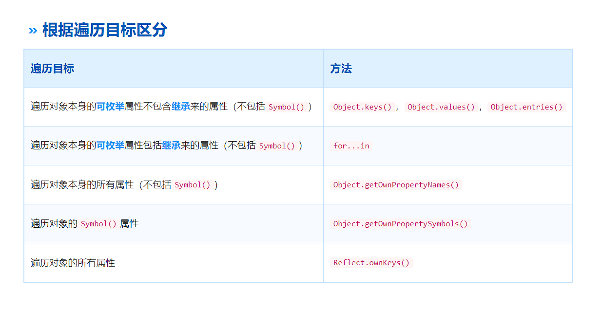

# 三、JS

## 1. JS的数据类型及检测方法

基本数据类型：number、string、undefined、null、boolean、symbol（es6）、bigInt（es7）

 引用数据类型：object、array、function 

检测方法： 

- typeof :检测基本数据类型，但是null和object都被检测为对象 例：`typeof undefined // "undefined"`
- Instance of: 主要用来检测引用数据类型，不能正确检测基本数据类型，原理是判断其原型链上能不能找到该类型的原型 , 语法`obj instanceof Class` 
- Object.prototype.toString.call(): 可以检测任何类

## 2. ES6新增

- **let 和 const**：用于变量声明，提供块级作用域。
- **箭头函数（Arrow Functions）** ：简化了函数表达式的写法，使用 `=>` 符号
- **类（Classes）** ：引入了基于类的面向对象编程语法。

```
class Person {
  constructor(name) {
    this.name = name;
  }
  greet() {
    return `Hello, ${this.name}!`;
  }
}
```

- **模板字符串（Template Literals）** ：允许嵌入表达式的字符串字面量。
- **默认参数值**：允许函数参数有默认值。
- **解构赋值（Destructuring Assignment）** ：允许从数组或对象中提取数据并赋值给变量。

```
const [a, b] = [1, 2];
const { x, y } = { x: 10, y: 20 };
```

- **扩展运算符（Spread Operator）和剩余参数（Rest Parameters）** ：使用 `...` 实现。

```
const numbers = [1, 2, 3];
const newNumbers = [...numbers, 4, 5]; // Spread operator

function sum(...args) { // Rest parameters
  return args.reduce((sum, current) => sum + current, 0);
}
```

- **模块导入和导出（Modules）** ：使用 `import` 和 `export` 语法。
- **Promise 对象**：用于异步编程。
- **生成器和迭代器（Generators & Iterators）** ：引入生成器函数，可通过 `yield` 关键字暂停和恢复执行
- **新的数据结构**：如 `Map`, `Set`, `WeakMap`, `WeakSet`
- **Symbol 类型**：引入了新的原始数据类型 `Symbol`，可用作唯一的属性键。
- **新的静态方法和属性**：例如 `Array.from`, `Object.assign`, `Number.isFinite`, `Math.trunc` 等

## 3. let、const、var区别

|            | var      | let    | const  |
| ---------- | -------- | ------ | ------ |
| 块级作用域 | 没有     | 有     | 有     |
| 变量提升   | 有       | 没有   | 没有   |
| 暂时性死区 | 没有     | 有     | 有     |
| 初始值     | 可以没有 | 可以有 | 必须有 |
| 重复声明   | 可以     | 不可以 | 不可以 |

## 4. ==和===区别

- **`=` 是相等运算符**，当使用 `==` 比较两个变量时，如果它们的类型不相同，会进行类型转化再进行比较。
- **`===` 是严格相等运算符，它不会执行类型转换。仅当变量的值和类型都相同时，它们才被认为是相等的**。


## 5. 原型与原型链

每个函数都会有一个prototype属性，它就是原型对象，通过实例化出来的对象有`_proto_`属性，指向原型对象

```
let a = new A()
a._proto_ = A.prototype
```

**原型链是一个对象查找属性和方法时的查找机制。**如果在对象自身上找不到请求的属性或方法，JavaScript 会沿着这个对象的原型链向上查找，直到找到属性或方法或者到达原型链的顶端（也就是 `Object.prototype`）。如果在原型链的任何一级上找到了属性或方法，查找过程就会停止；如果一直没找到，通常会返回 `undefined`（对于方法调用则会抛出错误）。

`Object.prototype` 的原型是 `null`，这表示原型链的终点，即没有更多的原型对象可以查找。

 

```
    function Person() {}
    var person = new Person()
    console.log(person.__proto__ === Person.prototype)//true
    console.log(Person.prototype.constructor===Person)//true
    //顺便学习一个ES5的方法,可以获得对象的原型
    console.log(Object.getPrototypeOf(person) === Person.prototype) // true

```

## 6.作用域与闭包

**作用域**：是程序中定义变量的区域，分为全局作用域（代码的任何地方都能访问到的变量）和局部作用域（只能在函数或者代码块内部访问的变量）作用域链的变量只能向上访问， 变量访问到 window 对象即被终止，简单的说，作用域就是变量与函数的可访问范围， 即**作用域控制着变量与函数的可⻅性和 生命周期**

**闭包**：当一个函数嵌套在另一个函数中，内部函数会保留外部函数的作用域，即使外部函数已经执行完毕，内部函数依然可以访问外部函数中的变量

 常用的两个用途： 能够实现封装和缓存等； 

闭包的好处是可以读取函数内部的变量， 让这些变量始终保 持在内存中

闭包的坏处 ：就是消耗内存 、不正当使用会造成内存溢出的问题 

## 7. Promise

promise 是一个对象，用来传递异步操作的信息。代表着某个未来才会知道结果的时间，并未这个事件提供统一的api，以进行异步处理

有了这个对象，就可以让异步操作以同步的操作的流程来表达出来，避免层层嵌套的回调地狱

### 三种状态

promise代表一个异步状态，有三个状态**pending（进行中），Resolve(已完成），Reject（失败）**

一旦状态改变，就不会在变。状态的改变只能通过`resolve、reject`来实现，从进行中变为已完成或者失败

### 方法

`Promise.race()` 和 `Promise.all()` 用于处理多个 Promise 实例的情况。 promise.all()是里面状态都改变，那就会输出，得到一个数组，promise.race() 里面只有一个状态变为rejected或者fulfilled即输出，

`then()` 方法用于注册当 Promise 对象的状态变为 resolved（成功）时的回调函数 ，`catch()` 方法用于注册当 Promise 对象的状态变为 rejected（失败）时的回调函数。 `finally()` 方法用于注册当 Promise 对象无论状态如何都要执行的回调函数。 

### 缺点

promise通常用来解决回调地狱的问题，但也有几个**不可忽视的缺点**

- promise一旦新建就会立即执行，无法中途取消

  当处于pending状态时，无法得知当前处于哪一个状态，是刚刚开始还是刚刚结束

  如果不设置回调函数，promise内部的错误就无法反映到外部

  promise封装ajax时，由于promise是异步任务，发送请求的三步会被延后到整个脚本同步代码执行完，并且将响应回调函数延迟到现有队列的最后，如果大量使用会大大降低了请求效率。

## 8. 箭头函数特点

- 箭头函数的语法更简单，省去了`function`关键字
- 普通函数：谁调用这个函数，this指向谁，箭头函数：在哪里定义函数，this指向谁
- 不可以使用 arguments 对象，该对象在函数体内不存在  ，但可以用剩余参数语法（…args）
- 不可以当作构造函数，也就是说，不可以使用 new 命令 

## 9 new一个对象的过程

- **创建一个新对象**： `new` 操作符首先创建一个空的简单 JavaScript 对象（即 `{}`）。
- **设置原型**：新对象的  `__proto__` 属性会被设置为构造函数的 `prototype` 属性，新对象会继承构造函数原型上的方法和属性。
- **绑定 this 值**：构造函数内部的 `this` 被绑定到新创建的对象上。
- **执行构造函数**：`new` 操作符后面的函数（构造函数）会被调用，其参数也会按照指定的参数传递进去。构造函数内部的代码通常会初始化新对象的属性，并执行其他必要的设置。
- **返回新对象**：如果构造函数返回一个对象，那么这个对象会成为 `new` 操作符的返回值。如果构造函数没有返回对象，那么 `new` 操作符会返回刚刚创建的新对象。

## 10. 深拷贝与浅拷贝

**浅拷贝**只复制对象的第一层属性。如果属性值是原始类型 则复制的是值本身；如果属性值是复合类型则复制的是引用（内存地址），而不是实际的值。当修改了拷贝后对象中的某个嵌套对象，原始对象中对应的嵌套对象也会被修改，因为它们引用的是同一块内存地址。

浅拷贝方法： 数组的 from()、slice()、 concat() 与扩展运算符、 object.assign 等方法可以实现浅拷贝

**深拷贝**是完全复制一个对象，包括对象内部嵌套的对象。深拷贝后的对象与原始对象不共享任何引用。

- 最简单的深拷贝实现是使用 `JSON.stringify()` 和 `JSON.parse()`。这种方法会将对象转换成 JSON 字符串，然后再将字符串解析成一个新的对象，例` JSON.parse(JSON.stringify(original));`
- 使用三方库**lodash的** cloneDeep 方法
- 递归调用

## 11. 简述forEach()和map()循环的主要区别

- 返回值：`forEach()` 没有返回值，而 `map()` 返回一个新数组。
- 原数组：`forEach()` 能改变原数组，而 `map()` 一般不能改变原数组，而是返回一个新数组。
- 使用场景：如果需要对数组进行操作并且不需要返回值，可以使用 `forEach()`；如果需要对数组进行操作并且需要返回一个新数组，可以使用 `map()`。 

## 12.简述JSONP的工作原理（它为什么不是真的AJAX）

JSONP是利用 `<script>` 标签进行跨域请求的技术。它不是真正的 AJAX，因为它并不使用 XMLHttpRequest 对象发送请求，而是通过动态创建 `<script>` 标签来加载外部脚本。 

### 工作原理

- **客户端创建请求**： 先定义一个回调函数，然后通过动态创建一个 `<script>` 标签来向服务器发起请求。请求的 URL 包含一个查询参数，通常称为 `callback` 或 `jsonp`，其值是准备接收响应的回调函数的名称。
- **服务器响应**： 服务器将调用指定回调函数的 JavaScript 代码作为脚本的内容发送给客户端。
- **客户端处理**： 浏览器会执行服务器返回的 JavaScript 代码。
- **执行回调函数**： 回调函数执行时，它处理从服务器接收到的数据。 

## 13. 对async/await理解

**`async` 关键字用于声明一个函数是异步的**。`async` 函数返回 的是Promise 对象。

**`await` 关键字用于等待一个 Promise 解决（fulfilled）**。它只能在 `async` 函数中使用。`await` 会暂停 `async` 函数的执行，等待 Promise 解决后再继续执行，并返回解决的值。如果 Promise 被拒绝（rejected），`await` 会抛出拒绝的原因，**可以用 `try...catch` 语句捕获这个错误

## 14. 精度丢失问题

**精度丢失问题**通常是由于其使用 **IEEE 754 双精度浮点数格式**来表示数字所导致的。这个问题的根源在于二进制浮点数在表示某些十进制小数时的不精确性。

### 解决方案

- **使用整数进行计算**: 通过将浮点数转换为整数（例如，将 0.1 转为 10），进行计算后再转换回去。这种方法对于简单的运算有效，但对于复杂的数学运算可能不实用。
- **使用第三方库**: 使用专门处理大数或者精确小数运算的库，如 `BigInt`（对于大整数）、`decimal.js` 或 `bignumber.js`（对于高精度的小数运算）。这些库提供了精确的数字运算方法。
- **内置 BigInt 类型**: 对于大整数，ES2020 引入了 `BigInt` 类型，可以用来表示任意精度的整数。

## 15 垃圾回收机制和内存泄漏

### 垃圾回收机制

Js运行时，需要分配内存空间来储存变量和值，当这些变量不再运行的时候，系统就会收回被占用的内存

**回收机制**

Js有自动回收机制，会定期清理不再使用的变量，然后释放内存。

Js有两种变量，全局变量和局部变量，全局变量的内存是等页面卸载之后就被释放；局部变量等到函数执行完毕之后就被释放


### 内存泄露

内存泄露是计算机程序中的一个缺陷，它发生在分配给程序的内存由于某些原因未能释放，尽管它不再被程序使用。在长时间运行的应用程序中，内存泄露可能会导致内存消耗持续增加，最终可能耗尽系统资源，导致程序变慢甚至崩溃


## 16 防抖 节流

- **防抖**：防止抖动，用于将用户的操作行为触发转换为程序行为触发，在一段时间内某个事件连续触发多次，回调只会执行一次。

  **应用场景**： input框输入请求

- **节流**：控制流量，主要用于用户在与页面交互时控制事件发生的频率，一段时间内控制事件每隔n秒执行一次

  **应用场景**：游戏中的射击按钮、调整窗口大小时持续更新布局

## 17. cookie、sessionStorage、localStorage、indexDB区别


## 18.eventloop（事件循环机制）

在事件循环中，当主线程执行完当前的同步任务后，会检查事件队列中是否有待处理的事件。如果有，主线程会取出事件并执行对应的回调函数。这个循环的过程被称为**事件循环**（Event Loop），它由**主线程**和**任务队列**两部分组成。**主线程**负责执行`同步任务`，而`异步任务`则通过**任务队列**进行处理。


### 同步任务

同步任务是按照代码的书写顺序一步一步执行的任务。当主线程执行同步任务时，会阻塞后续的代码执行，直到当前任务执行完成。典型的同步任务包括函数调用、变量赋值、算术运算等。

### 异步任务

异步任务是在主线程执行的同时，通过回调函数或其他机制委托给其他线程或事件来处理的任务。在执行异步任务时，主线程不会等待任务完成，而是继续执行后续代码。包括：回调函数 `callback`、计时器、`Promise/async` `await`、`process.nextTick`等

### 任务队列类型

任务队列分为`宏任务`队列（macrotask queue）和`微任务`队列（microtask queue）两种。**在执行完当前宏任务后，会检查微任务队列，执行其中的微任务，然后再取下一个宏任务执行。这个过程不断循环，形成事件循环。** 

1、宏任务（Macrotasks）**是一些较大粒度的任务**，包括：

- 所有同步任务
- `setTimeout`、`setInterval`
- `setImmediate`（Node.js环境）
- `requestAnimationFrame`
- 事件监听回调函数等
- I/O操作，如文件读写、数据库数据读写等
- ...

2、微任务（Microtasks）**是一些较小粒度、高优先级的任务**，包括：

- `Promise`的`then`、`catch`、`finally`
- `async/await`中的代码
- `Generator`函数
- `MutationObserver`
- `process.nextTick`（Node.js 环境）
- ...


## 19 数组方法

### 一、操作方法

[数组基本操作可以归纳为 增、删、改、查](https://juejin.cn/post/6964192660311506980) 

#### 增

下面前三种是对原数组产生影响的增添方法，第四种则不会对原数组产生影响

- push() ：`push()`方法接收任意数量的参数，并将它们添加到数组末尾，返回数组的最新长度 
- unshift() ：unshift()在数组开头添加任意多个值，然后返回新的数组长度 
- splice() ：传入三个参数，分别是开始位置、0（要删除的元素数量）、插入的元素，返回空数组 
- concat()： 首先会创建一个当前数组的副本，然后再把它的参数添加到副本末尾，最后返回这个新构建的数组，不会影响原始数组 

#### 删

下面三种都会影响原数组，最后一项不影响原数组：

- pop()：`pop()` 方法用于删除数组的最后一项，同时减少数组的` length` 值，返回被删除的项 
- shift()：`shift()`方法用于删除数组的第一项，同时减少数组的` length` 值，返回被删除的项 
- splice()：传入两个参数，分别是开始位置，删除元素的数量，返回包含删除元素的数组 
- slice()：slice() 用于创建一个包含原有数组中一个或多个元素的新数组，不会影响原始数组 

#### 改

即修改原来数组的内容，常用`splice`： splice() 传入三个参数，分别是开始位置，要删除元素的数量，要插入的任意多个元素，返回删除元素的数组，对原数组产生影响 

#### 查

即查找元素，返回元素坐标或者元素值

- indexOf(): 返回要查找的元素在数组中的位置，如果没找到则返回-1 
- includes():返回要查找的元素在数组中的位置，找到返回`true`，否则`false` 
- find(): 返回第一个匹配的元素 

### 二、排序方法

数组有两个方法可以用来对元素重新排序：

- reverse(): 颠倒数组顺序,返回值是颠倒后的数组,原数组也会被颠倒
- sort(): sort()方法接受一个比较函数，用于判断哪个值应该排在前面 

### 三、转换方法

常见的转换方法有：join() 方法接收一个参数，即字符串分隔符，返回包含所有项的字符串

### 四、迭代方法

常用来迭代数组的方法有如下：

- some(): 数组每一项都运行传入的函数，如果有一项函数返回 true ，则这个方法返回 true 

- every(): 对数组每一项都运行传入的函数，如果对每一项函数都返回 true ，则这个方法返回 true 

- forEach(): 对数组每一项都运行传入的函数，没有返回值 

- filter(): 对数组每一项都运行传入的函数，函数返回 `true` 的项会组成数组之后返回 

- map()： 对数组每一项都运行传入的函数，返回由每次函数调用的结果构成的数组

- `reduce()`方法从数组的第一项开始，逐个遍历到最后。

  `reduceRight()`则从数组的最后一项开始，向前遍历到第一项。

[小结](https://juejin.cn/post/7241875961130745911)

特定的循环，并且需要中断和跳过可使用 `for`

无需返回值可使用 `forEach、for...of`

检查是否满足指定条件而无需使用元素可使用 `some、every`

筛选符合条件的元素可使用`filter、find、findLast`

找到符合条件的元素索引可使用 `findIndex、findLastIndex`

需要对不符合展示条件的数据继续再处理时可使用`map`

需要依赖数组元素上次结果，如累计可使用 `reduce、reduceRight`

### 哪些不改变原数组

```
1.不会改变原来数组的有：
concat()---连接两个或更多的数组，并返回结果。
every()---检测数组元素的每个元素是否都符合条件。
some()---检测数组元素中是否有元素符合指定条件。
filter()---检测数组元素，并返回符合条件所有元素的数组。
indexOf()---搜索数组中的元素，并返回它首次出现的位置。
join()---把数组的所有元素放入一个字符串。
toString()---把数组转换为字符串，并返回结果。
lastIndexOf()---返回一个指定的字符串值最后出现的位置，在一个字符串中的指定位置从后向前搜索。
map()---通过指定函数处理数组的每个元素，并返回处理后的数组。
slice()---选取数组的的一部分，并返回一个新数组。
valueOf()---返回数组对象的原始值。
find()---返回数组中符合测试函数条件的第一个元素
reduce()---可以作为累加器

2.会改变原来数组的有：
pop()---删除数组的最后一个元素并返回删除的元素。
push()---向数组的末尾添加一个或更多元素，并返回新的长度。
shift()---删除并返回数组的第一个元素。
unshift()---向数组的开头添加一个或更多元素，并返回新的长度。
reverse()---反转数组的元素顺序。
sort()---对数组的元素进行排序。
splice()---用于插入、删除或替换数组的元素。

```


## 字符串的方法

字符串长度 str.length;  

字符串大小写转换，toUpperCase() 、toLowerCase() 

字符串查找：

- indexOf（）
- lastIndexOf()
- search()
  - `search() 方法无法设置第二个开始位置参数。`
  - `indexOf() 方法无法设置更强大的搜索值（正则表达式）`

字符串截取方法

- slice(*start*, *end*)
- substring(*start*, *end*)
- substr(*start*, *length*)
  - `substring()` 类似于 `slice()`。`不同之处在于substring() 无法接受负的索引`
  - `substr()` 类似于 `slice()`。`不同之处在于第二个参数规定被提取部分的长度`

字符串替换

- `replace()` 方法用另一个值替换在字符串中指定的值
- `replace()` 方法不会改变调用它的字符串。它返回的是新字符串
- `replace()` 默认只替换首个匹配

字符串连接

​	`concat()` 连接两个或多个字符串

字符串删除两端的空白符 

​	`trim()` 方法删除字符串两端的空白符 

字符串提取字符

- `charAt()` 方法返回字符串中指定下标（位置）的字符串：
- `charCodeAt()` 方法返回字符串中指定索引的字符 unicode 编码：

## 20. [ES6  Map 与Set](https://juejin.cn/post/7330914575695937547)

Set是一种集合数据结构，只能存储唯一的值，即不允许重复。 

特点：Set中的元素按照插入顺序排序，并且不能重复。可以存储任意类型的值：基本类型和引用类型。Set是可迭代的，可以使用for...of循环遍历。

### Set常用方法：

- `add(value)`: 向Set中添加一个新的值。
- `delete(value)`: 从Set中删除指定的值。
- `has(value)`: 检查Set中是否存在指定的值。
- `clear()`: 清空Set中的所有值。
- `size`: 返回Set中的元素个数。

### Set 用于数组去重方法

```
--------------------------------------方法一 [....new Set(arr)]
let arr = [1, 1, 2, 2, 3];
let newArr = [...new Set(arr)];
console.log(newArr); // 输出: [1, 2, 3]
--------------------------------------方法二 Array.from与Set
let arr = [1, 1, 2, 2, 3];
// 创建一个 Set 对象 
let set = new Set(arr);
// 将 Set 对象转换为数组
let newArr = Array.from(set); 
console.log(newArr); // 输出: [1, 2, 3]
```

Map是一种键值对的集合，可以使用任意类型的值作为键。 

特点：Map中的键值对按照插入顺序排序，并且键不能重复。可以存储任意类型的值：基本类型和引用类型。Map是可迭代的，可以使用for...of循环遍历。

### Map常用方法：

- `set(key, value)`: 向Map中添加一个键值对。
- `get(key)`: 根据键获取对应的值。
- `has(key)`: 检查Map中是否存在指定的键。
- `delete(key)`: 从Map中删除指定的键值对。
- `clear()`: 清空Map中的所有键值对。
- `size`: 返回Map中的键值对个数。

### 应用场景：

**set**：去除数组中的重复元素。 存储一组唯一的值，并快速检查某个值是否存在。 

**map**:存储需要快速查找的键值对数据。 维护一种关联关系，例如存储用户信息等。 

## 21 Map与Object的区别

1.键的类型：Object中键的类型只能是字符串，符号**(Symbol)** ，整数，在Map中键的类型可以是任何类型的值，包括对象
2.插入顺序：在Map中，键的插入顺序会被保留
3.大小：Map可以用size属性来获取，Object只能手动计算
4.迭代：Map支持for of 循环和forEach，Object只能有for in，并且需要判断属性是否是自身属性而不是继承属性
5.性能：在频繁增删键值对的场景下，Map的性能更好

## 22 什么是隐式类型转换？

隐式类型转换是指在表达式求值过程中，JavaScript自动将一个数据类型转换为另一个数据类型，而无需显式地调用转换函数。 

### 隐式类型转换：

- 数字转字符串：通过将 <u>数字与一个空字符串相加</u>，JavaScript会将数字隐式转换为字符串。 
- 字符串转数字：通过使用一元加号操作符<u>（+）</u>对字符串进行操作，JavaScript会将字符串隐式转换为数字。 
- 布尔值转数字：通过使用一元加号操作符（+）对布尔值进行操作，JavaScript会将布尔值隐式转换为数字，`true`转换为1，`false`转换为0。 
- 字符串转布尔值：通过使用两个逻辑  非操作符（!!） 对字符串进行操作，JavaScript会将字符串隐式转换为布尔值，非空字符串转换为`true`，空字符串转换为`false`。 
- 对象的隐式转换：对象转换为字符串或者数字

## 23 如何判断一个变量是对象还是数组

- Array.isArray( )函数来判断, 例：`Array.isArray(arr) `
- instanceof , 例：`arr instanceof Array `
- Object.prototype.toString.call()
- 构造函数。例：` a.__proto__.constructor === Array `

## 24 删除对象属性

利用delete关键字

```
const o = {
    p: 10,
    m: 20
}

delete o.p
console.log(o) // { m: 20 }
// 删除对象的属性后，在访问返回 undefined
console.log(o.p) // undefined

```

## 25 JSON序列化缺点是什么

- **undefined、任意的函数以及 symbol** 值，在序列化过程中**会被忽略**
- **Date** 日期调用了 toJSON() 将其转换为了 string 字符串（Date.toISOString()），因此**会被当做字符串处理**。
- **NaN 和 Infinity 格式的数值及 null 都会被当做 null**。
- 其他类型的对象，包括 Map/Set/WeakMap/WeakSet，**仅会序列化可枚举的属性**。
- 对包含**循环引用**的对象（对象之间相互引用，形成无限循环）执行此方法，**会抛出错误**。

## 26 如何实现继承？ proto ，class

- 原型链继承:
  - **实现方式：** 子类构造函数的原型对象指向父类的实例。 
  - 缺点：
    - 引用类型的属性会被所有实例共享，存在属性共享的问题。
    - 不能向父类传递参数, 无法通过子类向父类传参。
- 借用构造函数继承
  - **实现方式：** 在子类构造函数中调用父类构造函数，并使用 `call` 或 `apply` 方法绑定 `this` 
  - 缺点：
    - 不能继承父类原型上的方法。
    - 每次创建子类实例都会创建一份父类方法的副本，存在内存浪费。
- 组合继承
  - **实现方式：** 同时使用原型链继承和构造函数继承。
  - 缺点：子类原型链上存在两份相同的属性，存在内存浪费。
- 原型式继承
  - **实现方式：** 利用一个空的构造函数作为中介，创建一个对象并将该对象的原型指向某个对象。
  - 缺点：
    - 无法传递参数。
    - 引用类型的属性会被所有实例共享，存在属性共享的问题。
- 寄生式继承：
  - **实现方式：** 在原型式继承的基础上，对对象进行扩展，并返回扩展后的对象。
  - **缺点：** 无法传递参数，存在属性共享的问题。
- 寄生组合继承
  - **实现方式：** 使用寄生式继承来继承父类原型，然后将结果指定给子类的原型。
  - 
- es6 class继承
  - 优点：极大地简化了原型链代码
  - 缺点：不能兼容所有的浏览器

## 27 如何监听浏览器关闭或者刷新事件？？

window.onbeforeunload 

页面加载时只执行 onload 事件。

页面关闭时，先 onbeforeunload 事件，再 onunload 事件。

页面刷新时先执行 onbeforeunload事件，然后 onunload 事件，最后 onload 事件。

## 28 什么是事件代理？？

`事件委托`也称为`事件代理`。就是利用`事件冒泡`，把子元素的事件都绑定到父元素上。如果子元素阻止了事件冒泡，那么委托就无法实现。 

- **DOM事件流有3个阶段：捕获阶段，目标阶段，冒泡阶段；三个阶段的顺序为：捕获阶段——目标阶段——冒泡阶段；**
- **（更新）✅不管对于非目标阶段或者目标阶段的元素，事件响应执行顺序都是遵循先捕获后冒泡**
- **事件捕获是从顶层的Window逐层向内执行，事件冒泡则相反；**
- **事件委托（事件代理）是根据事件冒泡或事件捕获的机制来实现的。**

## 29 this指向

1、在全局环境下直接使用的this指向

​	指向 window 

 2、在对象中的this 

对象中的方法, this指向调用这些方法的对象 

3、函数内部的this 

默认指向window ， 严格模式中this会指向undefined，要用window.test()调用才会指向window 

4、箭头函数的this

**箭头函数没有自己的this** ，在哪里定义，this 指向谁

5、构造函数中的this 

构造函数中的this 关键字指向当前创建的实例对象。 需要注意的是 `setTimeout` 中的回调仍然是一个普通函数，因此 `this` 默认指向 `window` 

## 30 字符串的方法


## 31 对象的方法

https://juejin.cn/post/7129374520015585317



## 请说一下AJAX中XMLHttpRequest有哪五大步骤

**1.创建XMLhttpRequest对象**

**2.使用open方法设置和服务器的交互信息**

**3.如果默认是json格式,那就可以不设置requestHeader,默认的发送的是json格式数据**

**4.发送请求**

**5.如果请求完成，并响应完成，获取到响应数据**

```
 //1.创建XMLhttpRequest对象
            var request=new XMLHttpRequest();
            //2.使用open方法设置和服务器的交互信息
            request.open('get','https://api.muxiaoguo.cn/api/lishijr');
            //3.如果默认是json格式,那就可以不设置requestHeader,这是默认的发送json格式数据
            request.setRequestHeader('Content-type', 'application/json; charset=utf-8');
            //4.发送请求
            request.send();
            //5.如果请求完成，并响应完成，获取到响应数据
            request.onreadystatechange=function (){
                if(request.readyState===4&&request.status===200){
                    console.log(JSON.parse(request.responseText));
                }
            }
```

[参考](https://blog.csdn.net/qq_51066068/article/details/124293153)