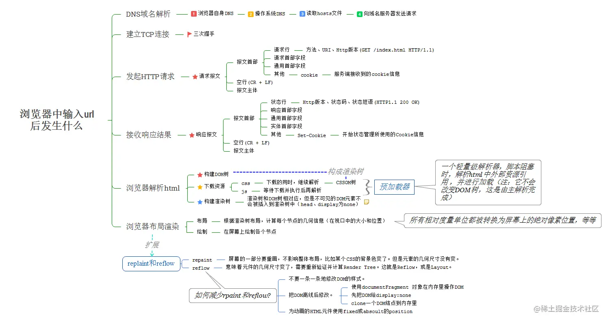

# 十、浏览器

## 1. 浏览器缓存机制

浏览器会将请求后的资源存储为离线资源，当下次需要该资源时，浏览器会根据缓存机制决定直接使用缓存资源还是再次向服务器发送请求

浏览器缓存主要分为**强缓存**（也称**本地缓存**）和**协商缓存**（也称**弱缓存**）。

### 强缓存

不向服务端发送请求，强制使用缓存数据，强缓存是利用http头中的`Expires`和`Cache-Control`两个字段来控制的 ，

当 ` cache-control`（约定过期时间的相对时间）和 `expires `（指定资源到期的时间）同时存在` cache-control` 的优先级会比 `expires `高

### 协商缓存

当强缓存失效后，会使用协商缓存

主要涉及到两组header字段：`Etag`和`If-None-Match`、`Last-Modified`和`if-modified-since`。 

服务器的` ETag` 和 浏览器的 `If-None-Match` 对应 

服务器的 `Last-Modified` 和 浏览器请求的` If-Modified-Since` 对应

### 缓存流程：


## 2 . 本地缓存方式

WebStorage(localstorage、sessionstorage)、Cookies、indexDB 

1. `cookie`并不适合存储，而且存在非常多的缺陷。
2. `Web Storage`包括`localStorage`和`sessionStorage`, 默认不会参与和服务器的通信。
3. `IndexedDB`为运行在浏览器上的非关系型数据库，为大型数据的存储提供了接口。

## 3. 跨域

### 什么是跨域

跨域是浏览器受同源（协议、域名、端口）策略的限制，不允许不同源的站点之间进行某些操作（如发送ajax请求，操作dom，读取cookie），如果不进行特殊配置是不能操作成功的，并且控制台会报跨域错误。

解决措施

- jsonp
- cors： 常用
- 反向代理： 常用

### JSONP：

**当需要跨域请求时，不使用AJAX，转而生成一个script元素去请求服务器，由于浏览器并不阻止script元素的请求，这样请求可以到达服务器。服务器拿到请求后，响应一段JS代码，这段代码实际上是一个函数调用，调用的是客户端预先生成好的函数，并把浏览器需要的数据作为参数传递到函数中，从而间接的把数据传递给客户端**

JSONP有着明显的缺点，即其只能支持GET请求

### 代理：

**对于前端开发而言**，大部分的跨域问题，都是通过代理解决的

**代理适用的场景是：生产环境不发生跨域，但开发环境发生跨域**

```
// vue 的开发服务器代理配置
// vue.config.js
module.exports = {
  devServer: { // 配置开发服务器
    proxy: { // 配置代理
      "/api": { // 若请求路径以 /api 开头
        target: "http://dev.taobao.com", // 将其转发到 http://dev.taobao.com
      },
    },
  },
};
```

### CORS

`CORS`是基于`http1.1`的一种跨域解决方案 , 它的总体思路是：**如果浏览器要跨域访问服务器的资源，需要获得服务器的允许**

针对不同的请求，CORS 规定了三种不同的交互模式，分别是：

- **简单请求**
  - 
- **需要预检的请求**
  - 流程
    - **浏览器发送预检请求，询问服务器是否允许**
    - **服务器允许**
    - **浏览器发送真实请求**
    - **服务器完成真实的响应**
  - 
- **附带身份凭证的请求**
  - 通过简单的配置附带 cookie，该跨域的 ajax 请求就是一个*附带身份凭证的请求*

## 4. http状态码

- **1xx**: 表示目前是协议处理的中间状态，还需要后续操作。
- **2xx**: 表示成功状态。
- **3xx**: 重定向状态，资源位置发生变动，需要重新请求。
- **4xx**: 请求报文有误。
- **5xx**: 服务器端发生错误。

### 常见状态码：

- 14种常用的HTTP状态码列表

| 状态码 | 状态码英文名称        | 中文描述                                                     |
| ------ | --------------------- | ------------------------------------------------------------ |
| 200    | OK                    | `请求成功`。一般用于GET与POST请求                            |
| 204    | No Content            | 无内容。`服务器成功处理，但未返回内容`。在未更新网页的情况下，可确保浏览器继续显示当前文档 |
| 206    | Partial Content       | `是对资源某一部分的请求`，服务器成功处理了部分GET请求，响应报文中包含由Content-Range指定范围的实体内容。 |
|        |                       |                                                              |
| 301    | Moved Permanently     | `永久性重定向`。请求的资源已被永久的移动到新URI，返回信息会包括新的URI，浏览器会自动定向到新URI。今后任何新的请求都应使用新的URI代替 |
| 302    | Found                 | `临时性重定向`。与301类似。但资源只是临时被移动。客户端应继续使用原有URI |
| 303    | See Other             | `查看其它地址`。与302类似。使用GET请求查看                   |
| 304    | Not Modified          | 未修改。所请求的资源未修改，服务器返回此状态码时，不会返回任何资源。客户端通常会缓存访问过的资源，通过提供一个头信息指出客户端希望只返回在指定日期之后修改的资源 |
| 307    | Temporary Redirect    | `临时重定向`。与302类似。使用GET请求重定向，会按照浏览器标准，不会从POST变成GET。 |
|        |                       |                                                              |
| 400    | Bad Request           | `客户端请求报文中存在语法错误，服务器无法理解`。浏览器会像200 OK一样对待该状态吗 |
| 401    | Unauthorized          | `请求要求用户的身份认证`，通过HTTP认证（BASIC认证，DIGEST认证）的认证信息，若之前已进行过一次请求，则表示用户认证失败 |
| 402    | Payment Required      | 保留，将来使用                                               |
| 403    | Forbidden             | `服务器理解请求客户端的请求，但是拒绝执行此请求`             |
| 404    | Not Found             | 服务器无法根据客户端的请求找到资源（网页）。通过此代码，网站设计人员可设置"您所请求的资源无法找到"的个性页面。也可以在服务器拒绝请求且不想说明理由时使用 |
|        |                       |                                                              |
| 500    | Internal Server Error | `服务器内部错误，无法完成请求`，也可能是web应用存在bug或某些临时故障 |
| 501    | Not Implemented       | 服务器不支持请求的功能，无法完成请求                         |
| 503    | Service Unavailable   | `由于超载或系统维护，服务器暂时的无法处理客户端的请求`。延时的长度可包含在服务器的Retry-After头信息中 |

[来源：](https://juejin.cn/post/6844904202863394830)

## 5. 三次握手 四次挥手

1. **SYN**：同步标志位，用于建立会话连接，同步序列号；
2. **ACK**： 确认标志位，对已接收的数据包进行确认；
3. **FIN**：完成标志位，表示我已经没有数据要发送了，即将关闭连接；

### [三次握手](https://juejin.cn/post/6844903842283274247)

第一次握手：客户端发送SYN包(syn=x)到服务器，并进入SYN_SEND状态，等待服务器确认；（报文段中不包含应用层数据）

第二次握手：服务器收到SYN包，必须确认客户的SYN（ack=x+1），同时自己也发送一个SYN包（syn=y），即SYN+ACK包，此时服务器进入SYN_RECV状态；（报文段中不包含应用层数据）

第三次握手：客户端收到服务器的SYN＋ACK包，向服务器发送确认包ACK(ack=y+1)，此包发送完毕，客户端和服务器进入ESTABLISHED状态，完成三次握手。（可以在报文段负载中携带客户到服务器的数据）

理想状态下，TCP连接一旦建立，在通信双方中的任何一方主动关闭连接之前，TCP 连接都将被一直保持下去。


#### [改成两次握手可以吗](https://juejin.cn/post/7192869386955259959)

​	三次握手可以理解为了客户端和服务器互相确认对方的发送和接收能力。如果是两次握手，可以确定服务器的发送和接收能力，但只能确定客户端的发送能力，无法确认其接收能力。另外，如果是两次握手的话，可能会因为网络阻塞等原因会发送多个请求报文，延时到达的请求又会与服务器建立连接，浪费服务器的资源。

### [四次挥手](https://juejin.cn/post/6844904070000410631)

**第一次挥手**： 客户端端发起挥手请求，向服务端发送标志位是FIN报文段，设置序列号seq，此时，Client端进入`FIN_WAIT_1`状态，这表示Client端没有数据要发送给Server端了。

**第二次挥手**：服务端收到了Client端发送的FIN报文段，向客户端返回一个标志位是ACK的报文段，ack设为seq加1，客户端进入`FIN_WAIT_2`状态，服务端告诉客户端，我确认并同意你的关闭请求。

**第三次挥手**： 服务端向客户端发送标志位是FIN的报文段，请求关闭连接，同时客户端进入`LAST_ACK`状态。

**第四次挥手** ： 客户端收到服务端发送的FIN报文段，向服务端发送标志位是ACK的报文段，然后服务端进入`TIME_WAIT`状态。服务端收到客户端的ACK报文段以后，就关闭连接。此时，客户端等待**2MSL**的时间后依然没有收到回复，则证明服务端已正常关闭，那好，客户端也可以关闭连接了。


### 等待2MSL的意义

2 个 `MSL`(`Maximum Segment Lifetime，报文最大生存时间`), 在这段时间内如果客户端没有收到服务端的重发请求，那么表示 ACK 成功到达，挥手结束，否则客户端重发 ACK。

为什么要等待 2 MSL?

- 1 个 MSL 确保四次挥手中主动关闭方最后的 ACK 报文最终能达到对端
- 1 个 MSL 确保对端没有收到 ACK 重传的 FIN 报文可以到达

### 为什么是四次挥手而不是三次？

因为服务端在接收到`FIN`, 往往不会立即返回`FIN`, 必须等到服务端所有的报文都发送完毕了，才能发`FIN`。因此先发一个`ACK`表示已经收到客户端的`FIN`，延迟一段时间才发`FIN`。这就造成了四次挥手。

如果是三次挥手会有什么问题？

等于说服务端将`ACK`和`FIN`的发送合并为一次挥手，这个时候长时间的延迟可能会导致客户端误以为`FIN`没有到达客户端，从而让客户端不断的重发`FIN`。

## 6. 输入URL，会发生什么


 

[图来源](https://juejin.cn/post/6898518950154338317)

## 7. [浏览器怎么渲染的](https://juejin.cn/post/7262263050102095929)

- 解析HTML：将字符串解析成`DOM`树和`CSSOM`树
- 样式计算：得到`Computed Style`
- 布局：产生布局树
- 分层：划分图层
- 绘制：产生绘制指令集
- 分块：划分区域
- 光栅化：生成位图
- 画：生成`quad`，提交硬件，完成成像


 

 

[图来源](https://juejin.cn/post/7262263050102095929)

## 8 TCP与UDP区别

**TCP是一个面向连接的、可靠的、基于字节流的传输层协议。**

而**UDP是一个面向无连接的传输层协议， UDP 不提供数据传输的可靠性保证，  UDP 比 TCP 更快速 。**

- TCP 适用于需要可靠传输、顺序传输和流量控制的应用，如网页浏览、电子邮件传输和文件下载等。
- UDP 适用于实时应用，如语音通话、视频会议、在线游戏和实时传输等，因为它具有较低的延迟和更快的速度，尽管在数据丢失的情况下可能会出现一些质量问题。

## 9. GET 和 POST 的区别？

1. 参数位置：`GET`请求的参数是放在 url 中，`POST`请求放在请求体 body 中。
2. 参数长度：`GET`请求在 url 中传递的参数有长度限制（主要是因为浏览器对 url 长度有限制），`POST`则没有。
3. 参数的数据类型：`GET`只接受ASCII字符，而`POST`没有限制。
4. 安全：`POST`比`GET`安全，因为数据在地址栏上不可见。但是从传输角度考虑，二者都是不安全的，因为`HTTP`是明文传输。
5. 幂等性：`GET`是一个幂等的请求；`POST`不是。（幂等，指同⼀个请求⽅法执⾏多次和仅执⾏⼀次的效果完全相同）
6. 缓存：`GET`请求会被浏览器主动cache，而`POST`不会，除非手动设置

[参考来源](https://juejin.cn/post/7192869386955259959)

## 10. DNS 协议？

[参考来源](https://juejin.cn/post/7192869386955259959)

1. 概念：
   `DNS（Domain Namse System）`，域名系统，是进行域名和其相应IP地址进行转换的服务器。可以将`DNS`理解为一个翻译官，负责把域名转换为相应的IP地址。`DNS`协议运行在UDP协议之上，使用`53`号端口。
2. 域名：
   域名是一个具有层次的结构，如下：

```
主机名.次级域名.顶级域名.根域名
# 即
host.sld.tld.root
```

   需要注意的是，根域名`.root`对于所有域名都是一样的，所以平时是省略的。

   根据域名的层级结构，管理不同层级域名的服务器，可以分为`根域名服务器`、`顶级域名服务器`和`权限域名服务器`。除此之外，还有电脑默认的`本地域名服务器`。

1. 查询方式：
   `DNS`查询方式分为`递归查询`和`迭代查询`两种。所谓`递归查询`，就是A向B请求，如果B不知道所请求的内容，则B将继续向上请求，直到获得所需的内容，然后将内容返回给A。`迭代查询`，就是A向B请求，如果B不知道，则B会告诉A如何获得该内容，让A继续去请求。

   

   


1. 域名缓存：
   域名服务器会缓存域名和IP之间的映射。分为两种缓存方式：
   ① `浏览器缓存`：浏览器在获取网站域名的地址后会对其进行缓存，减少网络请求的损耗。
   ② `操作系统缓存`：操作系统的缓存其实是用户自己配置的 hosts 文件。
2. 完整解析过程：

- 首先搜索**浏览器的 DNS 缓存**，缓存中维护一张域名与 IP 地址的对应表

- 若没有命中，则继续搜索**操作系统的 DNS 缓存**

- 若仍然没有命中，**则操作系统将域名发送至本地域名服务器**，本地域名服务器查询自己的 DNS 缓存，查找**成功则返回结果**

- 若本地域名服务器的 DNS 缓存没有命中，则本地域名服务器向上级域名服务器进行查询，通过以下方式进行 

  **迭代查询**：

  - 首先本地域名服务器向根域名服务器发起请求，根域名服务器返回顶级域名服务器的地址
  - 本地域名服务器拿到这个顶级域名服务器的地址后，向其发起请求，获取权限域名服务器的地址
  - 本地域名服务器根据权限域名服务器的地址向其发起请求，最终得到该域名对应的 IP 地址

- 本地域名服务器将得到的 IP 地址返回给操作系统，同时自己将 IP 地址缓存起来

- 操作系统将 IP 地址返回给浏览器，同时自己也将 IP 地址缓存起来

- 至此，浏览器就得到了域名对应的 IP 地址，并将 IP 地址缓存起来

## 11. 正向代理和反向代理？

[参考来源](https://juejin.cn/post/7192869386955259959)

正向代理隐藏了真实的请求客户端，服务端不知道真实的客户端是谁，客户端请求的服务都被代理服务器代替来请求。

反向代理隐藏了真实的服务端，当发送一个请求时，其背后可能有很多台服务器为我们服务，但具体是哪一台，我们不知道，也不需要知道，我们只需要知道反向代理服务器是谁就好了，反向代理服务器会帮我们把请求转发到真实的服务器那里去。反向代理器一般用来实现负载平衡。


## 13. POST和PUT请求的区别

[参考来源](https://juejin.cn/post/7149438206419664927)

PUT请求是向服务器端发送数据，从而修改数据的内容，但是不会增加数据的种类等，也就是说无论进行多少次PUT操作，其结果并没有不同。（可以理解为时**更新数据**）

POST请求是向服务器端发送数据，该请求会改变数据的种类等资源，**它会创建新的内容**。（可以理解为是**创建数据**）

### 为什么post请求会发送两次请求?

- 1.第一次请求为`options`预检请求，状态码为:204
  - 作用：
    - 作用1: 询问服务器是否支持修改的请求头，如果服务器支持，则在第二次中发送真正的请求
    - 作用2: 检测服务器是否为同源请求,是否支持跨域
- 2.第二次为真正的`post`请求

## 14. 常见的HTTP请求方法

[参考来源](https://juejin.cn/post/7149438206419664927)

- `GET`: 向服务器获取数据；
- `POST`：发送数据给服务器，通常会造成服务器资源的新增修改；
- `PUT`：用于全量修改目标资源(看接口，也可以用于添加)；
- `PATCH`：用于对资源进行部分修改
- `DELETE`：用于删除指定的资源；
- `HEAD`：获取报文首部，与GET相比，不返回报文主体部分；使用场景是比如下载一个大文件前，先获取其大小再决定是否要下载，以此可以节约宽带资源
- `OPTIONS`：(浏览器自动执行)、询问支持的请求方法，用来跨域请求、预检请求、判断目标是否安全；
- `CONNECT`：要求在与代理服务器通信时建立**管道**，使用**管道**进行TCP通信；(把服务器作为跳板，让服务器代替用户去访问其他网页，之后把数据原原本本的返回给用户)
- `TRACE`: 该方法会让服务器原样返回任意客户端请求的信息内容，主要⽤于测试或诊断。

## 15. 什么是 HTTP？

`HTTP (HyperText Transfer Protocol)`，即超文本传输协议，是一种实现网络通信的规范。它定义了客户端和服务器之间交换报文的格式和方式，默认使用的是`80端口`，其底层使用`TCP`作为传输层协议，保证了数据传输的可靠性。

特点：

- 简单快速：客户端向服务器请求服务时，只需传送请求方法和路径。由于`HTTP`协议简单，使得`HTTP`服务器的规模小，因而通信速度很快。
- 灵活：`HTTP`允许传输任意类型的数据对象。
- 无连接：限制每次连接只处理一个请求。服务器处理完客户的请求，并收到客户的应答后，即断开连接。
- 无状态：`HTTP`协议无法根据之前的状态进行本次的请求处理。
- 明文：`HTTP`是以明文的形式传递内容

## 16. HTTP 和 HTTPS 的区别？

[参考来源](https://juejin.cn/post/7192869386955259959)

`HTTPS`是`HTTP`协议的安全版本。`HTTPS`的出现主要是为了解决`HTTP`明文传输内容导致其不安全的特性。为保证数据加密传输，让`HTTP`运行安全的`SSL/TLS`协议上，即 `HTTPS = HTTP + SSL/TLS`。通过`SSL`证书来验证服务器的身份，并为浏览器和服务器之间的通信进行加密。

二者的区别：

- 安全性：`HTTP`协议的数据传输是明文的，是不安全的；`HTTPS` 使用了`SSL/TLS`协议进行加密处理，相对更加安全。
- 连接方式：二者使用的连接方式不同，`HTTP`是三次握手，`HTTPS`是三次握手+数字证书。
- 默认端口：`HTTP`的默认端口是`80`；`HTTPS`的默认端口是`443`。
- 响应速度：由于`HTTPS`需要进行加解密过程，因此速度不如`HTTP`。
- 费用：`HTTPS`需要使用`SSL`证书，功能越强大的证书其费用越高；`HTTP`不需要。

## 17. HTTP 1.0 和 1.1 的区别？

[参考来源](https://juejin.cn/post/7192869386955259959)

1. 连接：`HTTP 1.0`默认使用非持久连接，`HTTP 1.1`则默认使用持久连接。`HTTP 1.1`通过使用持久连接来使多个HTTP请求复用同一个`TCP`连接，避免了`HTTP 1.0`中使用非持久连接造成的每次请求都需要建立连接的时延。
2. 缓存：`HTTP 1.0`主要使用`header`中的`If-Modified-Since`，`Expires` 来做为缓存判断的标准；`HTTP 1.1`则引入了更多的缓存控制策略，例如：`Etag`、`If-Unmodified-Since`、`If-Match`、`If-None-Match`等更多可供选择的缓存头来控制缓存策略。
3. 资源请求：`HTTP 1.0`中，存在一些浪费带宽的现象，例如客户端只是需要某个对象的一部分，而服务器却将整个对象送过来了，并且不支持断点续传功能；`HTTP 1.1`则在请求头引入了`range` 头域，它允许只请求资源的某个部分，即返回码是 `206（Partial Content）`，这样就方便了开发者自由的选择以便于充分利用带宽和连接。
4. host：`HTTP 1.1`引入了`host`，用来指定服务器的域名。
5. 方法：`HTTP 1.1`相较于`HTTP 1.0`新增了许多方法，如：`put`、`delete`、`options`等

 

## 18.  HTTP/1.1，HTTP/2和HTTP/3的区别 

在HTTP/1.1中，为了避免为每个请求都建立新的TCP连接，引入了持久连接 , 允许多个HTTP请求和响应在同一TCP连接上复用。然而，如果一个响应在传输过程中遇到延迟或阻塞，所有排在该响应后面的请求也会受到影响，必须等待该响应传输完成后才能处理。 这就导致了队头阻塞问题 

HTTP/2引入了多路复用（Multiplexing）和流量控制（Flow Control）等机制，允许多个请求并发在同一连接上进行传输，并且解决了HTTP 层面的队头阻塞问题。HTTP/2的多路复用允许请求和响应之间互不干扰，避免了一个请求的延迟影响到其他请求的传输。 HTTP*/2*将消息分解为帧,为每帧分配一个流标识符

HTTP/2基于TCP的，TCP 传输时候，如果有丢失也会造成队头阻塞，HTTP/3把TCP和TLS的握手过程整合到一起了，即QUIC整合了TCP和TLS，QUIC是基于UDP的协议 。


