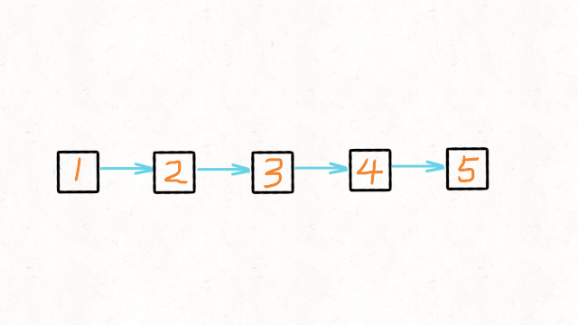

# 九、算法：

## 1.[排序方法](https://juejin.cn/post/7073640285904830471)

### 冒泡排序：

在每次冒泡操作时会比较相邻的两个元素，看是否满足大小关系要求，不满足就将它俩互换。一直迭代到不再需要交换，也就是排序完成。

```
/**
 * 外循环控制需要比较的元素，比如第一次排序后，
最后一个元素就不需要比较了，内循环则负责两两元素比较，将元素放到正确位置上
*/
function bubbleSort(arr) {
    const len = arr.length
    for(let i=0; i<len; i++) {
        for(let j=0;j<len-1-i; j++) {
          // 注意边界值
            if(arr[j] > arr[j+1]){
                [arr[j],arr[j+1]] = [arr[j+1],arr[j]] // 交换位置
            }
        }
    }
    return arr
}

console.log(bubbleSort([3,44,15,36,26,27,2,46,4,19,50,48]))
//[2,3,4,15,19,26,27,36,44,46,48,50]

```

- 时间复杂度: O(n^2)
- 空间复杂度: O(1) 

 

### 选择排序

**时间复杂度O(n^2)** 

首先在待排序序列中选出最小或最大值，存放在排序序列起始位置，然后再从剩余未排序元素中继续寻找最小或最大元素，放到已排序序列末尾。以此类推，直到所有元素均排序完毕。 

```
/**
 * 先假设第一个元素为最小的，然后通过循环找出最小元素，
 * 然后同第一个元素交换，接着假设第二个元素，重复上述操作即可
 */

function selectSort(arr) {
    let len = arr.length, minIndex, tem
    for(let i=0; i<len-1; i++) {
        minIndex = i //最小值下标
        for(let j=i+1; j<len; j++) {
            if(arr[j] < arr[minIndex]){
                // 找出最小值
                minIndex = j //更换最小值下标
            }
        }
        // 交换位置
        tem = arr[i]
        arr[i] = arr[minIndex]
        arr[minIndex] = tem
    }
    return arr
}

console.log(selectSort([3,44,15,36,26,27,2,46,4,19,50,48]))
//[2,  3,  4, 15, 19, 26, 27, 36, 44, 46, 48, 50]

```

 

### 快速排序

**时间复杂度：O(nlogn)** 

- 选择一个参考元素，将列表分割成两个子序列；
- 对列表重新排序，将所有小于基准值的元素放在基准值前面，所有大于基准值的元素放在基准值的后面；
- 分别对较小元素的子序列和较大元素的子序列重复步骤1和2

```
var sortArray = function quickSort(arr) {
    if(arr.length<=1) return arr
    const left = [],right = [],current = arr[0]
    for(let i=1; i<arr.length; i++) {
        if(arr[i]<current) {
            // 小于参考值放左边
            left.push(arr[i]) 
        }else{
            // 否则放右边
            right.push(arr[i])
        }
    }
    //递归上述步骤
    return quickSort(left).concat(current,quickSort(right))
}
```


 

### 插入排序

对于未排序的数据，在已排序的序列中从后往前扫描，找到相应的位置进行插入，保持已排序序列中元素一直有序。 

- 时间复杂度: O(n^2)

```
const insertSort = function(arr) {
    const len = arr.length
    let curr, prev
    for (let i = 1; i < len; i++) {
        curr = arr[i]
        prev = i - 1
        while (prev >= 0 && arr[prev] > curr) {
            arr[prev + 1] = arr[prev]
            prev--
        }
        arr[prev + 1] = curr
    }
    return arr
}
```


 

### 归并排序

将若干有序序列逐步归并，最终归并为一个有序序列。和选择排序一样，归并排序的性能不受输入数据的影响，但表现比选择排序好的多，因为始终都是`O(n log n）`的时间复杂度。 

- 把长度为n的输入序列分成两个长度为n/2的子序列；
- 对这两个子序列分别采用归并排序；
- 将两个排序好的子序列合并成一个最终的排序序列。

```
// 将数组一直等分，然后合并
function merge(left, right) {
    let tem = []
    while(left.length && right.length) {
        if(left[0] < right[0]) {
            tem.push(left.shift())
        }else{
            tem.push(right.shift())
        }
    }
    return tem.concat(left,right)
}
function mergeSort(arr) {
    const len = arr.length
    if(len<2) return arr
    let mid = Math.floor(len / 2), left = arr.slice(0,mid), right = arr.slice(mid)
    return merge(mergeSort(left),mergeSort(right))
}
console.log(mergeSort([3,44,15,36,26,27,2,46,4,19,50,48]))
// [2,  3,  4, 15, 19, 26, 27, 36, 44, 46, 48, 50]

```

 

## 最长公共子前缀

```
var longestCommonPrefix = function(strs) {
    var re = strs[0] ? strs[0]:'';
    for (var i=1;i<strs.length;i++){
        var regex = new RegExp('^'+re);
        while (!regex.test(strs[i])&&re.length){
            re = re.slice(0,re.length-1);
            regex = new RegExp('^'+re);
        }
    }
    return re;
};

链接：https://leetcode.cn/problems/longest-common-prefix/solutions/19106/javascript-zui-chang-gong-gong-qian-zhui-by-rhinoc/ 
```

## [矩形重叠](https://leetcode.cn/problems/rectangle-overlap/)  

**两个互相重叠的矩形，它们在 x轴和 y 轴上投影出的区间也是互相重叠的**。 如果

```
def isRectangleOverlap(self, rec1: List[int], rec2: List[int]) -> bool:
    x_overlap = not(rec1[2] <= rec2[0] or rec2[2] <= rec1[0])
    y_overlap = not(rec1[3] <= rec2[1] or rec2[3] <= rec1[1])
    return x_overlap and y_overlap

作者：nettee
链接：https://leetcode.cn/problems/rectangle-overlap/solutions/155825/tu-jie-jiang-ju-xing-zhong-die-wen-ti-zhuan-hua-we/ 
```

```
var isRectangleOverlap = function(rec1, rec2) {
    const [x1, y1, x2, y2] = rec1;
    const [x3, y3, x4, y4] = rec2;
    return !(x1 >= x4 || x3 >= x2 || y3 >= y2 || y1 >= y4);
};

作者：晨
链接：https://leetcode.cn/problems/rectangle-overlap/solutions/1120871/836-ju-xing-zhong-die-by-chen-wei-f-akdd/ 
```

## [20. 有效的括号](https://leetcode.cn/problems/valid-parentheses/) 

- 栈先入后出特点恰好与本题括号排序特点一致，即若遇到左括号入栈，遇到右括号时将对应栈顶左括号出栈，则遍历完所有括号后 `stack` 仍然为空；

```
 /**
 * @param {string} s
 * @return {boolean}
 */
var isValid = function(s) {
    var stack = [];
    for(var i=0;i<s.length;i++){
        const start = s[i];
        if(start =='('||start =='['||start =='{'){
            stack.push(start);
        }else{
            //end是在栈里边的一个，start是还未入栈的，所以end在前，start在后
            const end = stack[stack.length-1];
            if((end=='('&&start==')')||
            (end=='['&&start==']')||
            (end=='{'&&start=='}')){
                stack.pop();
            }else{
                return false;
            }
        }
    }
    return stack.length==0;
};

作者：lotus
链接：https://leetcode.cn/problems/valid-parentheses/solutions/2747114/you-xiao-de-gua-hao-by-lotus-r3-18lj/ 
```

```
/**
 * @param {string} s
 * @return {boolean}
 */
var isValid = function(s) {
	let len =s.length;
	if(len % 2 !==0 ){
		return false;
	}
 	let length = len / 2;
		for (let i = 0; i < length; i++) {
			s = s.replace("()", "");
			s = s.replace("{}", "");
			s = s.replace("[]", "");
		}

	return s.length === 0;
};

作者：Mr-Wang-Y-P
链接：https://leetcode.cn/problems/valid-parentheses/solutions/2023895/by-mr-wang-y-p-uz6a/
 
```

## [最长连续递增序列](https://leetcode.cn/problems/longest-continuous-increasing-subsequence/) 

解题思路
标签：遍历
过程：
count 为当前元素峰值，ans为最大峰值
初始化 count = 1
从 0 位置开始遍历，遍历时根据前后元素状态判断是否递增，递增则 count++，递减则 count=1
如果 count>ans，则更新 ans
直到循环结束
时间复杂度：O(N)O(N)O(N)

作者：画手大鹏
链接：https://leetcode.cn/problems/longest-continuous-increasing-subsequence/solutions/6699/hua-jie-suan-fa-674-zui-chang-lian-xu-di-zeng-xu-l/

 ```
/**
 * @param {number[]} nums
 * @return {number}
 */
var findLengthOfLCIS =  (nums) => {
    if(nums.length <= 1){
        return nums.length
    }
    let ans = 1
    let count = 1
    for(let i=1;i<nums.length;i++){
        if(nums[i]>nums[i-1]){
            count++
        }else{
            count=1
        }
        ans = ans>count ? ans : count
    }
    return ans
};
 ```


## [最长递增子序列](https://leetcode.cn/problems/longest-increasing-subsequence/) 

动态规划思想


```
/**
 * @param {number[]} nums
 * @return {number}
 */
var lengthOfLIS = function (nums) {
  const dp = new Array(nums.length).fill(1);
  for (let i = 0; i < nums.length; i++) {
    // i与i前面的元素比较
    for (let j = 0; j < i; j++) {
      // 找比i小的元素，找到一个，就让当前序列的最长子序列长度加1
      if (nums[i] > nums[j]) {
        dp[i] = Math.max(dp[i], dp[j] + 1);
      }
    }
  }
  // 找出最大的子序列
  return Math.max(...dp);
};

作者：花花
链接：https://leetcode.cn/problems/longest-increasing-subsequence/solutions/1033432/dong-tai-gui-hua-he-er-fen-cha-zhao-lian-x7dh/ 
```


新建数组 cell，用于保存最长上升子序列。

对原序列进行遍历，将每位元素二分插入 cell 中。

如果 cell 中元素都比它小，将它插到最后
否则，用它覆盖掉比它大的元素中最小的那个。
总之，思想就是让 cell 中存储比较小的元素。这样，cell 未必是真实的最长上升子序列，但长度是对的。

作者：ColdMe
链接：https://leetcode.cn/problems/longest-increasing-subsequence/solutions/13118/zui-chang-shang-sheng-zi-xu-lie-dong-tai-gui-hua-e/ 


```
/**
 * @param {number[]} nums
 * @return {number}
 */
var lengthOfLIS = function (nums) {
    let n = nums.length;
    if (n <= 1) {
        return n;
    }
    let tail = [nums[0]];//存放最长上升子序列数组
    for (let i = 1; i < n; i++) {
        if (nums[i] > tail[tail.length - 1]) {//当nums中的元素比tail中的最后一个大时 可以放心push进tail
            tail.push(nums[i]);
        } else {//否则进行二分查找
            let left = 0;
            let right = tail.length - 1;
            while (left < right) {
                let mid = Math.floor((left + right)/2);
                if (tail[mid] < nums[i]) {
                    left = mid + 1;
                } else {
                    right = mid;
                }
            }
            tail[left] = nums[i];//将nums[i]放置到合适的位置，此时前面的元素都比nums[i]小
        }
    }
    return tail.length;
}; 
```

## [三数之和](https://leetcode.cn/problems/3sum/) 

给定一个包含 `n` 个整数的数组 `nums`，判断 `nums` 中是否存在三个元素 `a` ，`b` ，`c` *，*使得 `a + b + c = 0` ？请找出所有和为 `0` 且 **不重复** 的三元组。 

原理
先将数组进行排序
从左侧开始，选定一个值为 定值 ，右侧进行求解，获取与其相加为 000 的两个值
类似于快排，定义首和尾
首尾与 定值 相加
等于 0 ，记录这三个值
小于 0 ，首部右移
大于 0 ，尾部左移
定值右移，重复该步骤

作者：gitHber
链接：https://leetcode.cn/problems/3sum/solutions/9729/three-sum-giftu-jie-by-githber/

 ```
/**
 * @param {number[]} nums
 * @return {number[][]}
 */
var threeSum = function (nums) {
    // 最左侧值为定值，右侧所有值进行两边推进计算
    let res = [];
    nums.sort((a, b) => a - b);
    let size = nums.length;
    if (nums[0] * nums[size - 1] > 0) {
        return res
    }

    // 保证有正数负数
    let i = 0;
    while (i < size - 2) {
        if (nums[i] > 0) break; // 最左侧大于0，无解
        let first = i + 1;
        let last = size - 1;
        while (first < last) {
            if (nums[i] * nums[last] > 0) break; // 三数同符号，无解
            let sum = nums[i] + nums[first] + nums[last];
            if (sum === 0) {
                res.push([nums[i], nums[first], nums[last]]);
            }
            if (sum < 0) {
                // 负数过小，first右移
                while (nums[first] === nums[++first]) { } // 重复值跳过
            } else {
                while (nums[last] === nums[--last]) { } // 重复值跳过
            }
        }
        while (nums[i] === nums[++i]) { }
    }


    return res;
};

 ```

## [二分查找](https://leetcode.cn/problems/binary-search/) 

```
var search = function (nums, target) {
    let l = 0, r = nums.length

    while (l<=r) {
        let mid = Math.floor((r + l) / 2)
        if(nums[mid]==target){
            return mid
        }else if(nums[mid]>target){
            r = mid-1
        }else{
            l =  mid + 1
        }
    }
    return -1

};
```

## [排序数组](https://leetcode.cn/problems/sort-an-array/)

快速排序


```
var sortArray = function quickSort(arr) {
    if(arr.length<=1) return arr
    const left = [],right = [],current = arr[0]
    for(let i=1; i<arr.length; i++) {
        if(arr[i]<current) {
            // 小于参考值放左边
            left.push(arr[i]) 
        }else{
            // 否则放右边
            right.push(arr[i])
        }
    }
    //递归上述步骤
    return quickSort(left).concat(current,quickSort(right))
}
```

插入排序

```
var sortArray = function sort(arr) {
    let curr ,preindex
    for(let i =1;i<arr.length;i++){
        curr=arr[i];preindex=i-1
        
        for(;preindex>=0;preindex--){
            if(curr>arr[preindex]){
                break
            }else{
                arr[preindex+1] =arr[preindex]
            }
        }
        arr[preindex+1] = curr
    }
    return arr
}
```

归并排序

思想： 分而治之

```
/**
 * @param {number[]} nums
 * @return {number[]}
 */
let merge = (left,right)=>{
    let temp = []
    while(left.length&&right.length){
        if(left[0]>right[0]){
            temp.push(right.shift())
        }else{
            temp.push(left.shift())
        }
    }
    return temp.concat(left,right)
}
var sortArray = function sort(arr) {
    let len = arr.length
    if(len<2){
        return arr
    }
     let mid = Math.floor(len/2)
     let left = arr.slice(0,mid)
     let right = arr.slice(mid)
     return merge(sort(left),sort(right))
}
```

## [移除元素](https://leetcode.cn/problems/remove-element/) 

```
//时间复杂度：O(n)
//空间复杂度：O(1)
var removeElement = (nums, val) => {
    let k = 0;
    for(let i = 0;i < nums.length;i++){
        if(nums[i] != val){
            nums[k++] = nums[i]
        }
    }
    return k;
};

作者：代码随想录
链接：https://leetcode.cn/problems/remove-element/solutions/1689028/by-carlsun-2-fdc4/
 
```

## [有序数组的平方](https://leetcode.cn/problems/squares-of-a-sorted-array/) 

给你一个按 **非递减顺序** 排序的整数数组 `nums`，返回 **每个数字的平方** 组成的新数组，要求也按 **非递减顺序** 排序。 

```
/**
 * @param {number[]} nums
 * @return {number[]}
 */
var sortedSquares = function(nums) {
    let newarr = nums.map(item => item*item )
    return newarr.sort((a,b)=>a-b)
};
```

## [长度最小的子数组](https://leetcode.cn/problems/minimum-size-subarray-sum/) 

给定一个含有 `n` 个正整数的数组和一个正整数 `target` **。**

找出该数组中满足其总和大于等于 `target` 的长度最小的 **连续**子数组`[numsl, numsl+1, ..., numsr-1, numsr]` ，并返回其长度**。**如果不存在符合条件的子数组，返回 `0` 。 

 使用队列相加（实际上我们也可以把它称作是滑动窗口，这里的队列其实就相当于一个窗口）
我们把数组中的元素不停的入队，直到总和大于等于 s 为止，接着记录下队列中元素的个数，然后再不停的出队，直到队列中元素的和小于 s 为止（如果不小于 s，也要记录下队列中元素的个数，这个个数其实就是不小于 s 的连续子数组长度，我们要记录最小的即可）。接着再把数组中的元素添加到队列中……重复上面的操作，直到数组中的元素全部使用完为止。

作者：数据结构和算法
链接：https://leetcode.cn/problems/minimum-size-subarray-sum/solutions/306066/javade-jie-fa-ji-bai-liao-9985de-yong-hu-by-sdwwld/ 

```
/**
 * @param {number} target
 * @param {number[]} nums
 * @return {number}
 */
var minSubArrayLen = function(target, nums) {
    // min 计算最短长度，left左指针，right右指针
    let left=0,right=0,min = nums.length+1,sum=0
    while(right<nums.length){
        sum+=nums[right++]
        while(sum>=target){
            min = Math.min(min,right-left)
            sum-=nums[left++]
        }
    }
    return min==  nums.length+1 ? 0 : min 
};
```

## [螺旋矩阵](https://leetcode.cn/problems/spiral-matrix/) 

给你一个 `m` 行 `n` 列的矩阵 `matrix` ，请按照 **顺时针螺旋顺序** ，返回矩阵中的所有元素。

- 取左边界到右边界，以upper为行，i为列从left到right 将上边界下移++upper
- 取上边界到下边界，以right为列，i为行从upper到down 将右边界左移--right
- 取右边界到左边界，以down为行，i为列从right到left 将下边界上移--down
- 取下边界到上边界，以left为列，i为行从down到upper 将左边界右移++left 

 ```
/**
 * @param {number[][]} matrix
 * @return {number[]}
 */
var spiralOrder = function(matrix) {
 
    let upper=0,left=0,down=matrix.length-1,right=matrix[0].length-1
    let res = new Array()
    while(true){
        for(let i=left;i<=right;i++){
            res.push(matrix[upper][i])
        }
        if(++upper>down) break;
        for(let i=upper;i<=down;i++){
            res.push(matrix[i][right])
        }
        if(--right<left) break;
        for(let i=right;i>=left;i--){
            res.push(matrix[down][i])
        }
        if(--down<upper) break;
         for(let i=down;i>=upper;i--){
            res.push(matrix[i][left])
        }
        if(++left>right) break;
    }
    return res
};
 ```

## [59. 螺旋矩阵 II](https://leetcode.cn/problems/spiral-matrix-ii/) 

```
/**
 * @param {number} n
 * @return {number[][]}
 */
var generateMatrix =   function (n) {
    const matrix = new Array(n);

    // 遍历每一行，创建固定长度的子数组
    for (let i = 0; i < n; i++) {
        matrix[i] = new Array(n);
    }

    let upper = 0, left = 0, down = n - 1, right = n - 1
    let num =1
    while (num<= n*n ) {
        for (let i = left; i <= right; i++) {
            matrix[upper][i] = num++
        }
        if (++upper > down) break;
        for (let i = upper; i <= down; i++) {
            matrix[i][right] =  num++
        }
        if (--right < left) break;
        for (let i = right; i >= left; i--) {
            matrix[down][i] = num++
        }
        if (--down < upper) break;
        for (let i = down; i >= upper; i--) {
            matrix[i][left] = num++
        }
        if (++left > right) break;
    }
    return matrix
};
```

## [合并两个有序数组](https://leetcode.cn/problems/merge-sorted-array/) 

给你两个按 **非递减顺序** 排列的整数数组 `nums1` 和 `nums2`，另有两个整数 `m` 和 `n` ，分别表示 `nums1` 和 `nums2` 中的元素数目。

请你 **合并** `nums2` 到 `nums1` 中，使合并后的数组同样按 **非递减顺序** 排列。

**注意：**最终，合并后数组不应由函数返回，而是存储在数组 `nums1` 中。为了应对这种情况，`nums1` 的初始长度为 `m + n`，其中前 `m` 个元素表示应合并的元素，后 `n` 个元素为 `0` ，应忽略。`nums2` 的长度为 `n` 。

```
标签：从后向前数组遍历
因为 nums1 的空间都集中在后面，所以从后向前处理排序的数据会更好，节省空间，一边遍历一边将值填充进去
设置指针 len1 和 len2 分别指向 nums1 和 nums2 的有数字尾部，从尾部值开始比较遍历，同时设置指针 len 指向 nums1 的最末尾，每次遍历比较值大小之后，则进行填充
当 len1<0 时遍历结束，此时 nums2 中海油数据未拷贝完全，将其直接拷贝到 nums1 的前面，最后得到结果数组
时间复杂度：O(m+n)O(m+n)O(m+n)
 
 const merge = (nums1, m, nums2, n) => {
  let i = nums1.length - 1
  m--
  n--
  while (n >= 0) {
    if (nums1[m] > nums2[n]) {
      nums1[i--] = nums1[m--]
    } else {
      nums1[i--] = nums2[n--]
    }
  }
}
```

## [反转链表](https://leetcode.cn/problems/reverse-linked-list/) 

```
var reverseList = function(head) {
    // 初始化当前结点和前一个结点
    let prev = null, curr = head
    while (curr) {
    // 保存指向的下一个结点
        const next = curr.next
       // 反转箭头
        curr.next = prev
        // 当前结点赋值给pre结点
        prev = curr
        // 当前结点赋值为下一个结点
        curr = next
    }
    return prev
};
 
```


 


## [环形链表](https://leetcode.cn/problems/linked-list-cycle/) 

用JSON.stringify太秀了

作者：晨风
链接：https://leetcode.cn/problems/linked-list-cycle/solutions/716263/shi-chuan-yi-jiu-de-javsscripttian-xiu-j-u8kv/ 

```
var hasCycle = function (head) {
    try {
        JSON.stringify(head)
    } catch{
        return true
    }
    return false
}; 
```

```
const hasCycle = function(head) {
  while (head) {
    if (head.tag) {
      return true;
    }
    head.tag = true;
    head = head.next;
  }
  return false;
};

```

## [合并两个有序链表](https://leetcode.cn/problems/merge-two-sorted-lists/) 

思路
直接用 mergeTwoLists 当作递归函数：

递归边界：如果其中一个链表为空，直接返回另一个链表作为合并后的结果。
如果两个链表都不为空，则比较两个链表当前节点的值，并选择较小的节点作为新链表的当前节点。例如 list1 的节点值更小，那么递归调用 mergeTwoLists(list1.next, list2)，将递归返回的链表接在 list1的末尾。

作者：灵茶山艾府
链接：https://leetcode.cn/problems/merge-two-sorted-lists/solutions/2373691/liang-chong-fang-fa-die-dai-di-gui-pytho-wf75/ 

```
/**
 * Definition for singly-linked list.
 * function ListNode(val, next) {
 *     this.val = (val===undefined ? 0 : val)
 *     this.next = (next===undefined ? null : next)
 * }
 */
/**
 * @param {ListNode} list1
 * @param {ListNode} list2
 * @return {ListNode}
 */
var mergeTwoLists = function(list1, list2) {
    //如果为空这返回空
    if(list1==null) return list2
    if(list2==null) return list1
    if(list1.val <list2.val){
        list1.next = mergeTwoLists(list1.next,list2)
        return list1
    }else{
        list2.next = mergeTwoLists(list2.next,list1)
        return list2
    }
};
```


我们需要做的事情是，让两个链表从同距离末尾同等距离的位置开始遍历。这个位置只能是较短链表的头结点位置。
为此，我们必须消除两个链表的长度差

指针 pA 指向 A 链表，指针 pB 指向 B 链表，依次往后遍历
如果 pA 到了末尾，则 pA = headB 继续遍历
如果 pB 到了末尾，则 pB = headA 继续遍历
比较长的链表指针指向较短链表head时，长度差就消除了
如此，只需要将最短链表遍历两次即可找到位置 

作者：房建斌学算法
链接：https://leetcode.cn/problems/intersection-of-two-linked-lists/solutions/10774/tu-jie-xiang-jiao-lian-biao-by-user7208t/ 

```
/**
 * Definition for singly-linked list.
 * function ListNode(val) {
 *     this.val = val;
 *     this.next = null;
 * }
 */

/**
 * @param {ListNode} headA
 * @param {ListNode} headB
 * @return {ListNode}
 */
var getIntersectionNode = function(headA, headB) {
    if (headA == null || headB == null) return null;
    let pA = headA, pB = headB;
    while (pA != pB) {
        pA = pA == null ? headB : pA.next;
        pB = pB == null ? headA : pB.next;
    }
    return pA; 
    
};
```

或者打标签

```
/**
 * Definition for singly-linked list.
 * function ListNode(val) {
 *     this.val = val;
 *     this.next = null;
 * }
 */

/**
 * @param {ListNode} headA
 * @param {ListNode} headB
 * @return {ListNode}
 */
var getIntersectionNode = function(headA, headB) {
    if (headA == null || headB == null) return null;
    while(headA){
        headA.taga =true
        headA = headA.next
    }
    while(headB){
        if(headB.taga==true){
            return headB
        }
        headB = headB.next
    }
    return null
    
};
```

## [训练计划 II](https://leetcode.cn/problems/lian-biao-zhong-dao-shu-di-kge-jie-dian-lcof/) 


```
/**
 * Definition for singly-linked list.
 * function ListNode(val, next) {
 *     this.val = (val===undefined ? 0 : val)
 *     this.next = (next===undefined ? null : next)
 * }
 */
/**
 * @param {ListNode} head
 * @param {number} cnt
 * @return {ListNode}
 */
var trainingPlan = function(head, cnt) {
    let p = head,q=head
    while (cnt--) p = p.next;
     
    while(p){
        p  = p.next
        q = q.next
    }
    return q

};
```

## [回文链表](https://leetcode.cn/problems/palindrome-linked-list/) 

给你一个单链表的头节点 `head` ，请你判断该链表是否为回文链表。如果是，返回 `true` ；否则，返回 `false` 。 

#### 方法一：转成数组

遍历一遍，把值放入数组中，然后用双指针判断是否回文。时间复杂度O(n)O(n)O(n) ，空间复杂度O(n)O(n)O(n)。

```
const isPalindrome = (head) => {
  const vals = [];
  while (head) {        // 丢进数组里
    vals.push(head.val);
    head = head.next;
  }
  let start = 0, end = vals.length - 1; // 双指针
  while (start < end) {
    if (vals[start] != vals[end]) {     // 理应相同，如果不同，不是回文
      return false;
    }
    start++;
    end--;      // 双指针移动
  }
  return true;  // 循环结束也没有返回false，说明是回文
};

作者：笨猪爆破组
链接：https://leetcode.cn/problems/palindrome-linked-list/solutions/457288/shou-hua-tu-jie-hui-wen-lian-biao-kuai-man-zhi-zhe/ 
```

## [删除排序链表中的重复元素](https://leetcode.cn/problems/remove-duplicates-from-sorted-list/) 

注意是排序链表

```
var deleteDuplicates = function (head) {
    let cur = head
    while (cur && cur.next) {
        if (cur.val == cur.next.val) {
            cur.next = cur.next.next
        } else {
            cur = cur.next
        }

    }
    return head
};
```

## 二叉树遍历

### 前序遍历--递归解法

①访问根结点 ②前序遍历根结点的左子树 ③前序遍历根结点的右子树 

```
/**
 * Definition for a binary tree node.
 * function TreeNode(val, left, right) {
 *     this.val = (val===undefined ? 0 : val)
 *     this.left = (left===undefined ? null : left)
 *     this.right = (right===undefined ? null : right)
 * }
 */
/**
 * @param {TreeNode} root
 * @return {number[]}
 */
 
var preorderTraversal = function (root) {
    let res = [] 
    preorder(root,res)
    return res

}; 
const preorder = (root, res) => {
    if (root === null) return; // 当前结点为空时，无需进行递归
    res.push(root.val); // 记录根节点值
    preorder(root.left, res); // 前序遍历左子树
    preorder(root.right, res); // 前序遍历右子树
} 
```

### 前序遍历-迭代解法

首先我们应该创建一个 Stack 用来存放节点，首先我们想要打印根节点的数据，此时 Stack 里面的内容为空，所以我们优先将头结点加入 Stack，然后打印。

之后我们应该先打印左子树，然后右子树。所以先加入 Stack 的就是右子树，然后左子树。

作者：golandscape
链接：https://leetcode.cn/problems/binary-tree-preorder-traversal/solutions/87526/leetcodesuan-fa-xiu-lian-dong-hua-yan-shi-xbian-2/ 

```
/**
 * Definition for a binary tree node.
 * function TreeNode(val, left, right) {
 *     this.val = (val===undefined ? 0 : val)
 *     this.left = (left===undefined ? null : left)
 *     this.right = (right===undefined ? null : right)
 * }
 */
/**
 * @param {TreeNode} root
 * @return {number[]}
 */
 
var preorderTraversal = function (root) {
    if (!root ) {
		return [];
	}
    const res = [], stk = []
    stk.push(root)
    while(stk.length){
        let node = stk.pop()
        res.push(node.val)
        if(node.right ) stk.push(node.right)
        if(node.left ) stk.push(node.left)
    }
    return res

};  
```

### 中序遍历

递归；①中序遍历根结点的左子树 ②访问根结点 ③中序遍历根结点的右子树。

 ```
/**
 * Definition for a binary tree node.
 * function TreeNode(val, left, right) {
 *     this.val = (val===undefined ? 0 : val)
 *     this.left = (left===undefined ? null : left)
 *     this.right = (right===undefined ? null : right)
 * }
 */
/**
 * @param {TreeNode} root
 * @return {number[]}
 */
var inorderTraversal = function (root) {
    let res = []
    preorder(root, res)
    return res
};
const preorder = (root, res) => {
    if (root === null) return; // 当前结点为空时，无需进行递归
    preorder(root.left, res); // 前序遍历左子树
    res.push(root.val); // 记录根节点值
    preorder(root.right, res); // 前序遍历右子树
} 
 ```

迭代解法

同理创建一个 Stack，然后按 左 中 右的顺序输出节点。
尽可能的将这个节点的左子树压入 Stack，此时栈顶的元素是最左侧的元素，其目的是找到一个最小单位的子树(也就是最左侧的一个节点)，并且在寻找的过程中记录了来源，才能返回上层,同时在返回上层的时候已经处理完毕左子树了。。
当处理完最小单位的子树时，返回到上层处理了中间节点。（如果把整个左中右的遍历都理解成子树的话，就是处理完 左子树->中间(就是一个节点)->右子树）
如果有右节点，其也要进行中序遍历。

作者：golandscape
链接：https://leetcode.cn/problems/binary-tree-preorder-traversal/solutions/87526/leetcodesuan-fa-xiu-lian-dong-hua-yan-shi-xbian-2/ 

```
/**
 * Definition for a binary tree node.
 * function TreeNode(val, left, right) {
 *     this.val = (val===undefined ? 0 : val)
 *     this.left = (left===undefined ? null : left)
 *     this.right = (right===undefined ? null : right)
 * }
 */
/**
 * @param {TreeNode} root
 * @return {number[]}
 */
var inorderTraversal = function (root) {
     if (!root ) {
		return [];
	}
    const res = [], stk = []
 
    while(stk.length || root){
         
        while(root){
            stk.push(root)
            root = root.left
        }
        root = stk.pop()
        res.push(root.val)
        root = root.right
    }
    return res
}; 
```


后序遍历

①后序遍历根结点的左子树 ②后序遍历根结点的右子树 ③访问根结点

## [寻找二叉搜索树中的目标节点](https://leetcode.cn/problems/er-cha-sou-suo-shu-de-di-kda-jie-dian-lcof/) 

 利用前序遍历，然后排序

```
var findTargetNode = function(root, cnt) {
    if (!root ) {
		return [];
	}
    const res = [], stk = []
    stk.push(root)
    while(stk.length){
        let node = stk.pop()
        res.push(node.val)
        if(node.right ) stk.push(node.right)
        if(node.left ) stk.push(node.left)
    }
    res.sort((a,b)=>b-a)
    return res[cnt-1]
 
};
```

或者依据中序遍历的特征

二叉搜索树的中序遍历为递增序列

```
/**
 * Definition for a binary tree node.
 * function TreeNode(val, left, right) {
 *     this.val = (val===undefined ? 0 : val)
 *     this.left = (left===undefined ? null : left)
 *     this.right = (right===undefined ? null : right)
 * }
 */
/**
 * @param {TreeNode} root
 * @param {number} cnt
 * @return {number}
 */
var findTargetNode = function (root, cnt) {
    if (!root) {
        return [];
    }
    const res = [], stk = []

    while (stk.length || root) {

        while (root) {
            stk.push(root)
            root = root.left
        }
        root = stk.pop()
        res.push(root.val)
        root = root.right
    }
    return res[res.length-cnt]
}; 
```

## 求解树的深度

解题思路：
树的遍历方式总体分为两类：深度优先搜索（DFS）、广度优先搜索（BFS）。

常见 DFS ： 先序遍历、中序遍历、后序遍历。
常见 BFS ： 层序遍历（即按层遍历）。
求树的深度需要遍历树的所有节点，本文将介绍基于 后序遍历（DFS） 和 层序遍历（BFS） 的两种解法。

作者：Krahets
链接：https://leetcode.cn/problems/maximum-depth-of-binary-tree/solutions/2361697/104-er-cha-shu-de-zui-da-shen-du-hou-xu-txzrx/ 

**关键点：** 此树的深度和其左（右）子树的深度之间的关系。显然，**此树的深度** 等于 **左子树的深度** 与 **右子树的深度**中的 **最大值**  +1 。

​终止条件： 当 root 为空，说明已越过叶节点，因此返回 深度 000 。
递推工作： 本质上是对树做后序遍历。
​**计算节点 root 的 左子树的深度 ，即调用 maxDepth(root.left)。**
**计算节点 root 的 右子树的深度 ，即调用 maxDepth(root.right)。**

返回值： 返回 此树的深度 ，即 max(maxDepth(root.left), maxDepth(root.right)) **+ 1**。 

### 递归

```
/**
 * Definition for a binary tree node.
 * function TreeNode(val, left, right) {
 *     this.val = (val===undefined ? 0 : val)
 *     this.left = (left===undefined ? null : left)
 *     this.right = (right===undefined ? null : right)
 * }
 */
/**
 * @param {TreeNode} root
 * @return {number}
 */
var maxDepth  = function (root) {
   if(!root){
    return 0;
   }
   return Math.max(maxDepth(root.left),maxDepth(root.right))+1

}; 

```

### 层序遍历

树的层序遍历 / 广度优先搜索往往利用 **队列** 实现。 

```
/**
 * Definition for a binary tree node.
 * function TreeNode(val, left, right) {
 *     this.val = (val===undefined ? 0 : val)
 *     this.left = (left===undefined ? null : left)
 *     this.right = (right===undefined ? null : right)
 * }
 */
/**
 * @param {TreeNode} root
 * @return {number}
 */
var maxDepth = function (root) {
    if (root == null) {
        return 0;
    }
    let queue = [root]
    let deep = 1
    while (queue.length) {
        // 当前层的结点个数
        let len = queue.length
        for (i = 0; i < len; i++) {
            // 获取出队结点
            let cur = queue.shift()
            if (cur.left) queue.push(cur.left)
            if (cur.right) queue.push(cur.right)
        }
        // 还有下一层结点，深度加一
        if (queue.length) deep++

    }
    return deep

}; 


```

## 平衡二叉树

利用一个递归函数求树的深度，在函数中判断是否是非平衡的，如果是返回-1，如果函数不返回-1，则是平衡的

函数内部实现：

 如果左子树不平衡则返回-1；

右子树不平衡则返回-1；

左右子树高度差超过了1 则返回-1，

其他则返回左右子树中深度最大的+1

```
var isBalanced = function(root) {
    const f = (root)=>{
        if(root=== null) return 0;
        const left = f(root.left)
        if(left==-1) return -1
         const right = f(root.right)
        if(right==-1) return -1
        if(Math.abs(right-left)>1) return -1
        return Math.max(left,right)+1
    }
    return f(root) == -1 ? false:true
};
```

## [ 路径总和](https://leetcode.cn/problems/path-sum/) 

给你二叉树的根节点 `root` 和一个表示目标和的整数 `targetSum` 。判断该树中是否存在 **根节点到叶子节点** 的路径，这条路径上所有节点值相加等于目标和 `targetSum` 。如果存在，返回 `true` ；否则，返回 `false`  

**解题思路：**

声明一个变量记录已经经过的节点的值之和，每经过一个节点就加上这个节点的值，在叶子节点判断变量值是否为目标值。 

```
var hasPathSum = function(root, targetSum) {
    if(root==null) return false
    if(root.left==null&&root.right==null){
        // 叶子结点则判断是否为0
        return targetSum-root.val == 0
    }
    // 左右子节点有一个为真也行
    return hasPathSum(root.left,targetSum-root.val) || hasPathSum(root.right,targetSum-root.val)
```

## [226. 翻转二叉树](https://leetcode.cn/problems/invert-binary-tree/) 

 

根据动画图我们可以总结出递归的两个条件如下：

终止条件：当前节点为 null 时返回
再递归的交换当前节点的左节点，递归的交换当前节点的右节点, 交换当前节点的左右节点，

作者：王尼玛
链接：https://leetcode.cn/problems/invert-binary-tree/solutions/73159/dong-hua-yan-shi-liang-chong-shi-xian-226-fan-zhua/ 

```
var invertTree = function(root) {
    if(root==null)
    return null 
    let temp =  invertTree(root.left)
    root.left = invertTree(root.right)
    root.right = temp
    return root
};
```

## [对称二叉树](https://leetcode.cn/problems/symmetric-tree/) 

对称二叉树定义： 对于树中 任意两个对称节点 L 和 R ，一定有：

L.val = R.val ：即此两对称节点值相等。
L.left.val = R.right.val ：即 L  的 左子节点 和  R 的 右子节点 对称。
L.right.val = R.left.val ：即 L  的 右子节点 和  R 的 左子节点 对称。
根据以上规律，考虑从顶至底递归，判断每对左右节点是否对称，从而判断树是否为对称二叉树。

作者：Krahets
链接：https://leetcode.cn/problems/symmetric-tree/solutions/2361627/101-dui-cheng-er-cha-shu-fen-zhi-qing-xi-8oba/ 

```
var isSymmetric = function (root) {
    // 在【100. 相同的树】的基础上稍加改动
    function isSameTree(p, q) {
        if (p === null && q === null) {
            return true;
        }else if(p===null && q!=null){
        // 不对称，所以为假
             return false;
        }else if(q===null && p!=null){
             return false;
        }
        
        return p.val === q.val && isSameTree(p.left, q.right) && isSameTree(p.right, q.left);
    }
    return isSameTree(root.left, root.right);
}; 
```

前三个条件可以压缩为

```
var isSymmetric = function (root) {
    // 在【100. 相同的树】的基础上稍加改动
    function isSameTree(p, q) {
        if (p === null || q === null) {
            return p === q;
        }
        return p.val === q.val && isSameTree(p.left, q.right) && isSameTree(p.right, q.left);
    } 
    return isSameTree(root.left, root.right);
}; 

// 作者： 灵茶山艾府
```

## [二叉树的直径](https://leetcode.cn/problems/diameter-of-binary-tree/) 

```
var diameterOfBinaryTree = function(root) {
    let res = 0
    let dfs = (root)=>{
    	// 到子节点了
        if(root==null) return -1;
        // 计算左右链长度
        let l = dfs(root.left) + 1;
        let r = dfs(root.right) + 1
        res = Math.max(res, l+r)
        // 返回子树的长度
        return Math.max(l,r)
    }
    dfs(root)
    return res
};
```


## [字符串相加](https://leetcode.cn/problems/add-strings/) 

因为本题不能使用任何 BigIntegerBigIntegerBigInteger 库，所以我们可以使用双指针来模拟人工计算，步骤如下：

创建指针 iii 指向 nums1nums1nums1 末位数字，jjj 指向 nums2nums2nums2 末位数字。
iii, jjj 数字相加，用进位就用 carrycarrycarry 来记录进位值，无则为 000。
若产生进位，则当前数字为 (i+j)%10(i+j) \% 10(i+j)%10 的值。
若遍历过程中，nums1nums1nums1 或 nums2nums2nums2 当前已无数字，则用 000 补位来计算。

作者：御三五 🥇
链接：https://leetcode.cn/problems/add-strings/solutions/683866/mo-ni-zi-fu-chuan-xiang-jia-by-demigodli-d5j0/ 

```
var addStrings = function(num1, num2) {
    let i=num1.length-1 , j=num2.length-1
    let carry = 0
    let ans = []
    while(j>=0 || i>=0 || carry!==0){
        let c1 = i>=0 ? +num1.charAt(i--) : 0,
        c2 = j >= 0 ? +num2.charAt(j--)   : 0;
        let sum = c1+c2+carry
        ans.unshift(sum%10)
        carry= Math.floor(sum/10)

    }
    return ans.join('')
};
```

## [多数元素](https://leetcode.cn/problems/majority-element/) 

给定一个大小为 `n` 的数组 `nums` ，返回其中的多数元素。多数元素是指在数组中出现次数 **大于** `⌊ n/2 ⌋` 的元素。 


## 参考博客

https://blog.csdn.net/m0_63230155/category_12426199.html

