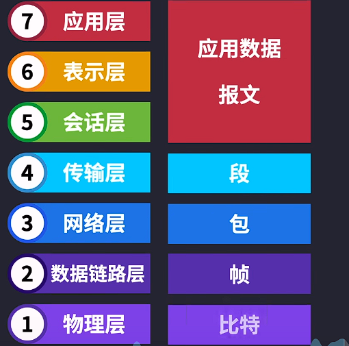
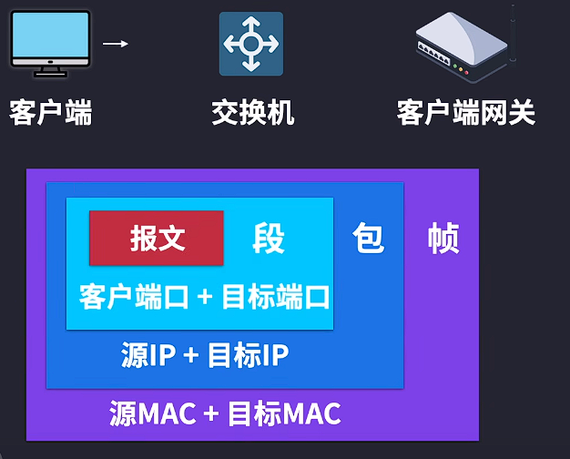
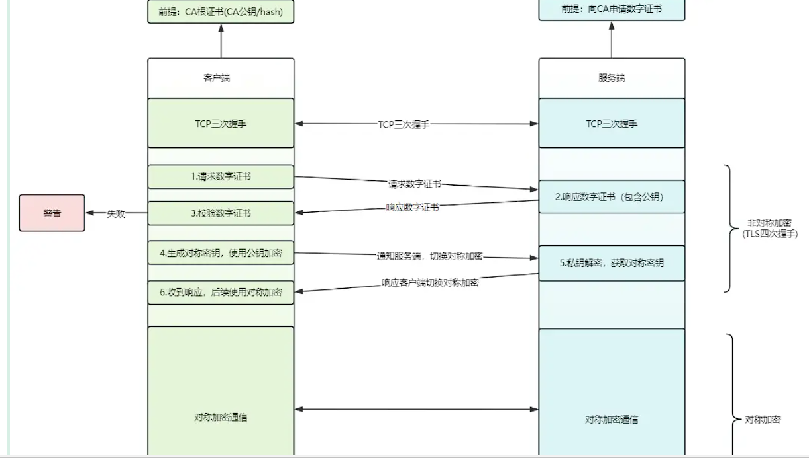

## flex布局

Flexbox 布局也叫 Flex 布局，弹性盒子布局。 

Flex Container的属性有：

- flex-direction，决定主轴的方向
  - flex-direction: row | row-reverse | column | column-reverse; 
- flex-wrap，决定Flex item时候可以换行
  - flex-wrap: nowrap | wrap | wrap-reverse; 
- justify-content，定义了item在主轴上的对齐方式
  - justify-content: flex-start | flex-end | center | space-between | space-around; 
- align-items，定义了item在交叉轴上如何对齐
  - align-items: flex-start | flex-end | center | baseline | stretch; 
- align-content，定义了多根轴线的对齐方式，如果项目只有一根轴线，该属性不起作用
  - align-content: flex-start | flex-end | center | space-between | space-around | stretch; 

对于项目布局

- order: 数值越小，排序越前
  - flex-grow: <number>; /* default 0 */ 
- flex-grow: 拉伸布局
- flex-shrink: 收缩布局
- flex: 结合order 、grow、 shrink布局
- flex-basis: 基本布局
  - flex-basis: <length> | auto; /* default auto */ 
- aligin-self: 布局

适用场景：弹性布局适合于移动前端开发、两栏三栏自适应布局 。 


## apply，call,bind区别

都是js中函数原型上的方法，用于设置函数执行时的上下文

- `call`：`call`方法允许调用一个函数，也允许指定函数内部的`this`值，它接收一个参数列表，第一个参数是`this`指向对象
- `Apply`：与call方法类似，但它接收的是一个参数数组而不是列
- `Bind`: call与apply都用于立即执行一个函数，但是bind不会立即调用函数，而是创建一个新函数，新函数被调用时它的this会被设置为bind方法的第一个参数


## 设置隐藏元素的方法

1. `display: none;`：元素会被完全移除，不再占据空间，也不可交互。
2. `visibility: hidden;`：元素不可见，但仍然占据原来的空间，不可交互。
3. `opacity: 0;`：元素不可见，但仍然占据空间，视情况可能可交互。
4. 负z-index：将元素放置在视觉层次结构的背后，使其不可见，但仍然占据空间，可交互。
5. `position: absolute;` 配合 `left: -9999px;` 或 `top: -9999px;`：将元素移出视口，使其不可见，但仍然占据空间，可交互。
6. `width: 0; height: 0; overflow: hidden;`：将元素的尺寸设置为0，使其不可见，但仍然占据空间，不可交互。

## 可迭代和不可迭代

可迭代对象（iterable object）：可以使用`for of` 进行遍历的对象，就称为可迭代的 ，是系统内置实现了`Symbol.iterator`迭代器方法。 对象成员可以遍历，是因为该对象实现了Symbol.iterator 方法

类数组的本质其实也很简单，就是那些具有数值索引和`length`属性的对象。不过在实际工作中，有很多对象它即是类数组，又是可迭代的。比如字符串（for..of 对它们有效，并且有数值索引和 length 属性）。 

`Array.from`我们常用来将一个类数组对象转换为真正的数组。其实它还可以将可迭代对象也转换为数组。 


## JS执行上下文：

执行上下文是JavaScript代码执行环境的抽象概念，**执行上下文可以看作是一个环境，其中包含了当前代码的变量、函数、this 指向等信息。**

> 但要注意执行上下文与作用域的区别：作用域指的是变量、函数和对象在代码中可访问的范围。它定义了变量的可见性和生命周期。作用域规定了在何处以及如何查找变量。
>
> 可以说执行上下文是为了实现作用域而存在的一种机制，但它们并不是完全等同的概念。

 

### 执行上下文的类型

- **全局执行上下文**

  这是默认或者说基础的上下文，任何不在函数内部的代码都在全局上下文中。一个程序中只会有一个全局执行上下文。

- **函数执行上下文**

  - 每当一个函数被调用时, 函数体内的代码会被编译，并创建一个新的函数执行上下文。函数执行结束之后，一般情况下，创建的函数执行上下文也会随之被销毁。每个函数都有它自己的执行上下文，不过是在函数被调用时创建的。函数上下文可以有任意多个。

- eval上下文

  

  

 js执行到一个函数时，会创建执行上下文， 而执行上下文存放在一种名为栈的数据结构中，执行上下文栈用来管理执行上下文，即执行栈。 

[观看视频](https://www.bilibili.com/video/BV1Gr4y1b7PT/)


## 数组转树

1.先找出一级目录(即pid为空字符串的元素)

2.根据一级目录的id找到和一级目录id一样的元素,这是二级目录

3.把二级目录的元素数组作为一级目录的children属性

4.重复根据二级目录的id找到和二级目录id一样的元素,这是三级目录

5.把三级目录的元素数组作为二级目录的children属性

.....(递归实现)

 

作者：风无雨
链接：https://juejin.cn/post/7154000686986821662 

```
// 数组转树的封装函数
function array2Tree(arr,pid){
// (1)筛选出pid相同的数组元素怒
const tree =arr.filter( item => item.pid === pid)
// (2)对筛选出的tree数组增加children数组,调用本函数递归
tree.forEach(item => {
    item.children = array2Tree(arr,item.id)
})
// (3)返回数组tree
return tree
}

```


## 最长递增子序列


## 二分排序(快速排序)


## CSS动画，动画渲染的方法


## TCP/IP 五层协议

- TCP的五层结构体系分成了从上到下分别是:应用层、传输层、网络层、数据链路层、物理层

物理层就是负责在网络设备之间传输原始比特流 

数据链路层它负责将物理层传输的原始比特流组合成数据帧，并在相邻节点之间进行无差错的帧传输。 

网络层是TCP/IP五层模型中的第三层，它负责将数据包从源主机传输到目标主机。网络层通过路由选择算法，确定数据包在网络中的最佳路径，并确保数据包能够可靠地到达目标地址。 

传输层是TCP/IP五层模型中的第四层，负责提供端到端（即进程到进程）的通信服务。它确保数据在发送方和接收方之间可靠、有序地传输。 段就是传输层里数据 的名字

应用层协议定义了应用程序之间通信的规则和格式，确保不同应用程序能够相互理解和交换信息。 


流程：客户端要发送数据也就是报文，报文来到传输层，加上端口号，封装成段，段来到网络层，加上IP地址，封装成包，包来到数据链路层，加上MAC地址封装成帧





## 堆，栈的概念

**堆**通常是一个可以被看做一棵树的数组对象。堆总是满足下列性质：

- 堆中某个节点的值总是不大于或不小于其父节点的值；
- 堆总是一棵完全二叉树。

将根节点最大的堆叫做最大堆或大根堆，根节点最小的堆叫做最小堆或小根堆。

**栈**作为一种[数据结构](https://baike.baidu.com/item/%E6%95%B0%E6%8D%AE%E7%BB%93%E6%9E%84)，是一种只能在一端进行插入和删除操作的特殊[线性表](https://baike.baidu.com/item/%E7%BA%BF%E6%80%A7%E8%A1%A8)。它按照先进后出的原则存储数据，先进入的数据被压入栈底，最后的数据在栈顶，需要读数据的时候从栈顶开始弹出数据 

## 链表和数组有什么区别

链表是链式的存储结构；数组是顺序的存储结构。 链表通过指针来连接元素与元素，数组则是把所有元素按次序依次存储。 链表的插入删除元素相对数组较为简单，不需要移动元素，且较为容易实现长度扩充，但是寻找某个元素较为困难；数组寻找某个元素较为简单，但插入与删除比较复杂，由于最大长度需要再编程一开始时指定，故当达到最大长度时，扩充长度不如链表方便。

   **相同：**两种结构均可实现数据的顺序存储，构造出来的模型呈线性结构。 

## 排序算法


## 时间复杂度概念

算法的*时间复杂度是*一个函数，它定性描述该算法的运行时间 ，时间复杂度通常用大写字母“O”表示 

例如O(f(n))。这个符号用来表示算法的时间复杂度，它给出了算法时间增长的上界。当输入数据的规模（通常表示为“n”）增大时，算法执行时间的增长率与f(n)的增长率成正比。 常见的时间复杂度量级包括常数阶O(1)、线性阶O(n)、平方阶O(n²)、对数阶O(log n)和指数阶O(2^n)等 

## 面向对象的优势

1.重用性利于开发速度，如果你想开发某个功能发现他实现起来很麻烦，这个时候有另一技术能很好的解决时其优势就发挥出来了

2.封装性/抽象性:结构清晰，很标准，规范化，易于理解，可读性更强

3.继承，容易扩展

## 多态

多态就是多种形态，具体点就是去完成某个行为，当不同的对象去完成时会产生出不同 的状态。 

在java中要实现多态，必须要满足如下几个条件，缺一不可： 1. 必须在继承体系下 2. 子类必须要对父类中方法进行重写 3. 通过父类的引用调用重写的方法 

多态可以实现简化代码、可扩展性、可复用性

## 对称加密和非对称加密结合



[参考](https://juejin.cn/post/7357917500962717706) 


## cookie session区别

Cookie是存储在客户端（用户浏览器）的**小块数据**，可以用来记住用户的相关信息，例如登录凭证或偏好设置。它们随每个HTTP请求发送给服务器，并且可以被服务器读取以维持会话或个性化用户体验。 

- **session 是另一种记录服务器和客户端会话状态的机制**
- **session 是基于 cookie 实现的，session 存储在服务器端，sessionId 会被存储到客户端的cookie 中**

Token 是访问资源接口（API）时所需要的资源凭证， 是一种无状态认证形式，客户端拥有一个**令牌**，通常是一串字符串，用于认证向服务器的请求。Token不要求服务器跟踪用户的状态，因为所有必要的信息都编码在令牌本身中。 


