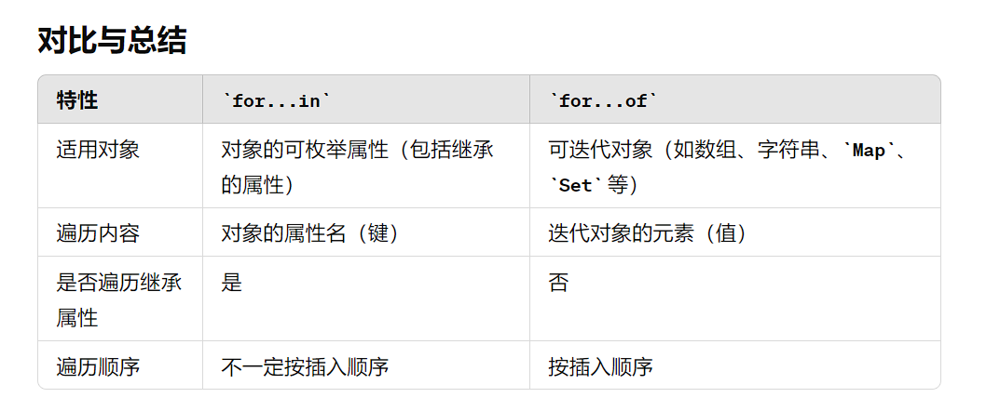

# **HTML**

1.HTML5新特性、介绍一下语义化以及语义化的优点

1. **新的语义标签**：
   - `<header>`：定义页面或部分内容的头部。
   - `<nav>`：定义导航链接部分。
   - `<section>`：定义文档中的章节。
   - `<article>`：定义独立的内容区域。
   - `<aside>`：定义侧边栏内容。
   - `<footer>`：定义页面或部分内容的底部。
2. **表单改进**：
   - 新的输入类型，如`<input type="email">`、`<input type="date">`、`<input type="number">`等，简化了表单数据的验证和输入。
   - `<datalist>`：提供输入建议的下拉列表。
   - `<output>`：用于显示计算结果。
3. **多媒体标签**：
   - `<audio>`：用于嵌入音频内容。
   - `<video>`：用于嵌入视频内容。
   - 这些标签支持多个来源和格式，以及内建的控制（播放、暂停、音量等）。
4. **图形和嵌入内容**：
   - `<canvas>`：用于绘制图形，通过JavaScript来实现动态内容。
   - `<svg>`：用于定义矢量图形，支持可伸缩性和高质量图像。
5. **本地存储**：
   - `localStorage`：允许在用户浏览器中存储大量数据，数据不会随浏览器关闭而失。
   - `sessionStorage`：类似于`localStorage`，但数据仅在当前会话中有效。
6. **离线和客户端存储**：
   - 应用程序缓存（AppCache）：允许Web应用在没有网络连接时也能运行（尽管现已逐渐被Service Workers取代）。
7. **WebSocket**：
   - 提供了全双工通信协议，有效地支持实时数据通信，适用于在线聊天、游戏等应用。
8. **地理定位**：
   - `Geolocation API`：允许Web应用获取用户的地理位置信息（需要用户许可）。
9. **拖放API**：
   - 允许元素在页面中进行拖放操作，提供了更直观的用户交互体验。
10. **微数据（Microdata）**：
    - 提供了一种嵌入机器可读数据的方法，帮助搜索引擎更好地理解和展示页面内容。

2.输入url后发生了哪些操作、什么是强制缓存和协商缓存

# **CSS**

1.css盒模型

2.css样式优先级算法

3.flex布局、flex常用属性、flex:1包含哪些属性

4.两栏布局、水平垂直居中   **要掌握多种实现方式**

5.怎么理解文档流？介绍块级元素、行内块元素、行内元素以及三者之间如何相互转换、对每种类型元素分别举几个例子；他们之间的嵌套规则是怎么样的？

 文档流（Document Flow）是指HTML文档中元素按顺序排列和显示的默认方式。浏览器根据文档流来计算和渲染元素的位置和布局。理解文档流有助于控制网页的布局和样式。 

```
元素类型

块级元素（Block-level Elements）
定义：块级元素通常占据其父容器的整个宽度，独占一行，并且会在其前后自动添加换行。
示例：
<div>：常用作容器，包含其他元素。
<p>：段落元素。
<h1> - <h6>：标题元素。
<ul>、<ol>、<li>：列表及列表项。
特点：
宽度默认占满父容器的全部。
可以包含其他块级元素和行内元素。

行内元素（Inline Elements）
定义：行内元素只占据其内容的空间，不会独占一行，多个行内元素可以在同一行内排列。
示例：
<span>：常用作文本内的容器。
<a>：链接元素。
<strong>：加粗文本。
<em>：斜体文本。
特点：
只占据内容所需的宽度。
不能包含块级元素，但可以包含其他行内元素和文本内容。

行内块元素（Inline-block Elements）
定义：行内块元素表现为行内元素，但可以设置宽度和高度，不会自动换行。
示例：
：图片元素。
<input>：表单输入元素。
<button>：按钮元素。
特点：
占据内容所需的宽度，但可以通过CSS设置宽度和高度。
不会自动换行，多个行内块元素可以在同一行内排列。
```


6.什么是伪元素和伪类

7.什么是BFC、BFC的特性有哪些、怎么设置一个元素成为BFC

8.css实现动画的属性，transfrom和animation有什么区别

9.重绘和重排

## 10.移动端适配(这个被字节面试官狠狠拷打了)

移动端适配是指在不同尺寸的设备上提供良好的用户体验和界面展示，通常称为响应式设计。以下是实现移动端适配的关键步骤和技术：

1. 使用视口（Viewport）meta标签

视口meta标签是HTML文档中最基础的一步，确保浏览器正确调整页面尺寸。

```

<head>
  <meta name="viewport" content="width=device-width, initial-scale=1.0">
</head>
```

2. 使用媒体查询（Media Queries）

媒体查询是CSS中的一种技术，用于根据设备的特性（如宽度、高度、分辨率等）应用不同的样式。

```

/* 基础样式 */
body {
  font-size: 16px;
}

/* 屏幕宽度小于600px时应用的样式 */
@media (max-width: 600px) {
  body {
    font-size: 14px;
  }

  .container {
    padding: 10px;
  }
}

/* 屏幕宽度在600px到1200px之间时应用的样式 */
@media (min-width: 600px) and (max-width: 1200px) {
  body {
    font-size: 15px;
  }

  .container {
    padding: 20px;
  }
}
```

3. 使用弹性和流式布局

通过使用百分比、`vh`、`vw`等单位代替固定的像素值，可以创建更灵活的布局。

```
 
.container {
  width: 80%; /* 使用百分比 */
  padding: 5%; /* 使用百分比 */
  margin: 0 auto; /* 居中对齐 */
}

.full-height {
  height: 100vh; /* 使用视口高度 */
}
```

4. 弹性盒模型（Flexbox）和网格布局（CSS Grid）

Flexbox和Grid是现代CSS布局的强大工具，特别适用于响应式设计。

**Flexbox示例**：

```

.container {
  display: flex;
  flex-direction: row;
  flex-wrap: wrap;
}

.item {
  flex: 1 1 100px; /* 弹性项目 */
  margin: 10px;
}
```

**Grid示例**：

```

.container {
  display: grid;
  grid-template-columns: repeat(auto-fit, minmax(200px, 1fr));
  gap: 10px;
}

.item {
  background: #ccc;
  padding: 20px;
}
```

5. 使用响应式图片

通过`<picture>`元素和`srcset`属性，根据设备的分辨率加载不同尺寸的图片，优化加载速度和显示效果。

```

<picture>
  <source srcset="small.jpg" media="(max-width: 600px)">
  <source srcset="medium.jpg" media="(max-width: 1200px)">
  
</picture>
```

6. 触摸优化

确保按钮、链接等交互元素适合触摸操作，通常应有较大的点击区域和适当的间距。

```

button, a {
  padding: 10px 20px; /* 增大点击区域 */
  touch-action: manipulation; /* 优化触摸反馈 */
}
```

7. 流式文本

使用相对单位（如`em`和`rem`）设置字体大小，确保文本在不同设备上保持可读性。

```

body {
  font-size: 1rem; /* 基于根元素的字体大小 */
}

h1 {
  font-size: 2rem; /* 两倍于根元素的字体大小 */
}
```

8. 测试和调试

在实际设备上测试你的设计，确保在各种屏幕尺寸和分辨率下都能正常显示。可以使用浏览器的开发者工具模拟不同设备。

通过结合这些技术和最佳实践，你可以创建在各种设备上都具备良好用户体验的响应式网页设计。

## 11.手写一些布局

# **js**

1.js数据类型、基本数据类型和引用数据类型分别存放在哪里？

2.typeof和intanceof判断元素类型有什么区别？

3.原型以及原型链(滴滴面试官根据这个问了如何判断**某个属性是否属于自身**)

4.let const var有什么区别，**var结合作用域的代码输出面试题很常见**

5.事件循环、**事件循环的代码输出题也很常见**

6.什么是闭包、闭包作用、闭包会带来哪些问题

7.防抖和节流以及防抖节流使用场景、实现防抖和节流函数

## 8.es6有哪些新特性(**es6中proxy，这个也被字节面试官拷打了**)


## 9.map 和 object的区别，set集合中判断元素重复的方式是什么？

1.键的类型：Object中键的类型只能是字符串，符号**(Symbol)** ，整数，在Map中键的类型可以是任何类型的值，包括对象
2.插入顺序：在Map中，键的插入顺序会被保留
3.大小：Map可以用size属性来获取，Object只能手动计算
4.迭代：Map支持for of 循环和forEach，Object只能有for in，并且需要判断属性是否是自身属性而不是继承属性
5.性能：在频繁增删键值对的场景下，Map的性能更好


## 10.for...in和for...of区别




11.普通函数和箭头函数区别，箭头函数可以当构造函数吗

12.创建对象时new操作符都干了什么，构造函数里写返回值有什么影响吗

13.this指向，如何改变this指向，实现call、apply、bind函数(**推荐大家去看黑马的面试视频，我觉得这是全网最简便写法)**

14.直接赋值、深拷贝和浅拷贝    实现深拷贝函数

15.es5继承和es6继承   组合式继承和寄生组合式继承

16.js实现异步都有哪些方法，async和await

17.判断相等有哪些方式，==和===有什么区别

## 18.Ajax、axios、fetch区别

Ajax 是一种通过 JavaScript 发送异步 HTTP 请求的技术，通过 XMLHttpRequest 对象与服务器进行通信，实现页面的局部更新。

axios 是一个基于 Promise 的 HTTP 客户端，提供了丰富的功能和易用的 API，适用于浏览器和 Node.js 环境。

fetch 是 JavaScript 的原生 API，用于发起网络请求，支持现代浏览器，使用 Promise 处理响应。

## 19.经常用到Promise哪些方法

## 20.localStroage、sessionStroage、cookie区别

## 21.浏览器的垃圾回收机制（**V8也要介绍**）

## 22.数组有哪些方法  

重点: map方法(map中不写return会怎么样？)、filter方法、reduce方法、Array.from方法

**git**

## 1.一般上传代码有什么流程

## 2.拉代码指令

## 3.合并代码指令

## 4.推送代码指令

## 5.怎么回退代码

## 6.rebase和merge区别

**webpack**

1.修改过哪些配置？

2.plugin和loader区别

**react**

1.react设计理念

2.怎么样理解单向数据流

3.经常使用哪些勾子函数

4.useState和useRef区别   useState和useReducer

5.useCallback、useMemo、memo

6.useEffect中写return了有什么作用，第一个参数可以是异步的吗

7.条件语句里可以写hooks吗

8.函数柯里化

9.react组件通信方式

10.react中diff算法，key的作用

11.手写一个count组件，实现自增，自减的方法

12.自定义hook有什么作用

13.函数式组件和类组件有什么区别、它们的使用场景

14.新旧生命周期对比

**其他**

## 1.进程和线程理解

## 2.数据结构中排序方法有哪些

## 3.时间复杂度和空间复杂度概念

## 4.介绍一下动态规划算法

## 5.什么是深度遍历和广度遍历

## 6.SQL相关指令

## 7.浏览器开发者模式面板中常用的功能，http请求常见的请求头和响应头有哪些

常见的 HTTP 请求头和响应头如下：

请求头（Request Headers）

1. **Accept**：指定客户端能够接收的内容类型。
2. **Accept-Encoding**：指定客户端能够接收的内容编码方式（如 gzip、deflate）。
3. **Content-Type**：指定发送给服务器的实体数据的类型。
4. **User-Agent**：标识客户端的软件应用类型、操作系统、软件开发者等信息。
5. **Authorization**：用于身份验证的凭据，常见的方式有基本认证（Basic Authentication）和 Bearer Token 认证。
6. **Cookie**：包含客户端发送给服务器的 Cookie 信息。
7. **Cache-Control**：控制缓存行为，指定请求/响应应该如何被缓存。
8. **Referer**：包含当前页面的来源 URL，用于标识请求的来源。
9. **Origin**：指示发起请求的域的源。
10. **Host**：指定被请求资源的主机名和端口号。

响应头（Response Headers）

1. **Content-Type**：指定响应的实体数据的类型。
2. **Content-Length**：指示响应的实体主体的大小（以字节为单位）。
3. **Cache-Control**：控制缓存行为，指定请求/响应应该如何被缓存。
4. **Expires**：指定响应的过期时间。
5. **Set-Cookie**：服务器在响应中发送的一个或多个 Cookie。
6. **Location**：指定重定向的 URL。
7. **Server**：指定响应的服务器软件信息。
8. **WWW-Authenticate**：用于身份验证的挑战信息，指示客户端应该如何提供身份验证凭据。
9. **Access-Control-Allow-Origin**：指定允许访问该资源的来源。
10. **Access-Control-Allow-Methods**：指定允许访问该资源的 HTTP 方法。

这些是常见的 HTTP 请求头和响应头，它们在客户端和服务器之间进行通信，控制着 HTTP 请求和响应的行为。

## 8.tcp三次握手，序列号和确认序列号有什么作用

## 9.如何预防xss攻击

**遇到的算法题**

1.合并两个有序数组，保证数组仍然是有序的

2.如何删除链表倒数第n个节点

3.两数之和，不能使用两层for循环

4.删除数组中重复的元素，例如['h','e','l','l','o','w','o','r','l','d']，删除'l'，用双指针

5.数组去重多种方式，去重之后如何随机打乱数组

6.二分查找、冒泡排序、快速排序

7.输出数组中没有出现过的最小正整数

8.数组扁平化

 

 

 

https://www.nowcoder.com/discuss/610511730900250624?anchorPoint=comment

 