项目技术

项目功能介绍：


### 1 项目前端技术

+ vue3框架：采用vue框架最新版本，组合式API形式开发项目

+ element-plus：UI组件库

+ vite：构建化工具

+ axios：网络交互

+ vue-router：采用vue-router最新版本管理路由

+ echarts: 数据可视化大屏

+ TypeScript：TypeScript技术栈

+ pinia: 集中式管理状态

  

### 2 项目功能介绍

- 首页
- 权限管理页面
  - 用户管理
  - 角色管理
  - 菜单管理
- 商品管理
    - 品牌管理
    - 属性管理
    - SPU管理
    - SKU管理

### 3 项目技术亮点

+ 规范化开发项目(eslint、prettier、stylelint、husky、commitlin、统一包管理器）
+ 封装后台管理系统模板
+ 菜单权限与按钮权限
+ 数据大屏
+ 请求响应拦截器二次封装
+ svg矢量图，主题颜色切换，暗黑模式


### 4 页面实现

#### 后端接口请求

1. ##### 域名服务器配置

   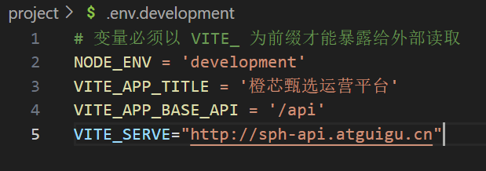

2. ##### vite.config.ts 代理跨域

   ```
   import { loadEnv } from 'vite'
   //....
   export default defineConfig(({ command, mode }) => {
     //获取各种环境下的对应的变量
     let env = loadEnv(mode, process.cwd())
     return {
       //代理跨域 省略其他
       server: {
         proxy: {
           [env.VITE_APP_BASE_API]: {
             //获取数据服务器地址的设置
             target: env.VITE_SERVE,
             //需要代理跨域
             changeOrigin: true,
             //路径重写
             rewrite: (path) => path.replace(/^\/api/, ''),
           },
         },
       },
     }
   })
   
   ```

3. ##### 封装request请求

   axios 二次 封装接口

   + 利用axios对象的create方法,去创建axios实例(其他的配置:基础路径、超时的时间)
   + 第二步:request实例添加请求拦截器(request.interceptors.request.use)
     + 获取仓库内部token,登录成功以后携带给服务器(config.headers.token  )
   + 第三步:request实例添加响应拦截器(request.interceptors.response.use)
     + 成功回调,返回响应数据
     + 失败回调:处理http网络错误的信息[(状态码status有哪些)](https://juejin.cn/post/7283459207696973839)
   + 对外暴露request实例

   ```
   //进行axios二次封装:使用请求与响应拦截器
   import axios from 'axios'
   import { ElMessage } from 'element-plus'
   //引入用户相关的仓库
   import useUserStore from '@/store/modules/user'
   //第一步:利用axios对象的create方法,去创建axios实例(其他的配置:基础路径、超时的时间)
   const request = axios.create({
     //基础路径
     baseURL: import.meta.env.VITE_APP_BASE_API, //基础路径上会携带/api
     timeout: 5000, //超时的时间的设置
   })
   //第二步:request实例添加请求与响应拦截器
   request.interceptors.request.use((config) => {
     //获取用户相关的小仓库:获取仓库内部token,登录成功以后携带给服务器
     const userStore = useUserStore()
     if (userStore.token) {
       config.headers.token = userStore.token
     }
     //config配置对象,headers属性请求头,经常给服务器端携带公共参数
     //返回配置对象
     return config
   })
   
   //第三步:响应拦截器
   request.interceptors.response.use(
     (response) => {
       //成功回调
       //简化数据
       return response.data
     },
     (error) => {
       //失败回调:处理http网络错误的
       //定义一个变量:存储网络错误信息
       let message = ''
       //http状态码
       const status = error.response.status
       switch (status) {
         case 401:
           message = 'TOKEN过期'
           break
         case 403:
           message = '无权访问'
           break
         case 404:
           message = '请求地址错误'
           break
         case 500:
           message = '服务器出现问题'
           break
         default:
           message = '网络出现问题'
           break
       }
       //提示错误信息
       ElMessage({
         type: 'error',
         message,
       })
       return Promise.reject(error)
     },
   )
   //对外暴露
   export default request
   
   ```

   token设置 、获取、移除的方法

   ```
   localStorage.setItem('TOKEN', token)
   
   localStorage.getItem('TOKEN')
   
   localStorage.removeItem('TOKEN')
   ```

   

4. ##### api请求数据:示例

   ```
   // (src\api\user\index.ts )
   //统一管理项目用户相关的接口
   import request from '@/utils/request'
   
   //项目用户相关的请求地址
   enum API {
     LOGIN_URL = '/admin/acl/index/login',
     USERINFO_URL = '/admin/acl/index/info',
     LOGOUT_URL = '/admin/acl/index/logout',
   }
   //对外暴露请求函数
   //登录接口方法
   export const reqLogin = (data: any) => {
     return request.post<any, any>(API.LOGIN_URL, data)
   }
   
   //获取用户信息接口方法
   export const reqUserInfo = () => {
     return request.get<any, any>(API.USERINFO_URL)
   }
   
   //退出登录
   export const reqLogout = () => {
     return request.post<any, any>(API.LOGOUT_URL)
   }
   
   ```

5. ##### 接口调用:示例

   ```
   //引入接口
   import { reqLogin, reqUserInfo, reqLogout } from '@/api/user'
   // 使用
   ```

   知识点:[同步,异步](https://juejin.cn/post/6844903855084290056)  ,[async/await：用同步的方式去写异步代码](async/await：用同步的方式去写异步代码)


页面结构与功能点：

#### 1 登录

业务逻辑：

+ 通知仓库发起请求
+ 请求成功，则路由跳转(看路由中是否有参数，如果有则跳转到请求页面，否则跳转主页面)
+ 请求失败，提示失败信息

```js
const login =  () => {
  //点击登录按钮以后干什么
  //通知仓库发起请求
  //请求成功->路由跳转
  //请求失败->弹出登陆失败信息
}
```


仓库store初始化 ：

+ 安装pinia: `pnpm i pinia@2.0.34 `
+ 定义大仓库，并且引入
+ 定义用户相关的小仓库
+ 登录页面调用

```
//仓库大仓库
import { createPinia } from 'pinia'
//创建大仓库
const pinia = createPinia()
//对外暴露：入口文件需要安装仓库typescript
```

```
//main.ts引入仓库
import pinia from './store'
//安装仓库
app.use(pinia)
```

```
//创建用户相关的小仓库
import { defineStore } from 'pinia'
//引入接口
import { reqLogin } from '@/api/user'
//引入数据类型
import type { loginForm } from '@/api/user/type'
//创建用户小仓库
const useUserStore = defineStore('User', {
  //小仓库存储数据地方
  state: () => {
    return {
      token: localStorage.getItem('TOKEN'), //用户唯一标识token
    }
  },
  //处理异步|逻辑地方
  actions: {
    //用户登录的方法
    async userLogin(data: loginForm) {
      //登录请求
      const result: any = await reqLogin(data)
      if (result.code == 200) {
        //pinia仓库存储token
        //由于pinia|vuex存储数据其实利用js对象
        this.token = result.data.token
        //本地存储持久化存储一份
        localStorage.setItem('TOKEN', result.data.token)
        //保证当前async函数返回一个成功的promise函数
        return 'ok'
      } else {
        return Promise.reject(new Error(result.data.message))
      }
    },
  },
  getters: {},
})
//对外暴露小仓库
export default useUserStore

```

```
//引入用户相关的小仓库
import useUserStore from "@/store/modules/user";

//登录按钮回调
const login = async () => {
  //保证全部表单相校验通过再发请求
  await loginForms.value.validate();
  //加载效果:开始加载
  loading.value = true;
  //点击登录按钮以后干什么?
  //通知仓库发登录请求
  //请求成功->首页展示数据的地方
  //请求失败->弹出登录失败信息
  try {
    //保证登录成功
    await useStore.userLogin(loginForm);
    //编程式导航跳转到展示数据首页
    //判断登录的时候,路由路径当中是否有query参数，如果有就往query参数挑战，没有跳转到首页
    let redirect: any = $route.query.redirect;
    $router.push({ path: redirect || '/' });
    //登录成功提示信息
    ElNotification({
      type: 'success',
      message: '欢迎回来',
      title: `HI,${getTime()}好`
    });
    //登录成功加载效果也消失
    loading.value = false;
  } catch (error) {
    //登录失败加载效果消息
    loading.value = false;
    //登录失败的提示信息
    ElNotification({
      type: 'error',
      message: (error as Error).message
    })
  }
}
```


#### 2 注册


#### 3 首页

+ 集成sass 环境

配置sass全局变量 : src\styles\variable.scss 

```
//左侧菜单宽度
$base-menu-width :260px;
//左侧菜单背景颜色
$base-menu-background: #001529;

//顶部导航的高度
$base-tabbar-height:50px;
```

主界面的静态页面结构

```
<!-- 结构 -->
<template>
  <div class="layout_container">
    <!-- 左侧菜单 -->
    <div class="layout_slider"></div>
    <!-- 顶部导航 -->
    <div class="layout_tabbar"></div>
    <!-- 内容展示区域 -->
    <div class="layout_main">
      <p style="height: 1000000px"></p>
    </div>
  </div>
</template>

<script setup lang="ts"></script>

<style lang="scss" scoped>
.layout_container {
  width: 100%;
  height: 100vh;
  .layout_slider {
    width: $base-menu-width;
    height: 100vh;
    background: $base-menu-background;
  }
  .layout_tabbar {
    position: fixed;
    width: calc(100% - $base-menu-width);
    height: $base-tabbar-height;
    background: cyan;
    top: 0;
    left: $base-menu-width;
  }
  .layout_main {
    position: absolute;
    width: calc(100% - $base-menu-width);
    height: calc(100vh - $base-tabbar-height);
    background-color: yellowgreen;
    left: $base-menu-width;
    top: $base-tabbar-height;
    padding: 20px;
    overflow: auto;
  }
}
</style>

```

##### 3.1 左侧菜单

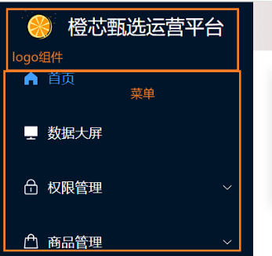


+ 添加配置文件
+ 封装logo组件
+ 递归生成动态菜单

```
//src\setting.ts 用于项目logo|标题配置
export default {
  title: '硅谷甄选运营平台', //项目的标题
  logo: '/public/logo.png', //项目logo设置
  logoHidden: true, //logo组件是否隐藏
}

```

###### 3.1.1ogo组件

```
<template>
  <div class="logo" v-if="setting.logoHidden">
    
    <p>{{ setting.title }}</p>
  </div>
</template>

<script setup lang="ts">
  //引入设置标题与logo配置文件
  import setting from '@/setting'
</script>

<style lang="scss" scoped>
  .logo {
    width: 100%;
    height: $base-menu-logo-height;
    color: white;
    display: flex;
    align-items: center;
    padding: 20px;
    img {
      width: 40px;
      height: 40px;
    }
    p {
      font-size: $base-logo-title-fontSize;
      margin-left: 10px;
    }
  }
</style>

```

###### 3.1.2递归路由组件生成动态路由菜单

+ 给路由加入元信息

  ```
  // 示例
  export const constantRoute = [
    {
      //登录
      path: '/login',
      component: () => import('@/views/login/index.vue'),
      name: 'login',
      meta: {
        title: '登录', //菜单标题
        hidden: true, //代表路由标题在菜单中是否隐藏  true:隐藏 false:不隐藏
        icon: 'Promotion', //菜单文字左侧的图标,支持element-plus全部图标
      },
    },
    {
      //登录成功以后展示数据的路由
      path: '/',
      component: () => import('@/layout/index.vue'),
      name: 'layout',
      meta: {
        title: '',
        hidden: false,
        icon: '',
      },
      redirect: '/home',
      children: [
        {
          path: '/home',
          component: () => import('@/views/home/index.vue'),
          meta: {
            title: '首页',
            hidden: false,
            icon: 'HomeFilled',
          },
        },
      ],
    },
    {
      //404
      path: '/404',
      component: () => import('@/views/404/index.vue'),
      name: '404',
      meta: {
        title: '404',
        hidden: true,
        icon: 'DocumentDelete',
      },
    },
    {
      path: '/screen',
      component: () => import('@/views/screen/index.vue'),
      name: 'Screen',
      meta: {
        hidden: false,
        title: '数据大屏',
        icon: 'Platform',
      },
    },
  ]
  ```

+ 仓库引入路由并对路由信息类型声明 

  ```
  //引入路由（常量路由）
  import { constantRoute } from '@/router/routes'
  // ....省略其他细节
  //小仓库存储数据地方
  state: (): UserState => {
    return {
      token: GET_TOKEN(), //用户唯一标识token
      menuRoutes: constantRoute, //仓库存储生成菜单需要数组（路由）
  }
  
  ```

+ layout 父组件拿到信息,传递给Menu子组件

  ```
   <Menu :menuList="userStore.menuRoutes"></Menu>
  
  <script setup lang="ts">
  // 省略其他细节
  //引入菜单组件
  import Menu from './menu/index.vue'
  //获取用户相关的小仓库
  import useUserStore from '@/store/modules/user'
  let userStore = useUserStore()
  </script>
  ```

+ Menu子组件分析处理数据

  ```
  <template>
    <template v-for="(item, index) in menuList" :key="item.path">
      <!-- 没有子路由 -->
      <template v-if="!item.children">
        <el-menu-item v-if="!item.meta.hidden" :index="item.path">
          <template #title>
            <span>图标</span>
            <span>{{ item.meta.title }}</span>
          </template>
        </el-menu-item>
      </template>
      <!-- 有且只有一个子路由 -->
      <template v-if="item.children && item.children.length == 1">
        <el-menu-item
          index="item.children[0].path"
          v-if="!item.children[0].meta.hidden"
        >
          <template #title>
            <span>图标</span>
            <span>{{ item.children[0].meta.title }}</span>
          </template>
        </el-menu-item>
      </template>
      <!-- 有子路由且个数大于一个 -->
      <el-sub-menu
        :index="item.path"
        v-if="item.children && item.children.length >= 2"
      >
        <template #title>
          <span>{{ item.meta.title }}</span>
        </template>
        <Menu :menuList="item.children"></Menu>
      </el-sub-menu>
    </template>
  </template>
  
  <script setup lang="ts">
  //获取父组件传递过来的全部路由数组
  defineProps(['menuList'])
  </script>
  <script lang="ts">
  export default {
    name: 'Menu',
  }
  </script>
  <style lang="scss" scoped></style>
  
  ```

+ 菜单图标

  + 注册element图标为全局组件

    ```
    //....
    //引入element-plus提供全部图标组件
    import * as ElementPlusIconsVue from '@element-plus/icons-vue'
    //......
    
    //对外暴露插件对象
    export default {
      //务必叫做install方法
      install(app: any) {
        //...
        //将element-plus提供图标注册为全局组件
        for (const [key, component] of Object.entries(ElementPlusIconsVue)) {
          app.component(key, component)
        }
      },
    }
    
    ```

  + 给路由元信息添加属性：**icon**

  + 菜单组件使用

    之前`<span>图标</span>`处引入图标组件,示例如下:

    ```
     <el-icon>
            <component :is="item.children[0].meta.icon"></component>
     </el-icon>
    ```

    

###### 3.1.3 菜单权限 和 按钮权限

**菜单权限**

+ 开发菜单权限
  + 第一步:拆分路由为静态(常量)路由、异步路由、任意路由
  + 静态(常量)路由是大家都可以拥有的路由，包括 login、首页、数据大屏、404
  + 异步路由:不同的身份有的有这个路由、有的没有，其中权限管理(三个子路由)、商品管理模块(四个子路由)
  + 任意路由:任意路由

路由拆分

```
//对外暴露配置路由(常量路由)
export const constantRoute = [
  {
    //登录路由
    path: '/login',
    component: () => import('@/views/login/index.vue'),
    name: 'login', //命名路由
    meta: {
      title: '登录', //菜单标题
      hidden: true, //路由的标题在菜单中是否隐藏
    },
  },
  {
    //登录成功以后展示数据的路由
    path: '/',
    component: () => import('@/layout/index.vue'),
    name: 'layout',
    meta: {
      hidden: false,
    },
    redirect: '/home',
    children: [
      {
        path: '/home',
        component: () => import('@/views/home/index.vue'),
        meta: {
          title: '首页',
          hidden: false,
          icon: 'HomeFilled',
        },
      },
    ],
  },
  {
    path: '/404',
    component: () => import('@/views/404/index.vue'),
    name: '404',
    meta: {
      title: '404',
      hidden: true,
    },
  },
  {
    path: '/screen',
    component: () => import('@/views/screen/index.vue'),
    name: 'Screen',
    meta: {
      hidden: false,
      title: '数据大屏',
      icon: 'Platform',
    },
  },
]

//异步路由
export const asnycRoute = [
  {
    path: '/acl',
    component: () => import('@/layout/index.vue'),
    name: 'Acl',
    meta: {
      hidden: false,
      title: '权限管理',
      icon: 'Lock',
    },
    redirect: '/acl/user',
    children: [
      {
        path: '/acl/user',
        component: () => import('@/views/acl/user/index.vue'),
        name: 'User',
        meta: {
          hidden: false,
          title: '用户管理',
          icon: 'User',
        },
      },
      {
        path: '/acl/role',
        component: () => import('@/views/acl/role/index.vue'),
        name: 'Role',
        meta: {
          hidden: false,
          title: '角色管理',
          icon: 'UserFilled',
        },
      },
      {
        path: '/acl/permission',
        component: () => import('@/views/acl/permission/index.vue'),
        name: 'Permission',
        meta: {
          hidden: false,
          title: '菜单管理',
          icon: 'Monitor',
        },
      },
    ],
  },
  {
    path: '/product',
    component: () => import('@/layout/index.vue'),
    name: 'Product',
    meta: {
      hidden: false,
      title: '商品管理',
      icon: 'Goods',
    },
    redirect: '/product/trademark',
    children: [
      {
        path: '/product/trademark',
        component: () => import('@/views/product/trademark/index.vue'),
        name: 'Trademark',
        meta: {
          hidden: false,
          title: '品牌管理',
          icon: 'ShoppingCartFull',
        },
      },
      {
        path: '/product/attr',
        component: () => import('@/views/product/attr/index.vue'),
        name: 'Attr',
        meta: {
          hidden: false,
          title: '属性管理',
          icon: 'CollectionTag',
        },
      },
      {
        path: '/product/spu',
        component: () => import('@/views/product/spu/index.vue'),
        name: 'Spu',
        meta: {
          hidden: false,
          title: 'SPU管理',
          icon: 'Calendar',
        },
      },
      {
        path: '/product/sku',
        component: () => import('@/views/product/sku/index.vue'),
        name: 'Sku',
        meta: {
          hidden: false,
          title: 'SKU管理',
          icon: 'Orange',
        },
      },
    ],
  },
]

//任意路由
//任意路由
export const anyRoute = {
  //任意路由
  path: '/:pathMatch(.*)*',
  redirect: '/404',
  name: 'Any',
  meta: {
    title: '任意路由',
    hidden: true,
    icon: 'DataLine',
  },
}
```

在用户仓库获取用户的异步路由:

`filterAsyncRoute` 函数会修改 `asnycRoute` 数组的值，因为在递归调用中，对 `item.children` 的修改会影响原始的 `asnycRoute` 数组 ,所以需要使用深拷贝方法

```

function filterAsyncRoute(asnycRoute, routes) {
  return asnycRoute.filter(item => {
    if (routes.includes(item.name)) {
      if (item.children && item.children.length > 0) {
        item.children = filterAsyncRoute(item.children, routes)
      }
      return true
    }
  })
}
```


```
// 省略细节
//引入深拷贝方法
//@ts-expect-error
import cloneDeep from 'lodash/cloneDeep'
import router from '@/router'
//引入路由（常量路由）
import { constantRoute, asnycRoute, anyRoute } from '@/router/routes'
//用于过滤当前用户需要展示的异步路由
function filterAsyncRoute(asnycRoute: any, routes: any) {
 // 省略细节
}
//创建用户小仓库
const useUserStore = defineStore('User', {
  //小仓库存储数据地方
  state: (): UserState => {
    return {
      // 省略
      menuRoutes: constantRoute, //仓库存储生成菜单需要数组（路由）
     
    }
  },
  //处理异步|逻辑地方
  actions: {
  
    //获取用户信息方法
    async userInfo() {
      //获取用户信息进行存储
      const result: userInfoResponseData = await reqUserInfo()
      if (result.code == 200) {
        this.username = result.data.name
        this.avatar = result.data.avatar
        //计算当前用户需要展示的异步路由
        const userAsyncRoute = filterAsyncRoute(
        // 深拷贝
          cloneDeep(asnycRoute),
          result.data.routes,
        )
        //菜单需要的数据整理完毕
        this.menuRoutes = [...constantRoute, ...userAsyncRoute, anyRoute]
        //目前路由器管理的只有常量路由:用户计算完毕异步路由、任意路由动态追加
        ;[...userAsyncRoute, anyRoute].forEach((route: any) => {
          router.addRoute(route)
        })
        return 'ok'
      } else {
        return Promise.reject(new Error(result.message))
      }
    },
    。。。。。。
})
//对外暴露小仓库
export default useUserStore
```

**注意:**

当调用 `filterAsyncRoute(asnycRoute, result.data.routes)` 时，传递的是 `asnycRoute` 数组的引用，而不是它的副本。这意味着在 `filterAsyncRoute` 函数内对 `asnycRoute` 数组所做的更改会影响到原始的`asnycRoute` 数组。具体来说，如果在 `filterAsyncRoute` 函数中修改了 `item.children`，那么这些修改将会反映在原始的 `asnycRoute` 数组中。故而,这里利用深拷贝避免异步路由数组被篡改。


**按钮权限**

+ 在用户仓库中获取用户所拥有的按钮权限`this.buttons = result.data.buttons`

+ 自定义指令,在每个按钮元素中使用v-has="btn.User.XXXX"去判断。 

  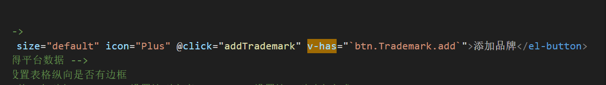

+ 引入自定义指令文件

  ```
  \\ src\directive\has.ts
  import pinia from '@/store'
  import useUserStore from '@/store/modules/user'
  const userStore = useUserStore(pinia)
  export const isHasButton = (app: any) => {
    //获取对应的用户仓库
    //全局自定义指令:实现按钮的权限
    app.directive('has', {
      //代表使用这个全局自定义指令的DOM|组件挂载完毕的时候会执行一次
      mounted(el: any, options: any) {
        //自定义指令右侧的数值:如果在用户信息buttons数组当中没有
        //从DOM树上干掉
        //el就是dom元素
        //options:传入进来的值
        if (!userStore.buttons.includes(options.value)) {
          el.parentNode.removeChild(el)
        }
      },
    })
  }
  ```

  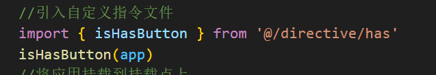


- `app.directive('has', {...})`：这里注册了一个名为 `'has'` 的全局自定义指令，它用来实现对页面元素的权限控制。
- `mounted(el: any, options: any) {...}`：这是指令的 `mounted` 钩子函数，在指令绑定的 DOM 元素挂载到页面上后会被调用。
- `el`：代表绑定了该指令的 DOM 元素，通过它可以进行操作。
- `options`：代表传递给指令的选项，其中的 `value` 属性可能是用来指定权限的值。
- `if (!userStore.buttons.includes(options.value)) {...}`：这里通过判断 `userStore.buttons` 数组中是否包含传递进来的 `options.value` 值来决定是否执行移除操作。
- `el.parentNode.removeChild(el)`：如果 `userStore.buttons` 数组中不包含 `options.value`，则通过 DOM 操作将该元素从父节点中移除。


##### 3.2 顶部导航

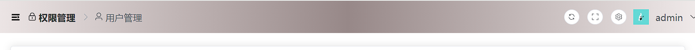

左侧面包屑和右侧设置分成两个组件

###### 3.2.1 菜单折叠功能实现

1: 定义变量(src/store/modules/setting.ts )

```
//添加setting小仓库：layout组件相关配置仓库
import { defineStore } from 'pinia'

let useLayOutSettingStore = defineStore('SettingStore', {
  state: () => {
    return {
      fold: false, //用户控制菜单折叠还是收起的控制
    }
  },
})

export default useLayOutSettingStore

```

2: 在面包屑组件中切换变量值

```
<template>
  <!-- 顶部左侧的图标 -->
  <el-icon style="margin-right: 10px" @click="changeIcon">
    <component :is="LayOutSettingStore.fold ? 'Fold' : 'Expand'"></component>
  </el-icon>
  。。。。。。。
</template>

<script setup lang="ts">
import useLayOutSettingStore from '@/store/modules/setting'
//获取layout配置相关的仓库
let LayOutSettingStore = useLayOutSettingStore()

//点击图标的切换
const changeIcon = () => {
  //图标进行切换
  LayOutSettingStore.fold = !LayOutSettingStore.fold
}
</script>
。。。。。。

```

3: 在layout组件中依据fold变量的值切换左侧菜单的样式

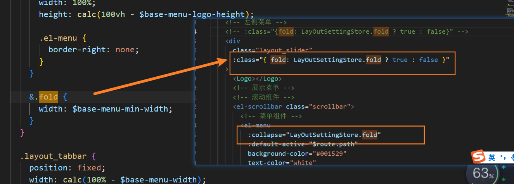

###### 3.2.2 顶部面包屑动态展示

在该组件中使用了$route.matched函数，此函数能得到当前路由的信息 

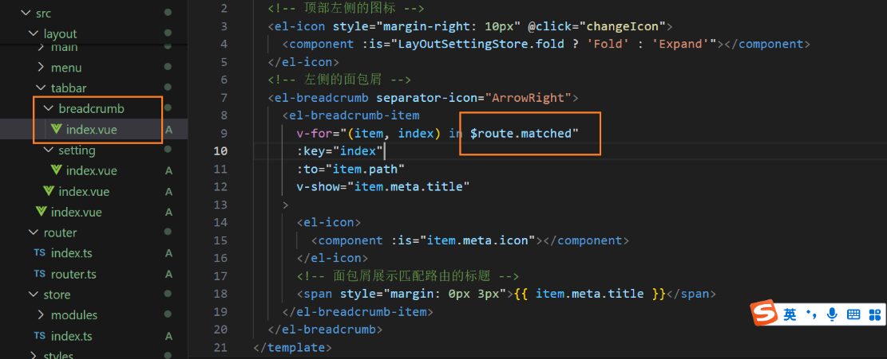

**注意**: 访问首页时，因为它是二级路由，会遍历出layout面包屑，处理：删除layout路由的title。需要v-show 判断 

**注意**：:to ="item.path"将路由中的一级路由**权限管理**以及**商品管理**重定向到第一个孩子，这样点击跳转的时候会定向到第一个孩子。 

###### 3.2.3 刷新按钮的视线

1. 使用pinia定义一个变量作为标记,在之前的src/store/modules/setting.ts 中添加一个refresh变量

2. 在右侧设置组件(src\layout\tabbar\setting\index.vue )中修改refresh的值

   ```
   <script setup lang="ts">
   //使用layout的小仓库
   import useLayOutSettingStore from '@/store/modules/setting'
   let layoutSettingStore = useLayOutSettingStore()
   //刷新按钮点击的回调
   const updateRefresh = () => {
     layoutSettingStore.refresh = !layoutSettingStore.refresh
   }
   </script>
   ```

3. main组件检测标记销毁&重加载组件（**nextTick** )

   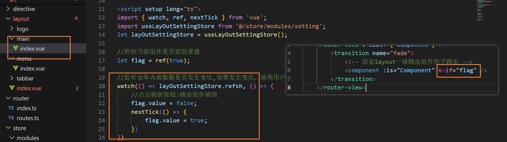

###### 3.2.4 全屏按钮实现

全屏按钮的实现函数

```
//全屏按钮点击的回调
const fullScreen = () => {
  //DOM对象的一个属性：可以用来判断当前是不是全屏的模式【全屏：true，不是全屏：false】
  let full = document.fullscreenElement
  //切换成全屏
  if (!full) {
    //文档根节点的方法requestFullscreen实现全屏
    document.documentElement.requestFullscreen()
  } else {
    //退出全屏
    document.exitFullscreen()
  }
```

###### 3.2.5 退出登录

1: 用户仓库中定义退出登录的函数

```
    //退出登录
    userLogout() {
      //当前没有mock接口（不做）：服务器数据token失效
      //本地数据清空
      this.token = ''
      this.username = ''
      this.avatar = ''
      REMOVE_TOKEN()
    },
```

2: 退出登录按钮函数

```
//退出登录点击回调
const logout = async () => {
    //第一件事情:需要向服务器发请求[退出登录接口]******
    //第二件事情:仓库当中关于用于相关的数据清空[token|username|avatar]
    //第三件事情:跳转到登录页面
    await userStore.userLogout();
    //跳转到登录页面
    $router.push({ path: '/login', query: { redirect: $route.path } });

}
```

注意:携带的query参数方便下次登陆时直接跳转到当时推出的界面 


##### 3.3 内容展示区

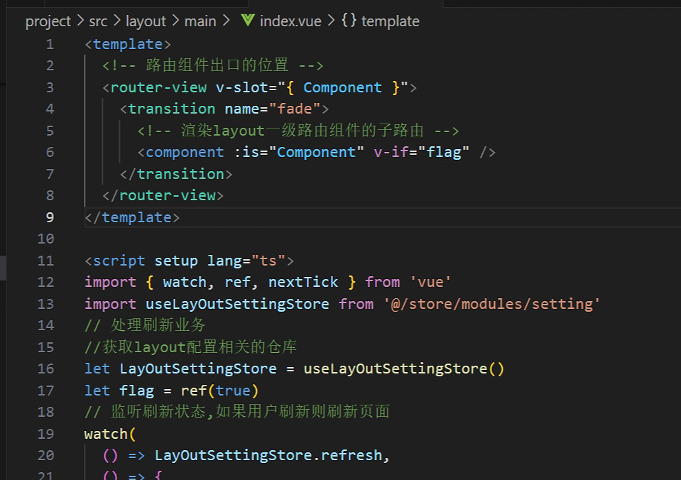

##### 3.4 home页面

1: request.ts 中为request对象添加请求拦截器

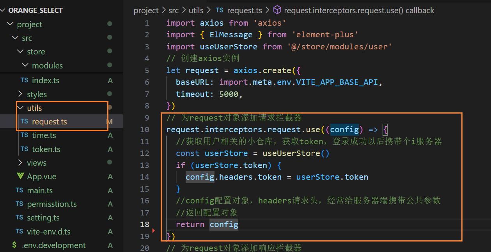

2: user仓库中添加用户信息和获取信息的函数

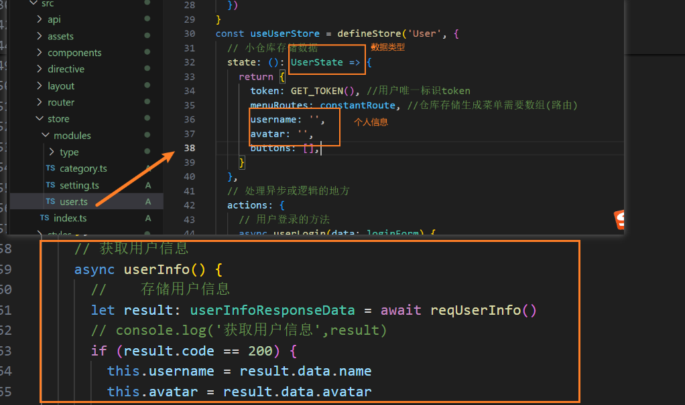

3: home页面引入并使用

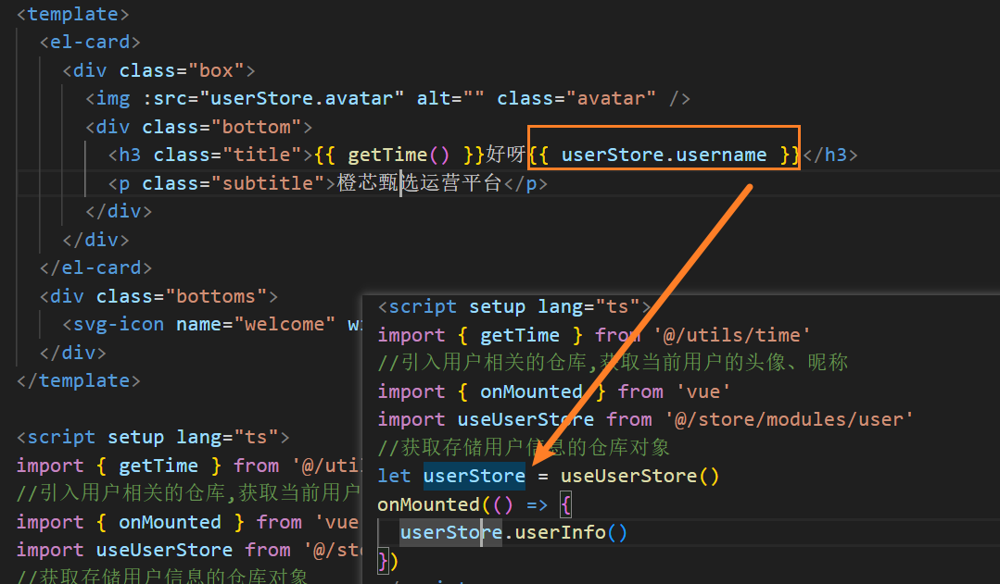


##### 3.6 路由守卫

###### 进度条

1. 安装` pnpm i nprogress `

2. src\permisstion.ts  中使用

```
//路由鉴权：鉴权：项目当中路由能不能被访问的权限
import router from '@/router'
import nprogress from 'nprogress'
//引入进度条样式
import 'nprogress/nprogress.css'
//全局前置守卫
router.beforeEach((to: any, from: any, next: any) => {
  //访问某一个路由之前的守卫
  nprogress.start()
  next()
})

//全局后置守卫
router.afterEach((to: any, from: any) => {
  // to and from are both route objects.
  nprogress.done()
})

//第一个问题：任意路由切换实现进度条业务 ----nprogress

```

3. main.ts 中使用 

```
//引入路由鉴权文件
import './permisstion'
```


###### 路由鉴权

```
//路由鉴权：鉴权：项目当中路由能不能被访问的权限
import router from '@/router'
import setting from './setting'
import nprogress from 'nprogress'
//引入进度条样式
import 'nprogress/nprogress.css'
//进度条的加载圆圈不要
nprogress.configure({ showSpinner: false })
//获取用户相关的小仓库内部token数据，去判断用户是否登陆成功
import useUserStore from './store/modules/user'
//为什么要引pinia
import pinia from './store'
const userStore = useUserStore(pinia)

//全局前置守卫
router.beforeEach(async (to: any, from: any, next: any) => {
  //网页的名字
  document.title = `${setting.title}-${to.meta.title}`
  //访问某一个路由之前的守卫
  nprogress.start()
  //获取token，去判断用户登录、还是未登录
  const token = userStore.token
  //获取用户名字
  let username = userStore.username
  //用户登录判断
  if (token) {
    //登陆成功，访问login。指向首页
    if (to.path == '/login') {
      next('/home')
    } else {
      //登陆成功访问其余的，放行
      //有用户信息
      if (username) {
        //放行
        next()
      } else {
        //如果没有用户信息，在收尾这里发请求获取到了用户信息再放行
        try {
          //获取用户信息
          await userStore.userInfo()
          next()
        } catch (error) {
          //token过期|用户手动处理token
          //退出登陆->用户相关的数据清空
          userStore.userLogout()
          next({ path: '/login', query: { redirect: to.path } })
        }
      }
    }
  } else {
    //用户未登录
    if (to.path == '/login') {
      next()
    } else {
      next({ path: '/login', query: { redirect: to.path } })
    }
  }
  next()
})

//全局后置守卫
router.afterEach((to: any, from: any) => {
  // to and from are both route objects.
  nprogress.done()
})

//第一个问题：任意路由切换实现进度条业务 ----nprogress
//第二个问题：路由鉴权
//全部路由组件 ：登录|404|任意路由|首页|数据大屏|权限管理（三个子路由）|商品管理（4个子路由）

//用户未登录 ：可以访问login 其余都不行
//登陆成功：不可以访问login 其余都可以

```


#### 4 权限管理页面

##### 4.1 用户管理

利用[TS 封装 Axios](https://juejin.cn/post/7154991998989959181)


##### 4.2 角色管理


##### 4.3 菜单管理

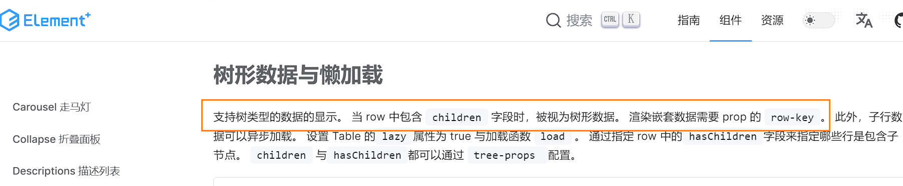


#### 5 商品管理

##### 5.1 品牌管理


##### 5.2 属性管理


##### 5.3 SPU管理


##### 5.4 SKU管理


