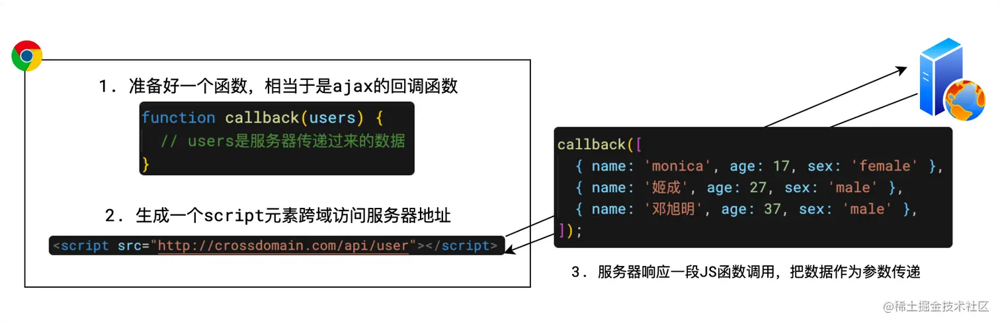

# 一 浏览器相关

[参考视频](https://www.bilibili.com/video/BV1BB4y167kg/)、[参考文章](https://liufusong.top/interview/browser/%E7%BC%93%E5%AD%98.html#%E5%8D%8F%E5%95%86%E7%BC%93%E5%AD%98)、[参考文章](https://juejin.cn/post/6844904021308735502#heading-102)、[参考文章-跨域](https://juejin.cn/post/7094162429310926855)

## 跨域相关：

### 什么是跨域

浏览器有一个重要的安全策略，称之为「同源策略」

其中，源=协议+主机+端口源=协议+主机+端口，**两个源相同，称之为同源，两个源不同，称之为跨源或跨域**

 **同源策略是指，若页面的源和页面运行过程中加载的源不一致时，出于安全考虑，浏览器会对跨域的资源访问进行一些限制** 

有多种方式解决跨域问题，常见的有：

- **代理**，常用
- **CORS**，常用
- JSONP

无论使用哪一种方式，都是要让浏览器知道，我这次跨域请求的是自己人，就不要拦截了。

### 跨域解决方法1-代理

**对于前端开发而言**，大部分的跨域问题，都是通过代理解决的

**代理适用的场景是：生产环境不发生跨域，但开发环境发生跨域**

因此，只需要在开发环境使用代理解决跨域即可，这种代理又称之为开发代理


在实际开发中，只需要对开发服务器稍加配置即可完成

```
// vue 的开发服务器代理配置
// vue.config.js
module.exports = {
  devServer: { // 配置开发服务器
    proxy: { // 配置代理
      "/api": { // 若请求路径以 /api 开头
        target: "http://dev.taobao.com", // 将其转发到 http://dev.taobao.com
      },
    },
  },
};
```

###  跨域解决方法2-JSONP

在CORS出现之前，人们想了一种奇妙的办法来实现跨域，这就是JSONP。

要实现JSONP，需要浏览器和服务器来一个天衣无缝的绝妙配合。

JSONP的做法是：**当需要跨域请求时，不使用AJAX，转而生成一个script元素去请求服务器，由于浏览器并不阻止script元素的请求，这样请求可以到达服务器。服务器拿到请求后，响应一段JS代码，这段代码实际上是一个函数调用，调用的是客户端预先生成好的函数，并把浏览器需要的数据作为参数传递到函数中，从而间接的把数据传递给客户端**



JSONP有着明显的缺点，即其只能支持GET请求

###   跨域解决方法3-CORS

`CORS`是基于`http1.1`的一种跨域解决方案，它的全称是**C**ross-**O**rigin **R**esource **S**haring，跨域资源共享。

它的总体思路是：**如果浏览器要跨域访问服务器的资源，需要获得服务器的允许**


而要知道，一个请求可以附带很多信息，从而会对服务器造成不同程度的影响

比如有的请求只是获取一些新闻，有的请求会改动服务器的数据

针对不同的请求，CORS 规定了三种不同的交互模式，分别是：

- **简单请求**
- **需要预检的请求**
- **附带身份凭证的请求**

这三种模式从上到下层层递进，请求可以做的事越来越多，要求也越来越严格。

下面分别说明三种请求模式的具体规范。

  简单请求

当浏览器端运行了一段 ajax 代码（无论是使用 XMLHttpRequest 还是 fetch api），浏览器会首先判断它属于哪一种请求模式

#### 简单请求的判定

当请求**同时满足**以下条件时，浏览器会认为它是一个简单请求：

1. 请求方法属于下面的一种：
   - get
   - post
   - head
2. 请求头仅包含安全的字段，常见的安全字段如下：
   - `Accept`
   - `Accept-Language`
   - `Content-Language`
   - `Content-Type`
   - `DPR`
   - `Downlink`
   - `Save-Data`
   - `Viewport-Width`
   - `Width`
3. 请求头如果包含`Content-Type`，仅限下面的值之一：
   - `text/plain`
   - `multipart/form-data`
   - `application/x-www-form-urlencoded`

如果以上三个条件同时满足，浏览器判定为简单请求。

 简单请求的交互规范

当浏览器判定某个**ajax 跨域请求**是**简单请求**时，会发生以下的事情

1. **请求头中会自动添加Origin字段**

比如，在页面`http://my.com/index.html`中有以下代码造成了跨域

```
 // 简单请求
fetch('http://crossdomain.com/api/news');
```

请求发出后，请求头会是下面的格式：

```
 GET /api/news/ HTTP/1.1
Host: crossdomain.com
Connection: keep-alive
...
Referer: http://my.com/index.html
Origin: http://my.com
```

看到最后一行没，`Origin`字段会告诉服务器，是哪个源地址在跨域请求

1. **服务器响应头中应包含Access-Control-Allow-Origin**

当服务器收到请求后，如果允许该请求跨域访问，需要在响应头中添加`Access-Control-Allow-Origin`字段

该字段的值可以是：

- *：表示我很开放，什么人我都允许访问
- 具体的源：比如`http://my.com`，表示我就允许你访问

> 实际上，这两个值对于客户端`http://my.com`而言，都一样，因为客户端才不会管其他源服务器允不允许，就关心自己是否被允许
>
> 当然，服务器也可以维护一个可被允许的源列表，如果请求的`Origin`命中该列表，才响应`*`或具体的源
>
> **为了避免后续的麻烦，强烈推荐响应具体的源**

假设服务器做出了以下的响应：

```
HTTP/1.1 200 OK
Date: Tue, 21 Apr 2020 08:03:35 GMT
...
Access-Control-Allow-Origin: http://my.com
...

消息体中的数据
```

当浏览器看到服务器允许自己访问后，高兴的像一个两百斤的孩子，于是，它就把响应顺利的交给 js，以完成后续的操作

下图简述了整个交互过程


#### 需要预检的请求

 需要预检的请求

简单的请求对服务器的威胁不大，所以允许使用上述的简单交互即可完成。

但是，如果浏览器不认为这是一种简单请求，就会按照下面的流程进行：

1. **浏览器发送预检请求，询问服务器是否允许**
2. **服务器允许**
3. **浏览器发送真实请求**
4. **服务器完成真实的响应**

下图简述了整个交互过程


#### 附带身份凭证的请求

 默认情况下，ajax 的跨域请求并不会附带 cookie，这样一来，某些需要权限的操作就无法进行

不过可以通过简单的配置就可以实现附带 cookie

这样一来，该跨域的 ajax 请求就是一个*附带身份凭证的请求*

当一个请求需要附带 cookie 时，无论它是简单请求，还是预检请求，都会在请求头中添加`cookie`字段

而服务器响应时，需要明确告知客户端：服务器允许这样的凭据

告知的方式也非常的简单，只需要在响应头中添加：`Access-Control-Allow-Credentials: true`即可

对于一个附带身份凭证的请求，若服务器没有明确告知，浏览器仍然视为跨域被拒绝。

另外要特别注意的是：**对于附带身份凭证的请求，服务器不得设置 Access-Control-Allow-Origin 的值为\***。这就是为什么不推荐使用*的原因

 


## 1 能不能说一说浏览器缓存?

### 概念

浏览器会将请求后的资源进行存贮为离线资源，当下次需要该资源时，浏览器会根据缓存机制决定直接使用缓存资源还是再次向服务器发送请求

### 作用

- 减少了不必要数据的传输、降低服务器的压力
- 加快了客户端访问速度
- 增强用户体验

### 强缓存

不向服务端发送请求，强制使用缓存数据

### 实现方式

后端在响应头中返回 Expires 和 Cache-Control

**Expires ：**

http 协议 1.0 的字端

缓存过期时间，用来指定资源到期的时间，是服务器端的具体的时间点

浏览器：使用 expires 到期时间和本地时间进行对比，如果本地时间被修改或者和服务器时间差距较大，造成不准确的问题


**Cache-Control**

Cache-Control 是 HTTP 1.1 的字段

约定过期时间的相对时间


当 cache-control 和 expires 同时存在 cache-control 的优先级会比 expires 高

### 协商缓存

当强缓存失效后，会使用协商缓存

协商缓存由服务器决定是否使用缓存

1. 向服务器发送请求资源并携带标识

   Etag 字段：表示请求资源在服务器的唯一标识，浏览器可以根据 ETag 值缓存数据，下次请求的时候以 If-None-Match 字段请求

   Last-Modified 字段：用于标记请求资源的最后一次修改时间

2. 服务器会进行判断浏览器缓存的资源是否真的失效是否更新

   真的失效，服务端已经更新，返回 200，重新返回最新资源和缓存标识

   浏览器再次存入缓存

   后续再次从强缓存开始

3. 缓存时间到了，但是资源没更新，就还使用本地的

   直接返回 304

总结


### 缓存位置

前面我们已经提到，当`强缓存`命中或者协商缓存中服务器返回304的时候，我们直接从缓存中获取资源。那这些资源究竟缓存在什么位置呢？

浏览器中的缓存位置一共有四种，按优先级从高到低排列分别是：

- Service Worker
- Memory Cache
- Disk Cache
- Push Cache

## 2 能不能说一说浏览器的本地存储？各自优劣如何？

浏览器的本地存储主要分为`Cookie`、`WebStorage`和`IndexedDB`, 其中`WebStorage`又可以分为`localStorage`和`sessionStorage`。  

总结

浏览器中各种本地存储和缓存技术的发展，给前端应用带来了大量的机会，PWA 也正是依托了这些优秀的存储方案才得以发展起来。重新梳理一下这些本地存储方案:

1. `cookie`并不适合存储，而且存在非常多的缺陷。
2. `Web Storage`包括`localStorage`和`sessionStorage`, 默认不会参与和服务器的通信。
3. `IndexedDB`为运行在浏览器上的非关系型数据库，为大型数据的存储提供了接口。


## 3 说一说从输入URL到页面呈现发生了什么？——网络篇

 

## 4 说一说从输入URL到页面呈现发生了什么？——解析算法篇

完成了网络请求和响应，如果响应头中`Content-Type`的值是`text/html`，那么接下来就是浏览器的`解析`和`渲染`工作了。

首先来介绍解析部分，主要分为以下几个步骤:

- 构建 `DOM`树

- `样式`计算

  - 关于CSS样式，它的来源一般是三种:
    1. **link标签引用**
    2. **style标签中的样式**
    3. **元素的内嵌style属性**

- 生成`布局树`(`Layout Tree`) 

  ​	现在已经生成DOM树和DOM样式，接下来要做的就是通过浏览器的布局系统  ` 确定元素的位置`，也就是要生成一棵`布局树`(Layout Tree)。

  ​	布局树生成的大致工作如下:

   	1. 遍历生成的 DOM 树节点，并把他们添加到`布局树中`。

  		2. 计算布局树节点的坐标位置。

     值得注意的是，这棵布局树值包含可见元素，对于 `head`标签和设置了`display: none`的元素，将不会被放入其中。

 

## 5 说一说从输入URL到页面呈现发生了什么？——渲染过程篇

`渲染`分为以下几个步骤:

- 建立`图层树`(`Layer Tree`)
- 生成`绘制列表`
- 生成`图块`并`栅格化`
- 显示器显示内容

 

## 6 谈谈你对重绘和回流的理解。

我们首先来回顾一下`渲染流水线`的流程:


接下来，我们将来以此为依据来介绍重绘和回流，以及让更新视图的另外一种方式——合成。

### 回流

首先介绍`回流`。`回流`也叫`重排`。

#### 触发条件

简单来说，就是当我们对 DOM 结构的修改引发 DOM 几何尺寸变化的时候，会发生`回流`的过程。

具体一点，有以下的操作会触发回流:

1. 一个 DOM 元素的几何属性变化，常见的几何属性有`width`、`height`、`padding`、`margin`、`left`、`top`、`border` 等等, 这个很好理解。
2. 使 DOM 节点发生`增减`或者`移动`。
3. 读写 `offset`族、`scroll`族和`client`族属性的时候，浏览器为了获取这些值，需要进行回流操作。
4. 调用 `window.getComputedStyle` 方法。

#### 回流过程

依照上面的渲染流水线，触发回流的时候，如果 DOM 结构发生改变，则重新渲染 DOM 树，然后将后面的流程(包括主线程之外的任务)全部走一遍。


相当于将解析和合成的过程重新又走了一篇，开销是非常大的。

### 重绘

#### 触发条件

当 DOM 的修改导致了样式的变化，并且没有影响几何属性的时候，会导致`重绘`(`repaint`)。

#### 重绘过程

由于没有导致 DOM 几何属性的变化，因此元素的位置信息不需要更新，从而省去布局的过程。流程如下：


跳过了`生成布局树`和`建图层树`的阶段，直接生成绘制列表，然后继续进行分块、生成位图等后面一系列操作。

可以看到，重绘不一定导致回流，但回流一定发生了重绘。

### 合成

还有一种情况，是直接合成。比如利用 CSS3 的`transform`、`opacity`、`filter`这些属性就可以实现合成的效果，也就是大家常说的**GPU加速**。

#### GPU加速的原因

在合成的情况下，会直接跳过布局和绘制流程，直接进入`非主线程`处理的部分，即直接交给`合成线程`处理。交给它处理有两大好处:

1. 能够充分发挥`GPU`的优势。合成线程生成位图的过程中会调用线程池，并在其中使用`GPU`进行加速生成，而GPU 是擅长处理位图数据的。
2. 没有占用主线程的资源，即使主线程卡住了，效果依然能够流畅地展示。

##  7   能不能说一说XSS攻击？

`XSS` 攻击是指浏览器中执行恶意脚本, 然后拿到用户的信息进行操作。主要分为`存储型`、`反射型`和`文档型`。防范的措施包括:

- 一个信念: 不要相信用户的输入，对输入内容转码或者过滤，让其不可执行。
  - `存储型`，顾名思义就是将恶意脚本存储了起来，确实，存储型的 XSS 将脚本存储到了服务端的数据库，然后在客户端执行这些脚本，从而达到攻击的效果。 
  - `反射型XSS`指的是恶意脚本作为**网络请求的一部分** 
  - 文档型的 XSS 攻击并不会经过服务端，而是作为中间人的角色，在数据传输过程劫持到网络数据包，然后**修改里面的 html 文档**！ 
- 两个利用: 利用 CSP，利用 Cookie 的 HttpOnly 属性。
  - CSP，即浏览器中的内容安全策略，它的核心思想就是服务器决定浏览器加载哪些资源，具体来说可以完成以下功能:
    1. 限制其他域下的资源加载。
    2. 禁止向其它域提交数据。
    3. 提供上报机制，能帮助我们及时发现 XSS 攻击。
  - 很多 XSS 攻击脚本都是用来窃取Cookie, 而设置 Cookie 的 HttpOnly 属性后，JavaScript 便无法读取 Cookie 的值。这样也能很好的防范 XSS 攻击。 

## 8  能不能说一说CSRF攻击？

CSRF(Cross-site request forgery), 即跨站请求伪造，指的是黑客诱导用户点击链接，打开黑客的网站，然后黑客利用用户目前的登录状态发起跨站请求。

`CSRF`攻击一般会有三种方式:

- 自动 GET 请求
- 自动 POST 请求
- 诱导点击发送 GET 请求。

防范措施: `利用 Cookie 的 SameSite 属性`、`验证来源站点`和`CSRF Token`。

## 9 HTTPS为什么让数据传输更安全？

谈到`HTTPS`, 就不得不谈到与之相对的`HTTP`。**`HTTP`的特性是明文传输，因此在传输的每一个环节，数据都有可能被第三方窃取或者篡改**，具体来说，HTTP 数据经过 TCP 层，然后经过`WIFI路由器`、`运营商`和`目标服务器`，这些环节中都可能被中间人拿到数据并进行篡改，也就是我们常说的**中间人攻击**。

为了防范这样一类攻击，我们不得已要引入新的加密方案，即 HTTPS。

`HTTPS`并不是一个新的协议, 而是一个加强版的`HTTP`。其原理是在`HTTP`和`TCP`之间建立了一个中间层，当`HTTP`和`TCP`通信时并不是像以前那样直接通信，直接经过了一个中间层进行加密，将加密后的数据包传给`TCP`, 响应的，`TCP`必须将数据包解密，才能传给上面的`HTTP`。这个中间层也叫`安全层`。`安全层`的核心就是对数据`加解密`。

**HTTPS并不是一个新的协议, 它在`HTTP`和`TCP`的传输中建立了一个安全层，利用`对称加密`和`非对称加密`结合数字证书认证的方式，让传输过程的安全性大大提高。** 

##  10 能不能实现事件的防抖和节流？

### 节流

节流的核心思想: 如果在定时器的时间范围内再次触发，则不予理睬，等当前定时器`完成`，才能启动**下一个定时器任务**。这就好比公交车，10 分钟一趟，10 分钟内有多少人在公交站等我不管，10 分钟一到我就要发车走人！

### 防抖

核心思想: 每次事件触发则删除原来的定时器，建立新的定时器。跟**王者荣耀**的**回城**功能类似，你反复触发回城功能，那么只认最后一次，从最后一次触发开始计时。

### 双剑合璧——加强版节流

现在我们可以把`防抖`和`节流`放到一起，为什么呢？因为防抖有时候触发的太频繁会导致一次响应都没有，我们希望到了固定的时间必须给用户一个响应.

```
function throttle(fn, delay) {
  let last = 0, timer = null;
  return function (...args) {
    let context = this;
    let now = new Date();
    if(now - last < delay){
      clearTimeout(timer);
      setTimeout(function() {
        last = now;
        fn.apply(context, args);
      }, delay);
    } else {
      // 这个时候表示时间到了，必须给响应
      last = now;
      fn.apply(context, args);
    }
  }
}

```

## 11  能不能实现图片懒加载？

### 方案一:clientHeight、scrollTop 和 offsetTop

### 方案二：getBoundingClientRect

### 方案三: IntersectionObserver

这是浏览器内置的一个`API`，实现了`监听window的scroll事件`、`判断是否在视口中`以及`节流`三大功能。

# 二 TCP协议相关

参考博客

## [001. 能不能说一说 TCP 和 UDP 的区别？](https://juejin.cn/post/6844904070889603085)

**TCP是一个面向连接的、可靠的、基于字节流的传输层协议。**

而**UDP是一个面向无连接的传输层协议。**(就这么简单，其它TCP的特性也就没有了)。

具体来分析，和 `UDP` 相比，`TCP` 有三大核心特性:

1. **面向连接**。所谓的连接，指的是客户端和服务器的连接，在双方互相通信之前，TCP 需要三次握手建立连接，而 UDP 没有相应建立连接的过程。
2. **可靠性**。TCP 花了非常多的功夫保证连接的可靠，这个可靠性体现在哪些方面呢？一个是有状态，另一个是可控制。

TCP 会精准记录哪些数据发送了，哪些数据被对方接收了，哪些没有被接收到，而且保证数据包按序到达，不允许半点差错。这是**有状态**。

当意识到丢包了或者网络环境不佳，TCP 会根据具体情况调整自己的行为，控制自己的发送速度或者重发。这是**可控制**。

相应的，UDP 就是`无状态`, `不可控`的。

1. **面向字节流**。UDP 的数据传输是基于数据报的，这是因为仅仅只是继承了 IP 层的特性，而 TCP 为了维护状态，将一个个 IP 包变成了字节流。

## 002 TCP三次握手

 

[举个例子](https://www.bilibili.com/video/BV18h41187Ep/)：


## 003 TCP四次挥手 

四次挥手（Four-Way Wavehand）即终止TCP连接，就是指断开一个TCP连接时，需要客户端和服务端总共发送4个包以确认连接的断开，如图所示：


 


客户端需要等待足够长的时间，具体来说，是 2 个 `MSL`(`Maximum Segment Lifetime，报文最大生存时间`), 在这段时间内如果客户端没有收到服务端的重发请求，那么表示 ACK 成功到达，挥手结束，否则客户端重发 ACK。

### 等待2MSL的意义

如果不等待会怎样？

如果不等待，客户端直接跑路，当服务端还有很多数据包要给客户端发，且还在路上的时候，若客户端的端口此时刚好被新的应用占用，那么就接收到了无用数据包，造成数据包混乱。所以，最保险的做法是等服务器发来的数据包都死翘翘再启动新的应用。

那，照这样说一个 MSL 不就不够了吗，为什么要等待 2 MSL?

- 1 个 MSL 确保四次挥手中主动关闭方最后的 ACK 报文最终能达到对端
- 1 个 MSL 确保对端没有收到 ACK 重传的 FIN 报文可以到达

这就是等待 2MSL 的意义。

### 为什么是四次挥手而不是三次？

因为服务端在接收到`FIN`, 往往不会立即返回`FIN`, 必须等到服务端所有的报文都发送完毕了，才能发`FIN`。因此先发一个`ACK`表示已经收到客户端的`FIN`，延迟一段时间才发`FIN`。这就造成了四次挥手。

如果是三次挥手会有什么问题？

等于说服务端将`ACK`和`FIN`的发送合并为一次挥手，这个时候长时间的延迟可能会导致客户端误以为`FIN`没有到达客户端，从而让客户端不断的重发`FIN`。

##  004: 说说半连接队列和 SYN Flood 攻击的关系

三次握手前，服务端的状态从`CLOSED`变为`LISTEN`, 同时在内部创建了两个队列：**半连接队列**和**全连接队列**，即**SYN队列**和**ACCEPT队列**。

### 半连接队列

当客户端发送`SYN`到服务端，服务端收到以后回复`ACK`和`SYN`，状态由`LISTEN`变为`SYN_RCVD`，此时这个连接就被推入了**SYN队列**，也就是**半连接队列**。

### 全连接队列

当客户端返回`ACK`, 服务端接收后，三次握手完成。这个时候连接等待被具体的应用取走，在被取走之前，它会被推入另外一个 TCP 维护的队列，也就是**全连接队列(Accept Queue)**。

### SYN Flood 攻击原理

SYN Flood 属于典型的 DoS/DDoS 攻击。其攻击的原理很简单，就是用客户端在短时间内伪造大量不存在的 IP 地址，并向服务端疯狂发送`SYN`。对于服务端而言，会产生两个危险的后果:

1. 处理大量的`SYN`包并返回对应`ACK`, 势必有大量连接处于`SYN_RCVD`状态，从而占满整个**半连接队列**，无法处理正常的请求。
2. 由于是不存在的 IP，服务端长时间收不到客户端的`ACK`，会导致服务端不断重发数据，直到耗尽服务端的资源。

 如何应对 SYN Flood 攻击？

1. 增加 SYN 连接，也就是增加半连接队列的容量。
2. 减少 SYN + ACK 重试次数，避免大量的超时重发。
3. 利用 SYN Cookie 技术，在服务端接收到`SYN`后不立即分配连接资源，而是根据这个`SYN`计算出一个Cookie，连同第二次握手回复给客户端，在客户端回复`ACK`的时候带上这个`Cookie`值，服务端验证 Cookie 合法之后才分配连接资源。


## 005: 介绍一下 TCP 报文头部的字段

 


## 006: 说说 TCP 快速打开的原理(TFO)

### TFO 流程

#### 首轮三次握手

首先客户端发送`SYN`给服务端，服务端接收到。

注意哦！现在服务端不是立刻回复 SYN + ACK，而是通过计算得到一个`SYN Cookie`, 将这个`Cookie`放到 TCP 报文的 `Fast Open`选项中，然后才给客户端返回。

客户端拿到这个 Cookie 的值缓存下来。后面正常完成三次握手。

首轮三次握手就是这样的流程。而后面的三次握手就不一样啦！

#### 后面的三次握手

在后面的三次握手中，客户端会将之前缓存的 `Cookie`、`SYN` 和`HTTP请求`(是的，你没看错)发送给服务端，服务端验证了 Cookie 的合法性，如果不合法直接丢弃；如果是合法的，那么就正常返回`SYN + ACK`。

重点来了，现在服务端能向客户端发 HTTP 响应了！这是最显著的改变，三次握手还没建立，仅仅验证了 Cookie 的合法性，就可以返回 HTTP 响应了。

当然，客户端的`ACK`还得正常传过来，不然怎么叫三次握手嘛。

流程如下:


注意: 客户端最后握手的 ACK 不一定要等到服务端的 HTTP 响应到达才发送，两个过程没有任何关系。

### TFO 的优势

TFO 的优势并不在与首轮三次握手，而在于后面的握手，在拿到客户端的 Cookie 并验证通过以后，可以直接返回 HTTP 响应，充分利用了**1 个RTT**(Round-Trip Time，往返时延)的时间**提前进行数据传输**，积累起来还是一个比较大的优势。


## 007: 能不能说说TCP报文中时间戳的作用？

`timestamp`是 TCP 报文首部的一个可选项，一共占 10 个字节， 

接下来我们就来一一梳理，TCP 的时间戳主要解决两大问题:

- 计算往返时延 RTT(Round-Trip Time)
- 防止序列号的回绕问题

## 008: TCP 的超时重传时间是如何计算的？

TCP 具有超时重传机制，即间隔一段时间没有等到数据包的回复时，重传这个数据包。

那么这个重传间隔是如何来计算的呢？

今天我们就来讨论一下这个问题。

这个重传间隔也叫做**超时重传时间**(Retransmission TimeOut, 简称RTO)，它的计算跟上一节提到的 RTT 密切相关。这里我们将介绍两种主要的方法，一个是经典方法，一个是标准方法。

### 经典方法

经典方法引入了一个新的概念——SRTT(Smoothed round trip time，即平滑往返时间)，没产生一次新的 RTT. 就根据一定的算法对 SRTT 进行更新，具体而言，计算方式如下(SRTT 初始值为0):

```
js
复制代码SRTT =  (α * SRTT) + ((1 - α) * RTT)
```

其中，α 是**平滑因子**，建议值是`0.8`，范围是`0.8 ~ 0.9`。

拿到 SRTT，我们就可以计算 RTO 的值了:

```
js
复制代码RTO = min(ubound, max(lbound, β * SRTT))
```

β 是加权因子，一般为`1.3 ~ 2.0`， **lbound** 是下界，**ubound** 是上界。

其实这个算法过程还是很简单的，但是也存在一定的局限，就是在 RTT 稳定的地方表现还可以，而在 RTT 变化较大的地方就不行了，因为平滑因子 α 的范围是`0.8 ~ 0.9`, RTT 对于 RTO 的影响太小。

### 标准方法

为了解决经典方法对于 RTT 变化不敏感的问题，后面又引出了标准方法，也叫`Jacobson / Karels 算法`。

一共有三步。

**第一步**: 计算`SRTT`，公式如下:

```
js
复制代码SRTT = (1 - α) * SRTT + α * RTT
```

注意这个时候的 `α`跟经典方法中的`α`取值不一样了，建议值是`1/8`，也就是`0.125`。

**第二步**: 计算`RTTVAR`(round-trip time variation)这个中间变量。

```
js
复制代码RTTVAR = (1 - β) * RTTVAR + β * (|RTT - SRTT|)
```

β 建议值为 0.25。这个值是这个算法中出彩的地方，也就是说，它记录了最新的 RTT 与当前 SRTT 之间的差值，给我们在后续感知到 RTT 的变化提供了抓手。

**第三步**: 计算最终的`RTO`:

```
js
复制代码RTO = µ * SRTT + ∂ * RTTVAR 
```

`µ`建议值取`1`, `∂`建议值取`4`。

这个公式在 SRTT 的基础上加上了最新 RTT 与它的偏移，从而很好的感知了 RTT 的变化，这种算法下，RTO 与 RTT 变化的差值关系更加密切。


## 009: 能不能说一说 TCP 的流量控制？

对于发送端和接收端而言，TCP 需要把发送的数据放到**发送缓存区**, 将接收的数据放到**接收缓存区**。

而流量控制索要做的事情，就是在通过接收缓存区的大小，控制发送端的发送。如果对方的接收缓存区满了，就不能再继续发送了。

要具体理解流量控制，首先需要了解`滑动窗口`的概念。

### TCP 滑动窗口

TCP 滑动窗口分为两种: **发送窗口**和**接收窗口**。

#### 发送窗口

发送端的滑动窗口结构如下:


其中包含四大部分:

- 已发送且已确认
- 已发送但未确认
- 未发送但可以发送
- 未发送也不可以发送

其中有一些重要的概念，我标注在图中:


发送窗口就是图中被框住的范围。SND 即`send`, WND 即`window`, UNA 即`unacknowledged`, 表示未被确认，NXT 即`next`, 表示下一个发送的位置。

#### 接收窗口

接收端的窗口结构如下:


REV 即 `receive`，NXT 表示下一个接收的位置，WND 表示接收窗口大小。

### 流量控制过程

这里我们不用太复杂的例子，以一个最简单的来回来模拟一下流量控制的过程，方便大家理解。

首先双方三次握手，初始化各自的窗口大小，均为 200 个字节。

假如当前发送端给接收端发送 100 个字节，那么此时对于发送端而言，SND.NXT 当然要右移 100 个字节，也就是说当前的`可用窗口`减少了 100 个字节，这很好理解。

现在这 100 个到达了接收端，被放到接收端的缓冲队列中。不过此时由于大量负载的原因，接收端处理不了这么多字节，只能处理 40 个字节，剩下的 `60` 个字节被留在了缓冲队列中。

注意了，此时接收端的情况是处理能力不够用啦，你发送端给我少发点，所以此时接收端的接收窗口应该缩小，具体来说，缩小 60 个字节，由 200 个字节变成了 140 字节，因为缓冲队列还有 60 个字节没被应用拿走。

因此，接收端会在 ACK 的报文首部带上缩小后的滑动窗口 140 字节，发送端对应地调整发送窗口的大小为 140 个字节。

此时对于发送端而言，已经发送且确认的部分增加 40 字节，也就是 SND.UNA 右移 40 个字节，同时**发送窗口**缩小为 140 个字节。

这也就是**流量控制**的过程。尽管回合再多，整个控制的过程和原理是一样的。

 

## 010: 能不能说说 TCP 的拥塞控制？

上一节所说的**流量控制**发生在发送端跟接收端之间，并没有考虑到整个网络环境的影响，如果说当前网络特别差，特别容易丢包，那么发送端就应该注意一些了。而这，也正是`拥塞控制`需要处理的问题。

对于拥塞控制来说，TCP 每条连接都需要维护两个核心状态:

- 拥塞窗口（Congestion Window，cwnd）
- 慢启动阈值（Slow Start Threshold，ssthresh）

涉及到的算法有这几个:

- 慢启动
- 拥塞避免
- 快速重传和快速恢复

接下来，我们就来一一拆解这些状态和算法。首先，从拥塞窗口说起。

### 拥塞窗口

拥塞窗口（Congestion Window，cwnd）是指目前自己还能传输的数据量大小。

那么之前介绍了接收窗口的概念，两者有什么区别呢？

- 接收窗口(rwnd)是`接收端`给的限制
- 拥塞窗口(cwnd)是`发送端`的限制

限制谁呢？

限制的是`发送窗口`的大小。

有了这两个窗口，如何来计算`发送窗口`？

```
scss
复制代码发送窗口大小 = min(rwnd, cwnd)
```

取两者的较小值。而拥塞控制，就是来控制`cwnd`的变化。

### 慢启动

刚开始进入传输数据的时候，你是不知道现在的网路到底是稳定还是拥堵的，如果做的太激进，发包太急，那么疯狂丢包，造成雪崩式的网络灾难。

因此，拥塞控制首先就是要采用一种保守的算法来慢慢地适应整个网路，这种算法叫`慢启动`。运作过程如下:

- 首先，三次握手，双方宣告自己的接收窗口大小
- 双方初始化自己的**拥塞窗口**(cwnd)大小
- 在开始传输的一段时间，发送端每收到一个 ACK，拥塞窗口大小加 1，也就是说，每经过一个 RTT，cwnd 翻倍。如果说初始窗口为 10，那么第一轮 10 个报文传完且发送端收到 ACK 后，cwnd 变为 20，第二轮变为 40，第三轮变为 80，依次类推。

难道就这么无止境地翻倍下去？当然不可能。它的阈值叫做**慢启动阈值**，当 cwnd 到达这个阈值之后，好比踩了下刹车，别涨了那么快了，老铁，先 hold 住！

在到达阈值后，如何来控制 cwnd 的大小呢？

这就是拥塞避免做的事情了。

### 拥塞避免

原来每收到一个 ACK，cwnd 加1，现在到达阈值了，cwnd 只能加这么一点: **1 / cwnd**。那你仔细算算，一轮 RTT 下来，收到 cwnd 个 ACK, 那最后拥塞窗口的大小 cwnd 总共才增加 1。

也就是说，以前一个 RTT 下来，`cwnd`翻倍，现在`cwnd`只是增加 1 而已。

当然，**慢启动**和**拥塞避免**是一起作用的，是一体的。

### 快速重传和快速恢复

#### 快速重传

在 TCP 传输的过程中，如果发生了丢包，即接收端发现数据段不是按序到达的时候，接收端的处理是重复发送之前的 ACK。

比如第 5 个包丢了，即使第 6、7 个包到达的接收端，接收端也一律返回第 4 个包的 ACK。当发送端收到 3 个重复的 ACK 时，意识到丢包了，于是马上进行重传，不用等到一个 RTO 的时间到了才重传。

这就是**快速重传**，它解决的是**是否需要重传**的问题。

#### 选择性重传

那你可能会问了，既然要重传，那么只重传第 5 个包还是第5、6、7 个包都重传呢？

当然第 6、7 个都已经到达了，TCP 的设计者也不傻，已经传过去干嘛还要传？干脆记录一下哪些包到了，哪些没到，针对性地重传。

在收到发送端的报文后，接收端回复一个 ACK 报文，那么在这个报文首部的可选项中，就可以加上`SACK`这个属性，通过`left edge`和`right edge`告知发送端已经收到了哪些区间的数据报。因此，即使第 5 个包丢包了，当收到第 6、7 个包之后，接收端依然会告诉发送端，这两个包到了。剩下第 5 个包没到，就重传这个包。这个过程也叫做**选择性重传(SACK，Selective Acknowledgment)**，它解决的是**如何重传**的问题。

#### 快速恢复

当然，发送端收到三次重复 ACK 之后，发现丢包，觉得现在的网络已经有些拥塞了，自己会进入**快速恢复**阶段。

在这个阶段，发送端如下改变：

- 拥塞阈值降低为 cwnd 的一半
- cwnd 的大小变为拥塞阈值
- cwnd 线性增加

以上就是 TCP 拥塞控制的经典算法: **慢启动**、**拥塞避免**、**快速重传和快速恢复**。

 

## 011: 能不能说说 Nagle 算法和延迟确认？

试想一个场景，发送端不停地给接收端发很小的包，一次只发 1 个字节，那么发 1 千个字节需要发 1000 次。这种频繁的发送是存在问题的，不光是传输的时延消耗，发送和确认本身也是需要耗时的，频繁的发送接收带来了巨大的时延。

而避免小包的频繁发送，这就是 Nagle 算法要做的事情。

具体来说，Nagle 算法的规则如下:

+ 当第一次发送数据时不用等待，就算是 1byte 的小包也立即发送

+ 后面发送满足下面条件之一就可以发了: 

  - 数据包大小达到最大段大小(Max Segment Size, 即 MSS)

  +  之前所有包的 ACK 都已接收到

### **延迟确认**

试想这样一个场景，当我收到了发送端的一个包，然后在极短的时间内又接收到了第二个包，那我是一个个地回复，还是稍微等一下，把两个包的 ACK 合并后一起回复呢？

**延迟确认**(delayed ack)所做的事情，就是后者，**稍稍延迟，然后合并 ACK，最后才回复给发送端。**TCP 要求这个延迟的时延必须小于500ms，一般操作系统实现都不会超过200ms。

不过需要主要的是，有一些场景是不能延迟确认的，收到了就要马上回复:

· 接收到了大于一个 frame 的报文，且需要调整窗口大小

· TCP 处于 quickack 模式（通过tcp_in_quickack_mode设置）

· 发现了乱序包


## 012. 如何理解 TCP 的 keep-alive？

大家都听说过 http 的`keep-alive`, 不过 TCP 层面也是有`keep-alive`机制，而且跟应用层不太一样。

试想一个场景，当有一方因为网络故障或者宕机导致连接失效，由于 TCP 并不是一个轮询的协议，在下一个数据包到达之前，对端对连接失效的情况是一无所知的。

**这个时候就出现了 keep-alive, 它的作用就是探测对端的连接有没有失效**。


# 三 HTTP相关知识

[参考博客](https://juejin.cn/post/6844904100035821575)

## 001. HTTP 报文结构是怎样的？

对于 TCP 而言，在传输的时候分为两个部分:**TCP头**和**数据部分**。

而 HTTP 类似，也是`header + body`的结构，具体而言:

```
复制代码起始行 + 头部 + 空行 + 实体
```

由于 http `请求报文`和`响应报文`是有一定区别，因此我们分开介绍。

### 起始行

对于请求报文来说，起始行类似下面这样:

```
复制代码GET /home HTTP/1.1
```

也就是**方法 + 路径 + http版本**。

对于响应报文来说，起始行一般张这个样:

```
复制代码HTTP/1.1 200 OK
```

响应报文的起始行也叫做`状态行`。由**http版本、状态码和原因**三部分组成。

## 003: 如何理解 URI？

**URI**, 全称为(Uniform Resource Identifier), 也就是**统一资源标识符**，它的作用很简单，就是区分互联网上不同的资源。

但是，它并不是我们常说的`网址`, 网址指的是`URL`, 实际上`URI`包含了`URN`和`URL`两个部分，由于 URL 过于普及，就默认将 URI 视为 URL 了。

### URI 的结构

URI 真正最完整的结构是这样的。


可能你会有疑问，好像跟平时见到的不太一样啊！先别急，我们来一一拆解。

**scheme** 表示协议名，比如`http`, `https`, `file`等等。后面必须和`://`连在一起。

**user:passwd**@ 表示登录主机时的用户信息，不过很不安全，不推荐使用，也不常用。

**host:port**表示主机名和端口。

**path**表示请求路径，标记资源所在位置。

**query**表示查询参数，为`key=val`这种形式，多个键值对之间用`&`隔开。

**fragment**表示 URI 所定位的资源内的一个**锚点**，浏览器可以根据这个锚点跳转到对应的位置。

举个例子:

```
复制代码https://www.baidu.com/s?wd=HTTP&rsv_spt=1
```

这个 URI 中，`https`即`scheme`部分，`www.baidu.com`为`host:port`部分（注意，http 和 https 的默认端口分别为80、443），`/s`为`path`部分，而`wd=HTTP&rsv_spt=1`就是`query`部分。

### URI 编码

URI 只能使用`ASCII`, ASCII 之外的字符是不支持显示的，而且还有一部分符号是界定符，如果不加以处理就会导致解析出错。

因此，URI 引入了`编码`机制，将所有**非 ASCII 码字符**和**界定符**转为十六进制字节值，然后在前面加个`%`。

如，空格被转义成了`%20`，**三元**被转义成了`%E4%B8%89%E5%85%83`。

## 004: 如何理解 HTTP 状态码？

RFC 规定 HTTP 的状态码为**三位数**，被分为五类:

- **1xx**: 表示目前是协议处理的中间状态，还需要后续操作。
- **2xx**: 表示成功状态。
- **3xx**: 重定向状态，资源位置发生变动，需要重新请求。
- **4xx**: 请求报文有误。
- **5xx**: 服务器端发生错误。

接下来就一一分析这里面具体的状态码。

### 1xx

**101 Switching Protocols**。在`HTTP`升级为`WebSocket`的时候，如果服务器同意变更，就会发送状态码 101。

### 2xx

**200 OK**是见得最多的成功状态码。通常在响应体中放有数据。

**204 No Content**含义与 200 相同，但响应头后没有 body 数据。

**206 Partial Content**顾名思义，表示部分内容，它的使用场景为 HTTP 分块下载和断点续传，当然也会带上相应的响应头字段`Content-Range`。

### 3xx

**301 Moved Permanently**即永久重定向，对应着**302 Found**，即临时重定向。

比如你的网站从 HTTP 升级到了 HTTPS 了，以前的站点再也不用了，应当返回`301`，这个时候浏览器默认会做缓存优化，在第二次访问的时候自动访问重定向的那个地址。

而如果只是暂时不可用，那么直接返回`302`即可，和`301`不同的是，浏览器并不会做缓存优化。

**304 Not Modified**: 当协商缓存命中时会返回这个状态码。详见[浏览器缓存](https://link.juejin.cn?target=http%3A%2F%2F47.98.159.95%2Fmy_blog%2Fperform%2F001.html)

### 4xx

**400 Bad Request**: 开发者经常看到一头雾水，只是笼统地提示了一下错误，并不知道哪里出错了。

**403 Forbidden**: 这实际上并不是请求报文出错，而是服务器禁止访问，原因有很多，比如法律禁止、信息敏感。

**404 Not Found**: 资源未找到，表示没在服务器上找到相应的资源。

**405 Method Not Allowed**: 请求方法不被服务器端允许。

**406 Not Acceptable**: 资源无法满足客户端的条件。

**408 Request Timeout**: 服务器等待了太长时间。

**409 Conflict**: 多个请求发生了冲突。

**413 Request Entity Too Large**: 请求体的数据过大。

**414 Request-URI Too Long**: 请求行里的 URI 太大。

**429 Too Many Request**: 客户端发送的请求过多。

**431 Request Header Fields Too Large**请求头的字段内容太大。

### 5xx

**500 Internal Server Error**: 仅仅告诉你服务器出错了，出了啥错咱也不知道。

**501 Not Implemented**: 表示客户端请求的功能还不支持。

**502 Bad Gateway**: 服务器自身是正常的，但访问的时候出错了，啥错误咱也不知道。

**503 Service Unavailable**: 表示服务器当前很忙，暂时无法响应服务。

 005: 简要概括一下 HTTP 的特点？HTTP 有哪些缺点？

### HTTP 特点

HTTP 的特点概括如下:

1. 灵活可扩展，主要体现在两个方面。一个是语义上的自由，只规定了基本格式，比如空格分隔单词，换行分隔字段，其他的各个部分都没有严格的语法限制。另一个是传输形式的多样性，不仅仅可以传输文本，还能传输图片、视频等任意数据，非常方便。
2. 可靠传输。HTTP 基于 TCP/IP，因此把这一特性继承了下来。这属于 TCP 的特性，不具体介绍了。
3. 请求-应答。也就是`一发一收`、`有来有回`， 当然这个请求方和应答方不单单指客户端和服务器之间，如果某台服务器作为代理来连接后端的服务端，那么这台服务器也会扮演**请求方**的角色。
4. 无状态。这里的状态是指**通信过程的上下文信息**，而每次 http 请求都是独立、无关的，默认不需要保留状态信息。

### HTTP 缺点

#### 无状态

所谓的优点和缺点还是要分场景来看的，对于 HTTP 而言，最具争议的地方在于它的**无状态**。

在需要长连接的场景中，需要保存大量的上下文信息，以免传输大量重复的信息，那么这时候无状态就是 http 的缺点了。

但与此同时，另外一些应用仅仅只是为了获取一些数据，不需要保存连接上下文信息，无状态反而减少了网络开销，成为了 http 的优点。

#### 明文传输

即协议里的报文(主要指的是头部)不使用二进制数据，而是文本形式。

这当然对于调试提供了便利，但同时也让 HTTP 的报文信息暴露给了外界，给攻击者也提供了便利。`WIFI陷阱`就是利用 HTTP 明文传输的缺点，诱导你连上热点，然后疯狂抓你所有的流量，从而拿到你的敏感信息。

#### 队头阻塞问题

当 http 开启长连接时，共用一个 TCP 连接，同一时刻只能处理一个请求，那么当前请求耗时过长的情况下，其它的请求只能处于阻塞状态，也就是著名的**队头阻塞**问题。接下来会有一小节讨论这个问题。

## 006: 对 Accept 系列字段了解多少？

对于`Accept`系列字段的介绍分为四个部分: **数据格式**、**压缩方式**、**支持语言**和**字符集**。

### 数据格式

上一节谈到 HTTP 灵活的特性，它支持非常多的数据格式，那么这么多格式的数据一起到达客户端，客户端怎么知道它的格式呢？

当然，最低效的方式是直接猜，有没有更好的方式呢？直接指定可以吗？

答案是肯定的。不过首先需要介绍一个标准——**MIME**(Multipurpose Internet Mail Extensions, **多用途互联网邮件扩展**)。它首先用在电子邮件系统中，让邮件可以发任意类型的数据，这对于 HTTP 来说也是通用的。

因此，HTTP 从**MIME type**取了一部分来标记报文 body 部分的数据类型，这些类型体现在`Content-Type`这个字段，当然这是针对于发送端而言，接收端想要收到特定类型的数据，也可以用`Accept`字段。

具体而言，这两个字段的取值可以分为下面几类:

- text： text/html, text/plain, text/css 等
- image: image/gif, image/jpeg, image/png 等
- audio/video: audio/mpeg, video/mp4 等
- application: application/json, application/javascript, application/pdf, application/octet-stream

### 压缩方式

当然一般这些数据都是会进行编码压缩的，采取什么样的压缩方式就体现在了发送方的`Content-Encoding`字段上， 同样的，接收什么样的压缩方式体现在了接受方的`Accept-Encoding`字段上。这个字段的取值有下面几种：

- gzip: 当今最流行的压缩格式
- deflate: 另外一种著名的压缩格式
- br: 一种专门为 HTTP 发明的压缩算法

```
复制代码// 发送端
Content-Encoding: gzip
// 接收端
Accept-Encoding: gzip
```

### 支持语言

对于发送方而言，还有一个`Content-Language`字段，在需要实现国际化的方案当中，可以用来指定支持的语言，在接受方对应的字段为`Accept-Language`。如:

```
复制代码// 发送端
Content-Language: zh-CN, zh, en
// 接收端
Accept-Language: zh-CN, zh, en
```

### 字符集

最后是一个比较特殊的字段, 在接收端对应为`Accept-Charset`，指定可以接受的字符集，而在发送端并没有对应的`Content-Charset`, 而是直接放在了`Content-Type`中，以**charset**属性指定。如:

```
复制代码// 发送端
Content-Type: text/html; charset=utf-8
// 接收端
Accept-Charset: charset=utf-8
```

最后以一张图来总结一下吧:


##  007: 对于定长和不定长的数据，HTTP 是怎么传输的？

## 007: 对于定长和不定长的数据，HTTP 是怎么传输的？

### 定长包体

对于定长包体而言，发送端在传输的时候一般会带上 `Content-Length`, 来指明包体的长度。`Content-Length`对于 http 传输过程起到了十分关键的作用，如果设置不当可以直接导致传输失败。 

### 不定长包体

上述是针对于`定长包体`，那么对于`不定长包体`而言是如何传输的呢？

这里就必须介绍另外一个 http 头部字段了:

```
复制代码Transfer-Encoding: chunked
```

表示分块传输数据，设置这个字段后会自动产生两个效果:

- Content-Length 字段会被忽略
- 基于长连接持续推送动态内容

## 008: HTTP 如何处理大文件的传输？

对于几百 M 甚至上 G 的大文件来说，如果要一口气全部传输过来显然是不现实的，会有大量的等待时间，严重影响用户体验。因此，HTTP 针对这一场景，采取了`范围请求`的解决方案，允许客户端仅仅请求一个资源的一部分。

### 如何支持

当然，前提是服务器要支持**范围请求**，要支持这个功能，就必须加上这样一个响应头:

```
复制代码Accept-Ranges: none
```

用来告知客户端这边是支持范围请求的。

### Range 字段拆解

而对于客户端而言，它需要指定请求哪一部分，通过`Range`这个请求头字段确定，格式为`bytes=x-y`。接下来就来讨论一下这个 Range 的书写格式:

- **0-499**表示从开始到第 499 个字节。
- **500**- 表示从第 500 字节到文件终点。
- **-100**表示文件的最后100个字节。

服务器收到请求之后，首先验证范围**是否合法**，如果越界了那么返回`416`错误码，否则读取相应片段，返回`206`状态码。

同时，服务器需要添加`Content-Range`字段，这个字段的格式根据请求头中`Range`字段的不同而有所差异。

具体来说，请求`单段数据`和请求`多段数据`，响应头是不一样的。

 单段数据

对于`单段数据`的请求，返回的响应如下:

```
复制代码HTTP/1.1 206 Partial Content
Content-Length: 10
Accept-Ranges: bytes
Content-Range: bytes 0-9/100

i am xxxxx
```

值得注意的是`Content-Range`字段，`0-9`表示请求的返回，`100`表示资源的总大小，很好理解。

### 多段数据

接下来我们看看多段请求的情况。得到的响应会是下面这个形式:

```
复制代码HTTP/1.1 206 Partial Content
Content-Type: multipart/byteranges; boundary=00000010101
Content-Length: 189
Connection: keep-alive
Accept-Ranges: bytes


--00000010101
Content-Type: text/plain
Content-Range: bytes 0-9/96

i am xxxxx
--00000010101
Content-Type: text/plain
Content-Range: bytes 20-29/96

eex jspy e
--00000010101--
```

这个时候出现了一个非常关键的字段`Content-Type: multipart/byteranges;boundary=00000010101`，它代表了信息量是这样的:

- 请求一定是多段数据请求
- 响应体中的分隔符是 00000010101

因此，在响应体中各段数据之间会由这里指定的分隔符分开，而且在最后的分隔末尾添上`--`表示结束。

以上就是 http 针对大文件传输所采用的手段。

 

## 009: HTTP 中如何处理表单数据的提交？

在 http 中，有两种主要的表单提交的方式，体现在两种不同的`Content-Type`取值:

- application/x-www-form-urlencoded
- multipart/form-data

由于表单提交一般是`POST`请求，很少考虑`GET`，因此这里我们将默认提交的数据放在请求体中。

 application/x-www-form-urlencoded

对于`application/x-www-form-urlencoded`格式的表单内容，有以下特点:

- 其中的数据会被编码成以`&`分隔的键值对
- 字符以**URL编码方式**编码。

对于`multipart/form-data`而言:

- 请求头中的`Content-Type`字段会包含`boundary`，且`boundary`的值有浏览器默认指定。例: `Content-Type: multipart/form-data;boundary=----WebkitFormBoundaryRRJKeWfHPGrS4LKe`。
- 数据会分为多个部分，每两个部分之间通过分隔符来分隔，每部分表述均有 HTTP 头部描述子包体，如`Content-Type`，在最后的分隔符会加上`--`表示结束。

##  010: HTTP1.1 如何解决 HTTP 的队头阻塞问题？

### 什么是 HTTP 队头阻塞？

从前面的小节可以知道，HTTP 传输是基于`请求-应答`的模式进行的，报文必须是一发一收，但值得注意的是，里面的任务被放在一个任务队列中串行执行，一旦队首的请求处理太慢，就会阻塞后面请求的处理。这就是著名的`HTTP队头阻塞`问题。

### 并发连接

对于一个域名允许分配多个长连接，那么相当于增加了任务队列，不至于一个队伍的任务阻塞其它所有任务。在RFC2616规定过客户端最多并发 2 个连接，不过事实上在现在的浏览器标准中，这个上限要多很多，Chrome 中是 6 个。

但其实，即使是提高了并发连接，还是不能满足人们对性能的需求。

### 域名分片

一个域名不是可以并发 6 个长连接吗？那我就多分几个域名。

比如 content1.sanyuan.com 、content2.sanyuan.com。

这样一个`sanyuan.com`域名下可以分出非常多的二级域名，而它们都指向同样的一台服务器，能够并发的长连接数更多了，事实上也更好地解决了队头阻塞的问题。

## 011: 对 Cookie 了解多少？

### Cookie 简介

前面说到了 HTTP 是一个无状态的协议，每次 http 请求都是独立、无关的，默认不需要保留状态信息。但有时候需要保存一些状态，怎么办呢？

HTTP 为此引入了 Cookie。Cookie 本质上就是浏览器里面存储的一个很小的文本文件，内部以键值对的方式来存储(在chrome开发者面板的Application这一栏可以看到)。向同一个域名下发送请求，都会携带相同的 Cookie，服务器拿到 Cookie 进行解析，便能拿到客户端的状态。而服务端可以通过响应头中的`Set-Cookie`字段来对客户端写入`Cookie`。举例如下:

```
复制代码// 请求头
Cookie: a=xxx;b=xxx
// 响应头
Set-Cookie: a=xxx
set-Cookie: b=xxx
```

### Cookie 属性

#### 生存周期

Cookie 的有效期可以通过**Expires**和**Max-Age**两个属性来设置。

- **Expires**即`过期时间`
- **Max-Age**用的是一段时间间隔，单位是秒，从浏览器收到报文开始计算。

若 Cookie 过期，则这个 Cookie 会被删除，并不会发送给服务端。

#### 作用域

关于作用域也有两个属性: **Domain**和**path**, 给 **Cookie** 绑定了域名和路径，在发送请求之前，发现域名或者路径和这两个属性不匹配，那么就不会带上 Cookie。值得注意的是，对于路径来说，`/`表示域名下的任意路径都允许使用 Cookie。

#### 安全相关

如果带上`Secure`，说明只能通过 HTTPS 传输 cookie。

如果 cookie 字段带上`HttpOnly`，那么说明只能通过 HTTP 协议传输，不能通过 JS 访问，这也是预防 XSS 攻击的重要手段。

相应的，对于 CSRF 攻击的预防，也有`SameSite`属性。

`SameSite`可以设置为三个值，`Strict`、`Lax`和`None`。

**a.** 在`Strict`模式下，浏览器完全禁止第三方请求携带Cookie。比如请求`sanyuan.com`网站只能在`sanyuan.com`域名当中请求才能携带 Cookie，在其他网站请求都不能。

**b.** 在`Lax`模式，就宽松一点了，但是只能在 `get 方法提交表单`况或者`a 标签发送 get 请求`的情况下可以携带 Cookie，其他情况均不能。

**c.** 在`None`模式下，也就是默认模式，请求会自动携带上 Cookie。

 

###  Cookie 的缺点

1. 容量缺陷。Cookie 的体积上限只有`4KB`，只能用来存储少量的信息。
2. 性能缺陷。Cookie 紧跟域名，不管域名下面的某一个地址需不需要这个 Cookie ，请求都会携带上完整的 Cookie，这样随着请求数的增多，其实会造成巨大的性能浪费的，因为请求携带了很多不必要的内容。但可以通过`Domain`和`Path`指定**作用域**来解决。
3. 安全缺陷。由于 Cookie 以纯文本的形式在浏览器和服务器中传递，很容易被非法用户截获，然后进行一系列的篡改，在 Cookie 的有效期内重新发送给服务器，这是相当危险的。另外，在`HttpOnly`为 false 的情况下，Cookie 信息能直接通过 JS 脚本来读取。

##  012: 如何理解 HTTP 代理？

 我们知道在 HTTP 是基于`请求-响应`模型的协议，一般由客户端发请求，服务器来进行响应。

当然，也有特殊情况，就是代理服务器的情况。引入代理之后，作为代理的服务器相当于一个中间人的角色，对于客户端而言，表现为服务器进行响应；而对于源服务器，表现为客户端发起请求，具有**双重身份**。

那代理服务器到底是用来做什么的呢？

### 功能

1. **负载均衡**。客户端的请求只会先到达代理服务器，后面到底有多少源服务器，IP 都是多少，客户端是不知道的。因此，这个代理服务器可以拿到这个请求之后，可以通过特定的算法分发给不同的源服务器，让各台源服务器的负载尽量平均。当然，这样的算法有很多，包括**随机算法**、**轮询**、**一致性hash**、**LRU**`(最近最少使用)`等等，不过这些算法并不是本文的重点，大家有兴趣自己可以研究一下。
2. **保障安全**。利用**心跳**机制监控后台的服务器，一旦发现故障机就将其踢出集群。并且对于上下行的数据进行过滤，对非法 IP 限流，这些都是代理服务器的工作。
3. **缓存代理**。将内容缓存到代理服务器，使得客户端可以直接从代理服务器获得而不用到源服务器那里。下一节详细拆解。

### 相关头部字段

#### Via

代理服务器需要标明自己的身份，在 HTTP 传输中留下自己的痕迹，怎么办呢？

通过`Via`字段来记录。举个例子，现在中间有两台代理服务器，在客户端发送请求后会经历这样一个过程:

```
复制代码客户端 -> 代理1 -> 代理2 -> 源服务器
```

在源服务器收到请求后，会在`请求头`拿到这个字段:

```
复制代码Via: proxy_server1, proxy_server2
```

而源服务器响应时，最终在客户端会拿到这样的`响应头`:

```
复制代码Via: proxy_server2, proxy_server1
```

可以看到，`Via`中代理的顺序即为在 HTTP 传输中报文传达的顺序。

#### X-Forwarded-For

字面意思就是`为谁转发`, 它记录的是**请求方**的`IP`地址(注意，和`Via`区分开，`X-Forwarded-For`记录的是请求方这一个IP)。

#### X-Real-IP

是一种获取用户真实 IP 的字段，不管中间经过多少代理，这个字段始终记录最初的客户端的IP。

相应的，还有`X-Forwarded-Host`和`X-Forwarded-Proto`，分别记录**客户端**(注意哦，不包括代理)的`域名`和`协议名`。

### X-Forwarded-For产生的问题

前面可以看到，`X-Forwarded-For`这个字段记录的是请求方的 IP，这意味着每经过一个不同的代理，这个字段的名字都要变，从`客户端`到`代理1`，这个字段是客户端的 IP，从`代理1`到`代理2`，这个字段就变为了代理1的 IP。

但是这会产生两个问题:

1. 意味着代理必须解析 HTTP 请求头，然后修改，比直接转发数据性能下降。
2. 在 HTTPS 通信加密的过程中，原始报文是不允许修改的。

由此产生了`代理协议`，一般使用明文版本，只需要在 HTTP 请求行上面加上这样格式的文本即可:

```
复制代码// PROXY + TCP4/TCP6 + 请求方地址 + 接收方地址 + 请求端口 + 接收端口
PROXY TCP4 0.0.0.1 0.0.0.2 1111 2222
GET / HTTP/1.1
...
```

这样就可以解决`X-Forwarded-For`带来的问题了。

