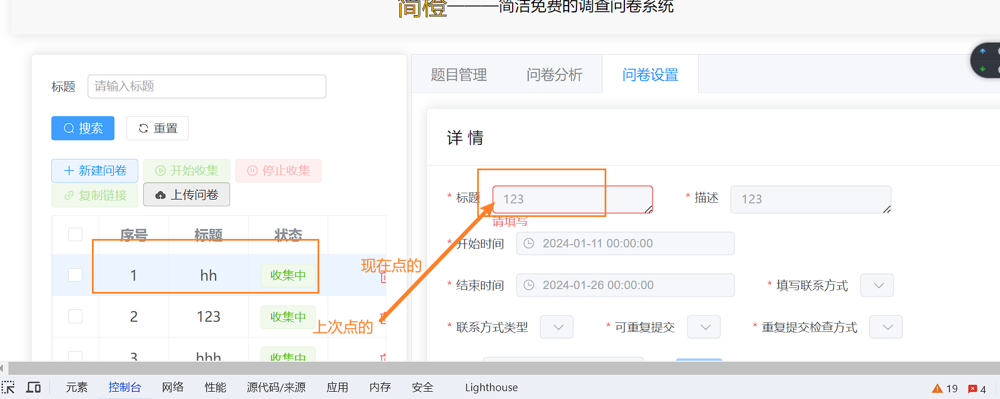
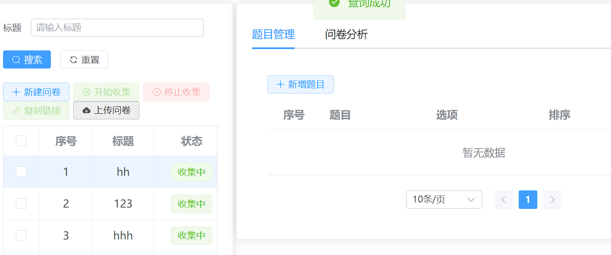
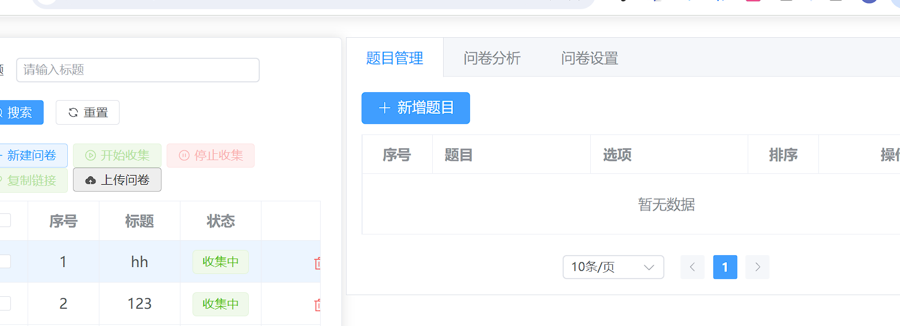
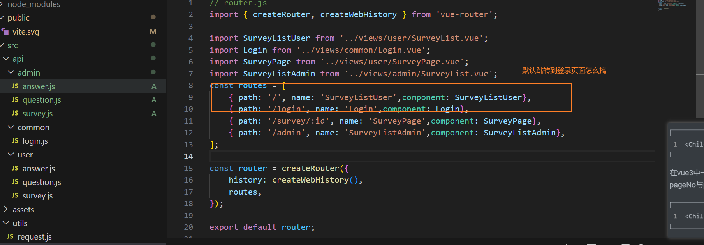

项目技术

项目功能介绍：

### 1 项目前端技术

+ vue3
+ element-plus
+ vite
+ axios
+ vue-router

### 2 项目功能介绍

- 首页
  - 可填写的问卷列表

- 管理页面
  - 问卷管理模块
    - 问卷列表(问卷序号、标题、状态等信息)
    - 问卷创建（标题、描述、起止时间、填写联系方式、重复提交检验方式、水印）
    - 问卷导入
    - 问卷删除
    - 问卷修改
    - 开始收集
    - 停止收集
    - 复制链接
  - 问卷题目管理
    - 题目列表（序号、题目、选项、排序）
    - 创建题目（序号、题目、选项、排序）
    - 修改题目
    - 删除题目

  - 问卷分析
    - 问卷结果分析(题目数量、答题次数、统计浏览器次数、统计联系方式数量、第一次答题时间、最后一次答题时间)
    - 逐题分析（浏览器答题记录、选项占比分析、填写详情【选项/答案、备注、填写时间、联系方式、浏览器指纹、用户标记】）
- 问卷填写
    - 问卷展示(依据问卷ID展示问卷题目)
    - 问卷水印展示
    - 联系方式、问卷答案校验
    - 是否重复提交校验
    - 问卷开始结束日期校验

  - 移动端适配

  - 多用户登录

### 3 问卷填写页面实现

页面结构与功能点：

+ 水印背景（注意与页面的适配）**TODO**
+ 问卷标题
+ 问卷描述
+ 问卷题目展示
  + 题目类型
  + 题目标题
  + 题目内容(判断题目类型并且展示、规则校验)
    + 单选
    + 多选
    + 简答
+ 联系方式(校验是否需要填写、填写是否合法)
+ 提交(校验填写内容是否符合要求、封装数组并且提交后台)
  + 首先校验问卷信息是否完整、联系方式是否合规，通过则显示对话框(确认or取消)
  + 选择确认则进行如下步骤
    + 封装答案信息（首先遍问题，获取问题、选项、答案)
      - 定义答案数组用于存放各题目答案
      - 如果是简答题，直接将问题ID、答案添加到数组中
      - 如果是单选题，看答案是否需要填写备注信息，如果是且填写了就将问题ID、答案、备注添加到数组中
      - 如果是多选题，首先要循环遍历答案数组，如果此答案在选项有必填备注信息，则判断是否已填写，如果没填写则提示，反之则将其加入数组中
    + 遍历答案数组，给每个题目添加指纹、问卷id、联系方式
    + 提交答案数组、如果失败显示提示信息，如果成功，则问卷表单禁用disabled 为真、表单不可提交
    + 将 对话框(确认or取消)隐藏

### 4 问卷管理页面

- 问卷管理模块
  - 问卷列表(问卷序号、标题、状态等信息)
  - 问卷创建模板（标题、描述、起止时间、填写联系方式、是否可重复提交、重复提交检验方式、水印）
  - 问卷导入
  - 问卷删除
  - 问卷修改
  - 开始收集
  - 停止收集
  - 复制链接
  - 问卷搜索
  - 重置
- 问卷题目管理
  - 题目列表（序号、题目、选项、排序）
  - 创建题目（序号、题目、选项、排序）
  - 修改题目
  - 删除题目
- 问卷分析
  - 问卷结果分析(题目数量、答题次数、统计浏览器次数、统计联系方式数量、第一次答题时间、最后一次答题时间)
  - 逐题分析（浏览器答题记录、选项占比分析、填写详情【选项/答案、备注、填写时间、联系方式、浏览器指纹、用户标记】）

点击显示错位的问题 （监听函数里面的newValue 和oldValue 写错了）

刷新不及时的问题 ，项目里面的这些标签页一般靠点击触发，不需要在组件里面写onMounted

tab 页面切换之后题目管理数据没有了，可能是监听函数里面的newValue 和oldValue 写错了的问题，此处显示的是上一个的数据，但是上一个没有数据

（此外注意：v-if ,v-show 的区别）

TODO ：生命周期，loading ，传数据，不要重复请求，GitHub登录

监听watch、computed、js 数组的一些常见方法、组件之间传递消息的方法

