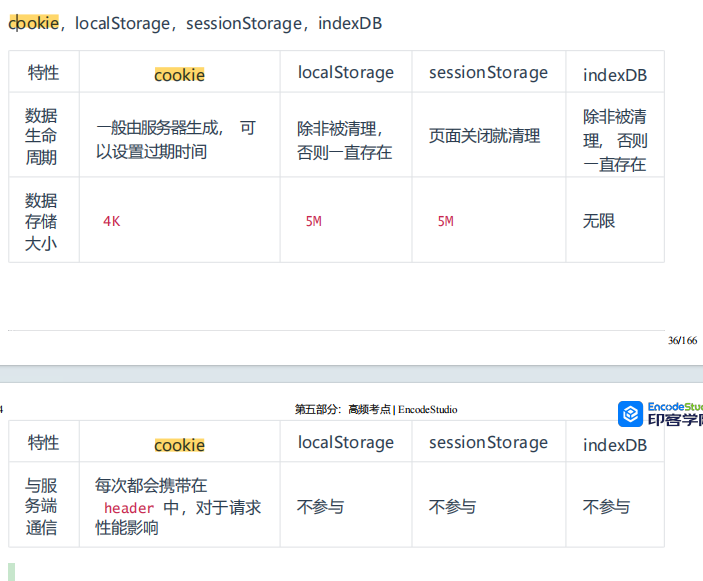

# CSS

## 1 盒子模型

所有 HTML 元素都可以视为一个盒子，该盒子包括： margin 、 border 、 padding、content

盒模型有2类， 标准盒模型和IE盒模型，最主要的区别还是在width和height的含义上

- 在标准盒模型中，width、height代表的是content的宽高
- 在IE盒模型中，width、height代表的是content + padding + border的宽高

`box-sizing: content-box;` 代表的是标准盒模型，`box-sizing: border-box;` 代表的是IE盒模型。

## 2.选择器

1. id选择器（#box） 
2. 类选择器（.one） 
3. 标签选择器（div） 
4. 后代选择器（#box div） 
5. 子选择器（.one>one_1） 
6. 相邻同胞选择器（.one+.two） 
7. 群组选择器（div,p） 

### 优先级

!important > 行内样式 > ID选择器 > 类选择器 > 标签选择器 > 通配符 > 浏览器默认属性

### 优先级计算

1. `!important`
2. 内联样式（1000）
3. ID 选择器（0100）
4. 类选择器 / 属性选择器 / 伪类选择器（0010）
5. 元素选择器 / 关系选择器 / 伪元素选择器（0001）
6. 通配选择器（0000）

### 继承

可继承的属性：font-size, font-family, color

不可继承的样式：border, padding, margin, width, height

## 3. 说说em/px/rem/vh/vw区别?

- `em`：相对于父元素的字体大小。父元素的字体大小是`16px`，那么`1em`就等于`16px` 
- `px`：固定像素单位。
- `rem`：相对于根元素（`html`）的字体大小。根元素的字体大小是`16px`，那么`1rem`就等于`16px` 
- `vh`：视口高度单位。`1vh` 等于视口高度的 1%
- `vw`：视口宽度单位。`1vw`等于视口宽度的1% 

## 4.BFC

理解：BFC是css布局的一个概念，是一块独立的渲染区域，一个环境，里面的元素不会影响到外部的元素

### 如何生成BFC：（脱离文档流）

​		     【1】根元素，即HTML元素（最大的一个BFC）

​		     【2】float的值不为none

​		     【3】position的值为absolute或fixed

​		     【4】overflow的值不为visible（默认值。内容不会被修剪，会呈现在元素框之外）

​		     【5】display的值为inline-block、table-cell、table-caption

### BFC布局规则：

`BFC`就是一个块级元素，块级元素会在垂直方向一个接一个的排列

`BFC`就是页面中的一个隔离的独立容器，容器里的标签不会影响到外部标签

垂直方向的距离由margin决定， 属于同一个`BFC`的两个相邻的标签外边距会发生重叠

计算`BFC`的高度时，浮动元素也参与计算

### BFC作用：

1. 利用 BFC 避免 margin 重叠
2. 自适应两栏布局
3. 清除浮动

## 5. 居中

### 水平垂直居中

**实现方式**

实现元素水平垂直居中的方式：

- 父元素position: relative子元素  position: absolute +  top、 left、right、bottom:0 +margin:auto
- 父元素position: relative子元素  position: absolute+   top: 50%;left: 50%+transform：`translate(-50%, -50%);
- table布局： 设置父元素为`display:table-cell`，vertical-align: middle; text-align: center; 子元素设置 `display: inline-block`。  
- flex布局：   display: flex;   justify-content: center;     align-items: center;
- grid布局：  display: grid;   align-items:center;  justify-content: center;

### 水平居中

+ 元素为行内元素，设置父元素 text-align:center 
+ 如果元素宽度固定， 可以设置左右 margin 为 auto ; 
+ 如果元素为绝对定位，设置父元素 position 为 relative ，元素设 left:0;right:0;margin:auto; 
+ 使用 flex-box 布局，指定 justify-content 属性为center 
+ display 设置为 tabel-ceil

### 垂直居中

+ 将显示方式设置为表格， display:table-cell ,同时设置 vertial-align：middle 
+ 使用 flex 布局，设置为 align-item： center 
+ 绝对定位中设置 bottom:0,top:0 ,并设置 margin:auto 
+ 绝对定位中固定高度时设置 top:50%，margin-top 值为高度⼀半的负值 
+ 文本垂直居中设置 line-height 为 height 值

## 6. **flexbox（弹性盒布局模型）,以及适用场景？** 

该布局模型的目的是提供一种更加高效的方式来对容器中的条目进行布局、对齐和分配空间。在传统的布局方式中，block 布局是把块在垂直方向从上到下依次排列的；而 inline 布局则是在水平方向来排列。弹性盒布局并没有这样内在的方向限制，可以由开发人员自由操作。 

Flex Container的属性有：

- flex-direction，决定主轴的方向
- flex-wrap，决定Flex item时候可以换行
- justify-content，定义了item在主轴上的对齐方式
- align-items，定义了item在交叉轴上如何对齐
- align-content，定义了多根轴线的对齐方式，如果项目只有一根轴线，该属性不起作用

对于项目布局

- order: 数值越小，排序越前
- flex-grow: 拉伸布局
- flex-shrink: 收缩布局
- flex: 结合order 、grow、 shrink布局
- flex-basis: 基本布局
- aligin-self: 布局

适用场景：弹性布局适合于移动前端开发、两栏三栏自适应布局 。 

## 7.怎么理解回流跟重绘？什么场景下会触发

**浏览器计算页面布局的过程就叫做`回流`**

GPU将已经计算好几何信息的容器在屏幕上亮起来就是`重绘`

### 触发回流：页面上有容器的几何属性发生变更

1. 改变窗口的尺寸
2. 改变元素的尺寸
3. display: none | block;（增加或删除可见元素）
4. 页面初次渲染

### 触发重绘：容器非几何属性变更，比如颜色等

1. 修改背景颜色
2. 修改背景图片
3. 边框颜色
4. 字体颜色
5. 回流

 **回流 会带来重绘，重绘不一定带来回流**

## 7. 画三角形

首先，需要把元素的宽度、高度设为0。然后设置边框样式，如设置四个边框大小为40px solid 将三个边框颜色设置为透明，剩下那个设置为红色。

```
width: 0;
height: 0;
border-top: 40px solid transparent;
border-left: 40px solid transparent;
border-right: 40px solid transparent;
border-bottom: 40px solid #ff0000;
```

## 8. 让Chrome支持小于12px 的文字方式有哪些？

常见的解决方案有：

- zoom
- -webkit-transform:scale()
- -webkit-text-size-adjust:none

`Zoom` 是非标属性，有兼容问题，**缩放会改变了元素占据的空间大小，触发重排**

`-webkit-transform:scale()` **大部分现代浏览器支持， 缩放不会改变了元素占据的空间大小，页面布局不会发生变化**

`-webkit-text-size-adjust`对谷歌浏览器有版本要求，在27之后，就取消了该属性的支持，并且只对英文、数字生效


## 9 常用定位方式有哪些 相对于谁定位

position 属性指定了元素的定位类型。

position 属性的五个值：

- static： static是默认值，元素在正常的流中，top、right、bottom、left和z-index属性无效。 
- relative：相对定位元素的定位是相对其正常位置。 top、right、bottom、left和z-index属性有效。 
- fixed：元素脱离正常的流，相对于浏览器窗口进行定位 
- absolute：绝对定位的元素的位置相对于最近的已定位父元素，如果元素没有已定位的父元素，那么它的位置相对于<html>
- sticky：粘性定位的元素是依赖于用户的滚动，在 **position:relative** 与 **position:fixed** 定位之间切换。 

## 10 display属性值有哪些？

block 转换成块状元素。 

inline 转换成行内元素。 

none 设置元素不可见。 

inline-block 象行内元素⼀样显示，但其内容象块类型元素⼀样显示。 

list-item 像块类型元素⼀样显示， 并添加样式列表标记。

table 此元素会作为块级表格来显示 

inherit 规定应该从父元素继承 display 属性的值

## 11 如何实现一个不定宽高的div垂直水平居中

- 父元素position: relative子元素  position: absolute+   top: 50%;left: 50%+transform：`translate(-50%, -50%);
- table布局： 设置父元素为`display:table-cell`，vertical-align: middle; text-align: center; 子元素设置 `display: inline-block`。  
- flex布局：   display: flex;   justify-content: center;     align-items: center;
- grid布局：  display: grid;   align-items:center;  justify-content: center;

## 12 如何实现一个左边宽度固定右边宽度自适应的两栏布局

使用弹性布局 父元素使用display：flex，左边元素设置宽度大小，右边元素设置flex：1

```
<style>
    .box{
        display: flex;
    }
    .left {
        width: 100px;
    }
    .right {
        flex: 1;
    }
</style>
<div class="box">
    <div class="left">左边</div>
    <div class="right">右边</div>
</div>
```


# HTML

## 1 语义化的理解 

就是用正确的标签做正确的事情 。 

HTML 语义化就是让页面的内容结构化，便于对**浏览器 、搜索引擎解析**； 

在没有样式 CSS 情况下也以⼀种⽂档格式显示， 并且是**容易阅读的。** 

搜索引擎的爬虫依赖于标记来确定上下⽂和各个关键字的权重，**利于 SEO** 。 

使阅读源代码的⼈对网站更容易将网站分块，便于阅读维护理解

## 2. src与href 区别

src 用于替换当前元素， href用于在当前⽂档和引用资源之间确立联系。 

src  指向外部资源的位置，在请求 src 资源时会将其指向的资源下载并应用到⽂档内，例如 js 脚本， img 图片和 frame 等元素，当浏览器解析到该元素时，会暂停其它资源下载，直到将该资源加载、编译、执行完毕。所以一般将js脚本放在底部。

href 指向网络资源，当浏览器识别到它指向的⽂件时，就会并⾏下载资源，不会停⽌对当前⽂档的处理，通常用于a、link元素。

## 3. **iframe 标签有那些优点和缺点？**

⾏内元素有： a b span img input select strong 

块级元素有： div ul ol li dl dt dd h1 h2 h3 h4… p 

空元素：`<br>` `<hr>` ``  `<input>` ` <link>`  `<meta> `

⾏内元素不可以设置宽高，不独占⼀⾏ 

块级元素可以设置宽高， 独占⼀⾏

## 4 Canvas和SVG有什么区别？ 

+ svg 绘制出来的每⼀个图形的元素都是独立的 DOM 节点， 能够方便的绑定事件或，也可以通过脚本和CSS进行修改  只能通过脚本修改。 canvas 输出的是⼀整幅画布，不支持事件处理器，只能通过脚本修改
+ svg 输出的图形是矢量图形，放大缩⼩不会失真和锯齿 。而 canvas 输出标量画布，就像⼀张图片⼀样，放大会失真或者锯齿

# JS

## 1. JS的数据类型及检测方法

基本数据类型：number、string、undefined、null、boolean、symbol（es6）、bigInt（es7）

 引用数据类型：object、array、function 

检测方法： 

- typeof :检测基本数据类型，但是null和object都被检测为对象 例：`typeof undefined // "undefined"`
- Instance of: 主要用来检测引用数据类型，不能正确检测基本数据类型，原理是判断其原型链上能不能找到该类型的原型 , 语法`obj instanceof Class` 
- Object.prototype.toString.call(): 可以检测任何类

## 2. ES6新增

- **let 和 const**：用于变量声明，提供块级作用域。
- **箭头函数（Arrow Functions）** ：简化了函数表达式的写法，使用 `=>` 符号
- **类（Classes）** ：引入了基于类的面向对象编程语法。

```
class Person {
  constructor(name) {
    this.name = name;
  }
  greet() {
    return `Hello, ${this.name}!`;
  }
}
```

- **模板字符串（Template Literals）** ：允许嵌入表达式的字符串字面量。
- **默认参数值**：允许函数参数有默认值。
- **解构赋值（Destructuring Assignment）** ：允许从数组或对象中提取数据并赋值给变量。

```
const [a, b] = [1, 2];
const { x, y } = { x: 10, y: 20 };
```

- **扩展运算符（Spread Operator）和剩余参数（Rest Parameters）** ：使用 `...` 实现。

```
const numbers = [1, 2, 3];
const newNumbers = [...numbers, 4, 5]; // Spread operator

function sum(...args) { // Rest parameters
  return args.reduce((sum, current) => sum + current, 0);
}
```

- **模块导入和导出（Modules）** ：使用 `import` 和 `export` 语法。
- **Promise 对象**：用于异步编程。
- **生成器和迭代器（Generators & Iterators）** ：引入生成器函数，可通过 `yield` 关键字暂停和恢复执行
- **新的数据结构**：如 `Map`, `Set`, `WeakMap`, `WeakSet`
- **Symbol 类型**：引入了新的原始数据类型 `Symbol`，可用作唯一的属性键。
- **新的静态方法和属性**：例如 `Array.from`, `Object.assign`, `Number.isFinite`, `Math.trunc` 等

##  3. let、const、var区别

|            | var      | let    | const  |
| ---------- | -------- | ------ | ------ |
| 块级作用域 | 没有     | 有     | 有     |
| 变量提升   | 有       | 没有   | 没有   |
| 暂时性死区 | 没有     | 有     | 有     |
| 初始值     | 可以没有 | 可以有 | 必须有 |
| 重复声明   | 可以     | 不可以 | 不可以 |

## 4. ==和===区别

- **`=` 是相等运算符**，当使用 `==` 比较两个变量时，如果它们的类型不相同，会进行类型转化再进行比较。

- **`===` 是严格相等运算符，它不会执行类型转换。仅当变量的值和类型都相同时，它们才被认为是相等的**。


## 5. 原型与原型链

每个函数都会有一个prototype属性，它就是原型对象，通过实例化出来的对象有`_proto_`属性，指向原型对象

```
let a = new A()
a._proto_ = A.prototype
```

**原型链是一个对象查找属性和方法时的查找机制。**如果在对象自身上找不到请求的属性或方法，JavaScript 会沿着这个对象的原型链向上查找，直到找到属性或方法或者到达原型链的顶端（也就是 `Object.prototype`）。如果在原型链的任何一级上找到了属性或方法，查找过程就会停止；如果一直没找到，通常会返回 `undefined`（对于方法调用则会抛出错误）。

`Object.prototype` 的原型是 `null`，这表示原型链的终点，即没有更多的原型对象可以查找。

 

```
    function Person() {}
    var person = new Person()
    console.log(person.__proto__ === Person.prototype)//true
    console.log(Person.prototype.constructor===Person)//true
    //顺便学习一个ES5的方法,可以获得对象的原型
    console.log(Object.getPrototypeOf(person) === Person.prototype) // true

```

## 6.作用域与闭包

**作用域**：是程序中定义变量的区域，分为全局作用域（代码的任何地方都能访问到的变量）和局部作用域（只能在函数或者代码块内部访问的变量）作用域链的变量只能向上访问， 变量访问到 window 对象即被终止，简单的说，作用域就是变量与函数的可访问范围， 即**作用域控制着变量与函数的可⻅性和 生命周期**

**闭包**：当一个函数嵌套在另一个函数中，内部函数会保留外部函数的作用域，即使外部函数已经执行完毕，内部函数依然可以访问外部函数中的变量

 常用的两个用途： 能够实现封装和缓存等； 

闭包的好处是可以读取函数内部的变量， 让这些变量始终保 持在内存中

闭包的坏处 ：就是消耗内存 、不正当使用会造成内存溢出的问题 

## 7. Promise

promise 是一个对象，用来传递异步操作的信息。代表着某个未来才会知道结果的时间，并未这个事件提供统一的api，以进行异步处理

有了这个对象，就可以让异步操作以同步的操作的流程来表达出来，避免层层嵌套的回调地狱

### 三种状态

promise代表一个异步状态，有三个状态**pending（进行中），Resolve(以完成），Reject（失败）**

一旦状态改变，就不会在变。状态的改变只能通过`resolve、reject`来实现，从进行中变为以完成或者失败

### 方法

`Promise.race()` 和 `Promise.all()` 用于处理多个 Promise 实例的情况。 promise.all()是里面状态都改变，那就会输出，得到一个数组，promise.race() 里面只有一个状态变为rejected或者fulfilled即输出，

`then()` 方法用于注册当 Promise 对象的状态变为 resolved（成功）时的回调函数 ，`catch()` 方法用于注册当 Promise 对象的状态变为 rejected（失败）时的回调函数。 `finally()` 方法用于注册当 Promise 对象无论状态如何都要执行的回调函数。 

### 缺点

promise通常用来解决回调地狱的问题，但也有几个**不可忽视的缺点**

+ promise一旦新建就会立即执行，无法中途取消

  当处于pending状态时，无法得知当前处于哪一个状态，是刚刚开始还是刚刚结束

  如果不设置回调函数，promise内部的错误就无法反映到外部

  promise封装ajax时，由于promise是异步任务，发送请求的三步会被延后到整个脚本同步代码执行完，并且将响应回调函数延迟到现有队列的最后，如果大量使用会大大降低了请求效率。

##  8. 箭头函数特点

- 箭头函数的语法更简单，省去了`function`关键字
- 普通函数：谁调用这个函数，this指向谁，箭头函数：在哪里定义函数，this指向谁
- 不可以使用 arguments 对象，该对象在函数体内不存在  ，但可以用剩余参数语法（…args）
- 不可以当作构造函数，也就是说，不可以使用 new 命令 

##  9 new一个对象的过程

- **创建一个新对象**： `new` 操作符首先创建一个空的简单 JavaScript 对象（即 `{}`）。
- **设置原型**：新对象的  `__proto__` 属性会被设置为构造函数的 `prototype` 属性，新对象会继承构造函数原型上的方法和属性。
- **绑定 this 值**：构造函数内部的 `this` 被绑定到新创建的对象上。
- **执行构造函数**：`new` 操作符后面的函数（构造函数）会被调用，其参数也会按照指定的参数传递进去。构造函数内部的代码通常会初始化新对象的属性，并执行其他必要的设置。
- **返回新对象**：如果构造函数返回一个对象，那么这个对象会成为 `new` 操作符的返回值。如果构造函数没有返回对象，那么 `new` 操作符会返回刚刚创建的新对象。

## 10. 深拷贝与浅拷贝

**浅拷贝**只复制对象的第一层属性。如果属性值是原始类型 则复制的是值本身；如果属性值是复合类型则复制的是引用（内存地址），而不是实际的值。当修改了拷贝后对象中的某个嵌套对象，原始对象中对应的嵌套对象也会被修改，因为它们引用的是同一块内存地址。

浅拷贝方法： 数组的 from()、slice()、 concat() 与扩展运算符、 object.assign 等方法可以实现浅拷贝

**深拷贝**是完全复制一个对象，包括对象内部嵌套的对象。深拷贝后的对象与原始对象不共享任何引用。

+ 最简单的深拷贝实现是使用 `JSON.stringify()` 和 `JSON.parse()`。这种方法会将对象转换成 JSON 字符串，然后再将字符串解析成一个新的对象，例` JSON.parse(JSON.stringify(original));`
+ 使用三方库**lodash的** cloneDeep 方法

## 11. 简述forEach()和map()循环的主要区别

- 返回值：`forEach()` 没有返回值，而 `map()` 返回一个新数组。
- 原数组：`forEach()` 会改变原数组，而 `map()` 不会改变原数组，而是返回一个新数组。
- 使用场景：如果需要对数组进行操作并且不需要返回值，可以使用 `forEach()`；如果需要对数组进行操作并且需要返回一个新数组，可以使用 `map()`。

## 12.简述JSONP的工作原理（它为什么不是真的AJAX）

JSONP是利用 `<script>` 标签进行跨域请求的技术。它不是真正的 AJAX，因为它并不使用 XMLHttpRequest 对象发送请求，而是通过动态创建 `<script>` 标签来加载外部脚本。 

### 工作原理

- **客户端创建请求**： 先定义一个回调函数，然后通过动态创建一个 `<script>` 标签来向服务器发起请求。请求的 URL 包含一个查询参数，通常称为 `callback` 或 `jsonp`，其值是准备接收响应的回调函数的名称。
- **服务器响应**： 服务器将调用指定回调函数的 JavaScript 代码作为脚本的内容发送给客户端。
- **客户端处理**： 浏览器会执行服务器返回的 JavaScript 代码。
- **执行回调函数**： 回调函数执行时，它处理从服务器接收到的数据。 

## 13. 对async/await理解

**`async` 关键字用于声明一个函数是异步的**。`async` 函数返回 的是Promise 对象。

**`await` 关键字用于等待一个 Promise 解决（fulfilled）**。它只能在 `async` 函数中使用。`await` 会暂停 `async` 函数的执行，等待 Promise 解决后再继续执行，并返回解决的值。如果 Promise 被拒绝（rejected），`await` 会抛出拒绝的原因，**可以用 `try...catch` 语句捕获这个错误

## 14. 精度丢失问题

**精度丢失问题**通常是由于其使用 **IEEE 754 双精度浮点数格式**来表示数字所导致的。这个问题的根源在于二进制浮点数在表示某些十进制小数时的不精确性。

### 解决方案

- **使用整数进行计算**: 通过将浮点数转换为整数（例如，将 0.1 转为 10），进行计算后再转换回去。这种方法对于简单的运算有效，但对于复杂的数学运算可能不实用。
- **使用第三方库**: 使用专门处理大数或者精确小数运算的库，如 `BigInt`（对于大整数）、`decimal.js` 或 `bignumber.js`（对于高精度的小数运算）。这些库提供了精确的数字运算方法。
- **内置 BigInt 类型**: 对于大整数，ES2020 引入了 `BigInt` 类型，可以用来表示任意精度的整数。

## 15 垃圾回收机制和内存泄漏

### 垃圾回收机制

Js运行时，需要分配内存空间来储存变量和值，当这些变量不再运行的时候，系统就会收回被占用的内存

**回收机制**

Js有自动回收机制，会定期清理不再使用的变量，然后释放内存。

Js有两种变量，全局变量和局部变量，全局变量的内存是等页面卸载之后就被释放；局部变量等到函数执行完毕之后就被释放


### 内存泄露

内存泄露是计算机程序中的一个缺陷，它发生在分配给程序的内存由于某些原因未能释放，尽管它不再被程序使用。在长时间运行的应用程序中，内存泄露可能会导致内存消耗持续增加，最终可能耗尽系统资源，导致程序变慢甚至崩溃


## 16 防抖 节流

- **防抖**：防止抖动，用于将用户的操作行为触发转换为程序行为触发，在一段时间内某个事件连续触发多次，回调只会执行一次。

  **应用场景**： input框输入请求

- **节流**：控制流量，主要用于用户在与页面交互时控制事件发生的频率，一段时间内控制事件每隔n秒执行一次

  **应用场景**：游戏中的射击按钮、调整窗口大小时持续更新布局

## 17. cookie、sessionStorage、localStorage、indexDB区别



## 18.eventloop（事件循环机制）

在事件循环中，当主线程执行完当前的同步任务后，会检查事件队列中是否有待处理的事件。如果有，主线程会取出事件并执行对应的回调函数。这个循环的过程被称为**事件循环**（Event Loop），它由**主线程**和**任务队列**两部分组成。**主线程**负责执行`同步任务`，而`异步任务`则通过**任务队列**进行处理。


### 同步任务

同步任务是按照代码的书写顺序一步一步执行的任务。当主线程执行同步任务时，会阻塞后续的代码执行，直到当前任务执行完成。典型的同步任务包括函数调用、变量赋值、算术运算等。

### 异步任务

异步任务是在主线程执行的同时，通过回调函数或其他机制委托给其他线程或事件来处理的任务。在执行异步任务时，主线程不会等待任务完成，而是继续执行后续代码。包括：回调函数 `callback`、计时器、`Promise/async` `await`、`process.nextTick`等

### 任务队列类型

任务队列分为`宏任务`队列（macrotask queue）和`微任务`队列（microtask queue）两种。**在执行完当前宏任务后，会检查微任务队列，执行其中的微任务，然后再取下一个宏任务执行。这个过程不断循环，形成事件循环。** 

1、宏任务（Macrotasks）是一些较大粒度的任务，包括：

- 所有同步任务
- `setTimeout`、`setInterval`
- `setImmediate`（Node.js环境）
- `requestAnimationFrame`
- 事件监听回调函数等
- I/O操作，如文件读写、数据库数据读写等
- ...

2、微任务（Microtasks）是一些较小粒度、高优先级的任务，包括：

- `Promise`的`then`、`catch`、`finally`
- `async/await`中的代码
- `Generator`函数
- `MutationObserver`
- `process.nextTick`（Node.js 环境）
- ...


## 19 数组方法

### 一、操作方法

[数组基本操作可以归纳为 增、删、改、查](https://juejin.cn/post/6964192660311506980) 

#### 增

下面前三种是对原数组产生影响的增添方法，第四种则不会对原数组产生影响

- push() ：`push()`方法接收任意数量的参数，并将它们添加到数组末尾，返回数组的最新长度 
- unshift() ：unshift()在数组开头添加任意多个值，然后返回新的数组长度 
- splice() ：传入三个参数，分别是开始位置、0（要删除的元素数量）、插入的元素，返回空数组 
- concat()： 首先会创建一个当前数组的副本，然后再把它的参数添加到副本末尾，最后返回这个新构建的数组，不会影响原始数组 

#### 删

下面三种都会影响原数组，最后一项不影响原数组：

- pop()：`pop()` 方法用于删除数组的最后一项，同时减少数组的` length` 值，返回被删除的项 
- shift()：`shift()`方法用于删除数组的第一项，同时减少数组的` length` 值，返回被删除的项 
- splice()：传入两个参数，分别是开始位置，删除元素的数量，返回包含删除元素的数组 
- slice()：slice() 用于创建一个包含原有数组中一个或多个元素的新数组，不会影响原始数组 

#### 改

即修改原来数组的内容，常用`splice`： splice() 传入三个参数，分别是开始位置，要删除元素的数量，要插入的任意多个元素，返回删除元素的数组，对原数组产生影响 

#### 查

即查找元素，返回元素坐标或者元素值

- indexOf(): 返回要查找的元素在数组中的位置，如果没找到则返回1 
- includes():返回要查找的元素在数组中的位置，找到返回`true`，否则`false` 
- find(): 返回第一个匹配的元素 

### 二、排序方法

数组有两个方法可以用来对元素重新排序：

- reverse(): 颠倒数组顺序,返回值是颠倒后的数组,原数组也会被颠倒
- sort(): sort()方法接受一个比较函数，用于判断哪个值应该排在前面 

### 三、转换方法

常见的转换方法有：join() 方法接收一个参数，即字符串分隔符，返回包含所有项的字符串

### 四、迭代方法

常用来迭代数组的方法（都不改变原数组）有如下：

- some(): 数组每一项都运行传入的函数，如果有一项函数返回 true ，则这个方法返回 true 

- every(): 对数组每一项都运行传入的函数，如果对每一项函数都返回 true ，则这个方法返回 true 

- forEach(): 对数组每一项都运行传入的函数，没有返回值 

- filter(): 对数组每一项都运行传入的函数，函数返回 `true` 的项会组成数组之后返回 

- map()： 对数组每一项都运行传入的函数，返回由每次函数调用的结果构成的数组

- `reduce()`方法从数组的第一项开始，逐个遍历到最后。

  `reduceRight()`则从数组的最后一项开始，向前遍历到第一项。

[小结](https://juejin.cn/post/7241875961130745911)

特定的循环，并且需要中断和跳过可使用 `for`

无需返回值可使用 `forEach、for...of`

检查是否满足指定条件而无需使用元素可使用 `some、every`

筛选符合条件的元素可使用`filter、find、findLast`

找到符合条件的元素索引可使用 `findIndex、findLastIndex`

需要对不符合展示条件的数据继续再处理时可使用`map`

需要依赖数组元素上次结果，如累计可使用 `reduce、reduceRight`

## 20. [ES6  Map 与Set](https://juejin.cn/post/7330914575695937547)

Set是一种集合数据结构，只能存储唯一的值，即不允许重复。 

特点：Set中的元素按照插入顺序排序，并且不能重复。可以存储任意类型的值：基本类型和引用类型。Set是可迭代的，可以使用for...of循环遍历。

### Set常用方法：

- `add(value)`: 向Set中添加一个新的值。
- `delete(value)`: 从Set中删除指定的值。
- `has(value)`: 检查Set中是否存在指定的值。
- `clear()`: 清空Set中的所有值。
- `size`: 返回Set中的元素个数。

### Set 用于数组去重方法

```
--------------------------------------方法一 [....new Set(arr)]
let arr = [1, 1, 2, 2, 3];
let newArr = [...new Set(arr)];
console.log(newArr); // 输出: [1, 2, 3]
--------------------------------------方法二 Array.from与Set
let arr = [1, 1, 2, 2, 3];
// 创建一个 Set 对象 
let set = new Set(arr);
// 将 Set 对象转换为数组
let newArr = Array.from(set); 
console.log(newArr); // 输出: [1, 2, 3]
```

Map是一种键值对的集合，可以使用任意类型的值作为键。 

特点：Map中的键值对按照插入顺序排序，并且键不能重复。可以存储任意类型的值：基本类型和引用类型。Map是可迭代的，可以使用for...of循环遍历。

### Map常用方法：

- `set(key, value)`: 向Map中添加一个键值对。
- `get(key)`: 根据键获取对应的值。
- `has(key)`: 检查Map中是否存在指定的键。
- `delete(key)`: 从Map中删除指定的键值对。
- `clear()`: 清空Map中的所有键值对。
- `size`: 返回Map中的键值对个数。

### 应用场景：

**set**：去除数组中的重复元素。 存储一组唯一的值，并快速检查某个值是否存在。 

**map**:存储需要快速查找的键值对数据。 维护一种关联关系，例如存储用户信息等。 

## 21 Map与Object的区别

1.键的类型：Object中键的类型只能是字符串，符号，整数，在Map中键的类型可以是任何类型的值，包括对象
2.插入顺序：在Map中，键的插入顺序会被保留
3.大小：Map可以用size属性来获取，Object只能手动计算
4.迭代：Map支持for of 循环和forEach，Object只能有for in，并且需要判断属性是否是自身属性而不是继承属性
5.性能：在频繁增删键值对的场景下，Map的性能更好

## 22 什么是隐式类型转换？

隐式类型转换是指在表达式求值过程中，JavaScript自动将一个数据类型转换为另一个数据类型，而无需显式地调用转换函数。 

### 隐式类型转换：

- 数字转字符串：通过将 <u>数字与一个空字符串相加</u>，JavaScript会将数字隐式转换为字符串。 
- 字符串转数字：通过使用一元加号操作符<u>（+）</u>对字符串进行操作，JavaScript会将字符串隐式转换为数字。 
- 布尔值转数字：通过使用一元加号操作符（+）对布尔值进行操作，JavaScript会将布尔值隐式转换为数字，`true`转换为1，`false`转换为0。 
- 字符串转布尔值：通过使用两个逻辑 <u>非操作符（!!） 对字符串进行操作，JavaScript会将字符串隐式转换为布尔值，非空字符串转换为`true`，空字符串转换为`false`。 
- 对象的隐式转换：对象转换为字符串或者数字

## 23 如何判断一个变量是对象还是数组

- Array.isArray( )函数来判断, 例：`Array.isArray(arr) `
- instanceof , 例：`arr instanceof Array `
- Object.prototype.toString.call()
- 构造函数。例：` a.__proto__.constructor === Array `

## 24 删除对象属性

利用delete关键字

````
const o = {
    p: 10,
    m: 20
}

delete o.p
console.log(o) // { m: 20 }
// 删除对象的属性后，在访问返回 undefined
console.log(o.p) // undefined

````

## 25 JSON序列化缺点是什么

+ **undefined、任意的函数以及 symbol** 值，在序列化过程中**会被忽略**
+ **Date** 日期调用了 toJSON() 将其转换为了 string 字符串（Date.toISOString()），因此**会被当做字符串处理**。
+ **NaN 和 Infinity 格式的数值及 null 都会被当做 null**。
+ 其他类型的对象，包括 Map/Set/WeakMap/WeakSet，**仅会序列化可枚举的属性**。
+ 对包含**循环引用**的对象（对象之间相互引用，形成无限循环）执行此方法，**会抛出错误**。

## 26 如何实现继承？ proto ，class

+ 原型链继承:
  + **实现方式：** 子类构造函数的原型对象指向父类的实例。 
  + 缺点：
    + 引用类型的属性会被所有实例共享，存在属性共享的问题。
    + 不能向父类传递参数, 无法通过子类向父类传参。
+ 借用构造函数继承
  + **实现方式：** 在子类构造函数中调用父类构造函数，并使用 `call` 或 `apply` 方法绑定 `this` 
  + 缺点：
    + 不能继承父类原型上的方法。
    + 每次创建子类实例都会创建一份父类方法的副本，存在内存浪费。
+ 组合继承
  + **实现方式：** 同时使用原型链继承和构造函数继承。
  + 缺点：子类原型链上存在两份相同的属性，存在内存浪费。
+ 原型式继承
  + **实现方式：** 利用一个空的构造函数作为中介，创建一个对象并将该对象的原型指向某个对象。
  + 缺点：
    - 无法传递参数。
    - 引用类型的属性会被所有实例共享，存在属性共享的问题。
+ 寄生式继承：
  + **实现方式：** 在原型式继承的基础上，对对象进行扩展，并返回扩展后的对象。
  + **缺点：** 无法传递参数，存在属性共享的问题。
+ 寄生组合继承
  + **实现方式：** 使用寄生式继承来继承父类原型，然后将结果指定给子类的原型。
  + 
+ es6 class继承
  + 优点：极大地简化了原型链代码
  + 缺点：不能兼容所有的浏览器

## 27 如何监听浏览器关闭或者刷新事件？？

window.onbeforeload

页面加载时只执行 onload 事件。

页面关闭时，先 onbeforeunload 事件，再 onunload 事件。

页面刷新时先执行 onbeforeunload事件，然后 onunload 事件，最后 onload 事件。

## 什么是事件代理？？

## 本地缓存方式

WebStorage(localstorage、sessionstorage)、Cookies、indexDB 

## this指向

# VUE

## 1. [vue生命周期](https://juejin.cn/post/7208823936300482619)

Vue2 的生命周期主要是：

> 1. beforeCreate：创建实例之前调用，此时实例的数据观测、事件等还未初始化。
> 2. created：创建实例后调用，此时实例的数据观测、事件等已经初始化完成。
> 3. beforeMount：挂载实例之前调用，此时模板已经编译完成，但是还未挂载到DOM。
> 4. mounted：挂载实例后调用，此时实例已经挂载到DOM，可以进行DOM操作。
> 5. beforeUpdate：数据更新之前调用，此时可以进行状态的最后更改。
> 6. updated：数据更新后调用，此时DOM已经完成更新，可以进行DOM操作。
> 7. beforeDestroy：销毁实例之前调用，此时实例仍然完全可用。
> 8. Destoryed: 销毁实例后调用，此时实例已经完全卸载。

而 `vue3` 在 `vue2` 的基础上进行了一些改变，主要是针对最后两个生命周期：

> beforeDestroy -> beforeUnmount
>
> Destoryed -> Unmounted

另外 `options API` 和 `composition API` 在生命周期上也有一些小的不同：

> `composition API` 提供了 `setup` 函数作为入口函数，替换了 `beforeCreate` 和 `created` 这两个生命周期钩子。`composition API`中的钩子函数，通过在生命周期钩子前面加上 `on` 来访问组件的生命周期钩子。需要注册，并且只能在 `setup` 期间同步使用

## 2，vue3新特性

 

[图来源](https://juejin.cn/post/7103740259925491742)

## 3.vue3性能优化体现在哪几个方面

###  1、编译阶段优化 

##### ① **diff算法优化**

`vue3`在`diff`算法中相比`vue2`增加了`静态标记`，其作用是为了会发生变化的地方添加一个`flag标记`，下次发生变化的时候`直接`找该地方进行比较。

##### ② **静态提升**

**Vue3中对`不参与更新`的元素，会做静态提升，`只会被创建一次`，在渲染时直接复用。**免去了重复的创建操作，优化内存。

没做静态提升之前，未参与更新的元素也在`render函数`内部，会重复`创建阶段`。
 做了静态提升后，未参与更新的元素，被`放置在render 函数外`，每次渲染的时候只要`取出`即可。同时该元素会被打上`静态标记值为-1`，特殊标志是`负整数`表示永远不会用于 `Diff`。

##### ③ **事件监听缓存**

默认情况下绑定事件行为会被视为动态绑定（`没开启事件监听器缓存`），所以`每次`都会去追踪它的变化。`开启事件侦听器缓存`后，没有了静态标记。也就是说下次`diff算法`的时候`直接使用`。

##### ④ **SSR优化**

当静态内容大到一定量级时候，会用`createStaticVNode`方法在客户端去生成一个`static node`，这些`静态node`，会被直接`innerHtml`，就不需要创建对象，然后根据对象渲染。

#### **2、源码体积**

相比`Vue2`，`Vue3`整体体积`变小`了，除了移出一些`不常用的API`，最重要的是`Tree shanking`。

任何一个函数，如`ref、reavtived、computed`等，仅仅在`用到`的时候才`打包`，`没用到`的模块都`被摇掉`，打包的整体体积`变小`。

#### **3、响应式系统**

`vue2`中采用 `defineProperty`来劫持整个对象，然后进行深度遍历所有属性，给`每个属性`添加`getter和setter`，实现响应式。`vue3`采用`proxy`重写了响应式系统，因为`proxy`可以对`整个对象进行监听`，所以不需要深度遍历。

## 3. Vue3 里为什么要用 Proxy API 替代 defineProperty API ？（响应式原理）

[可详细参考博客](https://juejin.cn/post/7201334455058923580)

1、`vue2`中采用 `defineProperty`来劫持整个对象，然后进行深度遍历所有属性，给每个属性添加getter和setter，实现响应式。但是存在以下的问题：

- 检测不到对象属性的添加和删除
- 数组API方法无法监听到
- 需要对每个属性进行遍历监听，如果嵌套对象，需要深层监听，造成性能问题

2、proxy：监听是针对一个对象的，那么对这个对象的所有操作会进入监听操作。

- Proxy直接可以劫持整个对象，并返回一个新对象，通过操作新的对象达到响应式目的
- Proxy可以直接监听数组的变化（push、shift、splice）
- Proxy有多达13种拦截方法,不限于apply、ownKeys、deleteProperty、has等等，这是Object.defineProperty不具备的

 **Proxy 只会代理对象的第一层，那么 Vue3 又是怎样处理这个问题的呢？**

判断当前 Reflect.get 的返回值是否为 Object，如果是则再通过 reactive 方法做代理， 这样就实现了深度观测。

## 4. `watch` 和 `watchEffect`区别

`watch` 和 `watchEffect` 都是监听器，`watchEffect` 是一个副作用函数。它们之间的区别有：

- `watch` ：要指明监视的数据源和监视的回调。而 `watchEffect` 可以自动监听数据源作为依赖。不用指明监视哪个数据，监视的回调中用到哪个数据，那就监视哪个数据。
- `watch` 可以访问`改变之前和之后`的值，`watchEffect` 只能获取`改变后`的值。
- `watch` 运行的时候`不会立即执行`，值改变后才会执行，而 `watchEffect` 运行后可`立即执行`。这一点可以通过 `watch` 的配置项 `immediate` 改变。


##  5.  v-if 和 v-for 的优先级哪个高

在 `vue2` 中 `v-for` 的优先级更高，但是在 `vue3` 中优先级改变了。`v-if` 的优先级更高。

## 6.  script setup 是干啥的？

`scrtpt setup` 是 `vue3` 的语法糖，简化了`组合式 API` 的写法，并且运行性能更好。使用 `script setup` 语法糖的特点：

- 属性和方法无需返回，可以直接使用。
- 引入`组件`的时候，会`自动注册`，无需通过 `components` 手动注册。
- 使用 `defineProps` 接收父组件传递的值。
- `useAttrs` 获取属性，`useSlots` 获取插槽，`defineEmits` 获取自定义事件。
- 默认`不会对外暴露`任何属性，如果有需要可使用 `defineExpose` 。

##  7. Vue2/Vue3组件通信方式？

[参考](https://juejin.cn/post/7133250560441974798)

| 方式             | Vue2           | Vue3                 |
| ---------------- | -------------- | -------------------- |
| 父传子           | props          | props                |
| 子传父           | $emit          | emits                |
| 父传子           | $attrs         | attrs                |
| 子传父           | $listeners     | 无(合并到 attrs方式) |
| 父传子           | provide/inject | provide/inject       |
| 子组件访问父组件 | $parent        | $parent              |
| 父组件访问子组件 | $children      | 无                   |
| 父组件访问子组件 | $refs          | expose&ref           |
| 兄弟传值         | EventBus       | mitt                 |

 此外还有插槽、v-model 实现父子组件之间的通信，组件还可以借助Vuex或者Pinia状态管理工具进行通信 

 

## 8. vue3 理解ref与reactive 、toRef 和 toRefs？

- `ref` 函数创建的响应式数据，在模板中可以直接被使用，在 `JS` 中需要通过 `.value` 的形式才能使用。
- `ref` 函数可以接收**原始数据类型**与**引用数据类型**。
- `reactive` 函数只能接收**引用数据类型**。
- `ref` 底层还是使用 `reactive` 来做，`ref` 是在 `reactive` 上在进行了封装，增强了其能力，使它支持了对原始数据类型的处理。
- 在 `Vue3` 中 `reactive` 能做的，`ref` 也能做，`reactive` 不能做的，`ref` 也能做。

`toRef`：针对一个响应式对象的属性创建一个ref，使得该属性具有响应式，两者之间保持引用关系。 

`toRefs`： 将一个**响应式对象**转为普通对象，对象的每一个属性都是对应的ref，两者保持引用关系

## 9. 谈一谈对 MVVM 的理解？

MVVM是`Model-View-ViewModel`缩写，也就是把`MVC`中的`Controller`演变成`ViewModel`。Model层代表数据模型，View代表UI组件，ViewModel是View和Model层的桥梁，数据会绑定到viewModel层并自动将数据渲染到页面中，视图变化的时候会通知viewModel层更新数据。


## 10 vue优点

主要有响应式编程、组件化开发、虚拟 DOM

**响应式编程：** Vue 会自动对页面中某些数据的变化做出响应。通过MVVM 思想实现数据的双向绑定，开发者不用再操作 DOM 对象，有更多的时间去思考业务逻辑。

**组件化开发**： Vue 通过组件，把一个单页应用中的各种模块拆分到一个一个单独的组件中，只要先<u>在父级应用中写好各种组件标签</u>（占坑），可在组件标签中写好要传入组件的参数 ，然后再分别写好各种组件的实现 （填坑），组件化开发可以<u>提高开发效率、方便重复使用、简化调试步骤、提升整个项目的可维护性、便于协同开发</u>。

虚拟DOM： **预先通过 JavaScript 进行各种计算，把最终的 DOM 操作计算出来并优化**，由于这个 DOM 操作属于预处理操作，**并没有真实的操作 DOM，所以叫做虚拟 DOM**。最后在**计算完毕才真正将 DOM 操作提交**，将 DOM 操作变化反映到 DOM 树上。

## 11. *Vue* 实现双向数据绑定原理是什么？

> **Vue2.x 采用数据劫持结合发布订阅模式（PubSub 模式）的方式，通过 Object.defineProperty 来劫持各个属性的 setter、getter，Vue3.x 使用 Proxy，在数据变动时发布消息给订阅者，触发相应的监听回调。**

关键步骤：  

```
1、实现一个监听器 Observer ，用来劫持并监听所有属性，如果属性发生变化，就通知订阅者；
2、实现一个订阅器 Dep，用来收集订阅者，对监听器 Observer 和 订阅者 Watcher 进行统一管理；
3、实现一个订阅者 Watcher，可以收到属性的变化通知并执行相应的方法，从而更新视图；
4、实现一个解析器 Compile，可以解析每个节点的相关指令，对模板数据和订阅器进行初始化。
```


 

## 12. 直接给一个数组项赋值，Vue 能检测到变化吗？

由于 JavaScript 的限制，Vue 不能检测到以下数组的变动：

- 当你利用索引直接设置一个数组项时，例如：`vm.items[indexOfItem] = newValue`
- 当你修改数组的长度时，例如：`vm.items.length = newLength`

为了解决第一个问题，Vue 提供了以下操作方法：

```
// Vue.set
Vue.set(vm.items, indexOfItem, newValue)
// vm.$set，Vue.set的一个别名
vm.$set(vm.items, indexOfItem, newValue)
// Array.prototype.splice
vm.items.splice(indexOfItem, 1, newValue)
```

为了解决第二个问题，Vue 提供了以下操作方法：

```
// Array.prototype.splice
vm.items.splice(newLength)
```

##  13 Vue 怎么用 vm.$set() 解决对象新增属性不能响应的问题 ？

使用 `Vue.set(object, propertyName, value)` 方法向嵌套对象添加响应式 property。例如

```
Vue.set(vm.someObject, 'b', 2)
```

还可以使用 `vm.$set` 实例方法，这也是全局 `Vue.set` 方法的别名：

```
this.$set(this.someObject,'b',2)
```

有时你可能需要为已有对象赋值多个新 property，比如使用 `Object.assign()` 或 `_.extend()`。但是，这样添加到对象上的新 property 不会触发更新。在这种情况下，你应该用原对象与要混合进去的对象的 property 一起创建一个新的对象。

```
this.someObject = Object.assign({}, this.someObject, { a: 1, b: 2 })
```

##  14 [v-model 的原理](https://juejin.cn/post/7331771415316791323)

### VUE2的方法

 `v-model`指令可以在表单 `input`、`radio`、`select`等表单元素上创建双向数据绑定它会根据控件类型自动选取正确的方法来更新元素。 

- text 和 textarea 元素使用 value 属性和 input 事件；
- checkbox 和 radio 使用 checked 属性和 change 事件；
- select 字段将 value 作为 prop 并将 change 作为事件。

#### 表单元素的v-model

> 在表单元素上使用`v-model`是真正意义上的**双向绑定**,能直接读取和修改v-model绑定的响应值

`v-model`在表单元素上使用,其实是一种语法糖,`v-model`只是一种简写,最终都会被转成原始写法

```
<input v-mdoel="testValue">
```

最终编译为:

```
<input type="text" :value="testValue" @input="testValue = $event.target.value">
 <!--$event  访问原始的 DOM 事件 -->
```

1. 将`目标值`(如上述testValue)与`input`元素的`value`绑定
2. 通过监听表单元素的`input`事件,将`输入值`($event.target.value)与`目标值`进行绑定
3. 最终实现双向绑定

#### 自定义组件的`v-model`

原理: 父子组件之间的通讯

- 父组件向子组件通讯:向子组件传递`props`
- 子组件向父组件通讯:子组件通过`emit`修改父组件的`props`

### VUE3的方法

#### 2.1.vue3中v-model和vue2的区别:

- 表单元素的`v-model`基本没变化
- 自定义组件的`v-model`变化较大:
  1. 删除`model`选项,不再使用 props 和 event ,声明v-model传到子组件的props和`$emit`事件名称
  2. 固定使用`modelValue`为父组件的props,使用`update:modelValue`这个emit来修改父组件的值
  3. vue3.4后新增`defineModel`简化了,自定义组件`v-model`双向绑定的操作
  4. 自定义组件支持多个v-model

vue3.4后,在表单元素的双向绑定依旧是使用`v-model`,在自定义组件中使用`v-model`时,在子组件中不需要使用父子组件之间通讯的方法如`defineProps` 和`defineEmits` ,直接使用`defineModel`即可在子组件中读取和修改父组件的值!

## 15.  *vuex* 是什么？怎么使用它？什么场景下我们会使用到 *vuex*

### **vuex 是什么**

vuex 是一个专为 Vue 应用程序开发的状态管理器，采用集中式存储管理应用的所有组件的状态。简而言之就是可以实现任意组件中通信，并可以检测数据的变化。 

### **为什么需要 vuex**

由于组件只维护自身的状态(data)，组件创建时或者路由切换时，组件会被初始化，从而导致 data 也随之销毁。

### 使用步骤：

**安装 Vuex** ->**创建 Store 实例** ->**将 Store 注册到 Vue 应用中** ->**在组件中使用状态和方法** 

**Vue组件接收交互行为，调用dispatch方法触发action相关处理，若页面状态需要改变，则调用commit方法提交mutation修改state，通过getters获取到state新值，响应数据或状态给Vue 组件，界面随之更新。** 

**vuex主要包括以下几个模块：**

- State：定义了应用状态的数据结构，可以在这里设置默认的初始状态。
- Getter：允许组件从 Store 中获取数据，mapGetters 辅助函数仅仅是将 store 中的 getter 映射到局部计算属性。
- Mutation：是唯一更改 store 中状态的方法，且必须是同步函数。
- Action：用于提交 mutation，而不是直接变更状态，可以包含任意异步操作。
- Module：允许将单一的 Store 拆分为多个 store 且同时保存在单一的状态树中。

### 应用场景

如果是 vue 的小型应用，那么没有必要使用 vuex，这个时候使用 vuex 反而会带来负担。组件之间的状态传递使用 props、自定义事件来传递即可。

但是如果涉及到 vue 的大型应用，那么就需要类似于 vuex 这样的状态管理器来管理所有组件的状态。

 

[图来源](https://juejin.cn/post/7021019423310331941)

## 16.说一下 *v-if* 与 *v-show* 的区别

v-if 是真正的条件渲染，因为它会确保在切换过程中条件块内的事件监听器和子组件适当地被销毁和重建；也是惰性的：如果在初始渲染时条件为假，则什么也不做——直到条件第一次变为真时，才会开始渲染条件块。

v-show 就简单得多——不管初始条件是什么，元素总是会被渲染，并且只是简单地基于 CSS 的 “display” 属性进行切换。

所以，v-if 适用于在运行时很少改变条件，不需要频繁切换条件的场景；v-show 则适用于需要非常频繁切换条件的场景

## 17 KeepAlive相关

`KeepAlive>` 是一个内置组件，它的功能是在多个组件间动态切换时缓存被移除的组件实例。 `<KeepAlive>` 默认会缓存内部的所有组件实例，但可以通过 `include` 和 `exclude` 定制该行为。 

```
<!-- 非活跃的组件将会被缓存！ -->
<KeepAlive>
  <component :is="activeComponent" />
</KeepAlive>
```

## 18. nextTick  的作用是什么？他的实现原理是什么？

vue 更新 DOM 是异步更新的，数据变化，DOM 的更新不会马上完成，**nextTick 的回调是在下次 DOM 更新循环结束之后执行的延迟回调**。

将传入的回调函数包装成异步任务，异步任务又分微任务和宏任务，为了尽快执行所以优先选择微任务；

nextTick 提供了四种异步方法 Promise.then、MutationObserver、setImmediate、setTimeout(fn,0)

## 19. computed 的实现原理

##  [20 computed 与watch、watchEffect 区别](https://juejin.cn/post/7239528592883122234)

三者都是侦听工具，

| 对比依据              | computed | watch            | watchEffect |
| --------------------- | -------- | ---------------- | ----------- |
| 是否自动收集依赖（1） | 自动     | 需要指定依赖对象 | 自动        |
| 有无返回值            | 有       | 无               | 有          |
| 是否可以赋值          | 可以     | 不能             | 不能        |
| 使用场景              | 简单情况 | 复杂情况         | 简单情况    |
| 是否立即执行          | 是       | 看参数（2）      | 是          |
| 本质                  | class    | function         | function    |


## 21.*Vue* 组件的 *data* 为什么必须是函数

组件中的 data 写成一个函数，**数据以函数返回值形式定义**。这样**每复用一次组件，就会返回一份新的 data**，类似于**给每个组件实例创建一个私有的数据空间，让各个组件实例维护各自的数据。**而单纯的写成对象形式，就使得所有组件实例共用了一份 data，就会造成一个变了全都会变的结果。

## 22. vue和react的区别

- 相同点
  - 都使用Virtural DOM
    都使用组件化思想，流程基本一致
    都是响应式，推崇单向数据流
    都有成熟的社区，都支持服务端渲染
- 不同点
  - 1.数据绑定：Vue实现了双向的数据绑定，react数据流动是单向的
     2.数据渲染：大规模的数据渲染，react更快
     3.使用场景：React配合Redux架构适合大规模多人协作复杂项目，Vue适合小快的项目
     4.开发风格：react推荐做法jsx + inline style把html和css都写在js了
     	    vue是采用webpack + vue-loader单文件组件格式，html, js, css同一个文件

## 23 *scoped* 是如何实现样式穿透的？

+ **vue2** 使用 `::v-deep` 操作符( >>> 的别名), vue3使用` :deep()`  
+ 定义一个含有 scoped 属性的 style 标签之外，再定义一个不含有 scoped 属性的 style 标签，即在一个 vue 组件中定义一个全局的 style 标签，一个含有作用域的 style 标签：

## 24  说一下 ref 的作用是什么？ 

*ref* 的作用是被用来给元素或子组件注册引用信息。引用信息将会注册在父组件的 *$refs* 对象上。其特点是：

- 如果在普通的 *DOM* 元素上使用，引用指向的就是 *DOM* 元素
- 如果用在子组件上，引用就指向组件实例

所以常见的使用场景有：

1. 基本用法，本页面获取 *DOM* 元素
2. 获取子组件中的 *data*
3. 调用子组件中的方法

## 25 说说你对 SPA 单页面的理解，它的优缺点分别是什么？

SPA 仅在 Web 页面初始化时加载相应的 HTML、JavaScript 和 CSS。一旦页面加载完成，SPA 不会因为用户的操作而进行页面的重新加载或跳转，而是利用路由机制实现 HTML 内容的变换。

 

[图来源](https://juejin.cn/post/7018876571658223623)

## 26 **Vue 中的 Key 的作用是什么？**

> **key 的作用主要是为了高效的更新虚拟 DOM**。另外 *vue* 中在使用相同标签名元素的过渡切换时，也会使用到 *key* 属性，其目的也是为了让 *vue* 可以区分它们，否则 *vue* 只会替换其内部属性而不会触发过渡效果。

## 27.**你的接口请求一般放在哪个生命周期中？为什么要这样做？**

接口请求可以放在钩子函数 *created、beforeMount、mounted* 中进行调用，因为在这三个钩子函数中，*data* 已经创建，可以将服务端端返回的数据进行赋值。

但是推荐在 *created* 钩子函数中调用异步请求，因为在 *created* 钩子函数中调用异步请求有以下优点：

- 能更快获取到服务端数据，减少页面 *loading* 时间
- *SSR* 不支持 *beforeMount 、mounted* 钩子函数，所以放在 *created* 中有助于代码的一致性
- *created* 是在模板渲染成 *html* 前调用，即通常初始化某些属性值，然后再渲染成视图。如果在 *mounted* 钩子函数中请求数据可能导致页面闪屏问题

## 28. *vue* 为什么采用异步渲染  

> 因为如果不采用异步更新，那么每次更新数据都会对当前组件进行重新渲染；所以为了性能考虑，*Vue* 会在本轮数据更新后，再去异步更新视图。
>
> 异步渲染的原理：
>
> 1. 调用 *notify( )* 方法，通知 *watcher* 进行更新操作
> 2. 依次调用 watcher 的 update 方法
> 3. 对 watcher 进行去重操作（通过id）放到队列里
> 4. 执行完后异步清空这个队列，nextTick 进行批量更新操作

## 29. 组件中写 *name* 选项有哪些好处

1. 可以**通过名字找到对应的组件**（ 递归组件：组件自身调用自身 ）
2. 可以通过 *name* 属性实现**缓存功能**（*keep-alive*）
3. 可以通过 *name* 来**识别组件**（跨级组件通信时非常重要）
4. 使用 *vue-devtools*  

## 30 说一说自定义指令有哪些生命周期？

- bind: **只调用一次，指令第一次绑定到元素时调用**，用这个钩子函数可以定义一个在绑定时执行一次的初始化动作。
- inserted: **被绑定元素插入父节点时调用**（父节点存在即可调用，不必存在于 document 中）。
- update: 被绑定元素所在的模板更新时调用，而不论绑定值是否变化。通过比较更新前后的绑定值，可以忽略不必要的模板更新（详细的钩子函数参数见下）。
- componentUpdated: 被绑定元素所在模板完成一次更新周期时调用。
- unbind: **只调用一次， 指令与元素解绑时调用。**

## 31vue 中相同逻辑如何进行抽离？

在 Vue 2 中，mixins 是创建可重用组件逻辑的主要方式。尽管  Vue 3 中保留了 mixins 支持，但对于组件间的逻辑复用，[使用组合式 API 的组合式函数](https://cn.vuejs.org/guide/reusability/composables.html)是现在更推荐的方式。 

组合式函数逻辑复用的核心思想就是在组合式函数里写逻辑代码，需要在模板中使用或其他地方使用的变量或者函数直接return出来，然后在需要使用这些逻辑的组件中引入即可。 

##  

## 33  在 Vue 中要获取当前时间你会放到 computed 还是 methods 里？

放在 *computed* 里面比较适合。因为 *computed* 只有在它的相关依赖发生改变时才会重新求值。 

## 34 在给 vue 中的元素设置 key 值时可以使用 Math 的 random 方法么

*random* 是生成随机数，有一定概率多个 *item* 会生成相同的值，不能保证唯一。

如果是根据数据来生成 *item*，数据具有 *id* 属性，那么就可以使用 *id* 来作为 *key*。

如果不是根据数据生成 *item*，那么最好的方式就是使用时间戳来作为 *key*。或者使用诸如 *uuid* 之类的库来生成唯一的 *id*。

## 35. 插槽与作用域插槽的区别是什么？

插槽的作用是子组件提供了可替换模板，父组件可以更换模板的内容。

[作用域插槽](https://v2.cn.vuejs.org/v2/guide/components-slots.html#%E4%BD%9C%E7%94%A8%E5%9F%9F%E6%8F%92%E6%A7%BD)实现在父组件中访问子组件的数据 

###  插槽有哪些：

默认插槽、具名插槽、动态插槽、作用域插槽

## vue-router 如何实现动态路由 **addRoute**

## vue性能优化

## Axios封装？？？

## 跨域及如何实现跨域请求？？？

# TS面试题

# React面试题

# git面试题

# 项目

# 算法：

## 1.排序方法

### 冒泡排序

 

### 选择排序

 

### 快速排序

 

### 插入排序

 

### 归并排序

 


# 浏览器

## 浏览器缓存机制

## 跨域

## http状态码

## 三次握手 四次挥手


