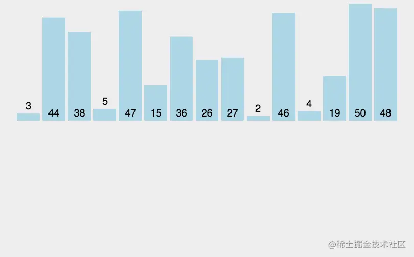
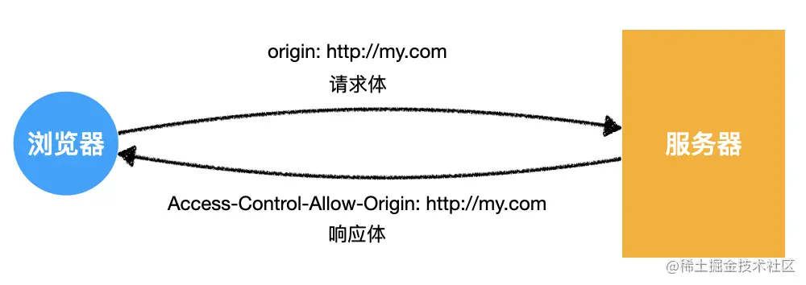
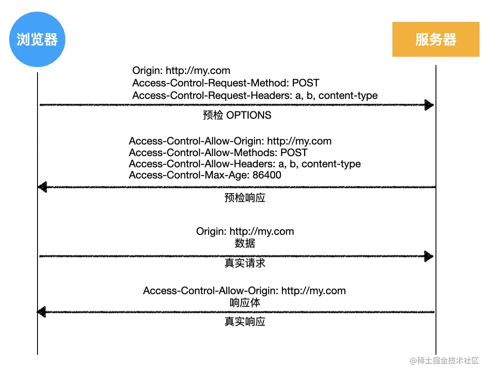
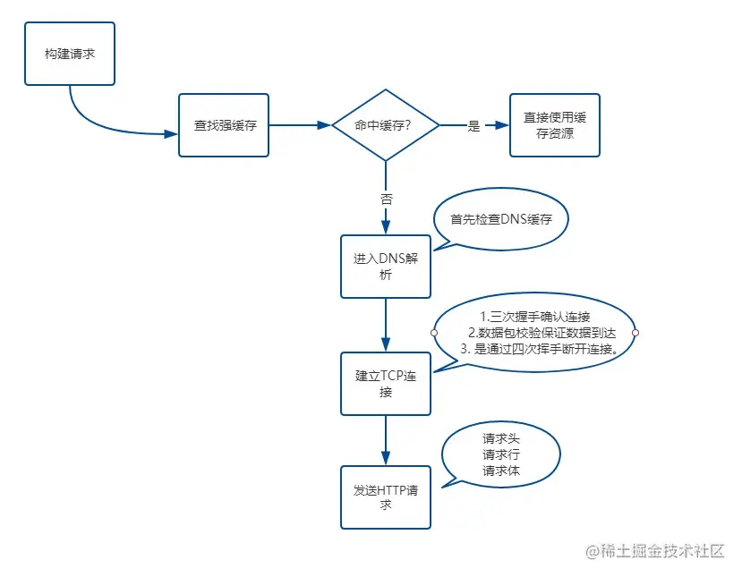

# 一、CSS

## 1 盒子模型

所有 HTML 元素都可以视为一个盒子，该盒子包括： margin 、 border 、 padding、content

盒模型有2类， 标准盒模型和IE盒模型，最主要的区别还是在width和height的含义上

- 在标准盒模型中，width、height代表的是content的宽高
- 在IE盒模型中，width、height代表的是content + padding + border的宽高

`box-sizing: content-box;` 代表的是标准盒模型，`box-sizing: border-box;` 代表的是IE盒模型。

## 2.选择器

1. id选择器（#box） 
2. 类选择器（.one） 
3. 标签选择器（div） 
4. 后代选择器（#box div） 
5. 子选择器（.one>one_1） 
6. 相邻同胞选择器（.one+.two） 
7. 群组选择器（div,p） 

### 优先级

!important > 行内样式 > ID选择器 > 类选择器 > 标签选择器 > 通配符 > 浏览器默认属性

### 优先级计算

1. `!important`
2. 内联样式（1000）
3. ID 选择器（0100）
4. 类选择器 / 属性选择器 / 伪类选择器（0010）
5. 元素选择器 / 关系选择器 / 伪元素选择器（0001）
6. 通配选择器（0000）

### 继承

可继承的属性：font-size, font-family, color

不可继承的样式：border, padding, margin, width, height

## 3. 说说em/px/rem/vh/vw区别?

- `em`：相对于父元素的字体大小。父元素的字体大小是`16px`，那么`1em`就等于`16px` 
- `px`：固定像素单位。
- `rem`：相对于根元素（`html`）的字体大小。根元素的字体大小是`16px`，那么`1rem`就等于`16px` 
- `vh`：视口高度单位。`1vh` 等于视口高度的 1%
- `vw`：视口宽度单位。`1vw`等于视口宽度的1% 

## 4.BFC

理解：BFC是css布局的一个概念，是一块独立的渲染区域，一个环境，里面的元素不会影响到外部的元素

### 如何生成BFC：（脱离文档流）

​		     【1】根元素，即HTML元素（最大的一个BFC）

​		     【2】float的值不为none

​		     【3】position的值为absolute或fixed

​		     【4】overflow的值不为visible（默认值。内容不会被修剪，会呈现在元素框之外）

​		     【5】display的值为inline-block、table-cell、table-caption

### BFC布局规则：

`BFC`就是一个块级元素，块级元素会在垂直方向一个接一个的排列

`BFC`就是页面中的一个隔离的独立容器，容器里的标签不会影响到外部标签

垂直方向的距离由margin决定， 属于同一个`BFC`的两个相邻的标签外边距会发生重叠

计算`BFC`的高度时，浮动元素也参与计算

### BFC作用：

1. 利用 BFC 避免 margin 重叠
2. 自适应两栏布局
3. 清除浮动

## 5. 居中

### 水平垂直居中

**实现方式**

实现元素水平垂直居中的方式：

- 父元素position: relative子元素  position: absolute +  top、 left、right、bottom:0 +margin:auto
- 父元素position: relative子元素  position: absolute+   top: 50%;left: 50%+transform：`translate(-50%, -50%);
- table布局： 设置父元素为`display:table-cell`，vertical-align: middle; text-align: center; 子元素设置 `display: inline-block`。  
- flex布局：   display: flex;   justify-content: center;     align-items: center;
- grid布局：  display: grid;   align-items:center;  justify-content: center;

### 水平居中

+ 元素为行内元素，设置父元素 text-align:center 
+ 如果元素宽度固定， 可以设置左右 margin 为 auto ; 
+ 如果元素为绝对定位，设置父元素 position 为 relative ，元素设 left:0;right:0;margin:auto; 
+ 使用 flex-box 布局，指定 justify-content 属性为center 
+ display 设置为 tabel-ceil

### 垂直居中

+ 将显示方式设置为表格， display:table-cell ,同时设置 vertial-align：middle 
+ 使用 flex 布局，设置为 align-item： center 
+ 绝对定位中设置 bottom:0,top:0 ,并设置 margin:auto 
+ 绝对定位中固定高度时设置 top:50%，margin-top 值为高度⼀半的负值 
+ 文本垂直居中设置 line-height 为 height 值

## 6. **flexbox（弹性盒布局模型）,以及适用场景？** 

该布局模型的目的是提供一种更加高效的方式来对容器中的条目进行布局、对齐和分配空间。在传统的布局方式中，block 布局是把块在垂直方向从上到下依次排列的；而 inline 布局则是在水平方向来排列。弹性盒布局并没有这样内在的方向限制，可以由开发人员自由操作。 

Flex Container的属性有：

- flex-direction，决定主轴的方向
- flex-wrap，决定Flex item时候可以换行
- justify-content，定义了item在主轴上的对齐方式
- align-items，定义了item在交叉轴上如何对齐
- align-content，定义了多根轴线的对齐方式，如果项目只有一根轴线，该属性不起作用

对于项目布局

- order: 数值越小，排序越前
- flex-grow: 拉伸布局
- flex-shrink: 收缩布局
- flex: 结合order 、grow、 shrink布局
- flex-basis: 基本布局
- aligin-self: 布局

适用场景：弹性布局适合于移动前端开发、两栏三栏自适应布局 。 

## 7.怎么理解回流跟重绘？什么场景下会触发

**浏览器计算页面布局的过程就叫做`回流`**

GPU将已经计算好几何信息的容器在屏幕上亮起来就是`重绘`

### 触发回流：页面上有容器的几何属性发生变更

1. 改变窗口的尺寸
2. 改变元素的尺寸
3. display: none | block;（增加或删除可见元素）
4. 页面初次渲染

### 触发重绘：容器非几何属性变更，比如颜色等

1. 修改背景颜色
2. 修改背景图片
3. 边框颜色
4. 字体颜色
5. 回流

 **回流 会带来重绘，重绘不一定带来回流**

## 7. 画三角形

首先，需要把元素的宽度、高度设为0。然后设置边框样式，如设置四个边框大小为40px solid 将三个边框颜色设置为透明，剩下那个设置为红色。

```
width: 0;
height: 0;
border-top: 40px solid transparent;
border-left: 40px solid transparent;
border-right: 40px solid transparent;
border-bottom: 40px solid #ff0000;
```

## 8. 让Chrome支持小于12px 的文字方式有哪些？

常见的解决方案有：

- zoom
- -webkit-transform:scale()
- -webkit-text-size-adjust:none

`Zoom` 是非标属性，有兼容问题，**缩放会改变了元素占据的空间大小，触发重排**

`-webkit-transform:scale()` **大部分现代浏览器支持， 缩放不会改变了元素占据的空间大小，页面布局不会发生变化**

`-webkit-text-size-adjust`对谷歌浏览器有版本要求，在27之后，就取消了该属性的支持，并且只对英文、数字生效


## 9 常用定位方式有哪些 相对于谁定位

position 属性指定了元素的定位类型。

position 属性的五个值：

- static： static是默认值，元素在正常的流中，top、right、bottom、left和z-index属性无效。 
- relative：相对定位元素的定位是相对其正常位置。 top、right、bottom、left和z-index属性有效。 
- fixed：元素脱离正常的流，相对于浏览器窗口进行定位 
- absolute：绝对定位的元素的位置相对于最近的已定位父元素，如果元素没有已定位的父元素，那么它的位置相对于<html>
- sticky：粘性定位的元素是依赖于用户的滚动，在 **position:relative** 与 **position:fixed** 定位之间切换。 

## 10 display属性值有哪些？

block 转换成块状元素。 

inline 转换成行内元素。 

none 设置元素不可见。 

inline-block 象行内元素⼀样显示，但其内容象块类型元素⼀样显示。 

list-item 像块类型元素⼀样显示， 并添加样式列表标记。

table 此元素会作为块级表格来显示 

inherit 规定应该从父元素继承 display 属性的值

## 11 如何实现一个不定宽高的div垂直水平居中

- 父元素position: relative子元素  position: absolute+   top: 50%;left: 50%+transform：`translate(-50%, -50%);
- table布局： 设置父元素为`display:table-cell`，vertical-align: middle; text-align: center; 子元素设置 `display: inline-block`。  
- flex布局：   display: flex;   justify-content: center;     align-items: center;
- grid布局：  display: grid;   align-items:center;  justify-content: center;

## 12 如何实现一个左边宽度固定右边宽度自适应的两栏布局

使用弹性布局 父元素使用display：flex，左边元素设置宽度大小，右边元素设置flex：1

```
<style>
    .box{
        display: flex;
    }
    .left {
        width: 100px;
    }
    .right {
        flex: 1;
    }
</style>
<div class="box">
    <div class="left">左边</div>
    <div class="right">右边</div>
</div>
```


# 二、HTML

## 1 语义化的理解 

就是用正确的标签做正确的事情 。 

HTML 语义化就是让页面的内容结构化，便于对**浏览器 、搜索引擎解析**； 

在没有样式 CSS 情况下也以⼀种⽂档格式显示， 并且是**容易阅读的。** 

搜索引擎的爬虫依赖于标记来确定上下⽂和各个关键字的权重，**利于 SEO** 。 

使阅读源代码的⼈对网站更容易将网站分块，便于阅读维护理解

## 2. src与href 区别

src 用于替换当前元素， href用于在当前⽂档和引用资源之间确立联系。 

src  指向外部资源的位置，在请求 src 资源时会将其指向的资源下载并应用到⽂档内，例如 js 脚本， img 图片和 frame 等元素，当浏览器解析到该元素时，会暂停其它资源下载，直到将该资源加载、编译、执行完毕。所以一般将js脚本放在底部。

href 指向网络资源，当浏览器识别到它指向的⽂件时，就会并⾏下载资源，不会停⽌对当前⽂档的处理，通常用于a、link元素。

## 3. **iframe 标签有那些优点和缺点？**

⾏内元素有： a b span img input select strong 

块级元素有： div ul ol li dl dt dd h1 h2 h3 h4… p 

空元素：`<br>` `<hr>` ``  `<input>` ` <link>`  `<meta> `

⾏内元素不可以设置宽高，不独占⼀⾏ 

块级元素可以设置宽高， 独占⼀⾏

## 4 Canvas和SVG有什么区别？ 

+ svg 绘制出来的每⼀个图形的元素都是独立的 DOM 节点， 能够方便的绑定事件或，也可以通过脚本和CSS进行修改  只能通过脚本修改。 canvas 输出的是⼀整幅画布，不支持事件处理器，只能通过脚本修改
+ svg 输出的图形是矢量图形，放大缩⼩不会失真和锯齿 。而 canvas 输出标量画布，就像⼀张图片⼀样，放大会失真或者锯齿

# 三、JS

## 1. JS的数据类型及检测方法

基本数据类型：number、string、undefined、null、boolean、symbol（es6）、bigInt（es7）

 引用数据类型：object、array、function 

检测方法： 

- typeof :检测基本数据类型，但是null和object都被检测为对象 例：`typeof undefined // "undefined"`
- Instance of: 主要用来检测引用数据类型，不能正确检测基本数据类型，原理是判断其原型链上能不能找到该类型的原型 , 语法`obj instanceof Class` 
- Object.prototype.toString.call(): 可以检测任何类

## 2. ES6新增

- **let 和 const**：用于变量声明，提供块级作用域。
- **箭头函数（Arrow Functions）** ：简化了函数表达式的写法，使用 `=>` 符号
- **类（Classes）** ：引入了基于类的面向对象编程语法。

```
class Person {
  constructor(name) {
    this.name = name;
  }
  greet() {
    return `Hello, ${this.name}!`;
  }
}
```

- **模板字符串（Template Literals）** ：允许嵌入表达式的字符串字面量。
- **默认参数值**：允许函数参数有默认值。
- **解构赋值（Destructuring Assignment）** ：允许从数组或对象中提取数据并赋值给变量。

```
const [a, b] = [1, 2];
const { x, y } = { x: 10, y: 20 };
```

- **扩展运算符（Spread Operator）和剩余参数（Rest Parameters）** ：使用 `...` 实现。

```
const numbers = [1, 2, 3];
const newNumbers = [...numbers, 4, 5]; // Spread operator

function sum(...args) { // Rest parameters
  return args.reduce((sum, current) => sum + current, 0);
}
```

- **模块导入和导出（Modules）** ：使用 `import` 和 `export` 语法。
- **Promise 对象**：用于异步编程。
- **生成器和迭代器（Generators & Iterators）** ：引入生成器函数，可通过 `yield` 关键字暂停和恢复执行
- **新的数据结构**：如 `Map`, `Set`, `WeakMap`, `WeakSet`
- **Symbol 类型**：引入了新的原始数据类型 `Symbol`，可用作唯一的属性键。
- **新的静态方法和属性**：例如 `Array.from`, `Object.assign`, `Number.isFinite`, `Math.trunc` 等

##  3. let、const、var区别

|            | var      | let    | const  |
| ---------- | -------- | ------ | ------ |
| 块级作用域 | 没有     | 有     | 有     |
| 变量提升   | 有       | 没有   | 没有   |
| 暂时性死区 | 没有     | 有     | 有     |
| 初始值     | 可以没有 | 可以有 | 必须有 |
| 重复声明   | 可以     | 不可以 | 不可以 |

## 4. ==和===区别

- **`=` 是相等运算符**，当使用 `==` 比较两个变量时，如果它们的类型不相同，会进行类型转化再进行比较。

- **`===` 是严格相等运算符，它不会执行类型转换。仅当变量的值和类型都相同时，它们才被认为是相等的**。


## 5. 原型与原型链

每个函数都会有一个prototype属性，它就是原型对象，通过实例化出来的对象有`_proto_`属性，指向原型对象

```
let a = new A()
a._proto_ = A.prototype
```

**原型链是一个对象查找属性和方法时的查找机制。**如果在对象自身上找不到请求的属性或方法，JavaScript 会沿着这个对象的原型链向上查找，直到找到属性或方法或者到达原型链的顶端（也就是 `Object.prototype`）。如果在原型链的任何一级上找到了属性或方法，查找过程就会停止；如果一直没找到，通常会返回 `undefined`（对于方法调用则会抛出错误）。

`Object.prototype` 的原型是 `null`，这表示原型链的终点，即没有更多的原型对象可以查找。

 

```
    function Person() {}
    var person = new Person()
    console.log(person.__proto__ === Person.prototype)//true
    console.log(Person.prototype.constructor===Person)//true
    //顺便学习一个ES5的方法,可以获得对象的原型
    console.log(Object.getPrototypeOf(person) === Person.prototype) // true

```

## 6.作用域与闭包

**作用域**：是程序中定义变量的区域，分为全局作用域（代码的任何地方都能访问到的变量）和局部作用域（只能在函数或者代码块内部访问的变量）作用域链的变量只能向上访问， 变量访问到 window 对象即被终止，简单的说，作用域就是变量与函数的可访问范围， 即**作用域控制着变量与函数的可⻅性和 生命周期**

**闭包**：当一个函数嵌套在另一个函数中，内部函数会保留外部函数的作用域，即使外部函数已经执行完毕，内部函数依然可以访问外部函数中的变量

 常用的两个用途： 能够实现封装和缓存等； 

闭包的好处是可以读取函数内部的变量， 让这些变量始终保 持在内存中

闭包的坏处 ：就是消耗内存 、不正当使用会造成内存溢出的问题 

## 7. Promise

promise 是一个对象，用来传递异步操作的信息。代表着某个未来才会知道结果的时间，并未这个事件提供统一的api，以进行异步处理

有了这个对象，就可以让异步操作以同步的操作的流程来表达出来，避免层层嵌套的回调地狱

### 三种状态

promise代表一个异步状态，有三个状态**pending（进行中），Resolve(以完成），Reject（失败）**

一旦状态改变，就不会在变。状态的改变只能通过`resolve、reject`来实现，从进行中变为以完成或者失败

### 方法

`Promise.race()` 和 `Promise.all()` 用于处理多个 Promise 实例的情况。 promise.all()是里面状态都改变，那就会输出，得到一个数组，promise.race() 里面只有一个状态变为rejected或者fulfilled即输出，

`then()` 方法用于注册当 Promise 对象的状态变为 resolved（成功）时的回调函数 ，`catch()` 方法用于注册当 Promise 对象的状态变为 rejected（失败）时的回调函数。 `finally()` 方法用于注册当 Promise 对象无论状态如何都要执行的回调函数。 

### 缺点

promise通常用来解决回调地狱的问题，但也有几个**不可忽视的缺点**

+ promise一旦新建就会立即执行，无法中途取消

  当处于pending状态时，无法得知当前处于哪一个状态，是刚刚开始还是刚刚结束

  如果不设置回调函数，promise内部的错误就无法反映到外部

  promise封装ajax时，由于promise是异步任务，发送请求的三步会被延后到整个脚本同步代码执行完，并且将响应回调函数延迟到现有队列的最后，如果大量使用会大大降低了请求效率。

##  8. 箭头函数特点

- 箭头函数的语法更简单，省去了`function`关键字
- 普通函数：谁调用这个函数，this指向谁，箭头函数：在哪里定义函数，this指向谁
- 不可以使用 arguments 对象，该对象在函数体内不存在  ，但可以用剩余参数语法（…args）
- 不可以当作构造函数，也就是说，不可以使用 new 命令 

##  9 new一个对象的过程

- **创建一个新对象**： `new` 操作符首先创建一个空的简单 JavaScript 对象（即 `{}`）。
- **设置原型**：新对象的  `__proto__` 属性会被设置为构造函数的 `prototype` 属性，新对象会继承构造函数原型上的方法和属性。
- **绑定 this 值**：构造函数内部的 `this` 被绑定到新创建的对象上。
- **执行构造函数**：`new` 操作符后面的函数（构造函数）会被调用，其参数也会按照指定的参数传递进去。构造函数内部的代码通常会初始化新对象的属性，并执行其他必要的设置。
- **返回新对象**：如果构造函数返回一个对象，那么这个对象会成为 `new` 操作符的返回值。如果构造函数没有返回对象，那么 `new` 操作符会返回刚刚创建的新对象。

## 10. 深拷贝与浅拷贝

**浅拷贝**只复制对象的第一层属性。如果属性值是原始类型 则复制的是值本身；如果属性值是复合类型则复制的是引用（内存地址），而不是实际的值。当修改了拷贝后对象中的某个嵌套对象，原始对象中对应的嵌套对象也会被修改，因为它们引用的是同一块内存地址。

浅拷贝方法： 数组的 from()、slice()、 concat() 与扩展运算符、 object.assign 等方法可以实现浅拷贝

**深拷贝**是完全复制一个对象，包括对象内部嵌套的对象。深拷贝后的对象与原始对象不共享任何引用。

+ 最简单的深拷贝实现是使用 `JSON.stringify()` 和 `JSON.parse()`。这种方法会将对象转换成 JSON 字符串，然后再将字符串解析成一个新的对象，例` JSON.parse(JSON.stringify(original));`
+ 使用三方库**lodash的** cloneDeep 方法

## 11. 简述forEach()和map()循环的主要区别

- 返回值：`forEach()` 没有返回值，而 `map()` 返回一个新数组。
- 原数组：`forEach()` 会改变原数组，而 `map()` 不会改变原数组，而是返回一个新数组。
- 使用场景：如果需要对数组进行操作并且不需要返回值，可以使用 `forEach()`；如果需要对数组进行操作并且需要返回一个新数组，可以使用 `map()`。

## 12.简述JSONP的工作原理（它为什么不是真的AJAX）

JSONP是利用 `<script>` 标签进行跨域请求的技术。它不是真正的 AJAX，因为它并不使用 XMLHttpRequest 对象发送请求，而是通过动态创建 `<script>` 标签来加载外部脚本。 

### 工作原理

- **客户端创建请求**： 先定义一个回调函数，然后通过动态创建一个 `<script>` 标签来向服务器发起请求。请求的 URL 包含一个查询参数，通常称为 `callback` 或 `jsonp`，其值是准备接收响应的回调函数的名称。
- **服务器响应**： 服务器将调用指定回调函数的 JavaScript 代码作为脚本的内容发送给客户端。
- **客户端处理**： 浏览器会执行服务器返回的 JavaScript 代码。
- **执行回调函数**： 回调函数执行时，它处理从服务器接收到的数据。 

## 13. 对async/await理解

**`async` 关键字用于声明一个函数是异步的**。`async` 函数返回 的是Promise 对象。

**`await` 关键字用于等待一个 Promise 解决（fulfilled）**。它只能在 `async` 函数中使用。`await` 会暂停 `async` 函数的执行，等待 Promise 解决后再继续执行，并返回解决的值。如果 Promise 被拒绝（rejected），`await` 会抛出拒绝的原因，**可以用 `try...catch` 语句捕获这个错误

## 14. 精度丢失问题

**精度丢失问题**通常是由于其使用 **IEEE 754 双精度浮点数格式**来表示数字所导致的。这个问题的根源在于二进制浮点数在表示某些十进制小数时的不精确性。

### 解决方案

- **使用整数进行计算**: 通过将浮点数转换为整数（例如，将 0.1 转为 10），进行计算后再转换回去。这种方法对于简单的运算有效，但对于复杂的数学运算可能不实用。
- **使用第三方库**: 使用专门处理大数或者精确小数运算的库，如 `BigInt`（对于大整数）、`decimal.js` 或 `bignumber.js`（对于高精度的小数运算）。这些库提供了精确的数字运算方法。
- **内置 BigInt 类型**: 对于大整数，ES2020 引入了 `BigInt` 类型，可以用来表示任意精度的整数。

## 15 垃圾回收机制和内存泄漏

### 垃圾回收机制

Js运行时，需要分配内存空间来储存变量和值，当这些变量不再运行的时候，系统就会收回被占用的内存

**回收机制**

Js有自动回收机制，会定期清理不再使用的变量，然后释放内存。

Js有两种变量，全局变量和局部变量，全局变量的内存是等页面卸载之后就被释放；局部变量等到函数执行完毕之后就被释放


### 内存泄露

内存泄露是计算机程序中的一个缺陷，它发生在分配给程序的内存由于某些原因未能释放，尽管它不再被程序使用。在长时间运行的应用程序中，内存泄露可能会导致内存消耗持续增加，最终可能耗尽系统资源，导致程序变慢甚至崩溃


## 16 防抖 节流

- **防抖**：防止抖动，用于将用户的操作行为触发转换为程序行为触发，在一段时间内某个事件连续触发多次，回调只会执行一次。

  **应用场景**： input框输入请求

- **节流**：控制流量，主要用于用户在与页面交互时控制事件发生的频率，一段时间内控制事件每隔n秒执行一次

  **应用场景**：游戏中的射击按钮、调整窗口大小时持续更新布局

## 17. cookie、sessionStorage、localStorage、indexDB区别


## 18.eventloop（事件循环机制）

在事件循环中，当主线程执行完当前的同步任务后，会检查事件队列中是否有待处理的事件。如果有，主线程会取出事件并执行对应的回调函数。这个循环的过程被称为**事件循环**（Event Loop），它由**主线程**和**任务队列**两部分组成。**主线程**负责执行`同步任务`，而`异步任务`则通过**任务队列**进行处理。


### 同步任务

同步任务是按照代码的书写顺序一步一步执行的任务。当主线程执行同步任务时，会阻塞后续的代码执行，直到当前任务执行完成。典型的同步任务包括函数调用、变量赋值、算术运算等。

### 异步任务

异步任务是在主线程执行的同时，通过回调函数或其他机制委托给其他线程或事件来处理的任务。在执行异步任务时，主线程不会等待任务完成，而是继续执行后续代码。包括：回调函数 `callback`、计时器、`Promise/async` `await`、`process.nextTick`等

### 任务队列类型

任务队列分为`宏任务`队列（macrotask queue）和`微任务`队列（microtask queue）两种。**在执行完当前宏任务后，会检查微任务队列，执行其中的微任务，然后再取下一个宏任务执行。这个过程不断循环，形成事件循环。** 

1、宏任务（Macrotasks）是一些较大粒度的任务，包括：

- 所有同步任务
- `setTimeout`、`setInterval`
- `setImmediate`（Node.js环境）
- `requestAnimationFrame`
- 事件监听回调函数等
- I/O操作，如文件读写、数据库数据读写等
- ...

2、微任务（Microtasks）是一些较小粒度、高优先级的任务，包括：

- `Promise`的`then`、`catch`、`finally`
- `async/await`中的代码
- `Generator`函数
- `MutationObserver`
- `process.nextTick`（Node.js 环境）
- ...


## 19 数组方法

### 一、操作方法

[数组基本操作可以归纳为 增、删、改、查](https://juejin.cn/post/6964192660311506980) 

#### 增

下面前三种是对原数组产生影响的增添方法，第四种则不会对原数组产生影响

- push() ：`push()`方法接收任意数量的参数，并将它们添加到数组末尾，返回数组的最新长度 
- unshift() ：unshift()在数组开头添加任意多个值，然后返回新的数组长度 
- splice() ：传入三个参数，分别是开始位置、0（要删除的元素数量）、插入的元素，返回空数组 
- concat()： 首先会创建一个当前数组的副本，然后再把它的参数添加到副本末尾，最后返回这个新构建的数组，不会影响原始数组 

#### 删

下面三种都会影响原数组，最后一项不影响原数组：

- pop()：`pop()` 方法用于删除数组的最后一项，同时减少数组的` length` 值，返回被删除的项 
- shift()：`shift()`方法用于删除数组的第一项，同时减少数组的` length` 值，返回被删除的项 
- splice()：传入两个参数，分别是开始位置，删除元素的数量，返回包含删除元素的数组 
- slice()：slice() 用于创建一个包含原有数组中一个或多个元素的新数组，不会影响原始数组 

#### 改

即修改原来数组的内容，常用`splice`： splice() 传入三个参数，分别是开始位置，要删除元素的数量，要插入的任意多个元素，返回删除元素的数组，对原数组产生影响 

#### 查

即查找元素，返回元素坐标或者元素值

- indexOf(): 返回要查找的元素在数组中的位置，如果没找到则返回1 
- includes():返回要查找的元素在数组中的位置，找到返回`true`，否则`false` 
- find(): 返回第一个匹配的元素 

### 二、排序方法

数组有两个方法可以用来对元素重新排序：

- reverse(): 颠倒数组顺序,返回值是颠倒后的数组,原数组也会被颠倒
- sort(): sort()方法接受一个比较函数，用于判断哪个值应该排在前面 

### 三、转换方法

常见的转换方法有：join() 方法接收一个参数，即字符串分隔符，返回包含所有项的字符串

### 四、迭代方法

常用来迭代数组的方法（都不改变原数组）有如下：

- some(): 数组每一项都运行传入的函数，如果有一项函数返回 true ，则这个方法返回 true 

- every(): 对数组每一项都运行传入的函数，如果对每一项函数都返回 true ，则这个方法返回 true 

- forEach(): 对数组每一项都运行传入的函数，没有返回值 

- filter(): 对数组每一项都运行传入的函数，函数返回 `true` 的项会组成数组之后返回 

- map()： 对数组每一项都运行传入的函数，返回由每次函数调用的结果构成的数组

- `reduce()`方法从数组的第一项开始，逐个遍历到最后。

  `reduceRight()`则从数组的最后一项开始，向前遍历到第一项。

[小结](https://juejin.cn/post/7241875961130745911)

特定的循环，并且需要中断和跳过可使用 `for`

无需返回值可使用 `forEach、for...of`

检查是否满足指定条件而无需使用元素可使用 `some、every`

筛选符合条件的元素可使用`filter、find、findLast`

找到符合条件的元素索引可使用 `findIndex、findLastIndex`

需要对不符合展示条件的数据继续再处理时可使用`map`

需要依赖数组元素上次结果，如累计可使用 `reduce、reduceRight`

## 20. [ES6  Map 与Set](https://juejin.cn/post/7330914575695937547)

Set是一种集合数据结构，只能存储唯一的值，即不允许重复。 

特点：Set中的元素按照插入顺序排序，并且不能重复。可以存储任意类型的值：基本类型和引用类型。Set是可迭代的，可以使用for...of循环遍历。

### Set常用方法：

- `add(value)`: 向Set中添加一个新的值。
- `delete(value)`: 从Set中删除指定的值。
- `has(value)`: 检查Set中是否存在指定的值。
- `clear()`: 清空Set中的所有值。
- `size`: 返回Set中的元素个数。

### Set 用于数组去重方法

```
--------------------------------------方法一 [....new Set(arr)]
let arr = [1, 1, 2, 2, 3];
let newArr = [...new Set(arr)];
console.log(newArr); // 输出: [1, 2, 3]
--------------------------------------方法二 Array.from与Set
let arr = [1, 1, 2, 2, 3];
// 创建一个 Set 对象 
let set = new Set(arr);
// 将 Set 对象转换为数组
let newArr = Array.from(set); 
console.log(newArr); // 输出: [1, 2, 3]
```

Map是一种键值对的集合，可以使用任意类型的值作为键。 

特点：Map中的键值对按照插入顺序排序，并且键不能重复。可以存储任意类型的值：基本类型和引用类型。Map是可迭代的，可以使用for...of循环遍历。

### Map常用方法：

- `set(key, value)`: 向Map中添加一个键值对。
- `get(key)`: 根据键获取对应的值。
- `has(key)`: 检查Map中是否存在指定的键。
- `delete(key)`: 从Map中删除指定的键值对。
- `clear()`: 清空Map中的所有键值对。
- `size`: 返回Map中的键值对个数。

### 应用场景：

**set**：去除数组中的重复元素。 存储一组唯一的值，并快速检查某个值是否存在。 

**map**:存储需要快速查找的键值对数据。 维护一种关联关系，例如存储用户信息等。 

## 21 Map与Object的区别

1.键的类型：Object中键的类型只能是字符串，符号，整数，在Map中键的类型可以是任何类型的值，包括对象
2.插入顺序：在Map中，键的插入顺序会被保留
3.大小：Map可以用size属性来获取，Object只能手动计算
4.迭代：Map支持for of 循环和forEach，Object只能有for in，并且需要判断属性是否是自身属性而不是继承属性
5.性能：在频繁增删键值对的场景下，Map的性能更好

## 22 什么是隐式类型转换？

隐式类型转换是指在表达式求值过程中，JavaScript自动将一个数据类型转换为另一个数据类型，而无需显式地调用转换函数。 

### 隐式类型转换：

- 数字转字符串：通过将 <u>数字与一个空字符串相加</u>，JavaScript会将数字隐式转换为字符串。 
- 字符串转数字：通过使用一元加号操作符<u>（+）</u>对字符串进行操作，JavaScript会将字符串隐式转换为数字。 
- 布尔值转数字：通过使用一元加号操作符（+）对布尔值进行操作，JavaScript会将布尔值隐式转换为数字，`true`转换为1，`false`转换为0。 
- 字符串转布尔值：通过使用两个逻辑  非操作符（!!） 对字符串进行操作，JavaScript会将字符串隐式转换为布尔值，非空字符串转换为`true`，空字符串转换为`false`。 
- 对象的隐式转换：对象转换为字符串或者数字

## 23 如何判断一个变量是对象还是数组

- Array.isArray( )函数来判断, 例：`Array.isArray(arr) `
- instanceof , 例：`arr instanceof Array `
- Object.prototype.toString.call()
- 构造函数。例：` a.__proto__.constructor === Array `

## 24 删除对象属性

利用delete关键字

````
const o = {
    p: 10,
    m: 20
}

delete o.p
console.log(o) // { m: 20 }
// 删除对象的属性后，在访问返回 undefined
console.log(o.p) // undefined

````

## 25 JSON序列化缺点是什么

+ **undefined、任意的函数以及 symbol** 值，在序列化过程中**会被忽略**
+ **Date** 日期调用了 toJSON() 将其转换为了 string 字符串（Date.toISOString()），因此**会被当做字符串处理**。
+ **NaN 和 Infinity 格式的数值及 null 都会被当做 null**。
+ 其他类型的对象，包括 Map/Set/WeakMap/WeakSet，**仅会序列化可枚举的属性**。
+ 对包含**循环引用**的对象（对象之间相互引用，形成无限循环）执行此方法，**会抛出错误**。

## 26 如何实现继承？ proto ，class

+ 原型链继承:
  + **实现方式：** 子类构造函数的原型对象指向父类的实例。 
  + 缺点：
    + 引用类型的属性会被所有实例共享，存在属性共享的问题。
    + 不能向父类传递参数, 无法通过子类向父类传参。
+ 借用构造函数继承
  + **实现方式：** 在子类构造函数中调用父类构造函数，并使用 `call` 或 `apply` 方法绑定 `this` 
  + 缺点：
    + 不能继承父类原型上的方法。
    + 每次创建子类实例都会创建一份父类方法的副本，存在内存浪费。
+ 组合继承
  + **实现方式：** 同时使用原型链继承和构造函数继承。
  + 缺点：子类原型链上存在两份相同的属性，存在内存浪费。
+ 原型式继承
  + **实现方式：** 利用一个空的构造函数作为中介，创建一个对象并将该对象的原型指向某个对象。
  + 缺点：
    - 无法传递参数。
    - 引用类型的属性会被所有实例共享，存在属性共享的问题。
+ 寄生式继承：
  + **实现方式：** 在原型式继承的基础上，对对象进行扩展，并返回扩展后的对象。
  + **缺点：** 无法传递参数，存在属性共享的问题。
+ 寄生组合继承
  + **实现方式：** 使用寄生式继承来继承父类原型，然后将结果指定给子类的原型。
  + 
+ es6 class继承
  + 优点：极大地简化了原型链代码
  + 缺点：不能兼容所有的浏览器

## 27 如何监听浏览器关闭或者刷新事件？？

window.onbeforeload

页面加载时只执行 onload 事件。

页面关闭时，先 onbeforeunload 事件，再 onunload 事件。

页面刷新时先执行 onbeforeunload事件，然后 onunload 事件，最后 onload 事件。

## 28 什么是事件代理？？

- **DOM事件流有3个阶段：捕获阶段，目标阶段，冒泡阶段；三个阶段的顺序为：捕获阶段——目标阶段——冒泡阶段；**
- **（更新）✅不管对于非目标阶段或者目标阶段的元素，事件响应执行顺序都是遵循先捕获后冒泡的原**

- **事件捕获是从顶层的Window逐层向内执行，事件冒泡则相反；**
- **事件委托（事件代理）是根据事件冒泡或事件捕获的机制来实现的。**

## 29 this指向

1、在全局环境下直接使用的this指向

​	指向 window 

 2、在对象中的this 

对象中的方法, this指向调用这些方法的对象 

3、函数内部的this 

默认指向window ， 严格模式中this会指向undefined，要用window.test()调用才会指向window 

4、箭头函数的this

**箭头函数没有自己的this** ，在哪里定义，this 指向谁

5、构造函数中的this 

构造函数中的this 关键字指向当前创建的实例对象。 需要注意的是 `setTimeout` 中的回调仍然是一个普通函数，因此 `this` 默认指向 `window` 

# 四、VUE

## 1. [vue生命周期](https://juejin.cn/post/7208823936300482619)

Vue2 的生命周期主要是：

> 1. beforeCreate：创建实例之前调用，此时实例的数据观测、事件等还未初始化。
> 2. created：创建实例后调用，此时实例的数据观测、事件等已经初始化完成。
> 3. beforeMount：挂载实例之前调用，此时模板已经编译完成，但是还未挂载到DOM。
> 4. mounted：挂载实例后调用，此时实例已经挂载到DOM，可以进行DOM操作。
> 5. beforeUpdate：数据更新之前调用，此时可以进行状态的最后更改。
> 6. updated：数据更新后调用，此时DOM已经完成更新，可以进行DOM操作。
> 7. beforeDestroy：销毁实例之前调用，此时实例仍然完全可用。
> 8. Destoryed: 销毁实例后调用，此时实例已经完全卸载。

而 `vue3` 在 `vue2` 的基础上进行了一些改变，主要是针对最后两个生命周期：

> beforeDestroy -> beforeUnmount
>
> Destoryed -> Unmounted

另外 `options API` 和 `composition API` 在生命周期上也有一些小的不同：

> `composition API` 提供了 `setup` 函数作为入口函数，替换了 `beforeCreate` 和 `created` 这两个生命周期钩子。`composition API`中的钩子函数，通过在生命周期钩子前面加上 `on` 来访问组件的生命周期钩子。需要注册，并且只能在 `setup` 期间同步使用

## 2，vue3新特性

 

[图来源](https://juejin.cn/post/7103740259925491742)

## 3.vue3性能优化体现在哪几个方面

###  1、编译阶段优化 

##### ① **diff算法优化**

`vue3`在`diff`算法中相比`vue2`增加了`静态标记`，其作用是为了会发生变化的地方添加一个`flag标记`，下次发生变化的时候`直接`找该地方进行比较。

##### ② **静态提升**

**Vue3中对`不参与更新`的元素，会做静态提升，`只会被创建一次`，在渲染时直接复用。**免去了重复的创建操作，优化内存。

没做静态提升之前，未参与更新的元素也在`render函数`内部，会重复`创建阶段`。
 做了静态提升后，未参与更新的元素，被`放置在render 函数外`，每次渲染的时候只要`取出`即可。同时该元素会被打上`静态标记值为-1`，特殊标志是`负整数`表示永远不会用于 `Diff`。

##### ③ **事件监听缓存**

默认情况下绑定事件行为会被视为动态绑定（`没开启事件监听器缓存`），所以`每次`都会去追踪它的变化。`开启事件侦听器缓存`后，没有了静态标记。也就是说下次`diff算法`的时候`直接使用`。

##### ④ **SSR优化**

当静态内容大到一定量级时候，会用`createStaticVNode`方法在客户端去生成一个`static node`，这些`静态node`，会被直接`innerHtml`，就不需要创建对象，然后根据对象渲染。

#### **2、源码体积**

相比`Vue2`，`Vue3`整体体积`变小`了，除了移出一些`不常用的API`，最重要的是`Tree shanking`。

任何一个函数，如`ref、reavtived、computed`等，仅仅在`用到`的时候才`打包`，`没用到`的模块都`被摇掉`，打包的整体体积`变小`。

#### **3、响应式系统**

`vue2`中采用 `defineProperty`来劫持整个对象，然后进行深度遍历所有属性，给`每个属性`添加`getter和setter`，实现响应式。`vue3`采用`proxy`重写了响应式系统，因为`proxy`可以对`整个对象进行监听`，所以不需要深度遍历。

## 3. Vue3 里为什么要用 Proxy API 替代 defineProperty API ？（响应式原理）

[可详细参考博客](https://juejin.cn/post/7201334455058923580)

1、`vue2`中采用 `defineProperty`来劫持整个对象，然后进行深度遍历所有属性，给每个属性添加getter和setter，实现响应式。但是存在以下的问题：

- 检测不到对象属性的添加和删除
- 数组API方法无法监听到
- 需要对每个属性进行遍历监听，如果嵌套对象，需要深层监听，造成性能问题

2、proxy：监听是针对一个对象的，那么对这个对象的所有操作会进入监听操作。

- Proxy直接可以劫持整个对象，并返回一个新对象，通过操作新的对象达到响应式目的
- Proxy可以直接监听数组的变化（push、shift、splice）
- Proxy有多达13种拦截方法,不限于apply、ownKeys、deleteProperty、has等等，这是Object.defineProperty不具备的

 **Proxy 只会代理对象的第一层，那么 Vue3 又是怎样处理这个问题的呢？**

判断当前 Reflect.get 的返回值是否为 Object，如果是则再通过 reactive 方法做代理， 这样就实现了深度观测。

## 4. `watch` 和 `watchEffect`区别

`watch` 和 `watchEffect` 都是监听器，`watchEffect` 是一个副作用函数。它们之间的区别有：

- `watch` ：要指明监视的数据源和监视的回调。而 `watchEffect` 可以自动监听数据源作为依赖。不用指明监视哪个数据，监视的回调中用到哪个数据，那就监视哪个数据。
- `watch` 可以访问`改变之前和之后`的值，`watchEffect` 只能获取`改变后`的值。
- `watch` 运行的时候`不会立即执行`，值改变后才会执行，而 `watchEffect` 运行后可`立即执行`。这一点可以通过 `watch` 的配置项 `immediate` 改变。


##  5.  v-if 和 v-for 的优先级哪个高

在 `vue2` 中 `v-for` 的优先级更高，但是在 `vue3` 中优先级改变了。`v-if` 的优先级更高。

## 6.  script setup 是干啥的？

`scrtpt setup` 是 `vue3` 的语法糖，简化了`组合式 API` 的写法，并且运行性能更好。使用 `script setup` 语法糖的特点：

- 属性和方法无需返回，可以直接使用。
- 引入`组件`的时候，会`自动注册`，无需通过 `components` 手动注册。
- 使用 `defineProps` 接收父组件传递的值。
- `useAttrs` 获取属性，`useSlots` 获取插槽，`defineEmits` 获取自定义事件。
- 默认`不会对外暴露`任何属性，如果有需要可使用 `defineExpose` 。

##  7. Vue2/Vue3组件通信方式？

[参考](https://juejin.cn/post/7133250560441974798)

| 方式             | Vue2           | Vue3                 |
| ---------------- | -------------- | -------------------- |
| 父传子           | props          | props                |
| 子传父           | $emit          | emits                |
| 父传子           | $attrs         | attrs                |
| 子传父           | $listeners     | 无(合并到 attrs方式) |
| 父传子           | provide/inject | provide/inject       |
| 子组件访问父组件 | $parent        | $parent              |
| 父组件访问子组件 | $children      | 无                   |
| 父组件访问子组件 | $refs          | expose&ref           |
| 兄弟传值         | EventBus       | mitt                 |

 此外还有插槽、v-model 实现父子组件之间的通信，组件还可以借助Vuex或者Pinia状态管理工具进行通信 

 

## 8. vue3 理解ref与reactive 、toRef 和 toRefs？

- `ref` 函数创建的响应式数据，在模板中可以直接被使用，在 `JS` 中需要通过 `.value` 的形式才能使用。
- `ref` 函数可以接收**原始数据类型**与**引用数据类型**。
- `reactive` 函数只能接收**引用数据类型**。
- `ref` 底层还是使用 `reactive` 来做，`ref` 是在 `reactive` 上在进行了封装，增强了其能力，使它支持了对原始数据类型的处理。
- 在 `Vue3` 中 `reactive` 能做的，`ref` 也能做，`reactive` 不能做的，`ref` 也能做。

`toRef`：针对一个响应式对象的属性创建一个ref，使得该属性具有响应式，两者之间保持引用关系。 

`toRefs`： 将一个**响应式对象**转为普通对象，对象的每一个属性都是对应的ref，两者保持引用关系

## 9. 谈一谈对 MVVM 的理解？

MVVM是`Model-View-ViewModel`缩写，也就是把`MVC`中的`Controller`演变成`ViewModel`。Model层代表数据模型，View代表UI组件，ViewModel是View和Model层的桥梁，数据会绑定到viewModel层并自动将数据渲染到页面中，视图变化的时候会通知viewModel层更新数据。


## 10 vue优点

主要有响应式编程、组件化开发、虚拟 DOM

**响应式编程：** Vue 会自动对页面中某些数据的变化做出响应。通过MVVM 思想实现数据的双向绑定，开发者不用再操作 DOM 对象，有更多的时间去思考业务逻辑。

**组件化开发**： Vue 通过组件，把一个单页应用中的各种模块拆分到一个一个单独的组件中，只要先<u>在父级应用中写好各种组件标签</u>（占坑），可在组件标签中写好要传入组件的参数 ，然后再分别写好各种组件的实现 （填坑），组件化开发可以<u>提高开发效率、方便重复使用、简化调试步骤、提升整个项目的可维护性、便于协同开发</u>。

虚拟DOM： **预先通过 JavaScript 进行各种计算，把最终的 DOM 操作计算出来并优化**，由于这个 DOM 操作属于预处理操作，**并没有真实的操作 DOM，所以叫做虚拟 DOM**。最后在**计算完毕才真正将 DOM 操作提交**，将 DOM 操作变化反映到 DOM 树上。

## 11. *Vue* 实现双向数据绑定原理是什么？

> **Vue2.x 采用数据劫持结合发布订阅模式（PubSub 模式）的方式，通过 Object.defineProperty 来劫持各个属性的 setter、getter，Vue3.x 使用 Proxy，在数据变动时发布消息给订阅者，触发相应的监听回调。**

关键步骤：  

```
1、实现一个监听器 Observer ，用来劫持并监听所有属性，如果属性发生变化，就通知订阅者；
2、实现一个订阅器 Dep，用来收集订阅者，对监听器 Observer 和 订阅者 Watcher 进行统一管理；
3、实现一个订阅者 Watcher，可以收到属性的变化通知并执行相应的方法，从而更新视图；
4、实现一个解析器 Compile，可以解析每个节点的相关指令，对模板数据和订阅器进行初始化。
```


 

## 12. 直接给一个数组项赋值，Vue 能检测到变化吗？

由于 JavaScript 的限制，Vue 不能检测到以下数组的变动：

- 当你利用索引直接设置一个数组项时，例如：`vm.items[indexOfItem] = newValue`
- 当你修改数组的长度时，例如：`vm.items.length = newLength`

为了解决第一个问题，Vue 提供了以下操作方法：

```
// Vue.set
Vue.set(vm.items, indexOfItem, newValue)
// vm.$set，Vue.set的一个别名
vm.$set(vm.items, indexOfItem, newValue)
// Array.prototype.splice
vm.items.splice(indexOfItem, 1, newValue)
```

为了解决第二个问题，Vue 提供了以下操作方法：

```
// Array.prototype.splice
vm.items.splice(newLength)
```

##  13 Vue 怎么用 vm.$set() 解决对象新增属性不能响应的问题 ？

使用 `Vue.set(object, propertyName, value)` 方法向嵌套对象添加响应式 property。例如

```
Vue.set(vm.someObject, 'b', 2)
```

还可以使用 `vm.$set` 实例方法，这也是全局 `Vue.set` 方法的别名：

```
this.$set(this.someObject,'b',2)
```

有时你可能需要为已有对象赋值多个新 property，比如使用 `Object.assign()` 或 `_.extend()`。但是，这样添加到对象上的新 property 不会触发更新。在这种情况下，你应该用原对象与要混合进去的对象的 property 一起创建一个新的对象。

```
this.someObject = Object.assign({}, this.someObject, { a: 1, b: 2 })
```

##  14 [v-model 的原理](https://juejin.cn/post/7331771415316791323)

### VUE2的方法

 `v-model`指令可以在表单 `input`、`radio`、`select`等表单元素上创建双向数据绑定它会根据控件类型自动选取正确的方法来更新元素。 

- text 和 textarea 元素使用 value 属性和 input 事件；
- checkbox 和 radio 使用 checked 属性和 change 事件；
- select 字段将 value 作为 prop 并将 change 作为事件。

#### 表单元素的v-model

> 在表单元素上使用`v-model`是真正意义上的**双向绑定**,能直接读取和修改v-model绑定的响应值

`v-model`在表单元素上使用,其实是一种语法糖,`v-model`只是一种简写,最终都会被转成原始写法

```
<input v-mdoel="testValue">
```

最终编译为:

```
<input type="text" :value="testValue" @input="testValue = $event.target.value">
 <!--$event  访问原始的 DOM 事件 -->
```

1. 将`目标值`(如上述testValue)与`input`元素的`value`绑定
2. 通过监听表单元素的`input`事件,将`输入值`($event.target.value)与`目标值`进行绑定
3. 最终实现双向绑定

#### 自定义组件的`v-model`

原理: 父子组件之间的通讯

- 父组件向子组件通讯:向子组件传递`props`
- 子组件向父组件通讯:子组件通过`emit`修改父组件的`props`

### VUE3的方法

#### 2.1.vue3中v-model和vue2的区别:

- 表单元素的`v-model`基本没变化
- 自定义组件的`v-model`变化较大:
  1. 删除`model`选项,不再使用 props 和 event ,声明v-model传到子组件的props和`$emit`事件名称
  2. 固定使用`modelValue`为父组件的props,使用`update:modelValue`这个emit来修改父组件的值
  3. vue3.4后新增`defineModel`简化了,自定义组件`v-model`双向绑定的操作
  4. 自定义组件支持多个v-model

vue3.4后,在表单元素的双向绑定依旧是使用`v-model`,在自定义组件中使用`v-model`时,在子组件中不需要使用父子组件之间通讯的方法如`defineProps` 和`defineEmits` ,直接使用`defineModel`即可在子组件中读取和修改父组件的值!

## 15.  *vuex* 是什么？怎么使用它？什么场景下我们会使用到 *vuex*

### **vuex 是什么**

vuex 是一个专为 Vue 应用程序开发的状态管理器，采用集中式存储管理应用的所有组件的状态。简而言之就是可以实现任意组件中通信，并可以检测数据的变化。 

### **为什么需要 vuex**

由于组件只维护自身的状态(data)，组件创建时或者路由切换时，组件会被初始化，从而导致 data 也随之销毁。

### 使用步骤：

**安装 Vuex** ->**创建 Store 实例** ->**将 Store 注册到 Vue 应用中** ->**在组件中使用状态和方法** 

**Vue组件接收交互行为，调用dispatch方法触发action相关处理，若页面状态需要改变，则调用commit方法提交mutation修改state，通过getters获取到state新值，响应数据或状态给Vue 组件，界面随之更新。** 

**vuex主要包括以下几个模块：**

- State：定义了应用状态的数据结构，可以在这里设置默认的初始状态。
- Getter：允许组件从 Store 中获取数据，mapGetters 辅助函数仅仅是将 store 中的 getter 映射到局部计算属性。
- Mutation：是唯一更改 store 中状态的方法，且必须是同步函数。
- Action：用于提交 mutation，而不是直接变更状态，可以包含任意异步操作。
- Module：允许将单一的 Store 拆分为多个 store 且同时保存在单一的状态树中。

### 应用场景

如果是 vue 的小型应用，那么没有必要使用 vuex，这个时候使用 vuex 反而会带来负担。组件之间的状态传递使用 props、自定义事件来传递即可。

但是如果涉及到 vue 的大型应用，那么就需要类似于 vuex 这样的状态管理器来管理所有组件的状态。

 

[图来源](https://juejin.cn/post/7021019423310331941)

## 16.说一下 *v-if* 与 *v-show* 的区别

v-if 是真正的条件渲染，因为它会确保在切换过程中条件块内的事件监听器和子组件适当地被销毁和重建；也是惰性的：如果在初始渲染时条件为假，则什么也不做——直到条件第一次变为真时，才会开始渲染条件块。

v-show 就简单得多——不管初始条件是什么，元素总是会被渲染，并且只是简单地基于 CSS 的 “display” 属性进行切换。

所以，v-if 适用于在运行时很少改变条件，不需要频繁切换条件的场景；v-show 则适用于需要非常频繁切换条件的场景

## 17 KeepAlive相关

`KeepAlive>` 是一个内置组件，它的功能是在多个组件间动态切换时缓存被移除的组件实例。 `<KeepAlive>` 默认会缓存内部的所有组件实例，但可以通过 `include` 和 `exclude` 定制该行为。 

```
<!-- 非活跃的组件将会被缓存！ -->
<KeepAlive>
  <component :is="activeComponent" />
</KeepAlive>
```

## 18. nextTick  的作用是什么？他的实现原理是什么？

vue 更新 DOM 是异步更新的，数据变化，DOM 的更新不会马上完成，**nextTick 的回调是在下次 DOM 更新循环结束之后执行的延迟回调**。

将传入的回调函数包装成异步任务，异步任务又分微任务和宏任务，为了尽快执行所以优先选择微任务；

nextTick 提供了四种异步方法 Promise.then、MutationObserver、setImmediate、setTimeout(fn,0)

## 19. computed 的实现原理

##  [20 computed 与watch、watchEffect 区别](https://juejin.cn/post/7239528592883122234)

三者都是侦听工具，

| 对比依据              | computed | watch            | watchEffect |
| --------------------- | -------- | ---------------- | ----------- |
| 是否自动收集依赖（1） | 自动     | 需要指定依赖对象 | 自动        |
| 有无返回值            | 有       | 无               | 有          |
| 是否可以赋值          | 可以     | 不能             | 不能        |
| 使用场景              | 简单情况 | 复杂情况         | 简单情况    |
| 是否立即执行          | 是       | 看参数（2）      | 是          |
| 本质                  | class    | function         | function    |


## 21.*Vue* 组件的 *data* 为什么必须是函数

组件中的 data 写成一个函数，**数据以函数返回值形式定义**。这样**每复用一次组件，就会返回一份新的 data**，类似于**给每个组件实例创建一个私有的数据空间，让各个组件实例维护各自的数据。**而单纯的写成对象形式，就使得所有组件实例共用了一份 data，就会造成一个变了全都会变的结果。

## 22. vue和react的区别

- 相同点
  - 都使用Virtural DOM
    都使用组件化思想，流程基本一致
    都是响应式，推崇单向数据流
    都有成熟的社区，都支持服务端渲染
- 不同点
  - 1.数据绑定：Vue实现了双向的数据绑定，react数据流动是单向的
     2.数据渲染：大规模的数据渲染，react更快
     3.使用场景：React配合Redux架构适合大规模多人协作复杂项目，Vue适合小快的项目
     4.开发风格：react推荐做法jsx + inline style把html和css都写在js了
     	    vue是采用webpack + vue-loader单文件组件格式，html, js, css同一个文件

## 23 *scoped* 是如何实现样式穿透的？

+ **vue2** 使用 `::v-deep` 操作符( >>> 的别名), vue3使用` :deep()`  
+ 定义一个含有 scoped 属性的 style 标签之外，再定义一个不含有 scoped 属性的 style 标签，即在一个 vue 组件中定义一个全局的 style 标签，一个含有作用域的 style 标签：

## 24  说一下 ref 的作用是什么？ 

*ref* 的作用是被用来给元素或子组件注册引用信息。引用信息将会注册在父组件的 *$refs* 对象上。其特点是：

- 如果在普通的 *DOM* 元素上使用，引用指向的就是 *DOM* 元素
- 如果用在子组件上，引用就指向组件实例

所以常见的使用场景有：

1. 基本用法，本页面获取 *DOM* 元素
2. 获取子组件中的 *data*
3. 调用子组件中的方法

## 25 说说你对 SPA 单页面的理解，它的优缺点分别是什么？

SPA 仅在 Web 页面初始化时加载相应的 HTML、JavaScript 和 CSS。一旦页面加载完成，SPA 不会因为用户的操作而进行页面的重新加载或跳转，而是利用路由机制实现 HTML 内容的变换。

 

[图来源](https://juejin.cn/post/7018876571658223623)

## 26 **Vue 中的 Key 的作用是什么？**

> **key 的作用主要是为了高效的更新虚拟 DOM**。另外 *vue* 中在使用相同标签名元素的过渡切换时，也会使用到 *key* 属性，其目的也是为了让 *vue* 可以区分它们，否则 *vue* 只会替换其内部属性而不会触发过渡效果。

## 27.**你的接口请求一般放在哪个生命周期中？为什么要这样做？**

接口请求可以放在钩子函数 *created、beforeMount、mounted* 中进行调用，因为在这三个钩子函数中，*data* 已经创建，可以将服务端端返回的数据进行赋值。

但是推荐在 *created* 钩子函数中调用异步请求，因为在 *created* 钩子函数中调用异步请求有以下优点：

- 能更快获取到服务端数据，减少页面 *loading* 时间
- *SSR* 不支持 *beforeMount 、mounted* 钩子函数，所以放在 *created* 中有助于代码的一致性
- *created* 是在模板渲染成 *html* 前调用，即通常初始化某些属性值，然后再渲染成视图。如果在 *mounted* 钩子函数中请求数据可能导致页面闪屏问题

## 28. *vue* 为什么采用异步渲染  

> 因为如果不采用异步更新，那么每次更新数据都会对当前组件进行重新渲染；所以为了性能考虑，*Vue* 会在本轮数据更新后，再去异步更新视图。
>
> 异步渲染的原理：
>
> 1. 调用 *notify( )* 方法，通知 *watcher* 进行更新操作
> 2. 依次调用 watcher 的 update 方法
> 3. 对 watcher 进行去重操作（通过id）放到队列里
> 4. 执行完后异步清空这个队列，nextTick 进行批量更新操作

## 29. 组件中写 *name* 选项有哪些好处

1. 可以**通过名字找到对应的组件**（ 递归组件：组件自身调用自身 ）
2. 可以通过 *name* 属性实现**缓存功能**（*keep-alive*）
3. 可以通过 *name* 来**识别组件**（跨级组件通信时非常重要）
4. 使用 *vue-devtools*  

## 30 说一说自定义指令有哪些生命周期？

- bind: **只调用一次，指令第一次绑定到元素时调用**，用这个钩子函数可以定义一个在绑定时执行一次的初始化动作。
- inserted: **被绑定元素插入父节点时调用**（父节点存在即可调用，不必存在于 document 中）。
- update: 被绑定元素所在的模板更新时调用，而不论绑定值是否变化。通过比较更新前后的绑定值，可以忽略不必要的模板更新（详细的钩子函数参数见下）。
- componentUpdated: 被绑定元素所在模板完成一次更新周期时调用。
- unbind: **只调用一次， 指令与元素解绑时调用。**

## 31vue 中相同逻辑如何进行抽离？

在 Vue 2 中，mixins 是创建可重用组件逻辑的主要方式。尽管  Vue 3 中保留了 mixins 支持，但对于组件间的逻辑复用，[使用组合式 API 的组合式函数](https://cn.vuejs.org/guide/reusability/composables.html)是现在更推荐的方式。 

组合式函数逻辑复用的核心思想就是在组合式函数里写逻辑代码，需要在模板中使用或其他地方使用的变量或者函数直接return出来，然后在需要使用这些逻辑的组件中引入即可。 

##  

## 33  在 Vue 中要获取当前时间你会放到 computed 还是 methods 里？

放在 *computed* 里面比较适合。因为 *computed* 只有在它的相关依赖发生改变时才会重新求值。 

## 34 在给 vue 中的元素设置 key 值时可以使用 Math 的 random 方法么

*random* 是生成随机数，有一定概率多个 *item* 会生成相同的值，不能保证唯一。

如果是根据数据来生成 *item*，数据具有 *id* 属性，那么就可以使用 *id* 来作为 *key*。

如果不是根据数据生成 *item*，那么最好的方式就是使用时间戳来作为 *key*。或者使用诸如 *uuid* 之类的库来生成唯一的 *id*。

## 35. 插槽与作用域插槽的区别是什么？

插槽的作用是子组件提供了可替换模板，父组件可以更换模板的内容。

[作用域插槽](https://v2.cn.vuejs.org/v2/guide/components-slots.html#%E4%BD%9C%E7%94%A8%E5%9F%9F%E6%8F%92%E6%A7%BD)实现在父组件中访问子组件的数据 

###  插槽有哪些：

默认插槽、具名插槽、动态插槽、作用域插槽

## 36. vue-router 如何实现动态路由 **addRoute**

1、用户登陆，获取后端返回的路由 

2、使用`router.addRoute`动态添加到路由 [文档](https://link.juejin.cn/?target=https%3A%2F%2Frouter.vuejs.org%2Fzh%2Fapi%2F%23router-addroutes) 

3、使用`router.getRoutes`读取路由 [文档](https://link.juejin.cn/?target=https%3A%2F%2Frouter.vuejs.org%2Fzh%2Fapi%2F%23router-addroute-2) 

4、注销的时候，把路由重置到登陆前的数据。

[举例](https://juejin.cn/post/6963211038850449416)：

```
mutations: {
    ADD_ROUTE(state) {
      let routerList = JSON.parse(JSON.stringify(state.userInfo.routerList))
      console.log(26, router.getRoutes().length)
      //路由未添加之前是4个,添加完之后是6个，我们用是否小于6个，来判断是否要添加
      if (router.getRoutes().length < 6) {
        routerList = filterAsyncRouter(routerList)//路由动态添加
        console.log('路由添加前', router.getRoutes())
        routerList.forEach((i) => {
          //在home父路由内添加子路由
          router.addRoute('home', i)
        })
        console.log('路由添加后', router.getRoutes())
      }
    }
}

```

 

## vue性能优化


## Axios封装？？？

`axios`是 进行前端开发时常用的一种与后端接口交换数据的网络请求库。

**而进行axios封装会产生许多好处**： **统一处理请求和响应** 、**简化API调用** 、**提高代码的可维护性** 

### axios封装示例：

+  **创建axios实例**：在创建axios实例前需要先引入axios
+  **设置请求拦截器**：在请求拦截器中可以进行一些在请求发送前需要进行的操作，如对请求数据的处理。另外，在请求拦截器中还可以进行请求拦截的错误处理。
+  **设置响应拦截器**：在响应拦截器中可以进行一些响应数据的处理，并且对异常响应进行相应的错误处理 
+  **编写接口请求函数**：引入封装的axios请求，设置接口的地址、请求的方式、请求的数据等。
+  **调用接口请求函数**：调用封装的函数，传入请求的数据。

封装示例：

```
import axios from "axios";
import { ElMessage } from "element-plus";
//创建axios实例
let request = axios.create({
    baseURL: import.meta.env.VITE_APP_BASE_API,
    timeout: 5000
})
//请求拦截器
request.interceptors.request.use(config => {
    return config;
});
//响应拦截器
request.interceptors.response.use((response) => {
    return response.data;
}, (error) => {
    //处理网络错误
    let msg = '';
    let status = error.response.status;
    switch (status) {
        case 401:
            msg = "token过期";
            break;
        case 403:
            msg = '无权访问';
            break;
        case 404:
            msg = "请求地址错误";
            break;
        case 500:
            msg = "服务器出现问题";
            break;
        default:
            msg = "无网络";

    }
    ElMessage({
        type: 'error',
        message: msg
    })
    return Promise.reject(error);
});
export default request;
```

## 跨域及如何实现跨域请求？？？

### 什么是跨域

跨域是浏览器受同源（协议、域名、端口）策略的限制，不允许不同源的站点之间进行某些操作（如发送ajax请求，操作dom，读取cookie），如果不进行特殊配置是不能操作成功的，并且控制台会报跨域错误。

解决措施

+ jsonp
+ cors： 常用
+ 代理： 常用

**代理方式**：在实际开发中，只需要对开发服务器稍加配置即可完成

```
// vue 的开发服务器代理配置
// vue.config.js
module.exports = {
  devServer: { // 配置开发服务器
    proxy: { // 配置代理
      "/api": { // 若请求路径以 /api 开头
        target: "http://dev.taobao.com", // 将其转发到 http://dev.taobao.com
      },
    },
  },
};
```

# 五、TS面试题

[参考来源](https://juejin.cn/post/7160962909332307981)

## 1. TypeScript 是什么

TypeScript，简称 ts，是微软开发的一种静态的编程语言，它是 JavaScript 的超集。 那么它有什么特别之处呢?

1. 简单来说，js 有的 ts 都有，所有js 代码都可以在 ts 里面运行。
2. ts 支持类型支持，ts = type +JavaScript。

##  2. TypeScript 与 JavaScript 的区别


## 3. TypeScript的类型

### 基础类型

#### 1.1 Boolean 、Number 、String 、Symbol

```
let flag:boolean = true;
let num:number = 123;
let str:string = 'this is ts';
let x: symbol = Symbol();
```

#### 1.2 Array、Tuple (元组)

数组类型，跟javascript一致，通过[]进行包裹，有两种写法：

```
let list: number[] = [1, 2, 3];
let list: Array<number> = [1, 2, 3]; // Array<number>泛型语法
```

**tuple**

元祖类型，允许表示一个已知元素数量和类型的数组，各元素的类型不必相同

```
let tupleArr:[number, string, boolean];

tupleArr = [12, '34', true]; //ok

typleArr = [12, '34'] // no ok

```

赋值的类型、位置、个数需要和定义（生明）的类型、位置、个数一致

#### 1.3 undefined 、 null

默认情况下 `null` 和 `undefined` 是所有类型的子类型。 就是说你可以把 null 和 undefined 赋值给 number 类型的变量。

```
let age: number = null
let realName: string = undefined
```

#### 1.4 any、unknown 、never

**any类型**: 使用any类型允许被赋值为任意类型，甚至可以调用其属性、方法

**unknown**

所有类型也都可以赋值给 `unknown`。这使得 `unknown` 成为 TypeScript 类型系统的另一种顶级类型（另一种是 `any`）。它的定义和 `any` 定义很像，但是它是一个安全类型，使用 `unknown` 做任何事情都是不合法的。

```
let num:any = 123;
num = 'str';
num = true;
```

**never**

`never`类型表示的是那些永不存在的值的类型。

有些情况下值会永不存在，比如，

- 如果一个函数执行时抛出了异常，那么这个函数永远不存在返回值，因为抛出异常会直接中断程序运行。

- 函数中执行无限循环的代码，使得程序永远无法运行到函数返回值那一步。

  never 类型是任何类型的子类型，也可以赋值给任何类型。

  **没有类型是 never 的子类型**，没有类型可以赋值给 never 类型（除了 never 本身之外）。 即使 `any`也不可以赋值给 never 。

### ②、 函数类型

- 函数的类型实际上指的是：`函数参数`和`返回值`的类型

- 为函数指定类型的两种方式：

  1. 单独指定参数、返回值的类型

     ```
     // 函数声明
     function add(num1: number, num2: number): number {
       return num1 + num2
     }
     
     // 箭头函数
     const add = (num1: number, num2: number): number => {
       return num1 + num2
     }
     ```

  2. 同时指定参数、返回值的类型

     ```
     type AddFn = (num1: number, num2: number) => number
     
     const add: AddFn = (num1, num2) => {
       return num1 + num2
     }
     ```

#### void类型

如果函数没有返回值，那么，函数返回值类型为：`void` 

#### 可选参数

- 可选参数：在可传可不传的参数名称后面添加 `?`（问号）
- 注意：**可选参数只能出现在参数列表的最后**，也就是说可选参数后面不能再出现必选参数

#### 默认参数

跟 JS 的写法一样，在入参里定义初始值。

和可选参数不同的是，默认参数可以不放在函数入参的最后面

#### 函数重载

函数重载或方法重载是使用相同名称和不同参数数量或类型创建多个方法的一种能力。 

### ③、 对象类型

对象类型，非原始类型，常见的形式通过{}进行包裹

```
let obj:object;
obj = {name: 'Wang', age: 25};
```

### ④、 interface 接口类型

当一个对象类型被多次使用时，一般会使用接口（`interface`）来描述对象的类型，达到复用的目的 

```
interface IPerson {
  name: string
  age: number
  sayHi(): void
}

let person: IPerson = {
  name: 'jack',
  age: 19,
  sayHi() {}
}
```

#### 4.2 接口继承

- 如果两个接口之间有相同的属性或方法，可以将**公共的属性或方法抽离出来，通过继承来实现复用**

```
interface Point2D { x: number; y: number }
// 继承 Point2D
interface Point3D extends Point2D {
  z: number
}
```

#### 4.3 interface 和 type的区别

- interface（接口）和 type（类型别名）的对比：

- 相同点：都可以给对象指定类型

- 不同点:

  - **interface** ：

    - 只能为对象指定类型
    - 可以使用extends继承
    - 多个同名的interface会合并

  - **type**：

    - 不仅可以为对象指定类型，实际上可以为任意类型指定别名
    - 可以使用&运算符实现继承效果
    - 多个同名的type会报错

  - `type` 适用于定义类型别名、联合类型、交叉类型等，并且不需要运行时信息。

    - ```
      // 类型别名（Type Aliases）：类型别名是给一个类型起一个新名字,联合类型表示一个值可以是多个类型中的一种
      type StringOrNumber = string | number;
      //  交叉类型（Intersection Types）：交叉类型表示一个值必须满足多个类型的要求。
      type Name = { name: string };
      type Age = { age: number };
      type Person = Name & Age;
      ```

  - `interface` 主要用于定义对象的类型和形状，支持继承和实现。

### ⑤、 联合类型

- 联合类型（Union Types）：联合类型表示一个值可以是多个类型中的一种。例如：

  ```
  type StringOrNumber = string | number;
  ```

### ⑥、字面量类型、枚举(enum)类型

**字面量类型**，也就是说某个特定的字符串也可以作为 TS 中的类型 

```
type World = "world";

type Greeting = `hello ${World}`;
// type Greeting = "hello world"
```

**枚举类型** 

每当需要表示一组固定的常量时，都应该使用枚举类型。 

```
// 创建枚举
enum Direction { Up, Down, Left, Right }

```


## 4. TS中的class类的关键字

**extends**

在 TypeScript 中，我们可以通过 `extends` 关键字来实现继承

**super**

子类没有定义自己的属性，可以不写 super ，但是如果子类有自己的属性，就要用到 super 关键字来把父类的属性继承过来。

**public**

`public`，公有的，一个类里默认所有的方法和属性都是 public。

**private**

`private`，私有的，只属于这个类自己，它的实例和继承它的子类都访问不到。

**protected**

`protected` 受保护的，继承它的子类可以访问，实例不能访问。

**static**

`static` 是静态属性，可以理解为是类上的一些常量，实例不能访问。

**abstract**

`abstract` 关键字来定义抽象类和抽象方法

抽象类，是指**只能被继承，但不能被实例化的类**，就这么简单。

抽象类有两个特点：

- 抽象类不允许被实例化
- 抽象类中的抽象方法必须被子类实现

## 5. 类型推断、类型断言、非空断言

### 5.1 **类型推断**

在 TS 中，某些没有明确指出类型的地方，**TS 的类型推论机制会帮助提供类型**  

```
// 变量 age 的类型被自动推断为：number
let age = 18

// 函数返回值的类型被自动推断为：number
function add(num1: number, num2: number) {
  return num1 + num2
}
```

### 5.2 **类型断言**

有时候你会比 TS 更加明确一个值的类型，此时，可以使用类型断言来指定**更具体**的类型。

类型断言好比其他语言里的类型转换，但是不进行特殊的数据检查和解构。它没有运行时的影响，只是在编译阶段起作用。

`as`和`<>`都可以用来类型推断，但是尖括号格式会与 `react` 中 `JSX` 产生语法冲突，因此我们更推荐使用 `as` 语法。

```
// 尖括号 语法
let someValue: any = "this is a string";
let strLength: number = (<string>someValue).length;

// as 语法
let someValue: any = "this is a string";
let strLength: number = (someValue as string).length;
```

[参考来源](https://juejin.cn/post/7108724041103441957)

### 5.3 **非空断言**

在上下文中当类型检查器无法断定类型时，一个新的后缀表达式操作符 `!` 可以用于断言操作对象是非 null 和非 undefined 类型。**具体而言，x! 将从 x 值域中排除 null 和 undefined 。**

```
const aLink = document.getElementById('link')! 
 //如果没有非空断言，使用aLink时会报错，因为页面可能没有link这个标签，得到的就是undefined
```

 

## 6. 泛型

- **泛型是可以在保证类型安全前提下，让函数等与多种类型一起工作，从而实现复用**，常用于：函数、接口、class 中

- 我们需要变量，这个变量代表了传入的类型，然后再返回这个变量，它是一种特殊的变量，只用于表示类型而不是值。

  这个类型变量在 `TypeScript` 中就叫做「泛型」。

  ```
  function returnItem<T>(param: T): T {
    return param
  }
  ```

## 7. TS内置的常用工具类型

### 7.1 typeof

在 TypeScript 中，`typeof` 操作符可以用来获取一个变量声明或对象的类型。

### 7.2 keyof

`keyof` 操作符是在 TypeScript 2.1 版本引入的，该操作符可以用于获取某种类型的所有键，其返回类型是联合类型。

```
interface Person {
  name: string;
  age: number;
}

type K1 = keyof Person; // "name" | "age"
```

### 7.3 in

`in` 用来遍历枚举类型：

```
type Keys = "a" | "b" | "c"

type Obj =  {
  [p in Keys]: any
} // -> { a: any, b: any, c: any }

```

### 7.4 infer

在条件类型语句中，可以用 `infer` 声明一个类型变量并且对它进行使用。

### 7.5 extends

有时候我们定义的泛型不想过于灵活或者说想继承某些类等，可以通过 extends 关键字添加泛型约束。

### 7.6 Partial、Readonly、Required

`Partial<T>` 的作用就是将某个类型里的属性全部变为可选项 `?`。

```
type Partial<T> = {
  [P in keyof T]?: T[P];
};
```

在以上代码中，首先通过 `keyof T` 拿到 `T` 的所有属性名，然后使用 `in` 进行遍历，将值赋给 `P`，最后通过 `T[P]` 取得相应的属性值。中间的 `?` 号，用于将所有属性变为可选。

`Readonly<T>`

将 T 中的所有属性设置为只读

`Required<T>`

将 T 中的所有属性设置为必须

### 7.7 Omit

`Omit<T, U>`从类型 `T` 中剔除 `U` 中的所有属性

```
interface IPerson {
    name: string
    age: number
}

type IOmit = Omit<IPerson, 'age'>
// 这样就剔除了 IPerson 上的 age 属性。
```

## 8. TS怎么自定义类型声明文件

**如下两种场景需要提供类型声明文件**

1. 项目内共享类型
2. 为已有 JS 文件提供类型声明

### 12.1 项目内共享类型

将公共的类型定义提取出来，写在index.d.ts文件中 , 并导出

```
export interface Token {
  token: string
  refreshToken: string
}
```

导入接口并使用

```
<script setup lang='ts'>
import {Token} from '.' 
function fn(token:Token){
  
}
</script>
```

### 12.2 为已有 JS 文件提供类型声明

**编写同名的.d.ts文件**

```
demo.ts
utils/index.js
utils/index.d.ts // 这里是重点
```

**定义类型声明文件** 它的作用是提供声明，不需要提供逻辑代码；

declare 关键字:用于类型声明，为其他地方(比如，.js 文件)已存在的变量声明类型，而不是创建一个新的变量。

- 对于 type、interface 等这些明确就是 TS 类型的(只能在 TS 中使用的)，可以省略 declare 关键字。
- 对于 let、function 等具有双重含义(在 JS、TS 中都能用)，应该使用 declare 关键字，明确指定此处用于类型声明。

 

## 9. 说说对 TypeScript 中命名空间与模块的理解

**模块**

`TypeScript` 与`ECMAScript` 2015 一样，任何包含顶级 `import` 或者 `export` 的文件都被当成一个模块

相反地，如果一个文件不带有顶级的`import`或者`export`声明，那么它的内容被视为全局可见的

**命名空间**

命名空间一个最明确的目的就是解决重名问题

 命名空间也是用来解决重名问题。

`TypeScript` 中命名空间使用 `namespace` 来定义，语法格式如下：

```
namespace SomeNameSpace1 {
  export const a1 = 1;
  export const str1 = "randy";
  export const say = () => {
    console.log("SomeNameSpace1");
  };
}
```

使用方式和对象相似。

```
SomeNameSpace1.a1
SomeNameSpace1.str1
SomeNameSpace1.say
```

[参考来源](https://juejin.cn/post/7110026625177092109)

## 10. 说说你对 TypeScript 装饰器的理解？

装饰器是一种特殊类型的声明，它能够被附加到类声明，方法， 访问符，属性或参数上

是一种在不改变原类和使用继承的情况下，动态地扩展对象功能

### 装饰器类型

在 `TypeScript` 里，主要有类装饰器、方法装饰器、属性装饰器、参数装饰器。

## 11. Vue3中父子传值 , 用TS怎么写，怎么设置默认值


```
<script setup lang="ts">
interface Props {
  foo: string
  bar?: number
}

const props = defineProps<Props>()
</script>
```

设置默认值：

```
export interface Props {
  msg?: string
  labels?: string[]
}

const props = withDefaults(defineProps<Props>(), {
  msg: 'hello',
  labels: () => ['one', 'two']
})
```

# 六、React面试题

[2024前端高频面试题之-- react篇](https://juejin.cn/post/7349971654590857216)、[react面试题](https://juejin.cn/post/7194760495956492344)、[WEB前端面试题-面试官系列](https://vue3js.cn/interview/React/React.html)

## 1.React18有哪些更新？

- 并发模式
- 更新 render API
- 自动批处理
- Suspense 支持 SSR
- startTransition
- useTransition
- useDeferredValue
- useId
- 提供给第三方库的 Hook

## 2. JSX是什么，它和JS有什么区别

JSX 是 JavaScript 语法的扩展，它允许编写类似于 HTML 的代码。它可以编译为常规的 JavaScript 函数调用，从而为创建组件标记提供了一种更好的方法。 

## 3 react生命周期

React 的生命周期主要分为三个阶段：挂载、更新、卸载


### 挂载

当组件实例被创建并插入 DOM 中时，其生命周期调用顺序如下：

- constructor()
- static getDerivedStateFromProps()
- render()
- componentDidMount()

#### getDerivedStateFromProps

该方法是新增的生命周期方法，是一个静态的方法，因此**不能访问到组件的实例**。

执行时机：组件创建和更新阶段，不论是props变化还是state变化，都会调用。

**在每次render方法前调用**，第一个参数为即将更新的props，第二个参数为上一个状态的state，可以比较props 和 state来加一些限制条件，防止无用的state更新

该方法**需要返回一个新的对象作为新的state或者返回null表示state状态不需要更新**

### 更新

当组件的 props 或 state 发生变化时会触发更新。组件更新的生命周期调用顺序如下：

- static getDerivedStateFromProps()
- shouldComponentUpdate()
- render()
- getSnapshotBeforeUpdate()
- componentDidUpdate()

#### getSnapshotBeforeUpdate

该周期函数在render后执行，执行之时DOM元素还没有被更新

该方法返回的一个Snapshot值(不返回报错)，作为componentDidUpdate第三个参数传入

```
js
复制代码getSnapshotBeforeUpdate(prevProps, prevState) {
    console.log('#enter getSnapshotBeforeUpdate');
    return 'foo';
}

componentDidUpdate(prevProps, prevState, snapshot) {
    console.log('#enter componentDidUpdate snapshot = ', snapshot);
}
```

此方法的目的在于获取组件**更新前的一些信息**，比如组件的滚动位置之类的，在组件更新后可以根据这些信息恢复一些UI视觉上的状态

### 卸载

当组件从 DOM 中移除时会调用如下方法：

- componentWillUnmount()

### 错误处理

当渲染过程，生命周期，或子组件的构造函数中抛出错误时，会调用如下方法：

- static getDerivedStateFromError()：更改状态，从而显示降级组件
- componentDidCatch()：打印错误信息

## 4.React事件机制和原生DOM事件流有什么区别

而原生的事件是绑定到dom上面的，react所有事件都挂载在document上，当真实dom触发后冒泡到document后才会对react事件进行处理，所以：

- 原生事件先执行
- react合成事件再执行
- document上挂载的事件最后执行

react实现了一套自己的事件机制，包括事件注册、事件合成、事件冒泡、事件派发等。在react中这套事件被称为合成事件。

合成事件是 React模拟原生 DOM事件所有能力的一个事件对象，即浏览器原生事件的跨浏览器包装器

## 5.Redux工作原理

`redux`就是一个将状态进行集中管理的容器，遵循三大基本原则：

- 单一数据源
- state 是只读的
- 使用纯函数来执行修改

以下的情景可以使用redux:

- 某个组件的状态，需要共享
- 某个状态需要在任何地方都可以拿到
- 一个组件需要改变全局状态
- 一个组件需要改变另一个组件的状态

### 原理

[参考来源](https://juejin.cn/post/7281530284662751269)

在 Redux 中需要维护一个公共数据仓库 Store, 而数据流向只能通过 View 触发 Action、 Reducer更新派发, Store 改变从而驱动视图更新 

 

上文我们说到，一个组件如果想从 store 存取公用状态，需要进行四步操作：

1. import引入store

2. getState获取状态

3. dispatch修改状态

4. subscribe订阅更新

   ```
   const redux = require('redux');
   
   const initialState = {
     counter: 0
   }
   
   // 创建reducer
   const reducer = (state = initialState, action) => {
     switch (action.type) {
       case "INCREMENT":
         return {...state, counter: state.counter + 1};
       case "DECREMENT":
         return {...state, counter: state.counter - 1};
       case "ADD_NUMBER":
         return {...state, counter: state.counter + action.number}
       default: 
         return state;
     }
   }
   
   // 根据reducer创建store
   const store = redux.createStore(reducer);
   
   store.subscribe(() => {
     console.log(store.getState());
   })
   
   // 修改store中的state
   store.dispatch({
     type: "INCREMENT"
   })
   // console.log(store.getState());
   
   store.dispatch({
     type: "DECREMENT"
   })
   // console.log(store.getState());
   
   store.dispatch({
     type: "ADD_NUMBER",
     number: 5
   })
   // console.log(store.getState());
   ```

   

## 6.React-Router工作原理?  react-router-dom有哪些组件

 

[图来源](https://juejin.cn/post/7213956241612914749)

`React Router`对应的`hash`模式和`history`模式对应的组件为：

- HashRouter
- BrowserRouter

```
// 1.import { BrowserRouter as Router } from "react-router-dom";
// 2.import { HashRouter as Router } from "react-router-dom";

import React from 'react';
import {
  BrowserRouter as Router,
  // HashRouter as Router  
  Switch,
  Route,
} from "react-router-dom";
import Home from './pages/Home';
import Login from './pages/Login';
import Backend from './pages/Backend';
import Admin from './pages/Admin';


function App() {
  return (
    <Router>
        <Route path="/login" component={Login}/>
        <Route path="/backend" component={Backend}/>
        <Route path="/admin" component={Admin}/>
        <Route path="/" component={Home}/>
    </Router>
  );
}

export default App;
```

### 实现原理

路由描述了 `URL` 与 `UI`之间的映射关系，这种映射是单向的，即 URL 变化引起 UI 更新（无需刷新页面）

下面以`hash`模式为例子，改变`hash`值并不会导致浏览器向服务器发送请求，浏览器不发出请求，也就不会刷新页面

`hash` 值改变，触发全局 `window` 对象上的 `hashchange` 事件。所以 `hash` 模式路由就是利用 `hashchange` 事件监听 `URL` 的变化，从而进行 `DOM` 操作来模拟页面跳转

`react-router`也是基于这个特性实现路由的跳转

#### **BrowserRouter**:

`BrowserRouter` 利用浏览器的 `history.pushState()` 和 `history.replaceState()` 方法来操作浏览器的历史记录。

当用户点击链接或触发路由跳转时，React Router 会通过 `history` 包中的 `createBrowserHistory` 函数创建一个 `history` 对象，该对象使用 `pushState` 和 `replaceState` 来改变浏览器的历史记录。

在 `BrowserRouter` 组件的 `componentDidMount` 生命周期中，会注册 `popstate` 事件的监听器，用于监听浏览器的前进和后退按钮的点击。

当用户点击前进或后退按钮时，`popstate` 事件会被触发，`history` 对象的监听器会被调用，React Router 根据新的路径触发相应的路由匹配和渲染。


## 7.React hooks解决了什么问题? 函数组件与类组件的区别

在以前，函数组件也被称为无状态的组件，只负责渲染的一些工作

在有了hooks之后，函数组件也可以是有状态的组件，内部也可以维护自身的状态以及做一些逻辑方面的处理。

hooks的出现，使函数组件的功能得到了扩充，拥有了类组件相似的功能，在我们日常使用中，使用hooks能够解决大多数问题，并且还拥有代码复用机制，因此优先考虑hooks。

### 有哪些

#### useState

定义状态，解决了函数组件没有状态的问题 

在函数组件中通过`useState`实现函数内部维护`state`，参数为`state`默认的值，返回值是一个数组，第一个值为当前的`state`，第二个值为更新`state`的函数 

```
    const [state, setState] = useState({ name: 'jerry', age: 18 })

    const changeState = () => {
        setState({name:"tom"}) //覆盖整个state
    }
```

注意：

+ 对象**不可局部更新** ：：state是一个对象时，不能局部更新对象属性，`useState`不会合并，会把整个对象覆盖。要用展开运算符自己进行属性值的覆盖。 
+ **地址要变更**：对于引用类型，数据地址不变的时候，认为数据没有变化，不会更新视图。 
+ `useState` 传入一个函数：`useState`初始化是惰性的 ，`initialState`只有在初始渲染中起作用，*后续渲染会被忽略*，如果初始state需要通过复杂的计算获得，可以传入一个函数，在函数中计算并返回初始state，次函数只在初始渲染时被调用。 
+ `useState`异步回调问题：如何获取到更新后的state，使用`useEffect`，当`state`变化时触发

#### useEffect

给没有生命周期的组件添加结束渲染的信号，在**渲染结束后执行** 

`useEffect`第一个参数接受一个回调函数，默认情况下，`useEffect`会在第一次渲染和更新之后都会执行，相当于在`componentDidMount`和`componentDidUpdate`两个生命周期函数中执行回调 

```
useEffect(() => {
  document.title = `You clicked ${count} times`;
}, [count]); // 仅在 count 更改时更新
```

#### useContext

共享状态钩子。不同组件之间共享状态，避免props层层传递

- `React.createContext`
- `Context.Provider`

### useReducer

Action钩子，复杂版的`useState`

`useReducer()`是这样的：

`const [state, dispatch] = useReducer(reducer, initialState)`

#### 自己创建hooks

自己创建hooks就是一个将公共代码封装的过程

## 8.SetState是同步还是异步的，setState做了什么

- 在组件生命周期或React合成事件中，setState是异步
- 在setTimeout或者原生dom事件中，setState是同步

对同一个值进行多次 `setState`， `setState` 的批量更新策略会对其进行覆盖，取最后一次的执行结果 

如果是下一个`state`依赖前一个`state`的话，推荐给`setState`一个参数传入一个`function`，如下：

```
onClick = () => {
    this.setState((prevState, props) => {
      return {count: prevState.count + 1};
    });
    this.setState((prevState, props) => {
      return {count: prevState.count + 1};
    });
}
```

而在`setTimeout`或者原生`dom`事件中，由于是同步的操作，所以并不会进行覆盖现象

## 9. React父子组件的生命周期调用顺序

### 普通子组件

#### 挂载阶段


#### 更新阶段


#### 卸载阶段


### 懒加载组件

#### 挂载阶段

 

#### 更新阶段(和普通组件一样)

 

#### 卸载阶段(和普通组件一样)

## 11. React组件传值有哪些方式

组件传递的方式有很多种，根据传送者和接收者可以分为如下：

- **父组件向子组件传递**：父组件在调用子组件的时候，只需要在子组件标签内传递参数，子组件通过`props`属性就能接收父组件传递过来的参数 
- **子组件向父组件传递**：父组件向子组件传一个函数，然后通过这个函数的回调，拿到子组件传过来的值 
- 兄弟组件之间的通信：如果是兄弟组件之间的传递，则父组件作为中间层来实现数据的互通，通过使用父组件传递 
- 父组件向后代组件传递：`useContext`用于在函数式组件中访问上下文（`Context`）的值。 
- 非关系组件传递：redux 

[useContext使用](https://juejin.cn/post/7342793007938027530)

## 12 对immutable的理解,如何应用在react项目中

- Immutable 实现的原理是 Persistent Data Structure（持久化数据结构）
- 也就是使用旧数据创建新数据时，要保证旧数据同时可用且不变。
- 同时为了避免深拷贝把所有节点都复制一遍带来的性能损耗，Immutable 使用了结构共享的思路，即如果对象树中一个节点发生变化，只修改这个节点和受它影响的父节点，其它节点则进行共享。


## 13.react如何做到和vue中keep-alive的缓存效果

React Keep Alive 提供了 ，你必须把 放在 Provider 里面，并且每个 组件都必须拥有一个唯一的key 

##  14.React如何做路由监听


## 15.React有哪几种方式改变state


## 16react render原理，在什么时候触发

render存在两种形式：

- 类组件中的render方法
- 函数组件的函数本身

触发时机：

- 组件初始化
- 组件的状态或属性发生变化
- 父组件重新渲染导致子组件重新渲染

一旦执行了setState就会执行render方法(无论值是否发生变化)，useState 会判断当前值有无发生改变确定是否执行render方法，一旦父组件发生渲染，子组件也会渲染

## 17. 如何提高组件的渲染效率

在之前文章中，我们了解到render的触发时机，简单来讲就是类组件通过调用setState方法， 就会导致render，父组件一旦发生render渲染，子组件一定也会执行render渲染

父组件渲染导致子组件渲染，子组件并没有发生任何改变，这时候就可以从避免无谓的渲染，具体实现的方式有如下：

- shouldComponentUpdate

  - 通过`shouldComponentUpdate`生命周期函数来比对 `state`和 `props`，确定是否要重新渲染

    默认情况下返回`true`表示重新渲染，如果不希望组件重新渲染，返回 `false` 即可

- PureComponent

  - 跟`shouldComponentUpdate`原理基本一致，通过对 `props` 和 `state`的浅比较结果来实现 

- React.memo

  - `React.memo`用来缓存组件的渲染，避免不必要的更新，其实也是一个高阶组件，与 `PureComponent` 十分类似。但不同的是， `React.memo` 只能用于函数组件 

  - ```
    import { memo } from 'react';
    
    function Button(props) {
      // Component code
    }
    
    export default memo(Button);
    ```

  - 如果需要深层次比较，这时候可以给`memo`第二个参数传递比较函数 

##  18.React 中 keys 的作用是什么？

跟`Vue`一样，`React` 也存在 `Diff`算法，而元素`key`属性的作用是用于判断元素是新创建的还是被移动的元素，从而减少不必要的元素渲染，因此`key`的值需要为每一个元素赋予一个确定的标识,。

##  19.React 中 refs 的作用是什么？

ref作用于不同的组件时：

1. 作用于内置的html组件，得到的是真实的dom
2. ref作用于类组件，得到的是类的实例
3. **ref不能作用于函数组件**

创建`ref`的形式有三种：

- 传入字符串，使用时通过 this.refs.传入的字符串的格式获取对应的元素
- 传入对象，对象是通过 React.createRef() 方式创建出来，使用时获取到创建的对象中存在 current 属性就是对应的元素
- 传入函数，该函数会在 DOM 被挂载时进行回调，这个函数会传入一个 元素对象，可以自己保存，使用时，直接拿到之前保存的元素对象即可
- 传入hook，hook是通过 useRef() 方式创建，使用时通过生成hook对象的 current 属性就是对应的元素

```
function App(props) {
  const myref = useRef()
  return (
    <>
      <div ref={myref}></div>
    </>
  )
}
```


##  20.React diff 原理

diff算法就是更高效地通过对比新旧Virtual DOM来找出真正的Dom变化之处 

react中diff算法主要遵循三个层级的策略：

- tree层级
  - DOM节点跨层级的操作不做优化，只会对相同层级的节点进行比较
  - 只有删除、创建操作，没有移动操作
- conponent 层级
  - 如果是同一个类的组件，则会继续往下diff运算，如果不是一个类的组件，那么直接删除这个组件下的所有子节点，创建新的
- element 层级
  - 对于比较同一层级的节点们，每个节点在对应的层级用唯一的key作为标识
  - 提供了 3 种节点操作，分别为 INSERT_MARKUP(插入)、MOVE_EXISTING (移动)和 REMOVE_NODE (删除)
  - 通过key可以准确地发现新旧集合中的节点都是相同的节点，因此无需进行节点删除和创建，只需要将旧集合中节点的位置进行移动，更新为新集合中节点的位置
  - 由于dom节点的移动操作开销是比较昂贵的，在只修改文本的情况下，没有key的情况下要比有key的性能更好


## 21.受控组件和非受控组件有什么区别？

受控组件：简单理解为**双向绑定**，数据和视图的变化是同步的，受控组件一般需要**初始状态（value或者checked）** 和一个 **状态更新事件函数**。

非受控组件：不受控制的组件，在其内部存储自身的状态，可以通过ref查询DOM的当前值。**初始状态为defaultValue**

推荐使用受控组件，在受控组件中数据由React组件处理。

操作DOM的情况下一般需要使用非受控组件，数据由DOM本身处理，控制能力较弱，但是代码量更少。

##  22.JSX转换成真实DOM的过程

其渲染流程如下所示：

1. 将函数组件或者类组件中的jsx结构，通过babel转换成React.createElement的形式，React.createElement对接收到的参数进行“格式化”，传递给ReactElement函数；
2. ReactElement函数将接收到的参数进行整合，最终构造成一个虚拟DOM对象并返回；
3. ReactDOM.render将生成好的虚拟DOM渲染到指定容器上，其中采用了批处理、事务等机制并且对特定浏览器进行了性能优化，最终转换为真实DOM

## 23.React是什么，有哪些特性

### React是什么

React，用于构建用户界面的 JavaScript 库，只提供了 UI 层面的解决方案

遵循组件设计模式、声明式编程范式和函数式编程概念，以使前端应用程序更高效

使用虚拟 `DOM` 来有效地操作 `DOM`，遵循从高阶组件到低阶组件的单向数据流

帮助我们将界面成了各个独立的小块，每一个块就是组件，这些组件之间可以组合、嵌套，构成整体页面

`react` 类组件使用一个名为 `render()` 的方法或者函数组件`return`，接收输入的数据并返回需要展示的内容

### `React` 特性有很多

例如：

- JSX 语法
- 单向数据绑定
- 虚拟 DOM
- 声明式编程
- Component

## 24. useEffect的触发时机

或者可以问：

- 数组可不可以什么都不传
- 数组里边内容如何确定

触发机制跟第二个参数有关：

- 第二个参数不传时：每次渲染完成后触发
- 第二个参数是一个空数组时：初始化渲染完成后触发，相当于didMounted
- 第二个参数是非空数组时：数组中数据有一项更新时触发

数组中的内容一般是props或者state，*是普通变量时不会触发执行*。

## 25 hooks使用规则

- Hooks只在**函数组件**的**顶层调用**，不要在循环、条件判断或者嵌套函数中调用钩子。在类组件中无法使用。
- 对于自定义Hooks，使用use开头命名。

## 26 useEffect 如何判断依赖项变化的

React使用**严格的引用相等性**检查来判断依赖项是否发生变化，用的是`Object.is`方法进行判断的。

*Object.is是基于===实现的，但有一些特殊的处理来解决 === 中的一些不准确之处。*

在`useEffect`的依赖项数组中，React会比较数组中的每个依赖项的前一个值和当前值。如果任何一个依赖项发生了**引用上的变化**，`useEffect`就会被触发。

React使用闭包的特性来保存上一次渲染时`useEffect`的依赖项数组中的每个依赖项的值。当组件首次渲染时，React会在内部创建一个变量来存储依赖项的值。然后，在下一次组件渲染时，React会使用这个变量来比较前一个值和当前值。

## 27 useEffect的第一个函数返回一个函数

返回一个clean-up 函数，用来清除副作用。clean-up的执行时机是每个useEffect执行前会执行上一个effect返回的clean-up函数。

## 28 useMemo、memo、useCallback

[参考来源](https://juejin.cn/post/7316321509856755752)

| 特性         | React.memo           | useMemo                    | useCallback                |
| ------------ | -------------------- | -------------------------- | -------------------------- |
| **用途**     | 避免不必要的重新渲染 | 记忆化计算结果             | 记忆化回调函数             |
| **适用场景** | 函数组件             | 记忆化计算结果             | 记忆化回调函数             |
| **参数**     | 一个组件             | 一个`计算函数`和依赖项数组 | 一个`回调函数`和依赖项数组 |
| **返回值**   | 一个记忆化的组件     | 一个记忆化的值             | 一个记忆化的回调函数       |
| **作用方式** | 对比 props 的变化    | 对比依赖项数组的变化       | 对比依赖项数组的变化       |

###  React.memo

- 用途：用于函数组件，通过对比组件的 props 变化来避免不必要的重新渲染。
- 工作原理：`React.memo` 对比组件接收到的 `props` 是否发生变化。仅当 `props` 发生变化时，才会重新渲染组件，否则会使用上一次的渲染结果。

```
const memoComponent = React.memo(MyComponent);
```

### useMemo

- 用途：用于记忆化计算结果，避免在每次渲染时都重新计算。
- 工作原理：`useMemo` 接收一个**计算函数**和一个依赖项数组。它仅在依赖项数组中的值发生变化时，才会重新计算，并返回记忆化的值。

```
const useMemoValue = useMemo(() => computeExpensiveValue(dep1, dep2), [dep1, dep2]);
```

### useCallback

- 用途：用于记忆化回调函数，避免在每次渲染时都重新创建回调。
- 工作原理：`useCallback` 接收一个**回调函数**和一个依赖项数组。它仅在依赖项数组中的值发生变化时，才会返回上一次的记忆化的回调函数。

```
const useCallbackValue = useCallback(() => {
    // 回调逻辑
}, [dep1, dep2]);
```


## 29 state和props有什么区别

一个组件的数据可以来源于组件内部，也可以来源于组件外部(比如父组件)。

组件内部的状态就是state，一般在constructor中定义。通过setState修改，会调用render方法重新渲染组件。 setState 还可以接受第二个参数，它是一个函数，会在 setState 调用完成并且组件开始重新渲染时被调用，可以用来监听渲染是否完成。

组件外部定义的状态是props，组件中的props不可以修改，只能通过传入新的props。

相同点：

- 两者都是 JavaScript 对象
- 两者都是用于保存状态
- props 和 state 都能触发渲染更新

区别：

- props 是外部传递给组件的，而 state 是在组件内被组件自己管理的，一般在 constructor 中初始化
- props 在组件内部是不可修改的，但 state 在组件内部可以进行修改 state 是多变的、可以修改


## 30  useEffect和useLayoutEffect有什么区别

相同点：

- 处理副作用：函数组件内不允许操作副作用。比如：改变DOM、设置订阅、操作定时器等
- 底层都是调用mountEffectlmpl方法，基本上可以替换使用

不同点：

- useEffect在像素变化之后异步调用，改变屏幕内容可能会造成页面的闪烁
- useLayoutEffect在像素变化之前同步调用，可能会造成页面延迟显示，但是不会闪烁：主要用于处理**DOM操作、调整样式、避免页面闪烁等**。因为是同步执行，所以要避免做大量计算，从而避免造成阻塞。
- useLayoutEffect先于useEffect执行

### 副作用

执行副作用操作是指在函数或代码块执行期间，除了返回一个值以外，**还对函数外部的环境产生了可观察的影响**。这些影响可能包括但不限于：

1. 修改函数外部的变量或状态。
2. 发送网络请求或进行其他 I/O 操作。
3. 修改全局状态。
4. 修改 DOM 结构。
5. 订阅外部事件。
6. 调用其他函数产生副作用等。

## 31 react组件的创建方式以及区别

### 创建方式

- 函数组件：通过一个函数，return 一个jsx语法声明的结构,  **推荐使用**
- React.createClass 方法创建：语法冗余，目前已经不太使用
- 继承 React.Component 创建的类组件：最终会被编译成createClas

 ```
function Welcome(props) {
  return <h1>Hello, {props.name}</h1>;
}
 ```

## 32 React如何实现状态自动保存（vue中的keep-alive）

手动保存状态：适用于数据较少的情况

在componentWillUnmount的时候将状态通过redux进行保存，然后在componentDidMount周期进行数据恢复。

通过路由实现：

基本思想是，将KeepAlive中的组件也就是children取出来，通过React Portals将children渲染到一个不会被卸载的组件keeper中，再使用Dom操作将keeper内的真实内容移入对应的keepalive

 

## 33 super和super(props)的区别

在 React 中，类组件基于 ES6，所以在 constructor 中必须使用 super

在调用 super 过程，无论是否传入 props，React 内部都会将 porps 赋值给组件实例 porps 属性中

如果只调用了 super()，那么 this.props 在 super() 和构造函数结束之间仍是 undefined 

## 34 React事件绑定的方式有哪些？区别？

为了解决上面正确输出`this`的问题，常见的绑定方式有如下：

- render方法中使用bind
- render方法中使用箭头函数
- constructor中bind
- 定义阶段使用箭头函数绑定

上述四种方法的方式，区别主要如下：

- 编写方面：方式一、方式二写法简单，方式三的编写过于冗杂
- 性能方面：方式一和方式二在每次组件render的时候都会生成新的方法实例，性能问题欠缺。若该函数作为属性值传给子组件的时候，都会导致额外的渲染。而方式三、方式四只会生成一个方法实例

综合上述，方式四是最优的事件绑定方式

# 七、git面试题

## 1. 常用命令

[参考来源](https://juejin.cn/post/7196630860811075642)

- 初始化一个仓库：git init
- 查看分支：git branch
- 将已修改或未跟踪的文件添加到暂存区：git add [file] 或 git add .
- 提交至本地仓库：git commit -m "提及记录xxxx"
- 本地分支推送至远程分支：git push
- 查看当前工作目录和暂存区的状态: git status
- 查看提交的日志记录： git log
- 从远程分支拉取代码：git pull
- 合并某分支(xxx)到当前分支： git merge xxx
- 切换到分支xxx：git checkout xxx
- 创建分支xxx并切换到该分支：git checkout -b xxx
- 删除分支xxx：git branch -d xxx
- 将当前分支到改动保存到堆栈中：git stash
- 恢复堆栈中缓存的改动内容：git stash pop

##  2. git merge 和git rebase的区别？

相同点：

`git merge`和`git rebase`两个命令都⽤于从⼀个分⽀获取内容并合并到当前分⽀。

不同点：

1. `git merge`会⾃动创建⼀个新的`commit`，如果合并时遇到冲突的话，只需要修改后重新`commit`。

- 优点：能记录真实的`commit`情况，包括每个分⽀的详情
- 缺点：由于每次`merge`会⾃动产⽣⼀个`commit`，因此在使用⼀些可视化的git工具时会看到这些自动产生的`commit`，这些`commit`对于程序员来说没有什么特别的意义，多了反而会影响阅读。

1. `git rebase`会合并之前的`commit`历史。

- 优点：可以得到更简洁的提交历史，去掉了merge 产生的`commit`
- 缺点：因为合并而产生的代码问题，就不容易定位，因为会重写提交历史信息

场景：

- 当需要保留详细的合并信息，建议使⽤`git merge`, 尤其是要合并到`master`上
- 当发现⾃⼰修改某个功能时提交比较频繁，并觉得过多的合并记录信息对自己来说没有必要，那么可尝试使用`git rebase`

# 八、项目


# 九、算法：

## 1.[排序方法](https://juejin.cn/post/7073640285904830471)

### 冒泡排序：

在每次冒泡操作时会比较相邻的两个元素，看是否满足大小关系要求，不满足就将它俩互换。一直迭代到不再需要交换，也就是排序完成。

```
/**
 * 外循环控制需要比较的元素，比如第一次排序后，
最后一个元素就不需要比较了，内循环则负责两两元素比较，将元素放到正确位置上
*/
function bubbleSort(arr) {
    const len = arr.length
    for(let i=0; i<len; i++) {
        for(let j=0;j<len-1-i; j++) {
          // 注意边界值
            if(arr[j] > arr[j+1]){
                [arr[j],arr[j+1]] = [arr[j+1],arr[j]] // 交换位置
            }
        }
    }
    return arr
}

console.log(bubbleSort([3,44,15,36,26,27,2,46,4,19,50,48]))
//[2,3,4,15,19,26,27,36,44,46,48,50]

```

- 时间复杂度: O(n^2)
- 空间复杂度: O(1) 

 

### 选择排序 

**时间复杂度O(n^2)** 

首先在待排序序列中选出最小或最大值，存放在排序序列起始位置，然后再从剩余未排序元素中继续寻找最小或最大元素，放到已排序序列末尾。以此类推，直到所有元素均排序完毕。 

```
/**
 * 先假设第一个元素为最小的，然后通过循环找出最小元素，
 * 然后同第一个元素交换，接着假设第二个元素，重复上述操作即可
 */

function selectSort(arr) {
    let len = arr.length, minIndex, tem
    for(let i=0; i<len-1; i++) {
        minIndex = i //最小值下标
        for(let j=i+1; j<len; j++) {
            if(arr[j] < arr[minIndex]){
                // 找出最小值
                minIndex = j //更换最小值下标
            }
        }
        // 交换位置
        tem = arr[i]
        arr[i] = arr[minIndex]
        arr[minIndex] = tem
    }
    return arr
}

console.log(selectSort([3,44,15,36,26,27,2,46,4,19,50,48]))
//[2,  3,  4, 15, 19, 26, 27, 36, 44, 46, 48, 50]

```

 

### 快速排序

**时间复杂度：O(nlogn)** 

- 选择一个参考元素，将列表分割成两个子序列；
- 对列表重新排序，将所有小于基准值的元素放在基准值前面，所有大于基准值的元素放在基准值的后面；
- 分别对较小元素的子序列和较大元素的子序列重复步骤1和2

```

function quickSort(arr) {
    if(arr.length<=1) return arr
    const left = [],right = [],current = arr.splice(0,1)
    for(let i=0; i<arr.length; i++) {
        if(arr[i]<current) {
            // 小于参考值放左边
            left.push(arr[i]) 
        }else{
            // 否则放右边
            right.push(arr[i])
        }
    }
    //递归上述步骤
    return quickSort(left).concat(current,quickSort(right))
}

console.log(quickSort([3,44,15,36,26,27,2,46,4,19,50,48]))
//[2,  3,  4, 15, 19, 26, 27, 36, 44, 46, 48, 50]
```


 

### 插入排序

对于未排序的数据，在已排序的序列中从后往前扫描，找到相应的位置进行插入，保持已排序序列中元素一直有序。 

- 时间复杂度: O(n^2)

```
const insertSort = function(arr) {
    const len = arr.length
    let curr, prev
    for (let i = 1; i < len; i++) {
        curr = arr[i]
        prev = i - 1
        while (prev >= 0 && arr[prev] > curr) {
            arr[prev + 1] = arr[prev]
            prev--
        }
        arr[prev + 1] = curr
    }
    return arr
}
```


 

### 归并排序

将若干有序序列逐步归并，最终归并为一个有序序列。和选择排序一样，归并排序的性能不受输入数据的影响，但表现比选择排序好的多，因为始终都是`O(n log n）`的时间复杂度。 

- 把长度为n的输入序列分成两个长度为n/2的子序列；
- 对这两个子序列分别采用归并排序；
- 将两个排序好的子序列合并成一个最终的排序序列。

```
// 将数组一直等分，然后合并
function merge(left, right) {
    let tem = []
    while(left.length && right.length) {
        if(left[0] < right[0]) {
            tem.push(left.shift())
        }else{
            tem.push(right.shift())
        }
    }
    return tem.concat(left,right)
}
function mergeSort(arr) {
    const len = arr.length
    if(len<2) return arr
    let mid = Math.floor(len / 2), left = arr.slice(0,mid), right = arr.slice(mid)
    return merge(mergeSort(left),mergeSort(right))
}
console.log(mergeSort([3,44,15,36,26,27,2,46,4,19,50,48]))
// [2,  3,  4, 15, 19, 26, 27, 36, 44, 46, 48, 50]

```

 


# 十、浏览器

## 1. 浏览器缓存机制

浏览器会将请求后的资源存储为离线资源，当下次需要该资源时，浏览器会根据缓存机制决定直接使用缓存资源还是再次向服务器发送请求

浏览器缓存主要分为**强缓存**（也称**本地缓存**）和**协商缓存**（也称**弱缓存**）。

### 强缓存

不向服务端发送请求，强制使用缓存数据，强缓存是利用http头中的`Expires`和`Cache-Control`两个字段来控制的 ，

当 ` cache-control`（约定过期时间的相对时间）和 `expires `（指定资源到期的时间）同时存在` cache-control` 的优先级会比 `expires `高

### 协商缓存

当强缓存失效后，会使用协商缓存

主要涉及到两组header字段：`Etag`和`If-None-Match`、`Last-Modified`和`if-modified-since`。 

服务器的` ETag` 和 浏览器的 `If-None-Match` 对应 

服务器的 `Last-Modified` 和 浏览器请求的` If-Modified-Since` 对应

### 缓存流程： 


## 2 . 本地缓存方式

WebStorage(localstorage、sessionstorage)、Cookies、indexDB 

1. `cookie`并不适合存储，而且存在非常多的缺陷。
2. `Web Storage`包括`localStorage`和`sessionStorage`, 默认不会参与和服务器的通信。
3. `IndexedDB`为运行在浏览器上的非关系型数据库，为大型数据的存储提供了接口。

## 3. 跨域

### 什么是跨域

跨域是浏览器受同源（协议、域名、端口）策略的限制，不允许不同源的站点之间进行某些操作（如发送ajax请求，操作dom，读取cookie），如果不进行特殊配置是不能操作成功的，并且控制台会报跨域错误。

解决措施

- jsonp
- cors： 常用
- 反向代理： 常用

### JSONP：

**当需要跨域请求时，不使用AJAX，转而生成一个script元素去请求服务器，由于浏览器并不阻止script元素的请求，这样请求可以到达服务器。服务器拿到请求后，响应一段JS代码，这段代码实际上是一个函数调用，调用的是客户端预先生成好的函数，并把浏览器需要的数据作为参数传递到函数中，从而间接的把数据传递给客户端**

JSONP有着明显的缺点，即其只能支持GET请求

### 代理：

**对于前端开发而言**，大部分的跨域问题，都是通过代理解决的

**代理适用的场景是：生产环境不发生跨域，但开发环境发生跨域**

```
// vue 的开发服务器代理配置
// vue.config.js
module.exports = {
  devServer: { // 配置开发服务器
    proxy: { // 配置代理
      "/api": { // 若请求路径以 /api 开头
        target: "http://dev.taobao.com", // 将其转发到 http://dev.taobao.com
      },
    },
  },
};
```

### CORS

`CORS`是基于`http1.1`的一种跨域解决方案 , 它的总体思路是：**如果浏览器要跨域访问服务器的资源，需要获得服务器的允许**

针对不同的请求，CORS 规定了三种不同的交互模式，分别是：

- **简单请求**
  - 
- **需要预检的请求**
  - 流程
    - **浏览器发送预检请求，询问服务器是否允许**
    - **服务器允许**
    - **浏览器发送真实请求**
    - **服务器完成真实的响应**
  - 
- **附带身份凭证的请求**
  - 通过简单的配置附带 cookie，该跨域的 ajax 请求就是一个*附带身份凭证的请求*

## 4. http状态码

- **1xx**: 表示目前是协议处理的中间状态，还需要后续操作。
- **2xx**: 表示成功状态。
- **3xx**: 重定向状态，资源位置发生变动，需要重新请求。
- **4xx**: 请求报文有误。
- **5xx**: 服务器端发生错误。

### 常见状态码：

- 14种常用的HTTP状态码列表

| 状态码 | 状态码英文名称        | 中文描述                                                     |
| ------ | --------------------- | ------------------------------------------------------------ |
| 200    | OK                    | `请求成功`。一般用于GET与POST请求                            |
| 204    | No Content            | 无内容。`服务器成功处理，但未返回内容`。在未更新网页的情况下，可确保浏览器继续显示当前文档 |
| 206    | Partial Content       | `是对资源某一部分的请求`，服务器成功处理了部分GET请求，响应报文中包含由Content-Range指定范围的实体内容。 |
|        |                       |                                                              |
| 301    | Moved Permanently     | `永久性重定向`。请求的资源已被永久的移动到新URI，返回信息会包括新的URI，浏览器会自动定向到新URI。今后任何新的请求都应使用新的URI代替 |
| 302    | Found                 | `临时性重定向`。与301类似。但资源只是临时被移动。客户端应继续使用原有URI |
| 303    | See Other             | `查看其它地址`。与302类似。使用GET请求查看                   |
| 304    | Not Modified          | 未修改。所请求的资源未修改，服务器返回此状态码时，不会返回任何资源。客户端通常会缓存访问过的资源，通过提供一个头信息指出客户端希望只返回在指定日期之后修改的资源 |
| 307    | Temporary Redirect    | `临时重定向`。与302类似。使用GET请求重定向，会按照浏览器标准，不会从POST变成GET。 |
|        |                       |                                                              |
| 400    | Bad Request           | `客户端请求报文中存在语法错误，服务器无法理解`。浏览器会像200 OK一样对待该状态吗 |
| 401    | Unauthorized          | `请求要求用户的身份认证`，通过HTTP认证（BASIC认证，DIGEST认证）的认证信息，若之前已进行过一次请求，则表示用户认证失败 |
| 402    | Payment Required      | 保留，将来使用                                               |
| 403    | Forbidden             | `服务器理解请求客户端的请求，但是拒绝执行此请求`             |
| 404    | Not Found             | 服务器无法根据客户端的请求找到资源（网页）。通过此代码，网站设计人员可设置"您所请求的资源无法找到"的个性页面。也可以在服务器拒绝请求且不想说明理由时使用 |
|        |                       |                                                              |
| 500    | Internal Server Error | `服务器内部错误，无法完成请求`，也可能是web应用存在bug或某些临时故障 |
| 501    | Not Implemented       | 服务器不支持请求的功能，无法完成请求                         |
| 503    | Service Unavailable   | `由于超载或系统维护，服务器暂时的无法处理客户端的请求`。延时的长度可包含在服务器的Retry-After头信息中 |

[来源：](https://juejin.cn/post/6844904202863394830)

## 5. 三次握手 四次挥手

1. **SYN**：同步标志位，用于建立会话连接，同步序列号；
2. **ACK**： 确认标志位，对已接收的数据包进行确认；
3. **FIN**：完成标志位，表示我已经没有数据要发送了，即将关闭连接；

### [三次握手](https://juejin.cn/post/6844903842283274247) 

第一次握手：客户端发送SYN包(syn=x)到服务器，并进入SYN_SEND状态，等待服务器确认；（报文段中不包含应用层数据）

第二次握手：服务器收到SYN包，必须确认客户的SYN（ack=x+1），同时自己也发送一个SYN包（syn=y），即SYN+ACK包，此时服务器进入SYN_RECV状态；（报文段中不包含应用层数据）

第三次握手：客户端收到服务器的SYN＋ACK包，向服务器发送确认包ACK(ack=y+1)，此包发送完毕，客户端和服务器进入ESTABLISHED状态，完成三次握手。（可以在报文段负载中携带客户到服务器的数据）

理想状态下，TCP连接一旦建立，在通信双方中的任何一方主动关闭连接之前，TCP 连接都将被一直保持下去。


#### [改成两次握手可以吗](https://juejin.cn/post/7192869386955259959)

​	三次握手可以理解为了客户端和服务器互相确认对方的发送和接收能力。如果是两次握手，可以确定服务器的发送和接收能力，但只能确定客户端的发送能力，无法确认其接收能力。另外，如果是两次握手的话，可能会因为网络阻塞等原因会发送多个请求报文，延时到达的请求又会与服务器建立连接，浪费服务器的资源。

### [四次挥手](https://juejin.cn/post/6844904070000410631)

**第一次挥手**： 客户端端发起挥手请求，向服务端发送标志位是FIN报文段，设置序列号seq，此时，Client端进入`FIN_WAIT_1`状态，这表示Client端没有数据要发送给Server端了。

**第二次挥手**：服务端收到了Client端发送的FIN报文段，向客户端返回一个标志位是ACK的报文段，ack设为seq加1，客户端进入`FIN_WAIT_2`状态，服务端告诉客户端，我确认并同意你的关闭请求。

**第三次挥手**： 服务端向客户端发送标志位是FIN的报文段，请求关闭连接，同时客户端进入`LAST_ACK`状态。

**第四次挥手** ： 客户端收到服务端发送的FIN报文段，向服务端发送标志位是ACK的报文段，然后服务端进入`TIME_WAIT`状态。服务端收到客户端的ACK报文段以后，就关闭连接。此时，客户端等待**2MSL**的时间后依然没有收到回复，则证明服务端已正常关闭，那好，客户端也可以关闭连接了。


### 等待2MSL的意义

2 个 `MSL`(`Maximum Segment Lifetime，报文最大生存时间`), 在这段时间内如果客户端没有收到服务端的重发请求，那么表示 ACK 成功到达，挥手结束，否则客户端重发 ACK。

为什么要等待 2 MSL?

- 1 个 MSL 确保四次挥手中主动关闭方最后的 ACK 报文最终能达到对端
- 1 个 MSL 确保对端没有收到 ACK 重传的 FIN 报文可以到达

### 为什么是四次挥手而不是三次？

因为服务端在接收到`FIN`, 往往不会立即返回`FIN`, 必须等到服务端所有的报文都发送完毕了，才能发`FIN`。因此先发一个`ACK`表示已经收到客户端的`FIN`，延迟一段时间才发`FIN`。这就造成了四次挥手。

如果是三次挥手会有什么问题？

等于说服务端将`ACK`和`FIN`的发送合并为一次挥手，这个时候长时间的延迟可能会导致客户端误以为`FIN`没有到达客户端，从而让客户端不断的重发`FIN`。

## 6. 输入URL，会发生什么



## 7. [浏览器怎么渲染的](https://juejin.cn/post/7262263050102095929)

- 解析HTML：将字符串解析成`DOM`树和`CSSOM`树
- 样式计算：得到`Computed Style`
- 布局：产生布局树
- 分层：划分图层
- 绘制：产生绘制指令集
- 分块：划分区域
- 光栅化：生成位图
- 画：生成`quad`，提交硬件，完成成像


 

 

[图来源](https://juejin.cn/post/7262263050102095929)

## 8 TCP与UDP区别

**TCP是一个面向连接的、可靠的、基于字节流的传输层协议。**

而**UDP是一个面向无连接的传输层协议。**

## 9. GET 和 POST 的区别？

1. 参数位置：`GET`请求的参数是放在 url 中，`POST`请求放在请求体 body 中。
2. 参数长度：`GET`请求在 url 中传递的参数有长度限制（主要是因为浏览器对 url 长度有限制），`POST`则没有。
3. 参数的数据类型：`GET`只接受ASCII字符，而`POST`没有限制。
4. 安全：`POST`比`GET`安全，因为数据在地址栏上不可见。但是从传输角度考虑，二者都是不安全的，因为`HTTP`是明文传输。
5. 幂等性：`GET`是一个幂等的请求；`POST`不是。（幂等，指同⼀个请求⽅法执⾏多次和仅执⾏⼀次的效果完全相同）
6. 缓存：`GET`请求会被浏览器主动cache，而`POST`不会，除非手动设置

[参考来源](https://juejin.cn/post/7192869386955259959)

## 10. DNS 协议？

[参考来源](https://juejin.cn/post/7192869386955259959)

1. 概念：
    `DNS（Domain Namse System）`，域名系统，是进行域名和其相应IP地址进行转换的服务器。可以将`DNS`理解为一个翻译官，负责把域名转换为相应的IP地址。`DNS`协议运行在UDP协议之上，使用`53`号端口。

2. 域名：
    域名是一个具有层次的结构，如下：

   ```
主机名.次级域名.顶级域名.根域名
# 即
host.sld.tld.root
   ```

   需要注意的是，根域名`.root`对于所有域名都是一样的，所以平时是省略的。

   根据域名的层级结构，管理不同层级域名的服务器，可以分为`根域名服务器`、`顶级域名服务器`和`权限域名服务器`。除此之外，还有电脑默认的`本地域名服务器`。

3. 查询方式：
    `DNS`查询方式分为`递归查询`和`迭代查询`两种。所谓`递归查询`，就是A向B请求，如果B不知道所请求的内容，则B将继续向上请求，直到获得所需的内容，然后将内容返回给A。`迭代查询`，就是A向B请求，如果B不知道，则B会告诉A如何获得该内容，让A继续去请求。

   

   

    

4. 域名缓存：
    域名服务器会缓存域名和IP之间的映射。分为两种缓存方式：
    ① `浏览器缓存`：浏览器在获取网站域名的地址后会对其进行缓存，减少网络请求的损耗。
    ② `操作系统缓存`：操作系统的缓存其实是用户自己配置的 hosts 文件。

5. 完整解析过程：

+ 首先搜索**浏览器的 DNS 缓存**，缓存中维护一张域名与 IP 地址的对应表

+ 若没有命中，则继续搜索**操作系统的 DNS 缓存**

+ 若仍然没有命中，**则操作系统将域名发送至本地域名服务器**，本地域名服务器查询自己的 DNS 缓存，查找**成功则返回结果**

+ 若本地域名服务器的 DNS 缓存没有命中，则本地域名服务器向上级域名服务器进行查询，通过以下方式进行 

  **迭代查询**：

  + 首先本地域名服务器向根域名服务器发起请求，根域名服务器返回顶级域名服务器的地址
  + 本地域名服务器拿到这个顶级域名服务器的地址后，向其发起请求，获取权限域名服务器的地址
  + 本地域名服务器根据权限域名服务器的地址向其发起请求，最终得到该域名对应的 IP 地址

+ 本地域名服务器将得到的 IP 地址返回给操作系统，同时自己将 IP 地址缓存起来

+ 操作系统将 IP 地址返回给浏览器，同时自己也将 IP 地址缓存起来

+ 至此，浏览器就得到了域名对应的 IP 地址，并将 IP 地址缓存起来

## 11. 正向代理和反向代理？

[参考来源](https://juejin.cn/post/7192869386955259959)

正向代理隐藏了真实的请求客户端，服务端不知道真实的客户端是谁，客户端请求的服务都被代理服务器代替来请求。

反向代理隐藏了真实的服务端，当发送一个请求时，其背后可能有很多台服务器为我们服务，但具体是哪一台，我们不知道，也不需要知道，我们只需要知道反向代理服务器是谁就好了，反向代理服务器会帮我们把请求转发到真实的服务器那里去。反向代理器一般用来实现负载平衡。

## 12、GET 和 POST 的区别？

[参考来源](https://juejin.cn/post/7192869386955259959)

1. 参数位置：`GET`请求的参数是放在 url 中，`POST`请求放在请求体 body 中。
2. 参数长度：`GET`请求在 url 中传递的参数有长度限制（主要是因为浏览器对 url 长度有限制），`POST`则没有。
3. 参数的数据类型：`GET`只接受ASCII字符，而`POST`没有限制。
4. 安全：`POST`比`GET`安全，因为数据在地址栏上不可见。但是从传输角度考虑，二者都是不安全的，因为`HTTP`是明文传输。
5. 幂等性：`GET`是一个幂等的请求；`POST`不是。（幂等，指同⼀个请求⽅法执⾏多次和仅执⾏⼀次的效果完全相同）
6. 缓存：`GET`请求会被浏览器主动cache，而`POST`不会，除非手动设置。

## 13. POST和PUT请求的区别

[参考来源](https://juejin.cn/post/7149438206419664927)

PUT请求是向服务器端发送数据，从而修改数据的内容，但是不会增加数据的种类等，也就是说无论进行多少次PUT操作，其结果并没有不同。（可以理解为时**更新数据**）

POST请求是向服务器端发送数据，该请求会改变数据的种类等资源，它会创建新的内容。（可以理解为是**创建数据**）

### 为什么post请求会发送两次请求?

- 1.第一次请求为`options`预检请求，状态码为:204
  - 作用：
    - 作用1: 询问服务器是否支持修改的请求头，如果服务器支持，则在第二次中发送真正的请求
    - 作用2: 检测服务器是否为同源请求,是否支持跨域
- 2.第二次为真正的`post`请求

## 14. 常见的HTTP请求方法

[参考来源](https://juejin.cn/post/7149438206419664927)

- `GET`: 向服务器获取数据；
- `POST`：发送数据给服务器，通常会造成服务器资源的新增修改；
- `PUT`：用于全量修改目标资源(看接口，也可以用于添加)；
- `PATCH`：用于对资源进行部分修改
- `DELETE`：用于删除指定的资源；
- `HEAD`：获取报文首部，与GET相比，不返回报文主体部分；使用场景是比如下载一个大文件前，先获取其大小再决定是否要下载，以此可以节约宽带资源
- `OPTIONS`：(浏览器自动执行)、询问支持的请求方法，用来跨域请求、预检请求、判断目标是否安全；
- `CONNECT`：要求在与代理服务器通信时建立**管道**，使用**管道**进行TCP通信；(把服务器作为跳板，让服务器代替用户去访问其他网页，之后把数据原原本本的返回给用户)
- `TRACE`: 该方法会让服务器原样返回任意客户端请求的信息内容，主要⽤于测试或诊断。

## 15. 什么是 HTTP？

`HTTP (HyperText Transfer Protocol)`，即超文本传输协议，是一种实现网络通信的规范。它定义了客户端和服务器之间交换报文的格式和方式，默认使用的是`80端口`，其底层使用`TCP`作为传输层协议，保证了数据传输的可靠性。

特点：

- 简单快速：客户端向服务器请求服务时，只需传送请求方法和路径。由于`HTTP`协议简单，使得`HTTP`服务器的规模小，因而通信速度很快。
- 灵活：`HTTP`允许传输任意类型的数据对象。
- 无连接：限制每次连接只处理一个请求。服务器处理完客户的请求，并收到客户的应答后，即断开连接。
- 无状态：`HTTP`协议无法根据之前的状态进行本次的请求处理。
- 明文：`HTTP`是以明文的形式传递内容

## 16. HTTP 和 HTTPS 的区别？

[参考来源](https://juejin.cn/post/7192869386955259959)

`HTTPS`是`HTTP`协议的安全版本。`HTTPS`的出现主要是为了解决`HTTP`明文传输内容导致其不安全的特性。为保证数据加密传输，让`HTTP`运行安全的`SSL/TLS`协议上，即 `HTTPS = HTTP + SSL/TLS`。通过`SSL`证书来验证服务器的身份，并为浏览器和服务器之间的通信进行加密。

二者的区别：

- 安全性：`HTTP`协议的数据传输是明文的，是不安全的；`HTTPS` 使用了`SSL/TLS`协议进行加密处理，相对更加安全。
- 连接方式：二者使用的连接方式不同，`HTTP`是三次握手，`HTTPS`是三次握手+数字证书。
- 默认端口：`HTTP`的默认端口是`80`；`HTTPS`的默认端口是`443`。
- 响应速度：由于`HTTPS`需要进行加解密过程，因此速度不如`HTTP`。
- 费用：`HTTPS`需要使用`SSL`证书，功能越强大的证书其费用越高；`HTTP`不需要。

## 17. HTTP 1.0 和 1.1 的区别？

[参考来源](https://juejin.cn/post/7192869386955259959)

1. 连接：`HTTP 1.0`默认使用非持久连接，`HTTP 1.1`则默认使用持久连接。`HTTP 1.1`通过使用持久连接来使多个HTTP请求复用同一个`TCP`连接，避免了`HTTP 1.0`中使用非持久连接造成的每次请求都需要建立连接的时延。
2. 缓存：`HTTP 1.0`主要使用`header`中的`If-Modified-Since`，`Expires` 来做为缓存判断的标准；`HTTP 1.1`则引入了更多的缓存控制策略，例如：`Etag`、`If-Unmodified-Since`、`If-Match`、`If-None-Match`等更多可供选择的缓存头来控制缓存策略。
3. 资源请求：`HTTP 1.0`中，存在一些浪费带宽的现象，例如客户端只是需要某个对象的一部分，而服务器却将整个对象送过来了，并且不支持断点续传功能；`HTTP 1.1`则在请求头引入了`range` 头域，它允许只请求资源的某个部分，即返回码是 `206（Partial Content）`，这样就方便了开发者自由的选择以便于充分利用带宽和连接。
4. host：`HTTP 1.1`引入了`host`，用来指定服务器的域名。
5. 方法：`HTTP 1.1`相较于`HTTP 1.0`新增了许多方法，如：`put`、`delete`、`options`等

 