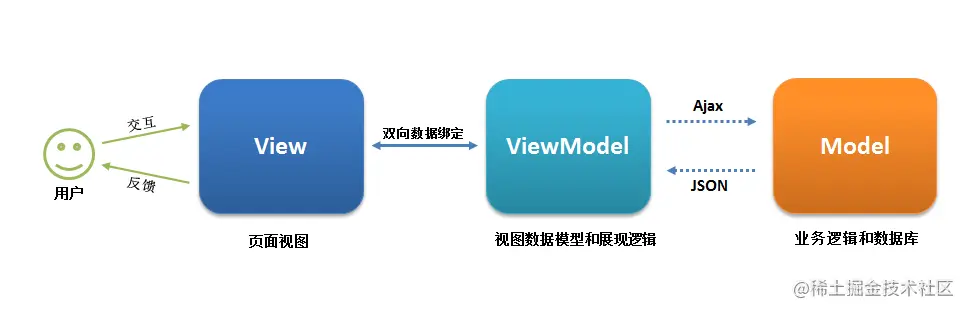

# CSS

## 1 盒子模型

所有 HTML 元素都可以视为一个盒子，该盒子包括： margin 、 border 、 padding、content

盒模型有2类， 标准盒模型和IE盒模型，最主要的区别还是在width和height的含义上

- 在标准盒模型中，width、height代表的是content的宽高
- 在IE盒模型中，width、height代表的是content + padding + border的宽高

`box-sizing: content-box;` 代表的是标准盒模型，`box-sizing: border-box;` 代表的是IE盒模型。

## 2.选择器

1. id选择器（#box） 
2. 类选择器（.one） 
3. 标签选择器（div） 
4. 后代选择器（#box div） 
5. 子选择器（.one>one_1） 
6. 相邻同胞选择器（.one+.two） 
7. 群组选择器（div,p） 

### 优先级

!important > 行内样式 > ID选择器 > 类选择器 > 标签选择器 > 通配符 > 浏览器默认属性

### 优先级计算

1. `!important`
2. 内联样式（1000）
3. ID 选择器（0100）
4. 类选择器 / 属性选择器 / 伪类选择器（0010）
5. 元素选择器 / 关系选择器 / 伪元素选择器（0001）
6. 通配选择器（0000）

### 继承

可继承的属性：font-size, font-family, color

不可继承的样式：border, padding, margin, width, height

## 3. 说说em/px/rem/vh/vw区别?

- `em`：相对于父元素的字体大小。父元素的字体大小是`16px`，那么`1em`就等于`16px` 
- `px`：固定像素单位。
- `rem`：相对于根元素（`html`）的字体大小。根元素的字体大小是`16px`，那么`1rem`就等于`16px` 
- `vh`：视口高度单位。`1vh` 等于视口高度的 1%
- `vw`：视口宽度单位。`1vw`等于视口宽度的1% 

## 4.BFC

理解：BFC是css布局的一个概念，是一块独立的渲染区域，一个环境，里面的元素不会影响到外部的元素

### 如何生成BFC：（脱离文档流）

​		     【1】根元素，即HTML元素（最大的一个BFC）

​		     【2】float的值不为none

​		     【3】position的值为absolute或fixed

​		     【4】overflow的值不为visible（默认值。内容不会被修剪，会呈现在元素框之外）

​		     【5】display的值为inline-block、table-cell、table-caption

### BFC布局规则：

`BFC`就是一个块级元素，块级元素会在垂直方向一个接一个的排列

`BFC`就是页面中的一个隔离的独立容器，容器里的标签不会影响到外部标签

垂直方向的距离由margin决定， 属于同一个`BFC`的两个相邻的标签外边距会发生重叠

计算`BFC`的高度时，浮动元素也参与计算

### BFC作用：

1. 利用 BFC 避免 margin 重叠
2. 自适应两栏布局
3. 清除浮动

## 5. 居中

### 水平垂直居中

**实现方式**

实现元素水平垂直居中的方式：

- 父元素position: relative子元素  position: absolute +  top、 left、right、bottom:0 +margin:auto
- 父元素position: relative子元素  position: absolute+   top: 50%;left: 50%+transform：`translate(-50%, -50%);
- table布局： 设置父元素为`display:table-cell`，子元素设置 `display: inline-block`。  vertical-align: middle; text-align: center;
- flex布局：   display: flex;   justify-content: center;     align-items: center;
- grid布局：  display: grid;   align-items:center;  justify-content: center;

### 水平居中

+ 元素为行内元素，设置父元素 text-align:center 
+ 如果元素宽度固定， 可以设置左右 margin 为 auto ; 
+ 如果元素为绝对定位，设置父元素 position 为 relative ，元素设 left:0;right:0;margin:auto; 
+ 使用 flex-box 布局，指定 justify-content 属性为center 
+ display 设置为 tabel-ceil

### 垂直居中

+ 将显示方式设置为表格， display:table-cell ,同时设置 vertial-align：middle 
+ 使用 flex 布局，设置为 align-item： center 
+ 绝对定位中设置 bottom:0,top:0 ,并设置 margin:auto 
+ 绝对定位中固定高度时设置 top:50%，margin-top 值为高度⼀半的负值 
+ 文本垂直居中设置 line-height 为 height 值

## 6. **flexbox（弹性盒布局模型）,以及适用场景？** 

该布局模型的目的是提供一种更加高效的方式来对容器中的条目进行布局、对齐和分配空间。在传统的布局方式中，block 布局是把块在垂直方向从上到下依次排列的；而 inline 布局则是在水平方向来排列。弹性盒布局并没有这样内在的方向限制，可以由开发人员自由操作。 

Flex Container的属性有：

- flex-direction，决定主轴的方向
- flex-wrap，决定Flex item时候可以换行
- justify-content，定义了item在主轴上的对齐方式
- align-items，定义了item在交叉轴上如何对齐
- align-content，定义了多根轴线的对齐方式，如果项目只有一根轴线，该属性不起作用

对于项目布局

- order: 数值越小，排序越前
- flex-grow: 拉伸布局
- flex-shrink: 收缩布局
- flex: 结合order 、grow、 shrink布局
- flex-basis: 基本布局
- aligin-self: 布局

适用场景：弹性布局适合于移动前端开发、两栏三栏自适应布局 。 

## 7.怎么理解回流跟重绘？什么场景下会触发

**浏览器计算页面布局的过程就叫做`回流`**

GPU将已经计算好几何信息的容器在屏幕上亮起来就是`重绘`

### 触发回流：页面上有容器的几何属性发生变更

1. 改变窗口的尺寸
2. 改变元素的尺寸
3. display: none | block;（增加或删除可见元素）
4. 页面初次渲染

### 触发重绘：容器非几何属性变更，比如颜色等

1. 修改背景颜色
2. 修改背景图片
3. 边框颜色
4. 字体颜色
5. 回流

 **回流 会带来重绘，重绘不一定带来回流**

## 7. 画三角形

首先，需要把元素的宽度、高度设为0。然后设置边框样式，如设置四个边框大小为40px solid 将三个边框颜色设置为透明，剩下那个设置为红色。

```
width: 0;
height: 0;
border-top: 40px solid transparent;
border-left: 40px solid transparent;
border-right: 40px solid transparent;
border-bottom: 40px solid #ff0000;
```

## 8. 让Chrome支持小于12px 的文字方式有哪些？

常见的解决方案有：

- zoom
- -webkit-transform:scale()
- -webkit-text-size-adjust:none

`Zoom` 是非标属性，有兼容问题，**缩放会改变了元素占据的空间大小，触发重排**

`-webkit-transform:scale()` **大部分现代浏览器支持， 缩放不会改变了元素占据的空间大小，页面布局不会发生变化**

`-webkit-text-size-adjust`对谷歌浏览器有版本要求，在27之后，就取消了该属性的支持，并且只对英文、数字生效

# HTML

## 1 语义化的理解 

就是用正确的标签做正确的事情 。 

HTML 语义化就是让页面的内容结构化，便于对**浏览器 、搜索引擎解析**； 

在没有样式 CSS 情况下也以⼀种⽂档格式显示， 并且是**容易阅读的。** 

搜索引擎的爬虫依赖于标记来确定上下⽂和各个关键字的权重，**利于 SEO** 。 

使阅读源代码的⼈对网站更容易将网站分块，便于阅读维护理解

## 2. src与href 区别

src 用于替换当前元素， href用于在当前⽂档和引用资源之间确立联系。 

src  指向外部资源的位置，在请求 src 资源时会将其指向的资源下载并应用到⽂档内，例如 js 脚本， img 图片和 frame 等元素，当浏览器解析到该元素时，会暂停其它资源下载，直到将该资源加载、编译、执行完毕。所以一般将js脚本放在底部。

href 指向网络资源，当浏览器识别到它指向的⽂件时，就会并⾏下载资源，不会停⽌对当前⽂档的处理，通常用于a、link元素。

## 3. **iframe 标签有那些优点和缺点？**

⾏内元素有： a b span img input select strong 

块级元素有： div ul ol li dl dt dd h1 h2 h3 h4… p 

空元素：`<br>` `<hr>` ``  `<input>` ` <link>`  `<meta> `

⾏内元素不可以设置宽高，不独占⼀⾏ 

块级元素可以设置宽高， 独占⼀⾏

## 4 Canvas和SVG有什么区别？ 

+ svg 绘制出来的每⼀个图形的元素都是独立的 DOM 节点， 能够方便的绑定事件或，也可以通过脚本和CSS进行修改  只能通过脚本修改。 canvas 输出的是⼀整幅画布，不支持事件处理器，只能通过脚本修改
+ svg 输出的图形是矢量图形，放大缩⼩不会失真和锯齿 。而 canvas 输出标量画布，就像⼀张图片⼀样，放大会失真或者锯齿

# JS

## 1. JS的数据类型及检测方法

基本数据类型：number、string、undefined、null、boolean、symbol（es6）、bigInt（es7）

 引用数据类型：object、array、function 

检测方法： 

- typeof :检测基本数据类型，但是null和object都被检测为对象 例：`typeof undefined // "undefined"`
- Instance of: 主要用来检测引用数据类型，不能正确检测基本数据类型，原理是判断其原型链上能不能找到该类型的原型 , 语法`obj instanceof Class` 
- Object.prototype.toString.call(): 可以检测任何类

## 2. ES6新增

- **let 和 const**：用于变量声明，提供块级作用域。
- **箭头函数（Arrow Functions）** ：简化了函数表达式的写法，使用 `=>` 符号
- **类（Classes）** ：引入了基于类的面向对象编程语法。

```
class Person {
  constructor(name) {
    this.name = name;
  }
  greet() {
    return `Hello, ${this.name}!`;
  }
}
```

- **模板字符串（Template Literals）** ：允许嵌入表达式的字符串字面量。
- **默认参数值**：允许函数参数有默认值。
- **解构赋值（Destructuring Assignment）** ：允许从数组或对象中提取数据并赋值给变量。

```
const [a, b] = [1, 2];
const { x, y } = { x: 10, y: 20 };
```

- **扩展运算符（Spread Operator）和剩余参数（Rest Parameters）** ：使用 `...` 实现。

```
const numbers = [1, 2, 3];
const newNumbers = [...numbers, 4, 5]; // Spread operator

function sum(...args) { // Rest parameters
  return args.reduce((sum, current) => sum + current, 0);
}
```

- **模块导入和导出（Modules）** ：使用 `import` 和 `export` 语法。
- **Promise 对象**：用于异步编程。
- **生成器和迭代器（Generators & Iterators）** ：引入生成器函数，可通过 `yield` 关键字暂停和恢复执行
- **新的数据结构**：如 `Map`, `Set`, `WeakMap`, `WeakSet`
- **Symbol 类型**：引入了新的原始数据类型 `Symbol`，可用作唯一的属性键。
- **新的静态方法和属性**：例如 `Array.from`, `Object.assign`, `Number.isFinite`, `Math.trunc` 等

##  3. let、const、var区别

|            | var      | let    | const  |
| ---------- | -------- | ------ | ------ |
| 块级作用域 | 没有     | 有     | 有     |
| 变量提升   | 有       | 没有   | 没有   |
| 暂时性死区 | 没有     | 有     | 有     |
| 初始值     | 可以没有 | 可以有 | 必须有 |
| 重复声明   | 可以     | 不可以 | 不可以 |

## 4. ==和===区别

- **`=` 是相等运算符**，当使用 `==` 比较两个变量时，如果它们的类型不相同，会进行类型转化再进行比较。

- **`===` 是严格相等运算符，它不会执行类型转换。仅当变量的值和类型都相同时，它们才被认为是相等的**。


## 5. 原型与原型链

**每当定义一个函数数据类型(普通函数、类)时候，都会天生自带一个prototype属性，这个属性指向函数的原型对象** 

**原型链是一个对象查找属性和方法时的查找机制。**如果在对象自身上找不到请求的属性或方法，JavaScript 会沿着这个对象的原型链向上查找，直到找到属性或方法或者到达原型链的顶端（也就是 `Object.prototype`）。如果在原型链的任何一级上找到了属性或方法，查找过程就会停止；如果一直没找到，通常会返回 `undefined`（对于方法调用则会抛出错误）。

`Object.prototype` 的原型是 `null`，这表示原型链的终点，即没有更多的原型对象可以查找。

 

```
    function Person() {}
    var person = new Person()
    console.log(person.__proto__ === Person.prototype)//true
    console.log(Person.prototype.constructor===Person)//true
    //顺便学习一个ES5的方法,可以获得对象的原型
    console.log(Object.getPrototypeOf(person) === Person.prototype) // true

```

## 6.作用域与闭包

**作用域**：是程序中定义变量的区域，分为全局作用域（代码的任何地方都能访问到的变量）和局部作用域（只能在函数或者代码块内部访问的变量）作用域链的变量只能向上访问， 变量访问到 window 对象即被终止，简单的说，作用域就是变量与函数的可访问范围， 即**作用域控制着变量与函数的可⻅性和 生命周期**

**闭包**：当一个函数嵌套在另一个函数中，内部函数会保留外部函数的作用域，即使外部函数已经执行完毕，内部函数依然可以访问外部函数中的变量

 常用的两个用途： 能够实现封装和缓存等； 

闭包的好处是可以读取函数内部的变量， 让这些变量始终保 持在内存中

闭包的坏处 ：就是消耗内存 、不正当使用会造成内存溢出的问题 

## 7. Promise

promise 是一个对象，用来传递异步操作的信息。代表着某个未来才会知道结果的时间，并未这个事件提供统一的api，以进行异步处理

有了这个对象，就可以让异步操作以同步的操作的流程来表达出来，避免层层嵌套的回调地狱

### 三种状态

promise代表一个异步状态，有三个状态**pending（进行中），Resolve(以完成），Reject（失败）**

一旦状态改变，就不会在变。状态的改变只能通过`resolve、reject`来实现，从进行中变为以完成或者失败

### 方法

`Promise.race()` 和 `Promise.all()` 用于处理多个 Promise 实例的情况。 promise.all()是里面状态都改变，那就会输出，得到一个数组，promise.race() 里面只有一个状态变为rejected或者fulfilled即输出，

`then()` 方法用于注册当 Promise 对象的状态变为 resolved（成功）时的回调函数 ，`catch()` 方法用于注册当 Promise 对象的状态变为 rejected（失败）时的回调函数。 `finally()` 方法用于注册当 Promise 对象无论状态如何都要执行的回调函数。 

### 缺点

promise通常用来解决回调地狱的问题，但也有几个**不可忽视的缺点**

+ promise一旦新建就会立即执行，无法中途取消

  当处于pending状态时，无法得知当前处于哪一个状态，是刚刚开始还是刚刚结束

  如果不设置回调函数，promise内部的错误就无法反映到外部

  promise封装ajax时，由于promise是异步任务，发送请求的三步会被延后到整个脚本同步代码执行完，并且将响应回调函数延迟到现有队列的最后，如果大量使用会大大降低了请求效率。

##  8. 箭头函数特点

- 箭头函数的语法更简单，省去了`function`关键字
- 普通函数：谁调用这个函数，this指向谁，箭头函数：在哪里定义函数，this指向谁
- 不可以使用 arguments 对象，该对象在函数体内不存在  ，但可以用剩余参数语法（…args）
- 不可以当作构造函数，也就是说，不可以使用 new 命令 

##  9 new一个对象的过程

- **创建一个新对象**： `new` 操作符首先创建一个空的简单 JavaScript 对象（即 `{}`）。
- **设置原型**：新对象的  `__proto__` 属性会被设置为构造函数的 `prototype` 属性，新对象会继承构造函数原型上的方法和属性。
- **绑定 this 值**：构造函数内部的 `this` 被绑定到新创建的对象上。
- **执行构造函数**：`new` 操作符后面的函数（构造函数）会被调用，其参数也会按照指定的参数传递进去。构造函数内部的代码通常会初始化新对象的属性，并执行其他必要的设置。
- **返回新对象**：如果构造函数返回一个对象，那么这个对象会成为 `new` 操作符的返回值。如果构造函数没有返回对象，那么 `new` 操作符会返回刚刚创建的新对象。

## 10. 深拷贝与浅拷贝

**浅拷贝**只复制对象的第一层属性。如果属性值是原始类型 则复制的是值本身；如果属性值是复合类型则复制的是引用（内存地址），而不是实际的值。当修改了拷贝后对象中的某个嵌套对象，原始对象中对应的嵌套对象也会被修改，因为它们引用的是同一块内存地址。

浅拷贝方法： 数组的 from()、slice()、 concat() 与扩展运算符、 object.assign 等方法可以实现浅拷贝

**深拷贝**是完全复制一个对象，包括对象内部嵌套的对象。深拷贝后的对象与原始对象不共享任何引用。

+ 最简单的深拷贝实现是使用 `JSON.stringify()` 和 `JSON.parse()`。这种方法会将对象转换成 JSON 字符串，然后再将字符串解析成一个新的对象，例` JSON.parse(JSON.stringify(original));`
+ 使用三方库**lodash的** cloneDeep 方法

## 11. 简述forEach()和map()循环的主要区别

- 返回值：`forEach()` 没有返回值，而 `map()` 返回一个新数组。
- 原数组：`forEach()` 会改变原数组，而 `map()` 不会改变原数组，而是返回一个新数组。
- 使用场景：如果需要对数组进行操作并且不需要返回值，可以使用 `forEach()`；如果需要对数组进行操作并且需要返回一个新数组，可以使用 `map()`。

## 12.简述JSONP的工作原理（它为什么不是真的AJAX）

JSONP是利用 `<script>` 标签进行跨域请求的技术。它不是真正的 AJAX，因为它并不使用 XMLHttpRequest 对象发送请求，而是通过动态创建 `<script>` 标签来加载外部脚本。 

### 工作原理

- **客户端创建请求**： 先定义一个回调函数，然后通过动态创建一个 `<script>` 标签来向服务器发起请求。请求的 URL 包含一个查询参数，通常称为 `callback` 或 `jsonp`，其值是准备接收响应的回调函数的名称。
- **服务器响应**： 服务器将调用指定回调函数的 JavaScript 代码作为脚本的内容发送给客户端。
- **客户端处理**： 浏览器会执行服务器返回的 JavaScript 代码。
- **执行回调函数**： 回调函数执行时，它处理从服务器接收到的数据。 

## 13. 对async/await理解

**`async` 关键字用于声明一个函数是异步的**。`async` 函数返回 的是Promise 对象。

**`await` 关键字用于等待一个 Promise 解决（fulfilled）**。它只能在 `async` 函数中使用。`await` 会暂停 `async` 函数的执行，等待 Promise 解决后再继续执行，并返回解决的值。如果 Promise 被拒绝（rejected），`await` 会抛出拒绝的原因，**可以用 `try...catch` 语句捕获这个错误

## 14. 精度丢失问题

**精度丢失问题**通常是由于其使用 **IEEE 754 双精度浮点数格式**来表示数字所导致的。这个问题的根源在于二进制浮点数在表示某些十进制小数时的不精确性。

### 解决方案

- **使用整数进行计算**: 通过将浮点数转换为整数（例如，将 0.1 转为 10），进行计算后再转换回去。这种方法对于简单的运算有效，但对于复杂的数学运算可能不实用。
- **使用第三方库**: 使用专门处理大数或者精确小数运算的库，如 `BigInt`（对于大整数）、`decimal.js` 或 `bignumber.js`（对于高精度的小数运算）。这些库提供了精确的数字运算方法。
- **内置 BigInt 类型**: 对于大整数，ES2020 引入了 `BigInt` 类型，可以用来表示任意精度的整数。

## 15 垃圾回收机制和内存泄漏

### 垃圾回收机制

Js运行时，需要分配内存空间来储存变量和值，当这些变量不再运行的时候，系统就会收回被占用的内存

**回收机制**

Js有自动回收机制，会定期清理不再使用的变量，然后释放内存。

Js有两种变量，全局变量和局部变量，全局变量的内存是等页面卸载之后就被释放；局部变量等到函数执行完毕之后就被释放


### 内存泄露

内存泄露是计算机程序中的一个缺陷，它发生在分配给程序的内存由于某些原因未能释放，尽管它不再被程序使用。在长时间运行的应用程序中，内存泄露可能会导致内存消耗持续增加，最终可能耗尽系统资源，导致程序变慢甚至崩溃


## 16 防抖 节流

- **防抖**：防止抖动，用于将用户的操作行为触发转换为程序行为触发，在一段时间内某个事件连续触发多次，回调只会执行一次。

  **应用场景**： input框输入请求

- **节流**：控制流量，主要用于用户在与页面交互时控制事件发生的频率，一段时间内控制事件每隔n秒执行一次

  **应用场景**：游戏中的射击按钮、调整窗口大小时持续更新布局

## 17. cookie、sessionStorage、localStorage、indexDB区别


## 18.eventloop（事件循环机制）

在事件循环中，当主线程执行完当前的同步任务后，会检查事件队列中是否有待处理的事件。如果有，主线程会取出事件并执行对应的回调函数。这个循环的过程被称为**事件循环**（Event Loop），它由**主线程**和**任务队列**两部分组成。**主线程**负责执行`同步任务`，而`异步任务`则通过**任务队列**进行处理。


### 同步任务

同步任务是按照代码的书写顺序一步一步执行的任务。当主线程执行同步任务时，会阻塞后续的代码执行，直到当前任务执行完成。典型的同步任务包括函数调用、变量赋值、算术运算等。

### 异步任务

异步任务是在主线程执行的同时，通过回调函数或其他机制委托给其他线程或事件来处理的任务。在执行异步任务时，主线程不会等待任务完成，而是继续执行后续代码。包括：回调函数 `callback`、计时器、`Promise/async` `await`、`process.nextTick`等

### 任务队列类型

任务队列分为`宏任务`队列（macrotask queue）和`微任务`队列（microtask queue）两种。**在执行完当前宏任务后，会检查微任务队列，执行其中的微任务，然后再取下一个宏任务执行。这个过程不断循环，形成事件循环。** 

1、宏任务（Macrotasks）是一些较大粒度的任务，包括：

- 所有同步任务
- `setTimeout`、`setInterval`
- `setImmediate`（Node.js环境）
- `requestAnimationFrame`
- 事件监听回调函数等
- I/O操作，如文件读写、数据库数据读写等
- ...

2、微任务（Microtasks）是一些较小粒度、高优先级的任务，包括：

- `Promise`的`then`、`catch`、`finally`
- `async/await`中的代码
- `Generator`函数
- `MutationObserver`
- `process.nextTick`（Node.js 环境）
- ...


# VUE

## 1. [vue生命周期](https://juejin.cn/post/7208823936300482619)

Vue2 的生命周期主要是：

> 1. beforeCreate：创建实例之前调用，此时实例的数据观测、事件等还未初始化。
> 2. created：创建实例后调用，此时实例的数据观测、事件等已经初始化完成。
> 3. beforeMount：挂载实例之前调用，此时模板已经编译完成，但是还未挂载到DOM。
> 4. mounted：挂载实例后调用，此时实例已经挂载到DOM，可以进行DOM操作。
> 5. beforeUpdate：数据更新之前调用，此时可以进行状态的最后更改。
> 6. updated：数据更新后调用，此时DOM已经完成更新，可以进行DOM操作。
> 7. beforeDestroy：销毁实例之前调用，此时实例仍然完全可用。
> 8. Destoryed: 销毁实例后调用，此时实例已经完全卸载。

而 `vue3` 在 `vue2` 的基础上进行了一些改变，主要是针对最后两个生命周期：

> beforeDestroy -> beforeUnmount
>
> Destoryed -> Unmounted

另外 `options API` 和 `composition API` 在生命周期上也有一些小的不同：

> `composition API` 提供了 `setup` 函数作为入口函数，替换了 `beforeCreate` 和 `created` 这两个生命周期钩子。`composition API`中的钩子函数，通过在生命周期钩子前面加上 `on` 来访问组件的生命周期钩子。需要注册，并且只能在 `setup` 期间同步使用

## 2，vue3新特性

 

[图来源](https://juejin.cn/post/7103740259925491742)

## 3.vue3性能优化体现在哪几个方面

###  1、编译阶段优化 

##### ① **diff算法优化**

`vue3`在`diff`算法中相比`vue2`增加了`静态标记`，其作用是为了会发生变化的地方添加一个`flag标记`，下次发生变化的时候`直接`找该地方进行比较。

##### ② **静态提升**

**Vue3中对`不参与更新`的元素，会做静态提升，`只会被创建一次`，在渲染时直接复用。**免去了重复的创建操作，优化内存。

没做静态提升之前，未参与更新的元素也在`render函数`内部，会重复`创建阶段`。
 做了静态提升后，未参与更新的元素，被`放置在render 函数外`，每次渲染的时候只要`取出`即可。同时该元素会被打上`静态标记值为-1`，特殊标志是`负整数`表示永远不会用于 `Diff`。

##### ③ **事件监听缓存**

默认情况下绑定事件行为会被视为动态绑定（`没开启事件监听器缓存`），所以`每次`都会去追踪它的变化。`开启事件侦听器缓存`后，没有了静态标记。也就是说下次`diff算法`的时候`直接使用`。

##### ④ **SSR优化**

当静态内容大到一定量级时候，会用`createStaticVNode`方法在客户端去生成一个`static node`，这些`静态node`，会被直接`innerHtml`，就不需要创建对象，然后根据对象渲染。

#### **2、源码体积**

相比`Vue2`，`Vue3`整体体积`变小`了，除了移出一些`不常用的API`，最重要的是`Tree shanking`。

任何一个函数，如`ref、reavtived、computed`等，仅仅在`用到`的时候才`打包`，`没用到`的模块都`被摇掉`，打包的整体体积`变小`。

#### **3、响应式系统**

`vue2`中采用 `defineProperty`来劫持整个对象，然后进行深度遍历所有属性，给`每个属性`添加`getter和setter`，实现响应式。`vue3`采用`proxy`重写了响应式系统，因为`proxy`可以对`整个对象进行监听`，所以不需要深度遍历。

## 3. Vue3 里为什么要用 Proxy API 替代 defineProperty API ？（响应式原理）

[可详细参考博客](https://juejin.cn/post/7201334455058923580)

1、`vue2`中采用 `defineProperty`来劫持整个对象，然后进行深度遍历所有属性，给每个属性添加getter和setter，实现响应式。但是存在以下的问题：

- 检测不到对象属性的添加和删除
- 数组API方法无法监听到
- 需要对每个属性进行遍历监听，如果嵌套对象，需要深层监听，造成性能问题

2、proxy：监听是针对一个对象的，那么对这个对象的所有操作会进入监听操作。

- Proxy直接可以劫持整个对象，并返回一个新对象，通过操作新的对象达到响应式目的
- Proxy可以直接监听数组的变化（push、shift、splice）
- Proxy有多达13种拦截方法,不限于apply、ownKeys、deleteProperty、has等等，这是Object.defineProperty不具备的

 **Proxy 只会代理对象的第一层，那么 Vue3 又是怎样处理这个问题的呢？**

判断当前 Reflect.get 的返回值是否为 Object，如果是则再通过 reactive 方法做代理， 这样就实现了深度观测。

## 4. `watch` 和 `watchEffect`区别

`watch` 和 `watchEffect` 都是监听器，`watchEffect` 是一个副作用函数。它们之间的区别有：

- `watch` ：要指明监视的数据源和监视的回调。而 `watchEffect` 可以自动监听数据源作为依赖。不用指明监视哪个数据，监视的回调中用到哪个数据，那就监视哪个数据。
- `watch` 可以访问`改变之前和之后`的值，`watchEffect` 只能获取`改变后`的值。
- `watch` 运行的时候`不会立即执行`，值改变后才会执行，而 `watchEffect` 运行后可`立即执行`。这一点可以通过 `watch` 的配置项 `immediate` 改变。


##  5.  v-if 和 v-for 的优先级哪个高

在 `vue2` 中 `v-for` 的优先级更高，但是在 `vue3` 中优先级改变了。`v-if` 的优先级更高。

## 6.  script setup 是干啥的？

`scrtpt setup` 是 `vue3` 的语法糖，简化了`组合式 API` 的写法，并且运行性能更好。使用 `script setup` 语法糖的特点：

- 属性和方法无需返回，可以直接使用。
- 引入`组件`的时候，会`自动注册`，无需通过 `components` 手动注册。
- 使用 `defineProps` 接收父组件传递的值。
- `useAttrs` 获取属性，`useSlots` 获取插槽，`defineEmits` 获取自定义事件。
- 默认`不会对外暴露`任何属性，如果有需要可使用 `defineExpose` 。

##  7. Vue2/Vue3组件通信方式？

| 方式             | Vue2           | Vue3                 |
| ---------------- | -------------- | -------------------- |
| 父传子           | props          | props                |
| 子传父           | $emit          | emits                |
| 父传子           | $attrs         | attrs                |
| 子传父           | $listeners     | 无(合并到 attrs方式) |
| 父传子           | provide/inject | provide/inject       |
| 子组件访问父组件 | $parent        | 无                   |
| 父组件访问子组件 | $children      | 无                   |
| 父组件访问子组件 | $ref           | expose&ref           |
| 兄弟传值         | EventBus       | mitt                 |

 **pinia  vuex**

## 8. 理解ref与reactive 、toRef 和 toRefs？

- `ref` 函数创建的响应式数据，在模板中可以直接被使用，在 `JS` 中需要通过 `.value` 的形式才能使用。
- `ref` 函数可以接收**原始数据类型**与**引用数据类型**。
- `reactive` 函数只能接收**引用数据类型**。
- `ref` 底层还是使用 `reactive` 来做，`ref` 是在 `reactive` 上在进行了封装，增强了其能力，使它支持了对原始数据类型的处理。
- 在 `Vue3` 中 `reactive` 能做的，`ref` 也能做，`reactive` 不能做的，`ref` 也能做。

`toRef`：针对一个响应式对象的属性创建一个ref，使得该属性具有响应式，两者之间保持引用关系。 

`toRefs`： 将一个**响应式对象**转为普通对象，对象的每一个属性都是对应的ref，两者保持引用关系

## 9. 谈一谈对 MVVM 的理解？

MVVM是`Model-View-ViewModel`缩写，也就是把`MVC`中的`Controller`演变成`ViewModel`。Model层代表数据模型，View代表UI组件，ViewModel是View和Model层的桥梁，数据会绑定到viewModel层并自动将数据渲染到页面中，视图变化的时候会通知viewModel层更新数据。

